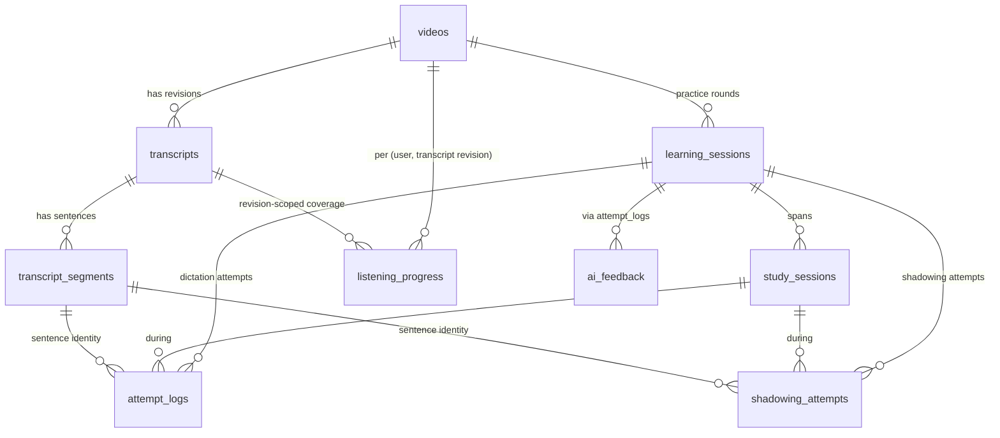
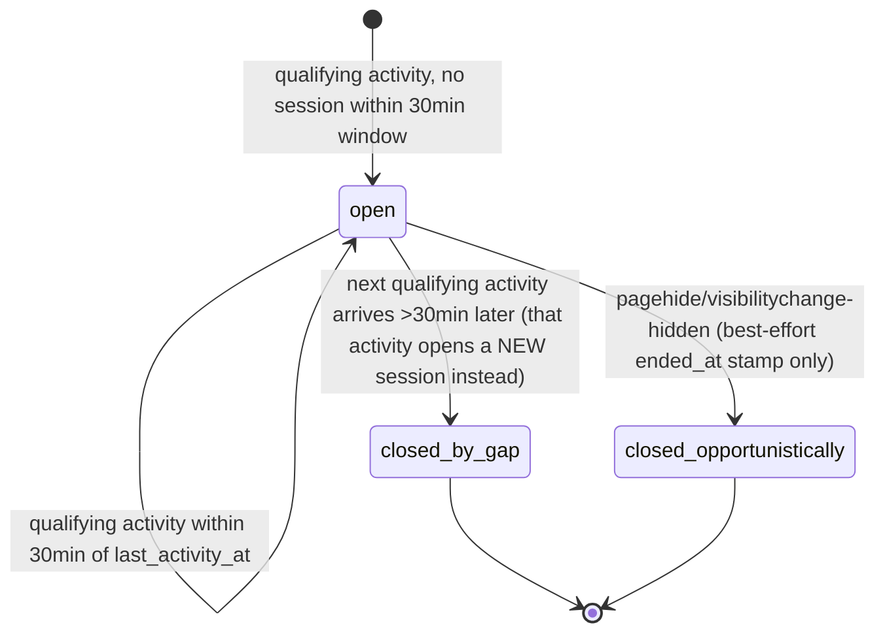
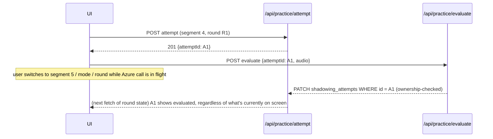

# Video-Based Learning Management — Audit & Implementation Plan

Status: **Audit and plan only.** No application code, migrations, or production data were
touched to produce this document. All findings were gathered by directly reading the current
repository (migrations `001`–`019`, and the live route/hook/component code), not assumed from
any prior planning document. Where an earlier finding from `.claude/vocabulary-stats-and-navigation-caching-plan.md`
overlaps, it was re-verified, not trusted as-is.

## Table of contents

1. [Executive summary](#1-executive-summary)
2. [Current-state audit](#2-current-state-audit)
3. [Confirmed defects and ambiguous behavior](#3-confirmed-defects-and-ambiguous-behavior)
4. [Agreed product rules and assumptions](#4-agreed-product-rules-and-assumptions)
5. [Proposed domain model](#5-proposed-domain-model)
6. [Completion and scoring formulas](#6-completion-and-scoring-formulas)
7. [State transitions](#7-state-transitions)
8. [Database changes](#8-database-changes)
9. [API changes and response contracts](#9-api-changes-and-response-contracts)
10. [Dashboard, library, History, and practice-page changes](#10-dashboard-library-history-and-practice-page-changes)
11. [Query-cache and view-state integration](#11-query-cache-and-view-state-integration)
12. [Implementation phases](#12-implementation-phases)
13. [Tests, runtime verification, and acceptance criteria](#13-tests-runtime-verification-and-acceptance-criteria)
14. [Rollout, compatibility, rollback, and limitations](#14-rollout-compatibility-rollback-and-limitations)
15. [Readiness assessment](#15-readiness-assessment)

---

## 1. Executive summary

The app already has most of the *primitives* this redesign needs (a video catalog, a
transcript-revisioning table, a dictation attempt log, TanStack Query wired end-to-end,
a working Shadowing evaluation UI) — but three load-bearing assumptions have quietly gone
stale as Dictation/Listening/Shadowing were merged into one shared practice page:

1. **Listening Mode writes progress into the Dictation table** (`learning_sessions`), not the
   purpose-built `listening_sessions` table its own migration describes — a genuine regression,
   not a design choice. `listening_sessions` and its two API routes are dead code today.
2. **Shadowing has no server-side persistence at all.** Every recording, Word Match result, and
   Azure Pronunciation Assessment score lives only in `sessionStorage`, gone on tab close.
3. **"Completion" is reachable through exactly one path** — typing the last Dictation sentence
   correctly. Listening and Shadowing can never mark a round complete under the current code,
   and Dashboard's progress bars quietly display *accuracy*, not coverage, because the coverage
   data was never fetched.

The plan below keeps the existing `videos` / `transcripts` / `transcript_segments` /
`learning_sessions` / `attempt_logs` tables as the backbone, fixes the transcript-regeneration
behavior that currently orphans historical attempts, adds three new tables (`study_sessions`,
`shadowing_attempts`, `listening_progress`), and deprecates (without dropping) the dead
`listening_sessions` table. It introduces one new domain concept the codebase doesn't have yet —
the **practice round** — by repurposing `learning_sessions` conceptually rather than replacing
it, and separates *practice coverage* from *performance* from *study time* throughout, per the
product rules in §4.

No new paid provider, no long-term recording storage, and no new client-state library are
introduced. The existing TanStack Query layer (already fully wired for Vocabulary/Bookmarks/
Dashboard/History as of this session) is extended with the same patterns already proven there.

---

## 2. Current-state audit

Every claim below cites `file:line`. Tags: **(a)** confirmed by direct code/schema reading,
**(b)** requires runtime/DB verification against the live Supabase project, **(c)** contradictory,
dead, or regressed relative to its own documented intent.

### 2.1 Session and video identity

**Does switching modes create another session or another video-history entry? (a) No.**
`inputMode` (`"dictation" | "listening" | "shadowing"`) is pure client state sourced from the
`?mode=` query param (`src/app/dictation/[videoId]/useInputModePreference.ts`), with a per-video
`localStorage` fallback. `setInputMode` does `router.replace(/dictation/${videoId}?mode=...,
{scroll:false})` — same route, same mounted component, no remount. `useDictationSession.ts` is
not re-invoked with different arguments per mode; `sessionId`, `currentSegIdx`, mistakes, combo,
etc. are one shared React state tree across all three modes. `ModeSwitcher.tsx`'s `onSelectMode`
wires straight to `setInputMode` from both `ControlBar.tsx:493` and `SettingsDrawer.tsx:335` (the
latter reachable at *any* UX state).

**What does the existing `session` entity represent? (a)** `learning_sessions`
(`supabase/migrations/001_initial.sql:86-97`) is a per-`(user, video)` resumable-progress row:
`current_segment_index`, `accuracy`, `total_attempts`, `status` (`active|completed|abandoned`),
`video_current_time`, plus `ai_assessment`/`ai_assessment_generated_at` (`010_session_assessment.sql`).
It has **no `mode` column** — nothing at the DB level records which of the three modes produced
a given row.

**Can multiple records represent the same user/video? (a) Yes, and nothing prevents it.**
Neither `learning_sessions` nor `listening_sessions` has a unique/composite constraint on
`(user_id, youtube_video_id)` — only separate single-column indexes on each. `POST /api/session/restart`
(`src/app/api/session/restart/route.ts:27-41`) marks the current active row `abandoned` rather
than deleting it; the next `save-progress` call with no `sessionId` then finds no active row and
**inserts a new one** (`src/app/api/session/save-progress/route.ts:111-124`). Repeated
restart→complete cycles on the same video therefore accumulate multiple `completed` rows for
that video.

**What determines which record is resumed? (a)** `GET /api/session/resume`
(`src/app/api/session/resume/route.ts:26-35`) — `order by updated_at desc limit 1` for
`(user_id, youtube_video_id)`, **no status filter** (deliberate, per its own comment, so a
completed video correctly reports back as completed). `POST /api/session/save-progress`'s
create-vs-reuse key is `(user_id, youtube_video_id, status='active')`
(`save-progress/route.ts:68-76`) — no `mode`/`transcript_id` component.

**Does entering through Dashboard behave differently from switching modes inside the practice
page? (a) No** — both paths land on `/dictation/[videoId]` (optionally `?mode=listening`) and
resolve to the same `learning_sessions` row via the identical lookup key. The only difference is
which route param seeds `inputMode` on first render.

**Listening specifically — (a)(c) confirmed regression:** `src/app/listening/[videoId]/page.tsx`
is now a 15-line server component that does nothing but `redirect(/dictation/${videoId}?mode=listening)`.
The dedicated `listening_sessions` table (`012_listening_sessions.sql`) and its two API routes
(`/api/listening-session/resume`, `/api/listening-session/save-progress`) are fully built,
migrated, RLS-protected — and **unreachable from any client code path** (repo-wide grep for
`listening-session` matches only the route files' own log strings). Listening Mode's
`triggerAutoSave` (`useDictationSession.ts:328-350`) has no branch on `inputMode` at all and
writes straight into `learning_sessions` via the same `saveProgress()` call Dictation uses. This
directly contradicts `012_listening_sessions.sql`'s own comment: *"Kept as its own table rather
than folding into learning_sessions... History/Dashboard queries union this table with
learning_sessions and tag each row with its mode."* The union still happens
(`dashboard/summary/route.ts:29-59`) — it just never receives real data anymore, because nothing
writes to `listening_sessions` post-merge.

**Shadowing specifically — (a) confirmed:** Shadowing is `?mode=shadowing` on the same route.
`useDictationSession.ts` never receives `inputMode` as a parameter at all — Shadowing's
recording/evaluation state lives entirely outside this hook, in
`useShadowingEvaluations.ts` + `shadowingEvaluationPersistence.ts`, backed only by
`sessionStorage`. When a user "completes" a video purely via Shadowing, the *only* DB trace is
whatever `learning_sessions` row happens to exist for that `(user, video)` — same row Dictation
would use, same zero-accuracy problem as Listening (below).

### 2.2 Completion and progress

**Where/when is a session marked completed? (a)** Exactly one call site in the entire repo sets
`status: "completed"` on `learning_sessions`: `useDictationSession.ts:399-412`, inside
`handleAnswerSubmit`'s **correct-answer** branch, only when `nextIdx >= segments.length` — i.e.
the user must type the *last* sentence correctly through the Dictation input. No other code path
(Listening's continuous tick, Shadowing's recorder, `handleSkip`, `jumpToSegment`) ever passes
`"completed"`.

**Does reaching the last sentence count as completion despite skipped sentences? (a) No, but
only by accident of the single-gate design.** `handleSkip` (`useDictationSession.ts:467-479`) is
guarded `if (nextIdx < segments.length)` — skipping the *last* segment is a no-op, so skip alone
can never trigger completion. But skipping segments 1 through 9 and then correctly *typing*
segment 10 **does** complete the round today, with zero `attempt_logs` rows for 1–9 — there is no
check that every segment was actually attempted, only that the final one was answered correctly.

**Is completion dependent on accuracy? (a) Yes, uniquely and only for Dictation** — completion
requires the *last* sentence specifically to be answered correctly (not just attempted). Wrong
answers on the last sentence never complete the session; there is no "attempted, however scored"
completion path.

**Are displayed progress bars based on coverage, sentence position, or accuracy? (a) Accuracy,
mislabeled as progress.** `dashboard/page.tsx:345`: `width: ${Math.min(100, Math.max(0,
firstSession.accuracy ?? 0))}%`. `history/page.tsx:237`: identical pattern. Both sit under a text
label showing `current_segment_index` with **no denominator** — `ResumableSession`
(`src/lib/types/index.ts:307-321`) carries `currentSegmentIndex` but no `totalSegments`, and
`dashboard/summary/route.ts` never fetches a per-video segment count for these rows. The only
place a true position-based bar exists is `ControlBar.tsx`'s `{idx+1}/{total}` **text**, not a
visual bar, and it's Dictation/Shadowing-only UI.

**Does seeking to the end count as having listened to the whole video? (a) Not "completed", but
functionally yes for the one progress signal that exists.** Seeking never triggers
`status:"completed"` (continuous mode's tick takes an early-return branch that skips the
completion-eligible code path entirely). But `player.getCurrentTime()` is re-read every 200ms tick
regardless of *how* the position changed, so a `seekTo(duration)` followed by any of the sparse
autosave triggers (tab hidden, page closed) persists `video_current_time ≈ duration` — exactly
what Dashboard/History render verbatim as **"Watched to `<duration>`."** A user who jumps straight
to the end and backgrounds the tab is shown as having watched the whole video.

### 2.3 Scores and persistence

**What constitutes a valid Dictation attempt? (a)** Non-empty (trimmed) submitted text reaching
`handleAnswerSubmit` → `POST /api/dictation/check`. Empty/whitespace-only input never leaves the
client (`page.tsx:543-547`, early-return no-op) — no `attempt_logs` row, no accuracy impact.
There is no "reveal answer" action anywhere; the only assist is a 5-level Hint toggle that masks/
reveals letters but never auto-fills or auto-submits. Hint usage is tracked client-side only
(`wrongAttempts===0 && hintLevel===0` → `isClean`) and is **never sent to the server** — a hinted
correct answer is indistinguishable from a clean one in `attempt_logs`.

**Which attempt contributes to current scores? (a) Every attempt, unweighted — not latest, not
best.** `src/store/sessionStore.ts:45-50,79-83`: `incrementAttempt(isCorrect)` bumps
`totalAttempts`/`correctCount` on *every* submit, right or wrong; `selectAccuracy = correctCount /
totalAttempts * 100`. A sentence retried 5 times before succeeding contributes 4 wrong + 1
correct to the tally. This client-tallied number is sent **verbatim** to
`POST /api/session/save-progress`, which writes it straight into `learning_sessions.accuracy` —
**never recomputed server-side from `attempt_logs`.** Separately, `attempt_logs` itself has **no
unique constraint** — every submission (including duplicate network retries) inserts an
unconditional new row, and DB insert errors on that insert are **silently swallowed**
(`dictation/check/route.ts:70-73`, caught/logged, 200 returned regardless) — so the client-tallied
accuracy shown to the user can diverge from what `attempt_logs` actually contains, with no
detection. A second, independent notion of accuracy exists at
`session/[sessionId]/report/route.ts:79-101`, which recomputes mistakes directly from
`attempt_logs` (deduped per `segment_index`) — **these two numbers are never reconciled.**

**Are Shadowing results stored only in sessionStorage, or also persisted server-side? (a) Only
sessionStorage, confirmed by repo-wide grep.** `shadowingEvaluationPersistence.ts:1-51` states
this explicitly in its own comment: *"session-scoped only (cleared on tab close), never sent
anywhere."* Key: `dictation.shadowing-evaluations.<videoId>.<transcriptId>` — already
transcript-revision-aware, a good precedent. No table anywhere in `supabase/migrations/**`
relates to Shadowing scores or audio; `azureSpeech.ts` and `practice/evaluate/route.ts` contain
zero Supabase calls. Raw recording audio is never persisted anywhere, client or server — it lives
only in an in-memory `Blob`, discarded on retry/unmount/tab close.

**Can failed evaluation overwrite a previous successful result? (a) No — already handled well.**
`useShadowingEvaluations.ts`'s `startTrueEvaluation`/`failTrueEvaluation` deliberately do **not**
touch `lastSuccessfulTrueEvaluation`/`attempts` (explicit bug-fix comments in the code: *"retry
destroys previous result"*). Azure quota is reserved *before* the call and only recorded *after*
success (`practiceQuota.ts`), so a failed/quota-blocked call never burns budget and never erases
prior valid data. This is exactly the discipline the redesign needs — it just needs to survive a
tab close, which it currently doesn't.

**What survives reload, navigation, sign-out, switching devices? (a)** Dictation progress/accuracy:
survives via `learning_sessions`/`attempt_logs` (server, durable) — but is client-trusted, not
server-verified (above). Shadowing: survives reload only via the `sessionStorage` snapshot within
the *same tab*; gone on sign-out (`auth.tsx`'s `signOut` calls `queryClient.clear()`, but
`sessionStorage` is untouched by that — moot anyway since nothing there is server-synced),
completely gone on a different device. Listening: nominally durable via `learning_sessions.video_current_time`
(because it's misrouted there, §2.1), but with no coverage semantics, no unique-per-mode
identity, and no monotonic guard — replaying an earlier part and then backgrounding the tab
**overwrites a higher previously-saved position with a lower one** (`save-progress` routes do a
plain `.update()`, never `GREATEST()`).

### 2.4 Dashboard and History

**Are completed videos counted distinctly? (a) Yes for the specific "completed videos" stat**
(`dashboard/summary/route.ts:64`: `new Set(completedDictationSessions.map(s => s.youtube_video_id)).size`)
— correctly deduplicated. **But `avgAccuracy` is not**: it averages over completed *rows*, not
distinct videos (`route.ts:65-71`), so a video completed twice (a real, reachable state per
§2.1) counts once in "Completed Videos" but **twice** in the accuracy average.

**How is practice time calculated? (a) It isn't — it's mislabeled.**
`totalPracticeMinutes = sum(video_current_time across all session rows) / 60`
(`dashboard/summary/route.ts:74-76`). `video_current_time` is a **playhead position** (furthest
point reached), not elapsed wall-clock time. Replaying/completing the same video twice adds its
playhead position twice; the UI's own labels elsewhere ("Watched to…") correctly describe this
value as a position, but the Dashboard stat calls it "Practice Time."

**How is the streak calculated? (a)** From `attempt_logs` only (`dashboard/summary/route.ts:114-116`,
scoped to dictation session IDs) — a day of pure Listening or Shadowing practice does not extend
the streak.

**Are the same data fetched independently in multiple places? (a) Mostly no, already fixed.**
`src/lib/queries/dashboard.ts` is shared by both `dashboard/page.tsx` and `history/page.tsx` (one
query, one cache entry) — the prior planning doc's proposal here is now implemented, not just
proposed. `history/page.tsx`'s "History" cards are **not** raw one-row-per-session; they reuse the
summary endpoint's `resumableSessions` (already deduped to "latest per `(mode, video)` key"
server-side). The separate "Mistakes" panel is a flat, paginated, dictation-only `attempt_logs`
list with no session/day grouping at all.

**Which caches must be updated after learning activity? (a) None are today, by deliberate prior
scope choice.** Repo-wide grep for `invalidateQueries` finds it used only in
`src/lib/queries/{bookmarks,vocabulary}.ts` — never in a dashboard/history/session context.
Session-progress writes (`triggerAutoSave`, and the dead listening-session equivalent) are plain
`fetch()` calls, not `useMutation`, with zero cache interaction. Dashboard/History only pick up
new activity once the global 60s `staleTime` naturally lapses. The prior plan documented this as
an explicit, deliberate exclusion ("out of scope for this release") — for this redesign, closing
that gap is in scope (§11).

### 2.5 What needs runtime/DB verification (not answerable from static code)

- Whether all 19 migrations are actually applied to the live Supabase project, and whether RLS is
  enforced at runtime exactly as the migration text declares (no out-of-band dashboard edits).
- Actual row counts: how many duplicate `active`/`completed` `learning_sessions` rows exist per
  `(user, video)` in production today; how many pre-merge `listening_sessions` rows still exist
  and what they'd backfill to; whether `attempt_logs`-derived accuracy actually disagrees with
  `learning_sessions.accuracy` for any real session (the code allows it; production data would
  confirm how often).
- The real-world impact of the Azure quota being **global**, not per-user
  (`practiceQuota.ts` — a single Redis counter for the whole app/month).

---

## 3. Confirmed defects and ambiguous behavior

Ranked by impact on the redesign. All **(a)** confirmed by code reading unless noted.

| # | Defect | Evidence | Impact |
|---|---|---|---|
| D1 | Listening Mode writes progress into `learning_sessions` instead of `listening_sessions` | `useDictationSession.ts:328-350` has no mode branch | Listening sessions appear on Dashboard/History as low-accuracy "Dictation" rows; `listening_sessions` table + 2 API routes are dead code |
| D2 | Shadowing has zero server-side persistence | `shadowingEvaluationPersistence.ts:1-51`, grep confirms no DB table | All Shadowing history lost on tab close; invisible to Dashboard/History/report entirely |
| D3 | Completion reachable only via "type last Dictation sentence correctly" | Single call site, `useDictationSession.ts:399-412` | Listening/Shadowing-only practice can never complete a round |
| D4 | Skipped sentences don't block completion | `handleSkip` guard only blocks skipping the *last* segment | Sentences 1–9 skipped + 10 typed correctly ⇒ "completed" with 90% never attempted |
| D5 | Dashboard/History progress bars render accuracy, not coverage | `dashboard/page.tsx:345`, `history/page.tsx:237` | Users see "progress" that is actually a score; no coverage data is even fetched to fix it in place |
| D6 | Seek-to-end + backgrounding falsely reads as "watched to duration" | No BUFFERING handling, no interval tracking, raw position persisted | Listening's only signal is trivially gameable/misleading |
| D7 | `video_current_time` has no monotonic guard | Plain `.update()` in both save-progress routes | Replaying an earlier part regresses a previously-higher saved position |
| D8 | `avgAccuracy` double-counts repeat completions of the same video | `dashboard/summary/route.ts:65-71` averages rows, not distinct videos | Skews the headline accuracy stat |
| D9 | "Practice Time" is actually sum of playhead positions, not elapsed time | `dashboard/summary/route.ts:74-76` | Mislabeled stat; inflated by replays/re-completions |
| D10 | Streak only counts Dictation typed attempts | `dashboard/summary/route.ts:114-116` scoped to dictation session IDs | Listening/Shadowing-only study days don't count |
| D11 | No unique constraint on `(user_id, youtube_video_id)` for either session table | Confirmed absent in both `001_initial.sql` and `012_listening_sessions.sql` | Duplicate active rows possible; app silently resolves via "most recently updated" |
| D12 | `attempt_logs` has no unique constraint at all | `001_initial.sql:105-116` | No idempotency — every retry (including accidental double-submits) inserts a new row |
| D13 | DB insert errors on `attempt_logs` are silently swallowed | `dictation/check/route.ts:70-73` | Client-tallied accuracy can silently diverge from ground truth with no error surfaced |
| D14 | Two independent, unreconciled notions of "accuracy" | Client tally (`sessionStore`) vs. server recompute (`report/route.ts`) | Numbers shown on the practice page vs. the results page can disagree |
| D15 | Transcript regeneration reuses `transcripts.id` and hard-deletes+replaces segments in place | `transcript/generate/route.ts:351-433` (confirmed by DB-audit agent) | `attempt_logs.segment_index` (a bare int, no FK) silently points at unrelated new text after regen — historical attempts become semantically orphaned |
| D16 | `transcripts.version` is always inserted as `1`, never incremented | `transcript/generate/route.ts:405` | No real revisioning signal exists today despite the column's name |
| D17 | Switching mode never resets `uxState` | No `inputMode` dependency found on the state-reset effect | A "Session Complete!" panel can stay on-screen after switching to Listening/Shadowing via the Settings drawer |
| D18 | No cache invalidation tied to any session/practice mutation | Grep confirms `invalidateQueries` used only for vocabulary/bookmarks | Dashboard/History only reflect new activity after the 60s `staleTime` lapses |
| D19 | Zustand `sessionStore`'s accuracy tally persists to a single, non-video-scoped `localStorage` key | `src/store/sessionStore.ts:28`, key `"dictation-session"` | Cross-video leakage is patched around at resume time (`useDictationSession.ts:774-812`) rather than fixed at the source |
| D20 | `exact`/`relaxed`/`learning` match modes are behaviorally identical for `relaxed`/`learning` | `lib/utils/text.ts:42-51` | Naming implies a leniency difference that doesn't exist — minor, noted but out of scope for this plan (not part of the video/mode/completion model) |

**Ambiguous, needs a product decision (resolved in §4):**
- Should a video with an existing *completed* round auto-offer "Practice again," or require an
  explicit action? (Task already answers this — explicit action, §4.)
- Should Word Match results (currently ephemeral even in the audited design) become
  server-persisted? The task's completion rules require *practice credit* to survive
  independently of evaluation success — this plan persists Word Match alongside Azure results on
  the same new `shadowing_attempts` row (§5), not just Azure.

---

## 4. Agreed product rules and assumptions

The product rules in the task brief are treated as settled and are restated here only where a
concrete default had to be chosen. New defaults chosen by this plan (all reversible, all
justified where they first apply):

| Constant | Default | Rationale |
|---|---|---|
| `INACTIVITY_TIMEOUT_MINUTES` | 30 | Study-session boundary (§5.3) — long enough that a bathroom break doesn't fragment one sitting, short enough that leaving a tab open overnight doesn't merge two real sessions |
| `SHADOWING_MIN_DURATION_SEC` | 0.5 | Floor to filter accidental instant-cancel taps, not a correctness proof (§6.2) |
| `LISTENING_GAP_TOLERANCE_SEC` | 1.5 | Merge tolerance for interval bookkeeping — covers 200ms-poll jitter + flush latency without silently bridging a real seek (§6.3) |
| `LISTENING_SYNC_FLUSH_INTERVAL_SEC` | 15 (of active `PLAYING` time) | Bounds request volume (~4/min while playing) and bounds data loss on crash to ≤15s (§6.3) |
| `LISTENED_THROUGH_THRESHOLD` | 90% coverage ratio | 100% is unrealistic given polling granularity and normal pause/seek behavior; 90% tolerates that without accepting a mostly-skipped video (§6.3) |
| `MAX_SHADOWING_ATTEMPT_HISTORY` | 5 per sentence | Already the existing client constant (`MAX_ATTEMPTS_PER_SENTENCE`); reused as-is |
| `ATTEMPT_IDEMPOTENCY_KEY` | client-generated `clientAttemptId` (UUID v4), one per logical submit | Minimal mechanism to make retried network requests safe (§9) |

Assumptions carried forward from the audit rather than re-litigated:
- **Video identity stays `youtube_video_id` (text)**, not a switch to `videos.id` (uuid) as the
  foreign key used across attempt/round tables — matches every existing table's convention
  (`learning_sessions`, `vocabulary_items`, `bookmarks` all key on the bare YouTube ID already).
  Changing this would touch far more surface than this redesign needs.
- **No physical rename of `learning_sessions`.** It is documented and API-shaped as the
  *Practice Round* table going forward, but the physical table name stays to avoid an
  unnecessary, purely-mechanical multi-file rename across ~10 route/hook files for zero
  functional gain. Noted as an optional later cleanup (§14).
- **No dedicated `user_videos`/library table.** The Video Library view (§10) is served by a
  query-time aggregation across `learning_sessions` + `shadowing_attempts` +
  `listening_progress`, mirroring the union pattern `dashboard/summary/route.ts` already uses
  successfully — a denormalized anchor table would be a second source of truth to keep in sync,
  which the task explicitly asks to avoid, and this app's scale (a small group of users, per
  `Master Plan.md §6`) doesn't need the read-path optimization it would buy.

---

## 5. Proposed domain model

### 5.1 Concept-to-table mapping

| Domain concept | Table | Status |
|---|---|---|
| Video catalog | `videos` | Existing, unchanged |
| Transcript revision | `transcripts` | Existing, **behavior fix** (§8.4) |
| Transcript sentences | `transcript_segments` | Existing, unchanged |
| **Practice round** | `learning_sessions` | Existing, **extended** (repurposed conceptually, physical name unchanged — §4) |
| **Study session** | `study_sessions` | **New** |
| Dictation sentence attempt | `attempt_logs` | Existing, **extended** |
| Shadowing sentence attempt | `shadowing_attempts` | **New** |
| **Listening coverage** | `listening_progress` | **New** — supersedes `listening_sessions` |
| AI session feedback | `ai_feedback` | Existing, unchanged |
| Legacy Listening rows | `listening_sessions` | Existing, **deprecated** (frozen, kept for backfill provenance, no new writes) |
| Video Library view | *(none — query-time aggregation)* | New read path, no new table (§4) |

Everything outside this list (`vocabulary_items`, `bookmarks`, translation/highlight caches,
`vocabulary_audio_assets`) is untouched — see §14 scope preservation.

### 5.2 Entity-relationship diagram



`learning_sessions` = **Practice Round**. One row per pass through a video's sentence set, fixed
to one `transcript_id`. Both Dictation and Shadowing attempts reference it via `round_id`
(physically the existing `session_id`/new `round_id` FK — see §8.2 on naming). `study_sessions`
sits *inside* a round (many sessions per round, spanning days) and both attempt tables also
reference the specific study session they occurred in, for History's per-sitting breakdown.
`listening_progress` deliberately does **not** reference a round — Listening isn't a discrete-
sentence pass, it's tracked per `(user, video, transcript revision)` directly, exactly matching
the product rule that Listening coverage is separate from active-practice coverage.

### 5.3 Study session — start/resume/inactivity/end rules

A study session is not equivalent to a round (§5.2) or a completed video. Rules, none of which
depend solely on `beforeunload`/`pagehide`:

1. **Start:** on the first *qualifying activity* for a round with no `study_sessions` row whose
   `last_activity_at` is within `INACTIVITY_TIMEOUT_MINUTES` (30) of now — insert a new row.
2. **Resume:** on qualifying activity within that window — update the existing row's
   `last_activity_at`, and append the active mode to `modes_used` if not already present.
3. **Inactivity boundary:** a gap larger than 30 minutes means the *next* qualifying activity
   starts a brand-new `study_sessions` row, even for the same round on the same day.
4. **End:** no explicit "close" call is required for correctness. `ended_at` is set
   **opportunistically** by extending the existing `visibilitychange`(hidden)/`pagehide` listener
   already in `useDictationSession.ts:684-715` to also stamp it — but the *authoritative* session
   duration for all stats is always `last_activity_at - started_at`, which is correct whether or
   not `ended_at` ever gets set (a crashed tab simply leaves it `null` forever; `last_activity_at`
   already reflects the true last moment of activity).

**Qualifying activity events** (bump `last_activity_at`, and create/resume the row):
Dictation attempt submit, Shadowing attempt save, a Listening sync flush (§6.3 — only fired after
real accumulated `PLAYING` time, never a bare position poll), segment navigation
(skip/previous/bookmark-jump). Passive 200ms position ticks while paused or merely mounted are
**not** qualifying — this is what keeps an idle-but-open tab from fabricating a session.

### 5.4 Sentence attempt — shared fields across Dictation and Shadowing

Both `attempt_logs` (Dictation) and the new `shadowing_attempts` carry the same identity/lineage
columns, kept as two tables rather than one polymorphic table — mirroring the existing codebase's
own precedent (`012_listening_sessions.sql`'s comment on why Listening was kept separate: *"a
pile of nullable dictation-only columns"* is exactly what a merged table would produce, since
Dictation's `expected_text`/`user_text` and Shadowing's `recording_duration_sec`/Azure score
columns don't overlap):

| Shared concern | `attempt_logs` | `shadowing_attempts` |
|---|---|---|
| User/video/round/session association | `session_id → round`, new `study_session_id` | `round_id`, `study_session_id` |
| Transcript revision + segment identity | new `transcript_id`, new `segment_id` FK, existing `segment_index` | `transcript_id`, `segment_id` FK, `segment_index` |
| Mode | implicit (table itself = Dictation) | implicit (table itself = Shadowing) |
| Timestamp | `created_at` (server-set) | `created_at`/`updated_at` (server-set) |
| Practice validity | new `is_practice_valid` | `is_practice_valid` |
| Idempotency | new `client_attempt_id` + unique index | `client_attempt_id` + unique index |
| Evaluation status/results | `is_correct`, `error_type` (always graded synchronously) | `word_match_*`, `azure_eval_status`, `azure_*_score` (evaluation is asynchronous/optional) |

### 5.5 Listening coverage — separate from active practice

`listening_progress`, one row per `(user, video, transcript_id)`: a merged, non-overlapping list
of observed play intervals (`covered_intervals jsonb`), a denormalized `covered_sec`/
`coverage_ratio`, a `listened_through` boolean + timestamp, and `last_position_sec` tracked
**separately** from coverage (resume convenience only — never used to infer coverage, closing
defect D6/D7). Full mechanics in §6.3.

---

## 6. Completion and scoring formulas

### 6.1 Eligible sentences and the denominator

`eligible_segment_count(round)` = count of `transcript_segments` rows for `round.transcript_id`
where `text_normalized <> ''` (excludes malformed/empty segments — a segment with no real text
can't be practiced). Snapshotted into `learning_sessions.required_sentence_count` at round
creation for fast reads, always re-derivable from `transcript_segments` since segments are no
longer mutated in place after the §8.4 transcript-revision fix.

- **Zero-eligible-sentence videos:** if `required_sentence_count = 0`, the round can never
  auto-complete via the coverage rule (0/0 is undefined, not 100%) — the completion check is
  explicitly guarded `required_sentence_count > 0 AND practiced_count >= required_sentence_count`.
  UI shows "No practiceable sentences in this transcript" rather than a false 100%.
- **Malformed segments** are simply excluded from the denominator, not a special error state —
  they were never eligible, so a user can't be asked to "practice" them.
- **Ordinary skips don't shrink the denominator:** `required_sentence_count` is fixed at round
  start and never decremented by skip/navigate actions — skipping only affects whether *that*
  segment individually contributes to the coverage numerator (it doesn't, since skip never
  writes an attempt row).

### 6.2 Practice validity

**Dictation** — an `attempt_logs` row is `is_practice_valid = true` iff the submitted text is
non-empty after trimming. This is already enforced client-side (empty submits never reach the
server); the server route additionally rejects an empty `userText` defensively (closing the gap
where a future/alternate client could bypass the client-side gate). Hints do **not** invalidate
practice credit — an incorrect, hinted, or clean answer are all valid practice; `hint_level_used`
is stored so the UI can honestly label a "clean solve" vs. an assisted one without changing
whether it counts.

**Shadowing** — a `shadowing_attempts` row is `is_practice_valid = true` iff the finalized
recording blob is non-empty **and** `recording_duration_sec >= SHADOWING_MIN_DURATION_SEC` (0.5s).
This is a floor against accidental instant-cancel taps, explicitly **not** a claim that the
duration proves the reference sentence was spoken — practice credit is about "did the user
produce and finalize a real attempt," not "was it correct." Credit is granted the moment the
recording is finalized and saved (mirroring the existing recorder's own non-empty-blob gate) —
**independent of whether Word Match or Azure evaluation ever runs or succeeds.** Cancelling
mid-recording, or a recording that never finalizes, produces no row and no credit. Three
independent, non-exclusive states are tracked per row:

- **Practiced:** `is_practice_valid = true` (set once, at insert, never revoked).
- **Evaluated:** `word_match_status = 'completed'` OR `azure_eval_status = 'completed'`.
- **Evaluation failed/unavailable:** `word_match_status IN ('failed','unsupported')` OR
  `azure_eval_status = 'failed'` — this never clears `is_practice_valid`.

### 6.3 Listening coverage and the "listened through" rule

On each sync flush (§9), the server merges the client's newly-observed `[start, end]` sub-interval
into `listening_progress.covered_intervals`, treating two intervals as one contiguous run when
the gap between them is ≤ `LISTENING_GAP_TOLERANCE_SEC` (1.5s — covers normal 200ms-poll jitter
and flush latency without bridging an actual seek, which typically jumps many seconds).

```
transcript_span_sec  = max(segment.end_sec) − min(segment.start_sec)   over transcript_segments for round.transcript_id
covered_sec          = Σ length(interval ∩ [min_start, max_end])       over merged covered_intervals
coverage_ratio        = covered_sec / transcript_span_sec               (guarded: 0 if span is 0 or unknown)
listened_through      = coverage_ratio >= LISTENED_THROUGH_THRESHOLD (0.90)
```

- **Video duration vs. transcript-covered duration:** the denominator is the transcript's own
  span (sum of real sentence timing), not the raw video duration — a long intro/outro with no
  transcript coverage shouldn't be required listening. If no transcript exists yet for the video,
  `videos.duration_sec` is used as a fallback denominator when populated; if neither is available,
  coverage is shown as raw seconds only, with no completion badge — never a fabricated percentage.
- **Seeking forward never credits the skipped interval** — only the sub-range actually traversed
  at real playback speed between ticks is submitted as a new interval; a `seekTo()` starts a new,
  disjoint interval rather than extending the previous one.
- **Replaying an interval doesn't inflate coverage** — the server-side merge is a set union;
  re-covering an already-covered range is a no-op on `covered_sec`.
- **Paused/buffering time doesn't count** — the client stops accumulating the open interval on
  any state other than `PLAYING` (closing the current BUFFERING gap in the audit, D6) and starts a
  fresh interval when playback resumes.
- **Playback speed** needs no correction — `getCurrentTime()` already reports real media-timeline
  position independent of rate, so interval math is rate-agnostic by construction.
- **End-of-video behavior:** on `ENDED`, the last open interval's end is extended to
  `min(currentTime_at_last_tick, transcript_span_end)` — i.e. `ENDED` only closes out the last
  fraction of a second already in-flight, it never retroactively credits a skipped span. This is
  what prevents the seek-to-end abuse case (D6): seeking to the end and immediately hitting `ENDED`
  only ever closes a sub-2-second gap, not the whole video.
- **Sampling/sync frequency:** client-side position polling stays at the existing 200ms; new
  intervals are flushed to the server every `LISTENING_SYNC_FLUSH_INTERVAL_SEC` (15s) of actual
  `PLAYING` time, or immediately on pause/mode-switch/tab-hide — bounding both request volume and
  worst-case data loss on a crash to ~15 seconds, without building a general offline-sync system.
- **Resume position stays separate:** `last_position_sec` is updated on every flush purely for
  "resume where you left off" and is allowed to move backward (rewatching an earlier part is a
  legitimate resume point) — it never feeds `coverage_ratio`, closing D7.
- **Threshold limitation, stated honestly:** 90% cannot distinguish "watched 90% attentively" from
  "watched 90%, was AFK for the last 10%" — this plan does not attempt attention detection; it
  only claims *media-timeline traversal*, which is the strongest signal the current player API can
  provide.

### 6.4 Active-practice coverage (mixed Dictation + Shadowing)

```
practiced_dictation(round)   = distinct segment_index from attempt_logs        where round_id = R and is_practice_valid
practiced_shadowing(round)   = distinct segment_index from shadowing_attempts  where round_id = R and is_practice_valid
practiced_overall(round)     = practiced_dictation(round) ∪ practiced_shadowing(round)

dictation_coverage  = |practiced_dictation(round)| / required_sentence_count
shadowing_coverage  = |practiced_shadowing(round)| / required_sentence_count
overall_coverage    = |practiced_overall(round)|  / required_sentence_count
```

A sentence practiced in both modes contributes once to `practiced_overall` (set union). Listening
never contributes to this numerator — it is tracked and shown, but not counted as active practice.

**Worked example (from the product brief, reproduced exactly):**

| | Segments | Count | Coverage |
|---|---|---|---|
| Required | 1–10 | 10 | — |
| Dictation practiced | 1–6 | 6 | 6/10 = 60% |
| Shadowing practiced | 7–10 | 4 | 4/10 = 40% |
| **Overall (union)** | 1–10 | 10 | **10/10 = 100% → round complete** |

The round is complete through mixed practice; neither individual mode reaches 100%.

**Worked example — overlap doesn't double-count:**

| | Segments | Count |
|---|---|---|
| Dictation practiced | {1,2,3,4,5,6,7,8} | 8 |
| Shadowing practiced | {6,7,8,9,10} | 5 |
| Overlap | {6,7,8} | 3 |
| **Unique overall** | {1..10} | **10** (8 + 5 − 3, not 13) |

### 6.5 Round completion — atomic, idempotent

```
UPDATE learning_sessions
SET status = 'completed', completed_at = now()
WHERE id = :roundId
  AND completed_at IS NULL
  AND required_sentence_count > 0
  AND (SELECT count(DISTINCT segment_index)
       FROM (SELECT segment_index FROM attempt_logs WHERE session_id = :roundId AND is_practice_valid
             UNION
             SELECT segment_index FROM shadowing_attempts WHERE round_id = :roundId AND is_practice_valid) u)
      >= required_sentence_count;
```

Run inside the same server-side transaction as the attempt insert that might trigger it (§9) —
the `completed_at IS NULL` guard makes it safe to run after every valid attempt without ever
double-firing or racing two concurrent tabs. **Revisiting sentences in an already-completed
round** is always allowed (re-practice writes new attempt rows normally) and never un-completes
the round — `completed_at` is fixed at first completion; revisited attempts still update the
round's latest-attempt-per-sentence scoring (§6.6), so an improved retake is reflected in the
accuracy shown even after completion.

"Practice complete" is a coverage claim only — it never implies "mastered" or "all correct." A
round can complete with 0% Dictation accuracy if every required sentence was attempted (even
entirely incorrectly) or shadowed.

### 6.6 Dictation performance aggregation

```
For each segment_index with ≥1 valid attempt in the round:
  latest_attempt(segment) = the attempt_logs row with max(created_at) for that (round_id, segment_index)

dictation_accuracy = count(latest_attempt.is_correct = true) / count(latest_attempt)
```

Denominator is **dictation-practiced sentences**, not `required_sentence_count` — an unpracticed
sentence has no score to include, and is never treated as a 0. This is a deliberate change from
today's behavior (every attempt counts, retries drag the average down) to "latest attempt per
sentence" — directly resolving D14/the "don't overweight a sentence with more retries" rule.
`dictation_coverage` (§6.4) is surfaced alongside it so coverage and accuracy are never conflated
into one number.

### 6.7 Shadowing performance aggregation

Reuses the existing, already-correct weighting logic from `videoPracticeSummary.ts`
(word-count-weighted for accuracy/completeness, duration-weighted for fluency/prosody/
pronunciation), just re-pointed from the sessionStorage map to a DB query:

```
For each segment_index with ≥1 shadowing attempt in the round:
  best_evaluated(segment) = the shadowing_attempts row with max(created_at) WHERE azure_eval_status='completed'
                             (falls back to word_match if no successful Azure evaluation exists)
  latest_attempt(segment) = the shadowing_attempts row with max(created_at), regardless of eval status

accuracy/completeness  = word-count-weighted average of best_evaluated.{accuracy,completeness} over practiced segments
fluency/prosody        = duration-weighted average of best_evaluated.{fluency,prosody} over evaluated segments only
evaluated_coverage      = count(segments with an evaluated best_evaluated) / count(segments with ≥1 shadowing attempt)
```

Missing metrics are **excluded from the average, never treated as zero** — same discipline the
current `weightedAverage`/`weakestMetric` helpers already implement; this plan only moves their
data source server-side, the math itself is preserved as-is per the scope-preservation rule (§14).

**Newer attempt with no successful assessment, explicitly handled:** the API returns
`latestAttempt` (most recent recording + its own eval status) and `bestEvaluatedAttempt` (the
most recent recording that *did* get a successful score) as two separate fields — never merged.
UI copy: *"Score from your Sep 5 take — your latest recording (Sep 7) hasn't been evaluated yet."*
The old score is never presented as describing the new recording.

### 6.8 Dashboard-level formulas

| Stat | Formula | Scope |
|---|---|---|
| Completed videos (practice) | `count(distinct youtube_video_id)` from rounds where `status='completed'` | All-time, per user |
| Listened-through videos | `count(distinct youtube_video_id)` from `listening_progress` where `listened_through=true` | Separate stat — never merged into "completed" |
| In-progress videos | distinct videos with an `active` round, **minus** those already counted as completed | All-time, per user |
| Dictation accuracy | §6.6, aggregated across **all** the user's rounds | All-time (a recency window is a reasonable future refinement, not required for v1) |
| Shadowing summary | §6.7, aggregated across all rounds | All-time |
| Practice time | `sum(last_activity_at − started_at)` over `study_sessions` | All-time, all modes combined (this *is* the cross-mode "study time" metric — replaces the mislabeled playhead-sum) |

No blended Dictation+Shadowing+Listening score is ever produced — each row above is its own
number, its own scope, shown independently (§10).

---

## 7. State transitions

### 7.1 Practice round lifecycle

```mermaid
stateDiagram-v2
    [*] --> active: first save-progress / first attempt
    active --> active: attempt recorded, coverage < required
    active --> completed: coverage reaches required_sentence_count (§6.5, atomic + idempotent)
    active --> abandoned: explicit restart (old round abandoned, new round created)
    completed --> completed: revisit / re-practice a sentence (completed_at unchanged)
    completed --> [*]: "Practice again" creates a NEW round (round_number + 1); this round's history is preserved untouched
    abandoned --> [*]
```



### 7.2 Study session lifecycle



### 7.3 Shadowing attempt evaluation lifecycle

```mermaid
stateDiagram-v2
    [*] --> recording: user presses Record
    recording --> discarded: cancel / empty blob (no row written, no credit)
    recording --> practiced: finalized, duration >= 0.5s (row inserted, is_practice_valid=true, credit granted immediately)
    practiced --> word_match_running: automatic (Chrome/Edge), or unsupported on Safari
    word_match_running --> word_match_done: completed / failed / unsupported (never revokes practice credit)
    practiced --> azure_pending: user clicks Evaluate (explicit, opt-in, quota-gated)
    azure_pending --> azure_completed: Azure returns scores (PATCH by attemptId, §9)
    azure_pending --> azure_failed: quota exceeded / Azure error / timeout (previous successful result, if any, untouched)
    practiced --> practiced: user records again for the same sentence (NEW row, new client_attempt_id; this row's credit/results are independent of prior rows)
```



The key invariant carried from the existing (already-correct) client logic: a failed or
quota-blocked evaluation only ever changes *that attempt's own* `azure_eval_status`; it never
touches a different row's `azure_*_score` fields, so an earlier successful score is never erased
by a later failure (§6.7).

### 7.4 Asynchronous evaluation attaches to its originating attempt



The PATCH is keyed strictly by the server-assigned `attemptId`, never by "whatever segment/mode is
currently visible" — this is the mechanism satisfying acceptance scenario #10 (§13).

---

## 8. Database changes

All migrations are additive (new tables/columns/indexes), numbered `020`–`027` continuing the
existing sequence. None drop or destructively rewrite existing data. Ownership/RLS follows the
exact pattern every existing owner-scoped table already uses
(`using (auth.uid() = user_id)`).

### 8.1 Migration plan overview

| # | File | Purpose |
|---|---|---|
| 020 | `020_practice_round_columns.sql` | Extend `learning_sessions` (Practice Round) with `round_number`, `completed_at`, `required_sentence_count` |
| 021 | `021_study_sessions.sql` | Create `study_sessions` |
| 022 | `022_attempt_logs_extensions.sql` | Extend `attempt_logs` with round/session/idempotency/hint/validity/segment-FK columns |
| 023 | `023_shadowing_attempts.sql` | Create `shadowing_attempts` |
| 024 | `024_listening_progress.sql` | Create `listening_progress`; backfill from `listening_sessions` as unverified legacy data |
| 025 | `025_transcript_revision_index.sql` | Index to support real `version` ordering (paired with the app-code fix in §8.4) |
| 026 | `026_practice_round_backfill.sql` | Backfill `round_number`/`completed_at`/`required_sentence_count` for existing rows |
| 027 | `027_practice_round_active_uniqueness.sql` | Data cleanup (abandon duplicate active rounds) + partial unique index |

### 8.2 `020_practice_round_columns.sql`

```sql
alter table learning_sessions
  add column round_number integer not null default 1,
  add column completed_at timestamptz null,
  add column required_sentence_count integer null;

comment on table learning_sessions is
  'Practice Round: one pass through a video''s sentence set, fixed to one transcript_id. '
  'May span multiple study_sessions and both Dictation and Shadowing modes. '
  'Table name kept for compatibility; see .claude/video-learning-management-plan.md §5.';
```

### 8.3 `021_study_sessions.sql`

```sql
create table study_sessions (
  id uuid primary key default gen_random_uuid(),
  user_id uuid not null references users(id) on delete cascade,
  round_id uuid not null references learning_sessions(id) on delete cascade,
  youtube_video_id text not null,
  started_at timestamptz not null default now(),
  last_activity_at timestamptz not null default now(),
  ended_at timestamptz null,
  modes_used jsonb not null default '[]'::jsonb,
  created_at timestamptz not null default now()
);

create index study_sessions_round_idx on study_sessions(round_id);
create index study_sessions_user_recent_idx on study_sessions(user_id, last_activity_at desc);

alter table study_sessions enable row level security;
create policy "study_sessions_owner" on study_sessions for all using (auth.uid() = user_id);
```

### 8.4 `022_attempt_logs_extensions.sql` — plus a required app-code fix

```sql
alter table attempt_logs
  add column study_session_id uuid null references study_sessions(id) on delete set null,
  add column client_attempt_id uuid not null default gen_random_uuid(),
  add column hint_level_used smallint not null default 0,
  add column is_practice_valid boolean not null default true,
  add column transcript_id uuid null references transcripts(id) on delete set null,
  add column segment_id uuid null references transcript_segments(id) on delete set null;

create unique index attempt_logs_idempotency_idx
  on attempt_logs(session_id, segment_index, client_attempt_id);

create index attempt_logs_round_segment_idx
  on attempt_logs(session_id, segment_index, created_at desc);
```

**Required companion app-code fix (not itself a migration, but a schema-integrity prerequisite):**
today `transcript/generate/route.ts:351-433` reuses the same `transcripts.id` on regeneration and
hard-deletes/replaces `transcript_segments` in place (confirmed, §2/D15). Because
`transcript_id`/`segment_id` above are meant to pin an attempt to the *exact* sentence text it was
graded against, this plan requires changing that route so regeneration **inserts a new
`transcripts` row** (new id, `version = previous_version + 1`) and leaves the old transcript row
and its segments **untouched** — old rounds/attempts keep resolving correctly through their frozen
`transcript_id`/`segment_id`, and `transcripts.version` finally means what its name says. This is
the one behavior change in this plan that existing code must actually stop doing, not just extend
(detailed in §12, Phase 1).

### 8.5 `023_shadowing_attempts.sql`

```sql
create table shadowing_attempts (
  id uuid primary key default gen_random_uuid(),
  user_id uuid not null references users(id) on delete cascade,
  round_id uuid not null references learning_sessions(id) on delete cascade,
  study_session_id uuid null references study_sessions(id) on delete set null,
  youtube_video_id text not null,
  transcript_id uuid null references transcripts(id) on delete set null,
  segment_index integer not null,
  segment_id uuid null references transcript_segments(id) on delete set null,
  client_attempt_id uuid not null default gen_random_uuid(),
  recording_duration_sec numeric not null,
  is_practice_valid boolean not null,
  word_match_status text null check (word_match_status in ('completed','failed','unsupported')),
  word_match_accuracy numeric null,
  word_match_completeness numeric null,
  azure_eval_status text not null default 'not_evaluated'
    check (azure_eval_status in ('not_evaluated','pending','completed','failed')),
  azure_accuracy_score numeric null,
  azure_fluency_score numeric null,
  azure_completeness_score numeric null,
  azure_prosody_score numeric null,
  azure_pronunciation_score numeric null,
  azure_error_reason text null,
  engine_version text null,
  created_at timestamptz not null default now(),
  updated_at timestamptz not null default now()
);

create unique index shadowing_attempts_idempotency_idx
  on shadowing_attempts(round_id, segment_index, client_attempt_id);
create index shadowing_attempts_round_segment_idx
  on shadowing_attempts(round_id, segment_index, created_at desc);

alter table shadowing_attempts enable row level security;
create policy "shadowing_attempts_owner" on shadowing_attempts for all using (auth.uid() = user_id);
```

No audio column of any kind — consistent with the "no long-term recording storage" policy, which
this plan preserves exactly as it stands today (§14).

### 8.6 `024_listening_progress.sql`

```sql
create table listening_progress (
  id uuid primary key default gen_random_uuid(),
  user_id uuid not null references users(id) on delete cascade,
  youtube_video_id text not null,
  transcript_id uuid null references transcripts(id) on delete set null,
  covered_intervals jsonb not null default '[]'::jsonb,
  covered_sec numeric not null default 0,
  transcript_span_sec numeric null,
  coverage_ratio numeric not null default 0,
  listened_through boolean not null default false,
  listened_through_at timestamptz null,
  last_position_sec numeric not null default 0,
  last_synced_at timestamptz not null default now(),
  legacy_source text null,
  created_at timestamptz not null default now(),
  updated_at timestamptz not null default now()
);

create unique index listening_progress_identity_idx
  on listening_progress(user_id, youtube_video_id, transcript_id);
create index listening_progress_user_idx on listening_progress(user_id);

alter table listening_progress enable row level security;
create policy "listening_progress_owner" on listening_progress for all using (auth.uid() = user_id);

-- Backfill from the dead-but-not-forgotten listening_sessions table. This is a best-effort,
-- explicitly-provenanced import — NOT a claim of verified coverage (per the "do not invent
-- Listening intervals from a last-played timestamp" rule). covered_intervals stays empty;
-- only the last-known position carries over, purely for resume convenience.
insert into listening_progress
  (user_id, youtube_video_id, transcript_id, last_position_sec, legacy_source, updated_at)
select distinct on (user_id, youtube_video_id, transcript_id)
  user_id, youtube_video_id, transcript_id, video_current_time, 'legacy_listening_sessions', updated_at
from listening_sessions
where user_id is not null
order by user_id, youtube_video_id, transcript_id, updated_at desc
on conflict (user_id, youtube_video_id, transcript_id) do nothing;

comment on table listening_sessions is
  'Deprecated: superseded by listening_progress. No longer written to by the app '
  '(it was already dead code before this migration — see audit §2.1/D1). Kept, not dropped, '
  'for historical provenance.';
```

### 8.7 `025_transcript_revision_index.sql`

```sql
create index transcripts_canonical_lookup_idx
  on transcripts(youtube_video_id, language, version desc);
```

Supports the fixed generate/fetch routes picking "the current revision" efficiently once
`version` actually increments (§8.4's companion app-code fix). No other schema change is needed —
old transcript rows simply stop being touched after being superseded, which combined with `order
by version desc limit 1` (replacing today's `order by updated_at desc limit 1`) is sufficient to
determine the canonical revision.

### 8.8 `026_practice_round_backfill.sql`

```sql
-- required_sentence_count: derive from each round's own transcript_id, where known.
update learning_sessions ls
set required_sentence_count = sub.cnt
from (
  select transcript_id, count(*) as cnt
  from transcript_segments
  where text_normalized <> ''
  group by transcript_id
) sub
where ls.transcript_id = sub.transcript_id
  and ls.required_sentence_count is null;

-- completed_at: best-effort backfill from updated_at for already-completed rows.
-- This is an approximation, not a verified completion timestamp -- rows backfilled this way
-- are indistinguishable from freshly-completed ones at the column level, which is an accepted
-- limitation (see §14) since the exact historical moment was never recorded.
update learning_sessions
set completed_at = updated_at
where status = 'completed' and completed_at is null;

-- round_number: number sequentially per (user, video) by started_at, to make existing
-- duplicate-round rows (see D11) at least internally consistent.
with numbered as (
  select id, row_number() over (partition by user_id, youtube_video_id order by started_at) as rn
  from learning_sessions
)
update learning_sessions ls
set round_number = numbered.rn
from numbered
where ls.id = numbered.id;
```

### 8.9 `027_practice_round_active_uniqueness.sql`

```sql
-- Pre-migration cleanup: resolve any existing duplicate 'active' rows per (user, video),
-- keeping only the most recently updated one active (matches what /api/session/resume already
-- treats as authoritative -- "most recent wins" -- so no user-visible behavior changes).
with ranked as (
  select id, row_number() over (
    partition by user_id, youtube_video_id
    order by updated_at desc
  ) as rn
  from learning_sessions
  where status = 'active'
)
update learning_sessions
set status = 'abandoned'
where id in (select id from ranked where rn > 1);

create unique index learning_sessions_one_active_per_video
  on learning_sessions(user_id, youtube_video_id)
  where status = 'active';
```

### 8.10 RLS summary for new tables

| Table | Policy | Matches existing pattern in |
|---|---|---|
| `study_sessions` | `using (auth.uid() = user_id)`, all commands | `listening_sessions_owner` (`012:27`) |
| `shadowing_attempts` | `using (auth.uid() = user_id)`, all commands | `bookmarks_owner_*` (`006:22-40`) |
| `listening_progress` | `using (auth.uid() = user_id)`, all commands | `vocabulary_owner_*` (`002:42-60`) |

No public-read policy on any of the three — all are private, owner-only, matching every other
per-user data table in the schema (never the `videos`/`transcripts`-style public-read pattern,
which is reserved for shared content).

### 8.11 Rollback

Every migration above is additive-only (new tables/columns/indexes; the one `UPDATE` in `027` is
reversible by re-flipping the affected rows back to `active`, which the migration file will
capture in a paired `_rollback` comment listing the affected ids at migration time). No existing
column is dropped, renamed, or has its type changed. Rolling back is: drop the new tables in
reverse dependency order (`listening_progress`, `shadowing_attempts`, `study_sessions`), drop the
new `attempt_logs`/`learning_sessions` columns, drop the new indexes. Application code would need
to roll back in lockstep (it depends on the new columns/tables) — this is a standard
schema+app coupled rollback, not a special case.

---

## 9. API changes and response contracts

### 9.1 Endpoint inventory

| Endpoint | Change | Backing tables |
|---|---|---|
| `POST /api/video/resolve` | Unchanged | `videos` |
| `GET /api/videos/library` | **New** | `learning_sessions`, `shadowing_attempts`, `listening_progress` (aggregated) |
| `GET /api/session/resume` | Extended response shape | `learning_sessions` |
| `POST /api/session/save-progress` | Stops being trusted as the accuracy source of truth; still accepted for resume-position convenience | `learning_sessions` |
| `POST /api/dictation/check` | Accepts `clientAttemptId`, `hintLevelUsed`, `studySessionId`; returns `roundCompleted` | `attempt_logs`, `learning_sessions` |
| `POST /api/practice/attempt` | **New** — records Shadowing practice credit | `shadowing_attempts`, `learning_sessions` |
| `PATCH /api/practice/attempt/[attemptId]/word-match` | **New** — persists Word Match result | `shadowing_attempts` |
| `POST /api/practice/evaluate` | Extended — now requires `attemptId`, PATCHes that row | `shadowing_attempts` |
| `GET /api/practice/quota` | Unchanged | Redis |
| `POST /api/listening/sync` | **New**, replaces dead `/api/listening-session/save-progress` | `listening_progress` |
| `GET /api/listening/progress` | **New**, replaces dead `/api/listening-session/resume` | `listening_progress` |
| `/api/listening-session/*` | **Removed** (dead code, §2.1/D1) | — |
| `GET /api/session/[sessionId]/report` | Extended with Shadowing/Listening sections, never blended | `attempt_logs`, `shadowing_attempts`, `listening_progress` |
| `POST /api/session/restart` | Reinterpreted as **"Practice again"** — same mechanics, new round_number | `learning_sessions` |
| `GET /api/dashboard/summary` | Formulas corrected per §6.8 | all of the above |
| `GET /api/history/sessions` | **New** — chronological `study_sessions` view | `study_sessions` + joins |
| `GET /api/history/mistakes` | Unchanged | `attempt_logs` |

### 9.2 `GET /api/session/resume?videoId=` — extended response

```json
{
  "round": {
    "roundId": "uuid",
    "roundNumber": 1,
    "status": "active",
    "transcriptId": "uuid",
    "requiredSentenceCount": 10,
    "currentSegmentIndex": 6,
    "completedAt": null,
    "coverage": { "dictation": 0.6, "shadowing": 0.4, "overall": 1.0 }
  },
  "lastMode": "shadowing",
  "listening": { "coverageRatio": 0.42, "listenedThrough": false, "lastPositionSec": 88.2 }
}
```
`lastMode` is derived (max of latest `attempt_logs.created_at`, latest `shadowing_attempts.created_at`,
`listening_progress.updated_at`), not stored redundantly — see §4's "no `user_videos` table" call.

### 9.3 `POST /api/practice/attempt` — Shadowing practice credit

Request:
```json
{
  "roundId": "uuid", "segmentIndex": 7, "clientAttemptId": "uuid",
  "recordingDurationSec": 3.4, "studySessionId": "uuid"
}
```
Response:
```json
{ "attemptId": "uuid", "isPracticeValid": true, "roundCompleted": false }
```
Server validates `recordingDurationSec >= 0.5`, checks the round's `transcript_id` still matches
the round's current pinned revision (409 `stale_transcript_revision` otherwise — §9.5), inserts
via `on conflict (round_id, segment_index, client_attempt_id) do nothing returning *` for
idempotency, then runs the §6.5 completion check in the same transaction.

### 9.4 `POST /api/practice/evaluate` — now attempt-scoped

Request adds `attemptId` (required) alongside the existing `audio`/`referenceText`/`durationSec`
multipart fields. On success, `PATCH`es `shadowing_attempts` **by id**, ownership-checked via the
existing `ownsPracticeAttempt`-style helper (mirroring `ownsSession`/`ownsAttempt` in
`src/lib/supabase/ownership.ts`) — never by "current segment." On failure, the response shape is
unchanged from today (`502` with a message); the client maps it to `azure_eval_status='failed'`
without touching any other row.

### 9.5 Stale-revision rejection (transcript regeneration safety)

Every write to `attempt_logs`/`shadowing_attempts`/`listening_progress` includes the client's
believed `roundId`/`transcriptId`. The server compares it against the round's actual pinned
`transcript_id` (frozen at round creation, immutable thereafter — §8.4). A mismatch means the
client's local state is stale (e.g., a transcript regeneration happened in another tab/device) and
the server responds `409 { error: "stale_transcript_revision" }` instead of silently accepting a
write against a dead revision. The client's response: refetch `/api/session/resume` and prompt
the user to continue in the current round or start a new one against the new revision — it never
auto-merges old-revision data into the new one.

### 9.6 `POST /api/listening/sync`

Request:
```json
{ "videoId": "abc123", "transcriptId": "uuid", "intervals": [{"start": 41.2, "end": 88.9}],
  "currentPositionSec": 88.9, "studySessionId": "uuid" }
```
Response:
```json
{ "coverageRatio": 0.42, "listenedThrough": false, "coveredSec": 47.7 }
```
Server-side interval merge per §6.3; `intervals` is the client's locally-buffered delta since the
last successful flush (bounded, §6.3's 15s cadence) — not a full replay of the whole session.

### 9.7 Reliable-writes mechanisms — summary

| Requirement | Mechanism |
|---|---|
| Stable attempt identifiers | Client-generated `clientAttemptId` (UUID v4), one per logical submit, reused across network retries of that same submit |
| Idempotent writes | `insert ... on conflict (round/segment/clientAttemptId) do nothing returning *` |
| Unique constraints | §8.4/§8.5 idempotency indexes |
| Transactions / conditional updates | Attempt insert + §6.5 completion check run as one server-side Postgres function invoked via `.rpc()`, not two separate HTTP round-trips — the minimum needed to avoid a read-then-write race between concurrent tabs |
| Server timestamps | `created_at`/`updated_at` always `now()` server-side — already the existing pattern, unchanged |
| Version checks | §9.5's stale-revision rejection |
| Bounded local buffering | Listening's ≤15s interval delta buffer only — no general offline queue |
| Async result → original attempt | §7.4 — PATCH by server-assigned `attemptId`, never by "currently visible" state |
| Concurrent tabs/devices | Naturally handled: attempts are a set (union), not a scalar overwrite; completion's `WHERE completed_at IS NULL` guard makes a two-tab race a no-op on the loser |
| Session expiration mid-write | 401 surfaces a "sign back in to save this" toast; the client retains the unsent attempt in its existing local buffer (already-present `sessionPersistence.ts` pattern) for a retry after re-auth — no new offline-sync system |

Deliberately **not** built: event sourcing, a general offline-sync engine, or a client-side
conflict-resolution UI — the task explicitly asks to avoid these unless the existing architecture
makes them necessary, and none of the 20 acceptance scenarios (§13) require them.

---

## 10. Dashboard, library, History, and practice-page changes

### 10.1 Dashboard — video-first flow

Replaces today's "pick Dictation or Listening, then paste a URL" (`STUDY_MODES` two-card chooser,
`dashboard/page.tsx:33-51`) with three sections, in order:

1. **Continue Learning** — sourced from `GET /api/videos/library`, first item by `lastActivityAt`
   among videos with an active round or unfinished listening. Shows the video, `lastMode`, and a
   coverage-based progress readout (§10.3) rather than the current accuracy-as-progress bar (D5).
2. **Add Video** — a single compact URL field (unchanged mechanics — still `POST
   /api/video/resolve`), with **no mode selection required first** (closing the current
   Dictation/Listening-only chooser gap — Shadowing becomes reachable from the very first visit,
   not only via the in-page Settings drawer). Navigates to `/dictation/[videoId]` with no `?mode=`
   param; the practice page itself resolves the starting mode from the per-video `localStorage`
   fallback already implemented in `useInputModePreference.ts`, defaulting to Dictation if never
   set.
3. **Library** — one card per video (§10.3), backed by the same `GET /api/videos/library` call,
   paginated.

Re-entering an existing video's URL resolves to the same `videos` row (unchanged — `POST
/api/video/resolve` already upserts on `youtube_video_id`) and the Library naturally shows one
card, not a duplicate — no new dedupe logic needed beyond what `upsert(...,
{onConflict:"youtube_video_id"})` already guarantees.

### 10.2 `GET /api/videos/library` — aggregation shape

One row per distinct video the user has touched, computed as:

```
latest_round(video)      = learning_sessions row with max(started_at) for (user, video)
listening(video)         = listening_progress row for (user, video, latest_round.transcript_id)
last_activity(video)     = max(latest_round.updated_at, listening.updated_at)
```

Response per card:
```json
{
  "videoId": "abc123", "title": "…", "lastActivityAt": "…", "lastMode": "shadowing",
  "roundStatus": "active", "coverage": { "overall": 0.7, "dictation": 0.5, "shadowing": 0.3 },
  "listenedThrough": false, "currentRoundId": "uuid"
}
```

### 10.3 Card states

| State | Trigger | Card shows |
|---|---|---|
| Not started | Video resolved, no round/listening activity yet | Title, thumbnail, "Start" (defaults to last-used mode preference) |
| In progress | Active round, `overall_coverage` between 0 and 1 | "`{practiced}/{required} sentences practiced`" (§6.4's numerator/denominator, never accuracy), last mode, "Continue" |
| Completed | Round `status='completed'` | "Practice complete" badge + `dictation_accuracy`/`shadowing_summary` shown as a **separate** line, never blended into the coverage figure; "Practice again" action (§10.5) alongside "Review" |
| Listening-only | No round activity, but `listening_progress` exists | "Listened `{coverage_ratio*100}%`" or "Listened through" badge — visually distinct from the practice-coverage badge above, never implying practice completion |

No card ever shows accuracy as its primary progress signal (closing D5), and no card is cluttered
with raw technical metadata (round ids, transcript ids stay in the API response only).

### 10.4 History — three distinct views

| View | Grain | Backing |
|---|---|---|
| **Video library** (§10.1) | One entry per video | `GET /api/videos/library` |
| **History** | One entry per **study session** (chronological, may span modes) | new `GET /api/history/sessions` |
| **Round details** | One entry per practice round for a chosen video | `GET /api/session/resume`-shaped, historical rounds via a `roundId` param |

`GET /api/history/sessions` response per entry:
```json
{
  "studySessionId": "uuid", "videoId": "…", "date": "…", "activeDurationSec": 1320,
  "modesUsed": ["dictation", "shadowing"],
  "dictationSentencesPracticed": 8, "shadowingSentencesPracticed": 5, "overlapCount": 3,
  "uniquePracticedThisSession": 10, "newlyCoveredInRound": 6,
  "listeningIntervalsSec": 240,
  "dictationResults": { "accuracy": 0.72 }, "shadowingResults": { "evaluatedCoverage": 0.4 }
}
```
Reproducing the brief's worked example exactly: Dictation 8, Shadowing 5, overlap 3 ⇒
`uniquePracticedThisSession = 10` (8+5−3); `newlyCoveredInRound` is the same set **minus**
whatever the round had already covered *before this study session started* — computed as
`|session_segments \ round_segments_covered_before(session.started_at)|`, so a session that
revisits already-covered sentences correctly reports a smaller "newly covered" number than
"unique practiced this session."

### 10.5 "Practice again" — explicit, non-destructive

A dedicated action (not implicit in reopening a video or switching its mode — closing the
"simply reopening... must not silently reset progress" requirement). `POST /api/session/restart`
now creates a genuinely new round: current active round (if any) → `status='abandoned'`; new row
inserted with `round_number = max(round_number for this video) + 1`, fresh `transcript_id` = the
current canonical transcript revision. All prior rounds' `attempt_logs`/`shadowing_attempts` rows
are untouched and remain queryable via their own `round_id` — nothing is deleted, matching "old
results preserved."

Reopening a completed video (no explicit action) or switching its mode always resumes the
existing round/state — `GET /api/session/resume` behavior for a completed round is unchanged
from today (shows the completed state / results), it just no longer resets anything, because
nothing in this design ever did reset on mere reopen — this was already true and stays true.

### 10.6 Practice-page fixes bundled with this redesign

- **D17 fix:** switching `inputMode` now resets `uxState` away from `session_completed` back to
  the appropriate paused/ready state for the new mode, so the Settings-drawer mode switch always
  visibly takes effect.
- **Progress readout** in `ControlBar` gains the coverage fraction (already text-only, no visual
  regression) alongside the existing `{idx+1}/{total}` position counter — two different, clearly
  labeled numbers, not one conflated bar.
- All three modes remain available from the practice page's existing `ModeSwitcher`/Settings
  drawer — no structural change to that UI, only to what it's connected to underneath.

---

## 11. Query-cache and view-state integration

Builds directly on the TanStack Query layer already proven in this repo
(`src/components/Providers.tsx` global `QueryClient`, `staleTime: 60_000`, default `gcTime`;
`src/lib/queries/{vocabulary,bookmarks,dashboard,historyMistakes}.ts` as the established shape) —
no new library, no per-page `QueryClientProvider`, same `["key", userId, ...filters]` convention,
same `enabled: !!userId` gating.

### 11.1 New query keys

| Data | Query key | Endpoint | Used by |
|---|---|---|---|
| Video library | `["video-library", userId]` | `GET /api/videos/library` | Dashboard Library section |
| Round state | `["round", userId, videoId]` | `GET /api/session/resume` | Practice page, Continue Learning |
| Listening progress | `["listening-progress", userId, videoId]` | `GET /api/listening/progress` | Practice page (Listening mode) |
| Study-session history | `["history-sessions", userId, filters]` | `GET /api/history/sessions` | History page (`useInfiniteQuery`, same `keepPreviousData` pattern as `historyMistakes.ts`) |
| Dashboard summary | `["dashboard-summary", userId]` | `GET /api/dashboard/summary` | Unchanged key, corrected formulas underneath |

All new keys follow the exact file/hook shape of `src/lib/queries/dashboard.ts` and
`historyMistakes.ts` — one new file, `src/lib/queries/videoLibrary.ts` and
`src/lib/queries/practiceRound.ts`, each exporting `keys`, a `useXQuery` hook, and an
`invalidateXQueries(queryClient, userId, ...)` helper, matching the existing convention exactly.

### 11.2 Mutation-to-cache-invalidation matrix

This is the primary gap closed relative to today (§2.4/D18 — currently **zero** invalidation is
wired to any session/practice mutation):

| Mutation | Call site | Invalidates |
|---|---|---|
| Add a video | `POST /api/video/resolve` success | `["video-library", userId]` |
| Start/resume a round | `GET /api/session/resume` (read, not a mutation) | — |
| Submit Dictation | `POST /api/dictation/check` success | `["round", userId, videoId]`; if `roundCompleted:true` also `["video-library", userId]` + `["dashboard-summary", userId]` |
| Complete a valid Shadowing recording | `POST /api/practice/attempt` success | `["round", userId, videoId]`; same completion cascade as above when applicable |
| Receive evaluation results | `POST /api/practice/evaluate` success/failure | `["round", userId, videoId]` (so the attempt's updated eval status is visible without a full page reload) |
| Synchronize Listening coverage | `POST /api/listening/sync` success | `["listening-progress", userId, videoId]`; on `listenedThrough` flipping true, also `["video-library", userId]` + `["dashboard-summary", userId]` |
| Complete a round | (bundled into the Dictation/Shadowing mutation above via `roundCompleted`) | `["video-library", userId]`, `["dashboard-summary", userId]`, `["history-sessions", userId, *]` |
| Start another round ("Practice again") | `POST /api/session/restart` success | `["round", userId, videoId]`, `["video-library", userId]` |
| Regenerate a transcript | `POST /api/transcript/generate` success | `["round", userId, videoId]` (so a stale pinned-revision banner, if shown, clears) — does **not** invalidate other users'/videos' caches |

Every invalidation is scoped to the one or two keys actually affected — nothing invalidates
Dashboard/History as a side effect of an unrelated mutation, matching the discipline already
established for vocabulary/bookmarks in this codebase.

### 11.3 Keeping content visible during background refresh

Same rule already applied to Vocabulary/Bookmarks/History: distinguish "no data yet"
(`data === undefined`) from "refreshing in the background" (`isFetching === true` with `data`
already populated) — only the former shows a loading placeholder. Applies to the new Library,
Round, and History-sessions queries identically; no new pattern to invent.

### 11.4 View-state and scroll restoration

The existing `usePersistedViewState`/`useScrollRestoration` hooks (currently wired only to
History's mistakes filters) extend to the new Library view (search/filter-by-status) and the new
History-sessions list, using the same `sessionStorage`-as-source-of-truth + URL-mirror pattern,
namespaced `video-library:viewstate:{userId}` / `history-sessions:viewstate:{userId}` — no new
mechanism, just two more adopters of an already-working hook.

### 11.5 Account scoping

Every new key includes `userId` and is `enabled: !!userId`, matching the existing convention.
`auth.tsx`'s `signOut` already calls `queryClient.clear()` (confirmed implemented, §2.4) — no
change needed there; the new keys are covered automatically since `clear()` wipes the whole cache.
New `sessionStorage` view-state keys follow the same `{namespace}:{userId}` scoping already
established, so a second user signing in on the same tab never inherits the first user's filters.

---

## 12. Implementation phases

Each phase is independently shippable and testable; later phases depend only on earlier ones,
never the reverse. File paths are exact, based on the audited current tree.

### Phase 0 — Transcript revision integrity (prerequisite for everything else)

Must land first: every later phase's attempt/coverage tables assume transcript revisions are
immutable once created.

- **Modify:** `src/app/api/transcript/generate/route.ts` — stop hard-deleting/reusing on
  regeneration (§8.4); insert a new `transcripts` row (`version = previous + 1`) and leave the old
  row + its segments/translations/highlights untouched.
- **Migrate:** `020_practice_round_columns.sql`, `025_transcript_revision_index.sql`.
- **Test:** extend `src/__tests__/transcript-generate-route.test.ts` — regenerating a video with
  an existing round in progress leaves the old transcript/segments queryable and does not mutate
  their ids.

### Phase 1 — Practice round + study session schema

- **Migrate:** `021_study_sessions.sql`, `022_attempt_logs_extensions.sql`,
  `026_practice_round_backfill.sql`, `027_practice_round_active_uniqueness.sql`.
- **New:** `src/lib/supabase/studySession.ts` (get-or-create-current-study-session helper, §5.3
  rules — the one piece of genuinely new server logic this phase adds).
- **Modify:** `src/lib/supabase/ownership.ts` — add `ownsStudySession`, matching the existing
  `ownsSession`/`ownsAttempt` shape.
- **Test:** new `src/__tests__/studySession.test.ts` covering the 30-minute boundary rule.

### Phase 2 — Dictation attempt idempotency + completion

- **Modify:** `src/app/api/dictation/check/route.ts` — accept `clientAttemptId`/`hintLevelUsed`/
  `studySessionId`; switch the insert to `on conflict ... do nothing returning *`; add the §6.5
  completion check (as a small Postgres function invoked via `.rpc()`, per §9.7); return
  `roundCompleted`.
- **New:** SQL function migration `028_fn_record_dictation_attempt.sql`.
- **Modify:** `src/app/dictation/[videoId]/useDictationSession.ts` — generate/attach
  `clientAttemptId` per submit; stop relying solely on the client-tallied `sessionStore` accuracy
  for anything persisted (keep it only as an optimistic local display value).
- **Test:** extend `src/__tests__/dictation-check-route.test.ts` — duplicate `clientAttemptId`
  produces one row; completion fires exactly once across two racing requests.

### Phase 3 — Shadowing server-side persistence

- **New:** `src/app/api/practice/attempt/route.ts` (`POST`), `src/app/api/practice/attempt/[attemptId]/word-match/route.ts` (`PATCH`).
- **Modify:** `src/app/api/practice/evaluate/route.ts` — require `attemptId`, PATCH by id.
- **Migrate:** `023_shadowing_attempts.sql`, `029_fn_record_shadowing_attempt.sql`.
- **Modify:** `src/app/dictation/[videoId]/useShadowingEvaluations.ts` — on a finalized valid
  recording, POST to `/api/practice/attempt` immediately (practice credit), keep the existing
  sessionStorage mirror as a fast local cache/recovery layer (not the source of truth anymore);
  wire the Word Match PATCH and the evaluate-by-id flow.
- **Modify:** `src/app/dictation/[videoId]/shadowingEvaluationPersistence.ts` — becomes a
  reconciliation cache seeded from the server on load, rather than the only copy of the data.
- **Test:** new `src/__tests__/practice-attempt-route.test.ts`,
  `src/__tests__/practice-evaluate-attempt-scoped.test.ts` (mocks Azure — no quota consumed).

### Phase 4 — Listening coverage

- **New:** `src/app/api/listening/sync/route.ts`, `src/app/api/listening/progress/route.ts`.
- **Migrate:** `024_listening_progress.sql`.
- **Delete:** `src/app/api/listening-session/resume/route.ts`,
  `src/app/api/listening-session/save-progress/route.ts` (confirmed dead code, §2.1).
- **Modify:** `src/components/YouTubePlayer.tsx` — add a `BUFFERING` branch that closes the open
  interval; `src/app/dictation/[videoId]/useDictationSession.ts` — replace the ad hoc
  `triggerAutoSave` call for Listening with the new interval-accumulation + 15s flush logic; wire
  the existing `visibilitychange`/`pagehide` listener to force-flush.
- **New:** `src/app/dictation/[videoId]/useListeningCoverage.ts` (client-side interval buffer +
  merge-before-flush, mirroring `sessionPersistence.ts`'s existing local-buffer idiom).
- **Test:** new `src/__tests__/listening-sync-route.test.ts` covering the merge/gap-tolerance/
  seek-to-end/replay scenarios from §13.

### Phase 5 — Dashboard, Library, History rewrite

- **New:** `src/app/api/videos/library/route.ts`, `src/app/api/history/sessions/route.ts`.
- **Modify:** `src/app/api/dashboard/summary/route.ts` — apply §6.8 formulas (dedupe accuracy by
  video, fix practice-time to use `study_sessions`, fix streak to include all three modes).
- **Modify:** `src/app/api/session/resume/route.ts`, `src/app/api/session/restart/route.ts`,
  `src/app/api/session/[sessionId]/report/route.ts` — extend per §9.2/§10.5, add Shadowing/
  Listening sections to the report.
- **New:** `src/lib/queries/videoLibrary.ts`, `src/lib/queries/practiceRound.ts`,
  `src/lib/queries/historySessions.ts` (mirrors `historyMistakes.ts` exactly).
- **Modify:** `src/app/dashboard/page.tsx` — video-first layout (§10.1), library cards (§10.3).
- **Modify:** `src/app/history/page.tsx` — add the History-sessions view alongside the existing
  Mistakes panel; wire the mutation-invalidation matrix (§11.2) into the practice-page mutations.
- **Modify:** `src/app/dictation/[videoId]/page.tsx` — D17 fix (reset `uxState` on mode switch);
  `ControlBar.tsx` — add the coverage readout.
- **Test:** extend `src/__tests__/error-patterns-route.test.ts`-style route tests for the two new
  routes; new `src/__tests__/dashboard-summary-formulas.test.ts` seeding fixtures across all four
  D5/D8/D9/D10 defect scenarios to lock in the corrected formulas.

### Phase 6 — Legacy backfill and cleanup

- **Migrate:** the `listening_sessions` backfill portion of `024_listening_progress.sql` (can run
  as part of Phase 4 or deferred here if a production data review is wanted first — see §14).
- **Optional, not required for v1:** physical rename of `learning_sessions` → `practice_rounds`
  (§4) — mechanical, touches every file listed in §2.1/§2.2, zero behavior change, purely a
  later-readability cleanup.

### Dependency summary

```
Phase 0 (transcript integrity)
   └─ Phase 1 (round + study session schema)
        ├─ Phase 2 (dictation idempotency/completion)
        ├─ Phase 3 (shadowing persistence)
        └─ Phase 4 (listening coverage)
             └─ Phase 5 (dashboard/library/history) — depends on 2, 3, and 4 all landing
                  └─ Phase 6 (legacy backfill / optional rename)
```

---

## 13. Tests, runtime verification, and acceptance criteria

All automated tests mock Azure/Gemini and consume no quota, per existing convention
(`src/__tests__/azureSpeech.test.ts`, `azureTts.test.ts`). Unit/integration coverage (Jest, `npm
test`) is listed separately from browser/device checks, which are explicitly manual/runtime —
none of the jsdom tests below are described as real-device verification.

| # | Scenario | Mechanism | Test |
|---|---|---|---|
| 1 | Dictation all required sentences, imperfect accuracy: practice complete, score imperfect | §6.5 coverage-only completion; §6.6 accuracy computed independently | `dictation-check-route.test.ts` (extend) |
| 2 | Dictation 1–6 + Shadowing 7–10: overall complete, neither mode complete | §6.4 worked example | new `roundCoverage.test.ts` |
| 3 | Same sentence in both modes: counts once overall | §6.4 set union | `roundCoverage.test.ts` |
| 4 | Jump to last sentence without earlier ones: incomplete | §6.5 `count(distinct...) >= required` guard | `roundCoverage.test.ts` |
| 5 | Listening through the video: Listening completion only | §6.3, never sets round `status` | `listening-sync-route.test.ts` |
| 6 | Seek to end: no full coverage | §6.3 "seeking never credits the skipped interval" | `listening-sync-route.test.ts` |
| 7 | Replay an interval: no duplicate coverage | §6.3 server-side interval union | `listening-sync-route.test.ts` |
| 8 | Valid Shadowing recording + Azure quota failure: practice retained, assessment unavailable | §6.2/§7.3 — credit at insert, eval status independent | `practice-attempt-route.test.ts` |
| 9 | Empty/cancelled recording: no credit | §6.2 validity gate (non-empty blob + duration floor) | `practice-attempt-route.test.ts` |
| 10 | Mode switch during pending evaluation: result attaches to original attempt | §7.4/§9.4 PATCH-by-`attemptId` | `practice-evaluate-attempt-scoped.test.ts` |
| 11 | Round spans multiple days: sessions distinct, round continues | §5.3 study-session boundary; round has no time limit | `studySession.test.ts` |
| 12 | Reopen a completed video: no automatic reset | §10.5 — resume is always non-destructive | `session-resume-route.test.ts` (new) |
| 13 | Explicit "Practice again": new round, old results preserved | §10.5, `round_number` increment | `session-restart-route.test.ts` (extend) |
| 14 | Multiple completed rounds/modes for one video: counted once | §6.8 `count(distinct youtube_video_id)` | `dashboard-summary-formulas.test.ts` |
| 15 | Duplicate submission delivery: no duplicate credit | §9.7 idempotency via `clientAttemptId` | `dictation-check-route.test.ts`, `practice-attempt-route.test.ts` |
| 16 | Refresh/navigation/another device: progress resumes correctly | Server-authoritative round/attempt/coverage tables, §5–§6 | `session-resume-route.test.ts` |
| 17 | Transcript regeneration: no misapplied old attempts | §8.4 immutable-revision fix + §9.5 stale-revision rejection | `transcript-generate-route.test.ts` (extend) |
| 18 | Legacy records with insufficient evidence: no fabricated coverage | §8.6 backfill — `legacy_source` tag, empty `covered_intervals`, no `listened_through` claim | `listening-progress-backfill.test.ts` (new, migration-level) |
| 19 | Partial assessment: missing scores not zeros | §6.7 "excluded from average, never zeroed" (already-correct existing logic, re-verified) | extend `videoPracticeSummary.test.ts`-equivalent for the server-side port |
| 20 | Dashboard/History update after mutations, no reload/empty-state flash | §11.2 invalidation matrix + §11.3 stale-while-revalidate | new `dashboard-cache-invalidation.test.tsx` |

### Runtime / real-device verification (not achievable in jsdom)

- iPhone Safari/PWA: `visibilitychange`/`pagehide` firing reliably for the Listening flush and
  study-session `ended_at` stamp; Safari's lack of `SpeechRecognition` correctly degrading Word
  Match to "unsupported" without blocking practice credit (§6.2 — practice credit never depends on
  Word Match succeeding).
- Real Supabase project: confirm all 19+8 migrations apply cleanly against production, RLS
  actually enforced at runtime (§2.5), and the §8.9 duplicate-active-round cleanup affects the
  expected (small) number of rows before the unique index is added.
- Real Azure calls (manual, outside the automated suite, quota-aware): one end-to-end Evaluate
  click to confirm the `attemptId`-scoped PATCH lands on the correct row under real network
  latency, not just the mocked test.

---

## 14. Rollout, compatibility, rollback, and limitations

### 14.1 Scope preservation — explicitly confirmed unaffected

Per the task's scope boundary, this plan does not touch: Dictation input behavior/shortcuts,
Listening's continuous-play mechanics beyond the coverage-tracking additions in Phase 4, Shadowing
recording/per-sentence evaluation UX, the Word Match vs. Azure separation, all vocabulary
data/translation/image/canonical-form/pronunciation-caching machinery, vocabulary SRS, transcript
translation/highlight engines (only their integration point with transcript revision identity
changes — §8.4 — the engines themselves are untouched), and existing auth/RLS conventions (every
new table follows the exact `using (auth.uid() = user_id)` pattern already in use). No new paid
provider, no long-term recording storage (confirmed absent from every new table in §8), no
unrelated UI redesign.

### 14.2 Compatibility

- Every migration is additive; no existing column is dropped, renamed, or retyped.
- `learning_sessions`/`attempt_logs` keep their physical names and all existing columns — any
  code not yet migrated to the new fields continues to function against the old ones during a
  staged rollout.
- The `/api/listening-session/*` routes are safe to delete outright (Phase 4) since they are
  confirmed unreachable dead code — no client anywhere calls them.

### 14.3 Rollback

Covered per-migration in §8.11. At the application layer, each phase (§12) is independently
revertable by redeploying the previous version of just its own files — phases don't share
mutable state in a way that makes a partial rollback unsafe, because every new table is additive
and nothing in an earlier phase depends on a later phase's tables existing.

### 14.4 Known, accepted limitations

- **Existing Listening/Shadowing sessions currently misfiled as low-accuracy Dictation rounds
  (D1) cannot be algorithmically reclassified.** Retroactively guessing which historical
  `learning_sessions` rows were "really" Listening or Shadowing would fabricate provenance the
  task explicitly forbids. They remain visible in History exactly as they are today; only new
  activity after Phase 3/4 ship is correctly attributed.
- **`completed_at` backfill (§8.8) is an approximation** (`= updated_at`) for rows completed
  before this migration — stated as such, not presented as a verified timestamp.
- **The 90% "listened through" threshold (§6.3) cannot detect inattention** — it measures
  media-timeline traversal, not comprehension or attention, and says so in its own UI copy.
- **Azure quota remains global, not per-user** (unchanged from today, out of scope for this
  redesign — a product/infra decision independent of the data model).
- **`videos.title`/`duration_sec` remain frequently null** unless a future, separate change
  populates them more reliably during transcript generation — this plan's Listening-denominator
  logic (§6.3) already accounts for that by falling back to the transcript's own span.

### 14.5 No parallel sources of truth

Every metric in §6 has exactly one authoritative computation path: coverage and scores are always
derived from `attempt_logs`/`shadowing_attempts`/`listening_progress`, never re-derived
differently in two places the way today's client-tallied `sessionStore` accuracy and the
report-page's `attempt_logs` recompute currently disagree (D14). The client-side `sessionStore`
tally is kept only as an *optimistic, non-authoritative* display value between a submit and its
server response — it is never written back to any table as the score of record.

---

## 15. Readiness assessment

**Ready to implement now**, with no open product questions:
- Phase 0 (transcript revision fix) — a clear, self-contained bug fix with an obvious correct
  behavior, blocking nothing else conceptually but blocking everything else *safely*.
- Phases 1–3 (round/study-session schema, Dictation idempotency, Shadowing persistence) — every
  formula, validity rule, and API contract in §6/§9 is fully specified; no ambiguity remains.
- Phase 5's Dashboard/Library/History formulas — fully specified in §6.8/§10.

**Needs runtime confirmation before or during rollout** (not blocking, but should happen early in
Phase 0/1):
- Actual production row counts for duplicate active `learning_sessions`, so the §8.9 cleanup's
  blast radius is known in advance rather than discovered at migration time.
- Whether migration `012_listening_sessions.sql` is actually applied in the live project, and how
  many real pre-merge `listening_sessions` rows exist to backfill.
- Confirming `SUPABASE_SERVICE_ROLE_KEY`/RLS behave in the live project exactly as the migration
  text declares (§2.5) — standard pre-flight for any schema change, not specific to this redesign.

**Genuinely blocking issues: none found.** Every defect in §3 has a concrete, additive fix in this
plan; every product rule in the brief has a precise formula in §6; the one behavior that must
actually *change* (transcript regeneration's in-place hard-delete, D15/§8.4) is isolated to Phase
0 and has no other correct implementation given the round/attempt model's requirements. The
redesign can proceed directly from this document into Phase 0 implementation.
