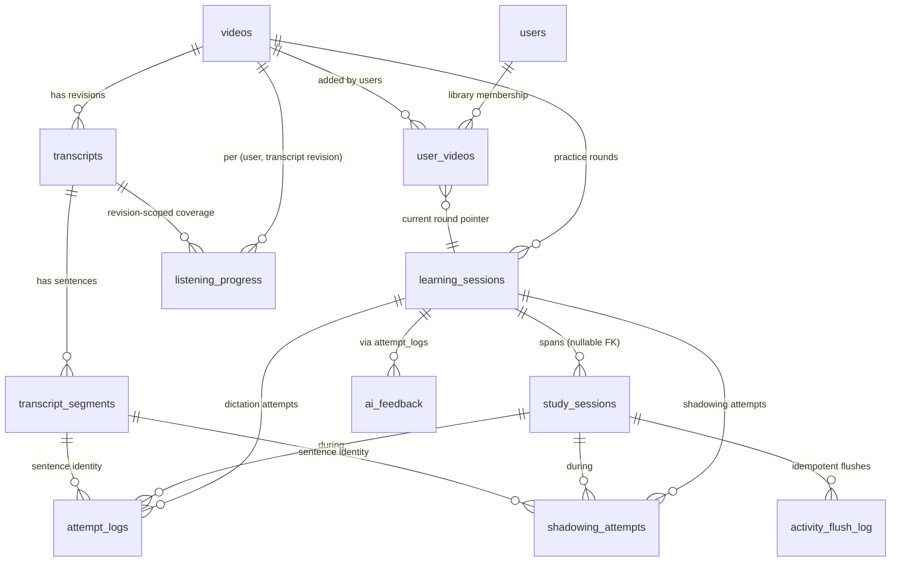
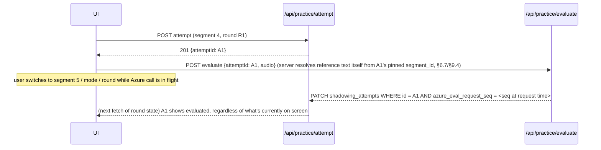

# Video-Based Learning Management — Audit & Implementation Plan

Status: **Audit and plan only.** No application code, migrations, or production data were
touched to produce this document. All findings were gathered by directly reading the current
repository (migrations `001`–`019`, and the live route/hook/component code), not assumed from
any prior planning document. Where an earlier finding from `.claude/vocabulary-stats-and-navigation-caching-plan.md`
overlaps, it was re-verified, not trusted as-is.

**Revision 6.** Revision 1 was the original audit + plan; Revision 2 a correctness/concurrency
review; Revision 3 added **Script Versions**; Revision 4 resolved eight findings going deeper into
mechanisms Revision 3 had touched but not fully fixed; Revision 5 fixed a second layer the same
review process surfaced under closer inspection (rows R21–R28 of the
[Review-resolution table](#review-resolution-table)) — `learning_sessions`' missing RLS
tightening, a cutover gate that checked a flag but never fenced concurrent writes, a false claim
that `SERIALIZABLE` isolation alone protects against a concurrent lower-isolation write, a
publish-vs-delete race, a §9.5/§9.7 contradiction over Listening writes, and a navigation-flush
ordering bug. **This revision (6)** fixes a third layer: the cutover fence still left
`dictation/check`'s service-role attempt insert and the new authoritative functions' own
`EXECUTE` grants unfenced, closed with a third transitional bridge and a deferred-grant mechanism,
plus a corrected (drain-not-abort) description of the lock's actual behavior and a full write-path
inventory (§8.14, issue 1); every `REVOKE` now names `anon` explicitly, since Supabase's default
per-schema privileges grant `anon` its own separate `EXECUTE` that revoking from `PUBLIC` alone
never removes (§9.9, issue 2); Script Versions deletion is now disabled for **every** video in v1
via a withheld `EXECUTE` grant, not merely refused for videos already showing vocabulary/bookmark
activity, which left the same race open for every other video (§6.9/§8.16, issue 3); the
navigation-flush trigger moves out of the practice page into a persistent root-layout observer, an
already-in-flight periodic flush is now tracked rather than missed, and Dictation/Shadowing
responses now actually carry the `coverage` field their cache patches read (§11.6/§9.3, issue 4);
and the Listening flush SQL is corrected to write its session-scoped counters to `study_sessions`
(not the nonexistent `listening_progress` columns a prior draft used) with an added
transcript-belongs-to-video relationship check (§9.6, issue 5). §2/§3 remain unchanged from
Revision 1.

## Table of contents

1. [Executive summary](#1-executive-summary)
   - [Review-resolution table](#review-resolution-table)
2. [Current-state audit](#2-current-state-audit)
3. [Confirmed defects and ambiguous behavior](#3-confirmed-defects-and-ambiguous-behavior)
4. [Agreed product rules and assumptions](#4-agreed-product-rules-and-assumptions)
5. [Proposed domain model](#5-proposed-domain-model)
6. [Completion and scoring formulas](#6-completion-and-scoring-formulas)
7. [State transitions](#7-state-transitions)
8. [Database changes](#8-database-changes)
9. [API changes and response contracts](#9-api-changes-and-response-contracts)
10. [Dashboard, library, History, and practice-page changes](#10-dashboard-library-history-and-practice-page-changes)
11. [Query-cache and view-state integration](#11-query-cache-and-view-state-integration)
12. [Implementation phases](#12-implementation-phases)
13. [Tests, runtime verification, and acceptance criteria](#13-tests-runtime-verification-and-acceptance-criteria)
14. [Rollout, compatibility, rollback, and limitations](#14-rollout-compatibility-rollback-and-limitations)
15. [Readiness assessment](#15-readiness-assessment)

---

## 1. Executive summary

The app already has most of the *primitives* this redesign needs (a video catalog, a
transcript-revisioning table, a dictation attempt log, TanStack Query wired end-to-end,
a working Shadowing evaluation UI) — but three load-bearing assumptions have quietly gone
stale as Dictation/Listening/Shadowing were merged into one shared practice page:

1. **Listening Mode writes progress into the Dictation table** (`learning_sessions`), not the
   purpose-built `listening_sessions` table its own migration describes — a genuine regression,
   not a design choice. `listening_sessions` and its two API routes are dead code today.
2. **Shadowing has no server-side persistence at all.** Every recording, Word Match result, and
   Azure Pronunciation Assessment score lives only in `sessionStorage`, gone on tab close.
3. **"Completion" is reachable through exactly one path** — typing the last Dictation sentence
   correctly. Listening and Shadowing can never mark a round complete under the current code,
   and Dashboard's progress bars quietly display *accuracy*, not coverage, because the coverage
   data was never fetched.

The plan below keeps the existing `videos` / `transcripts` / `transcript_segments` /
`learning_sessions` / `attempt_logs` tables as the backbone, fixes the transcript-regeneration
behavior that currently orphans historical attempts, adds three new tables (`study_sessions`,
`shadowing_attempts`, `listening_progress`), and deprecates (without dropping) the dead
`listening_sessions` table. It introduces one new domain concept the codebase doesn't have yet —
the **practice round** — by repurposing `learning_sessions` conceptually rather than replacing
it, and separates *practice coverage* from *performance* from *study time* throughout, per the
product rules in §4.

No new paid provider, no long-term recording storage, and no new client-state library are
introduced. The existing TanStack Query layer (already fully wired for Vocabulary/Bookmarks/
Dashboard/History as of this session) is extended with the same patterns already proven there.

Two review rounds hardened this further. The correctness/concurrency review found that the round
still needed a genuine per-video "added but not started" concept the original derived-only Library
design couldn't represent (fixed with a new, minimal `user_videos` membership table — never a
competing source of truth for scores), that the completion check as originally specified had a
real missed-completion race under concurrent submissions (fixed with row-level locking), that the
idempotent-write contract as written was actually broken (`ON CONFLICT DO NOTHING RETURNING *`
returns no row on conflict), and that Listening's coverage denominator overcounted when a
transcript has gaps between segments. The follow-up round added **Script Versions** — a
transcript-revision management feature (listing, honest storage-size estimates, duplicate
prevention via content fingerprinting, and reference-aware authorized deletion) — and caught a
subtler flaw in the interval-tracking design: gap-tolerant "compaction" applied to the same data
used for coverage math would silently lose real coverage decisions on a later flush.

A fourth review pass went deeper into mechanisms the first two rounds had already touched and
found genuine, concrete defects rather than remaining ambiguity: an idempotent-retry SQL pattern
that referenced a column (`attempt_logs.updated_at`) the actual schema does not have; a
transcript-revision "current" promotion pseudocode that violated its own unique-current index by
promoting before retiring; a Library query that could not produce a result for Listening-only
videos; a Postgres RLS gap that would let an authenticated client set `is_admin` on their own row,
or write fabricated Shadowing scores directly via PostgREST, bypassing every RPC-level check this
plan adds; a revision-deletion safety check that silently depended on legacy `attempt_logs` rows
having a `transcript_id` they were never backfilled with; and a "same deploy" cutover description
with no actual coordination mechanism behind it. All of this — plus the cache-invalidation gaps
and compatibility-contract corrections the same review raised — is resolved below; see the
review-resolution table immediately following for the full map, and the new rows R21–R28
specifically for this pass.

<a id="review-resolution-table"></a>
### Review-resolution table

| # | Finding | Decision | Updated sections | Verification |
|---|---|---|---|---|
| R1 | Practice-time formula measured session span, not active time | New wall-clock `activity_intervals` union per study session (cross-mode), distinct from `elapsed_span_sec`; account-level total unions across sessions to avoid cross-session double-count | §5.3, §6.3b, §8.3, §9, §13 (#25–28) | Scenarios #25 (25-min gap not counted), #27 (overlapping tabs not double-counted) |
| R2 | No entity represents "added, not started" or a Listening-only session with no round | New `user_videos` membership table (never authoritative for scores); `study_sessions.round_id` made nullable | §4, §5.1, §5.2, §5.6, §8.2, §9.2, §10.1–10.2 | Scenarios #21, #22 |
| R3 | Shadowing's Azure aggregate fell back to Word Match | Three fully independent aggregates (`azurePronunciationSummary`, `wordMatchSummary`, `shadowingPracticeCoverage`); `bestEvaluatedAttempt` renamed `latestSuccessfulAzureAttempt` (chronological, not highest-score) | §6.7, §9.4, §13 (#31) | Scenario #31 |
| R4 | Legacy `completed` rows would be silently treated as verified | `provenance`/`segment_identity_provenance` columns, schema-level not prose-level; legacy completions shown as a separate, non-blended Dashboard stat | §5.7 (base addendum item 4, now folded into §5), §6.8, §8.6, §10.3, §13 (#32–33) | Scenarios #32, #33 |
| R5 | Completion-check "transaction" didn't actually prevent a missed-completion race | `SELECT ... FOR UPDATE` on the round row before insert, inside one RPC function | §6.5, §8.7, §13 (#23) | Scenario #23 (two concurrent final-sentence submissions) |
| R6 | `ON CONFLICT DO NOTHING RETURNING *` returns no row on conflict | Superseded by R26 below: an explicit lock-then-lookup-then-insert flow, not an `ON CONFLICT ... DO UPDATE` self-touch (which R26 found still references a column `attempt_logs` doesn't have) | §6.5, §8.7, §9.3, §13 (#24, #29) | Scenarios #24, #29 |
| R7 | Transcript-revision handling only fixed the writer, not the readers | Explicit two-path reads (new-round vs. pinned-resume), `?transcriptId=` param on the transcript-fetch route, atomic publish function, advisory-locked version/fingerprint allocation | §6.9, §8.8, §9.6, §13 (#34–35) | Scenarios #34, #35 |
| R8 | Listening coverage denominator overcounted with segment gaps | Denominator = union of valid transcript-segment intervals (not `max(end)-min(start)`); credited coverage = observed ∩ that union, exact merge only | §6.3, §13 (#36) | Scenario #36 |
| R9 | No server-owned evaluation-failure/staleness/relationship-validation story | `azure_eval_request_seq` anti-staleness token, lazy stuck-`pending` expiry, explicit relationship-validation checklist, reference text resolved server-side | §9.4, §9.7, §13 (#38) | Scenario #38 |
| R10 | Cache matrix only fired on round completion | Every practice mutation invalidates round/library/dashboard at session-boundary events (not every 15s flush, to avoid excessive refetching) | §11.2 | Scenario #37 |
| R11 | Metric-labeling/scope conflicts (Dictation "accuracy," §6.8 vs. Phase 5 dedup contradiction, in-progress/completed treated as exclusive) | "Sentence accuracy" (binary, per-sentence) throughout; one unambiguous population/scope per stat; in-progress and completed are no longer mutually exclusive | §6.6, §6.8 | Scenario #39 (video with both a completed and an active round) |
| R12 | Migration/phase order had a real dependency bug (a completion function referenced `shadowing_attempts` before its migration) | All new schema created in one early phase before any cross-table function is written | §12 | Phase dependency graph re-checked against every function's table references |
| R13 | Acceptance criteria needed more scenarios | 24 scenarios from the first review round (#21–44), Script Versions scenarios (#45–48), the fourth-pass scenarios (#49–56, R21–R28), the fifth-pass scenarios (#57–65), and this (sixth) pass's scenarios (#66–78, replacing #57/#59/#47's framing where deletion's release gate changed — R29–R33 below) | §13 | — |
| R14 | Exact-interval preservation: gap-compacted storage plus one exact counter can't tell what's newly covered on a later flush | Dropped the compaction/exact-counter split; all stored interval sets merge on true overlap only, never on a tolerance window | §6.3, §6.3b | Re-derived worked example in §6.3 |
| R15 | Additive counters (`listening_observed_sec` etc.) had no retry-safe batch identity | New `activity_flush_log` dedup table (`(study_session_id, flush_batch_id)` primary key) gates every additive update | §6.3b, §8.3 | Scenario #26 |
| R16 | Per-session interval union doesn't dedupe overlapping wall-clock time across *different* sessions | Account-level "practice time" unions `activity_intervals` across all of a user's sessions at read time | §6.3b, §6.8 | Scenario #27 |
| R17 | Provider-issued score columns were protected on UPDATE but not INSERT | Superseded by R28 below: no owner-write policy of any kind remains on `shadowing_attempts` — a fresh-row-shape INSERT check alone still bypassed the round lock and validation, so R28 removes direct owner INSERT entirely rather than narrowing it | §8.7, §9.9 | RLS policy text itself |
| R18 | Legacy-provenance tagging and disabling old completion writes were scheduled too late relative to new readers depending on them | Both ship in the same deploy as the Dictation RPC cutover, not a later phase — made concrete by R23's write-gate runbook below, which is the actual mechanism, not just a scheduling statement | §12 (Phase 3) | Phase ordering |
| R19 | "Historical segments never become unavailable" was no longer true once deletion exists | Replaced with a cross-reference to the retention/deletion rules; any live reference still protects a revision | §6.9, §10.5 | §6.9's retention table |
| R20 | Script Versions feature: listing, size estimates, duplicate prevention, retention, authorized deletion | Full design in §6.9, §8.8, §9.6, §10.5 | §5.7, §6.9, §8.8, §9.6, §10.5, §12 (Phase 9), §13 (#45–48) | Scenarios #45–48 |
| R21 | Phase 0 fixed the transcript-revision *writer* but the *reader* (`fetchTranscript`, query key, new-round selection) stayed on Phase 9 — an existing round would render the wrong revision's text the moment Phase 0 alone shipped | Reader path (pinned-revision fetch, `?transcriptId=`, query-key split, server-side `is_current` resolution at round creation) moves into Phase 0 itself; duplicate-active-round reconciliation moves from the old Phase 7 into Phase 1, before Phase 2's functions assume round uniqueness | §12 (Phase 0, Phase 1), §9.1, §9.9 | Scenario #1 |
| R22 | §6.9's promotion pseudocode set `is_current=true` on the new/matched row *before* retiring the old current row — violates the `transcripts_one_current_idx` partial unique index, disagreeing with §8.3's own (correct) SQL function | Pseudocode corrected to retire-then-promote, matching §8.3 exactly | §6.9 | Re-read against §8.3's SQL, statement order now identical |
| R23 | "Same deploy" cutover language had no actual coordination mechanism for migrations vs. running instances vs. old tabs | A concrete `app_write_gate` singleton-row mechanism + bounded-timestamp backfill + explicit runbook with a defined recovery path — further corrected this pass into a genuine row-lock fence (issue group 2 below) | §8.14, §9.9, §12 (Phase 3), §14.2 | Scenarios #60, #61 |
| R24 | Library query selected Listening progress through `latest_round.transcript_id` — undefined when no round exists | Listening selection made round-independent: keyed by the video's own `is_current` transcript (or the null-transcript row), never through a round | §5.5, §6.3, §8.8, §10.2 | Scenario #49 |
| R25 | Cache matrix still gated several kinds of ordinary partial progress behind completion or a milestone, and relied on `pagehide` for in-app navigation | Direct cache patches for cheap deltas, throttled/boundary-triggered invalidation for aggregates, an explicit navigation-boundary flush hook (route-change, not just `pagehide`) — further corrected this pass for post-success ordering (issue group 5 below) | §11.2, §11.6 | Scenarios #38, #52, #65 |
| R26 | Idempotent-retry SQL used `ON CONFLICT ... DO UPDATE SET updated_at = now()`, but `attempt_logs` (confirmed against `001_initial.sql:105-114`) has no `updated_at` column; `roundCompleted` conflated "completed by this request" with "currently completed" | Explicit lock-then-lookup-then-insert flow (no self-touch UPDATE); response splits into `roundCompletedByThisRequest` (fixed at response time) and `roundStatus` (current, may legitimately differ on a later retry) | §6.5, §8.6, §8.12, §9.3, §9.8 | Scenario #24 |
| R27 | Listening/activity flush batching was described as a dedup-log-gated update but not confirmed atomic (dedup insert + interval merge + counter updates as one transaction), and had no defense against a reused batch id with different content | Single `fn_flush_study_activity` function per §6.3b, one transaction, `payload_fingerprint` column added to `activity_flush_log` for mismatch rejection | §6.3b, §8.10, §9.6 | Scenario #53 |
| R28 | Authorization stopped at row ownership: this app's existing client-side Supabase client can call PostgREST directly, and the existing `users_self_update`/`sessions_owner`/`attempts_owner` policies (`for all`/no `with check`) already permit a client to bypass server-side validation entirely — the new tables would inherit the same gap, including a self-`is_admin`-grant path; the Azure-recovery `persisted:false` path had no bound on what a "retry the persistence step" call could accept; revision-deletion's reference check silently depended on `attempt_logs.transcript_id`, which legacy rows are never backfilled with | New §9.9 documents SECURITY DEFINER execution identity + explicit `auth.uid()` checks in every function body; owner-`for all` RLS on `attempt_logs`/`shadowing_attempts`/`study_sessions`/`listening_progress`/`activity_flush_log` narrowed to owner-SELECT-only, writes RPC-only; `users` gets a `BEFORE UPDATE` trigger blocking client-driven `is_admin` changes; Azure recovery uses a server-signed, expiring token, never client-supplied scores; deletion's retention check now reads `learning_sessions.transcript_id` directly for every round status, not only via attempts | §8.6, §8.7, §8.8, §8.10, §8.11, §9.4, §9.9, §6.9 | Scenarios #54, #55, #56, #47 (corrected — a prior version of this row cited #9–#12, which are unrelated scenarios in this document's own numbering; those numbers belonged to the review's own request list, not this table) |
| R29 | The cutover fence covered only the two round-lifecycle bridges — `dictation/check`'s service-role `attempt_logs` insert, and direct PostgREST access to `learning_sessions` before Part C ran, were both left able to write during the pause/backfill window; the lock's own behavior was described backwards (an already-`FOR SHARE`-holding writer described as interrupted mid-write, rather than draining normally) | Third bridge `fn_legacy_record_dictation_attempt`; Part C (RLS drop) moved to run immediately after Phase 2 is confirmed live, decoupled from the pause/backfill; lock semantics corrected (drain, not abort) with a proof that the backfill's timestamp bound is sufficient; a full write-path inventory table; the five real functions' `EXECUTE` grant deferred to the Phase 3 runbook itself, not issued at creation | §8.13, §8.14, §12 Phase 2/3, §14.2 | Scenarios #70–#73 |
| R30 | Every `REVOKE EXECUTE` in this plan named only `public`/`authenticated` — Supabase's default per-schema privileges separately grant `anon` its own `EXECUTE` on every new function, which a `PUBLIC`-only revoke does not remove, leaving every function reachable by an unauthenticated caller | `anon` added explicitly to every `REVOKE` in §8.3/§8.13/§9.9; the default-privilege behavior stated as a verified project fact, not assumed | §8.3, §8.13, §9.9 | Scenario #69 |
| R31 | Deletion's release gate refused only videos with *existing* vocabulary/bookmark rows at check time, leaving open: check finds none → a reference is created concurrently → deletion proceeds anyway | v1 rule changed to unconditional: `fn_delete_transcript_revision` receives no `EXECUTE` grant to any application role at all; no route/UI delete control ships until a future migration adds the grant | §6.9, §8.16, §9.9, §10.7, §12 Phase 9 | Scenario #74 |
| R32 | The navigation-flush trigger (`usePathname`) still lived inside the practice page's own component tree, so it could unmount before observing the destination route; an already-in-flight periodic flush at the moment of navigation was invisible to the "unsent buffer" check; the Shadowing attempt response the cache matrix promised to patch coverage from didn't contain a coverage field | Persistent root-layout `NavigationFlushObserver` + module-level coordinator split; in-flight requests tracked by `flushBatchId` and attached to rather than re-sent; `coverage` added to both attempt-recording functions' responses | §11.6, §9.3, §8.12, §12 Phase 5 | Scenarios #75–78 |
| R33 | The Listening/activity flush SQL wrote `listening_observed_sec`/`listening_newly_covered_sec` onto `listening_progress`, a table whose actual DDL has no such columns; a Listening flush's `transcriptId` was accepted on bare FK existence, not confirmed to belong to the claimed video | Counters moved to `study_sessions` (their actual owning table, §5.3/§8.5), updated in the same transaction under the already-held session lock; explicit `transcripts.youtube_video_id = :videoId AND status='ready'` check added before the upsert | §9.6, §9.7, §8.13 | Scenarios #66–68 |

---

## 2. Current-state audit

Every claim below cites `file:line`. Tags: **(a)** confirmed by direct code/schema reading,
**(b)** requires runtime/DB verification against the live Supabase project, **(c)** contradictory,
dead, or regressed relative to its own documented intent.

### 2.1 Session and video identity

**Does switching modes create another session or another video-history entry? (a) No.**
`inputMode` (`"dictation" | "listening" | "shadowing"`) is pure client state sourced from the
`?mode=` query param (`src/app/dictation/[videoId]/useInputModePreference.ts`), with a per-video
`localStorage` fallback. `setInputMode` does `router.replace(/dictation/${videoId}?mode=...,
{scroll:false})` — same route, same mounted component, no remount. `useDictationSession.ts` is
not re-invoked with different arguments per mode; `sessionId`, `currentSegIdx`, mistakes, combo,
etc. are one shared React state tree across all three modes. `ModeSwitcher.tsx`'s `onSelectMode`
wires straight to `setInputMode` from both `ControlBar.tsx:493` and `SettingsDrawer.tsx:335` (the
latter reachable at *any* UX state).

**What does the existing `session` entity represent? (a)** `learning_sessions`
(`supabase/migrations/001_initial.sql:86-97`) is a per-`(user, video)` resumable-progress row:
`current_segment_index`, `accuracy`, `total_attempts`, `status` (`active|completed|abandoned`),
`video_current_time`, plus `ai_assessment`/`ai_assessment_generated_at` (`010_session_assessment.sql`).
It has **no `mode` column** — nothing at the DB level records which of the three modes produced
a given row.

**Can multiple records represent the same user/video? (a) Yes, and nothing prevents it.**
Neither `learning_sessions` nor `listening_sessions` has a unique/composite constraint on
`(user_id, youtube_video_id)` — only separate single-column indexes on each. `POST /api/session/restart`
(`src/app/api/session/restart/route.ts:27-41`) marks the current active row `abandoned` rather
than deleting it; the next `save-progress` call with no `sessionId` then finds no active row and
**inserts a new one** (`src/app/api/session/save-progress/route.ts:111-124`). Repeated
restart→complete cycles on the same video therefore accumulate multiple `completed` rows for
that video.

**What determines which record is resumed? (a)** `GET /api/session/resume`
(`src/app/api/session/resume/route.ts:26-35`) — `order by updated_at desc limit 1` for
`(user_id, youtube_video_id)`, **no status filter** (deliberate, per its own comment, so a
completed video correctly reports back as completed). `POST /api/session/save-progress`'s
create-vs-reuse key is `(user_id, youtube_video_id, status='active')`
(`save-progress/route.ts:68-76`) — no `mode`/`transcript_id` component.

**Does entering through Dashboard behave differently from switching modes inside the practice
page? (a) No** — both paths land on `/dictation/[videoId]` (optionally `?mode=listening`) and
resolve to the same `learning_sessions` row via the identical lookup key. The only difference is
which route param seeds `inputMode` on first render.

**Listening specifically — (a)(c) confirmed regression:** `src/app/listening/[videoId]/page.tsx`
is now a 15-line server component that does nothing but `redirect(/dictation/${videoId}?mode=listening)`.
The dedicated `listening_sessions` table (`012_listening_sessions.sql`) and its two API routes
(`/api/listening-session/resume`, `/api/listening-session/save-progress`) are fully built,
migrated, RLS-protected — and **unreachable from any client code path** (repo-wide grep for
`listening-session` matches only the route files' own log strings). Listening Mode's
`triggerAutoSave` (`useDictationSession.ts:328-350`) has no branch on `inputMode` at all and
writes straight into `learning_sessions` via the same `saveProgress()` call Dictation uses. This
directly contradicts `012_listening_sessions.sql`'s own comment: *"Kept as its own table rather
than folding into learning_sessions... History/Dashboard queries union this table with
learning_sessions and tag each row with its mode."* The union still happens
(`dashboard/summary/route.ts:29-59`) — it just never receives real data anymore, because nothing
writes to `listening_sessions` post-merge.

**Shadowing specifically — (a) confirmed:** Shadowing is `?mode=shadowing` on the same route.
`useDictationSession.ts` never receives `inputMode` as a parameter at all — Shadowing's
recording/evaluation state lives entirely outside this hook, in
`useShadowingEvaluations.ts` + `shadowingEvaluationPersistence.ts`, backed only by
`sessionStorage`. When a user "completes" a video purely via Shadowing, the *only* DB trace is
whatever `learning_sessions` row happens to exist for that `(user, video)` — same row Dictation
would use, same zero-accuracy problem as Listening (below).

### 2.2 Completion and progress

**Where/when is a session marked completed? (a)** Exactly one call site in the entire repo sets
`status: "completed"` on `learning_sessions`: `useDictationSession.ts:399-412`, inside
`handleAnswerSubmit`'s **correct-answer** branch, only when `nextIdx >= segments.length` — i.e.
the user must type the *last* sentence correctly through the Dictation input. No other code path
(Listening's continuous tick, Shadowing's recorder, `handleSkip`, `jumpToSegment`) ever passes
`"completed"`.

**Does reaching the last sentence count as completion despite skipped sentences? (a) No, but
only by accident of the single-gate design.** `handleSkip` (`useDictationSession.ts:467-479`) is
guarded `if (nextIdx < segments.length)` — skipping the *last* segment is a no-op, so skip alone
can never trigger completion. But skipping segments 1 through 9 and then correctly *typing*
segment 10 **does** complete the round today, with zero `attempt_logs` rows for 1–9 — there is no
check that every segment was actually attempted, only that the final one was answered correctly.

**Is completion dependent on accuracy? (a) Yes, uniquely and only for Dictation** — completion
requires the *last* sentence specifically to be answered correctly (not just attempted). Wrong
answers on the last sentence never complete the session; there is no "attempted, however scored"
completion path.

**Are displayed progress bars based on coverage, sentence position, or accuracy? (a) Accuracy,
mislabeled as progress.** `dashboard/page.tsx:345`: `width: ${Math.min(100, Math.max(0,
firstSession.accuracy ?? 0))}%`. `history/page.tsx:237`: identical pattern. Both sit under a text
label showing `current_segment_index` with **no denominator** — `ResumableSession`
(`src/lib/types/index.ts:307-321`) carries `currentSegmentIndex` but no `totalSegments`, and
`dashboard/summary/route.ts` never fetches a per-video segment count for these rows. The only
place a true position-based bar exists is `ControlBar.tsx`'s `{idx+1}/{total}` **text**, not a
visual bar, and it's Dictation/Shadowing-only UI.

**Does seeking to the end count as having listened to the whole video? (a) Not "completed", but
functionally yes for the one progress signal that exists.** Seeking never triggers
`status:"completed"` (continuous mode's tick takes an early-return branch that skips the
completion-eligible code path entirely). But `player.getCurrentTime()` is re-read every 200ms tick
regardless of *how* the position changed, so a `seekTo(duration)` followed by any of the sparse
autosave triggers (tab hidden, page closed) persists `video_current_time ≈ duration` — exactly
what Dashboard/History render verbatim as **"Watched to `<duration>`."** A user who jumps straight
to the end and backgrounds the tab is shown as having watched the whole video.

### 2.3 Scores and persistence

**What constitutes a valid Dictation attempt? (a)** Non-empty (trimmed) submitted text reaching
`handleAnswerSubmit` → `POST /api/dictation/check`. Empty/whitespace-only input never leaves the
client (`page.tsx:543-547`, early-return no-op) — no `attempt_logs` row, no accuracy impact.
There is no "reveal answer" action anywhere; the only assist is a 5-level Hint toggle that masks/
reveals letters but never auto-fills or auto-submits. Hint usage is tracked client-side only
(`wrongAttempts===0 && hintLevel===0` → `isClean`) and is **never sent to the server** — a hinted
correct answer is indistinguishable from a clean one in `attempt_logs`.

**Which attempt contributes to current scores? (a) Every attempt, unweighted — not latest, not
best.** `src/store/sessionStore.ts:45-50,79-83`: `incrementAttempt(isCorrect)` bumps
`totalAttempts`/`correctCount` on *every* submit, right or wrong; `selectAccuracy = correctCount /
totalAttempts * 100`. A sentence retried 5 times before succeeding contributes 4 wrong + 1
correct to the tally. This client-tallied number is sent **verbatim** to
`POST /api/session/save-progress`, which writes it straight into `learning_sessions.accuracy` —
**never recomputed server-side from `attempt_logs`.** Separately, `attempt_logs` itself has **no
unique constraint** — every submission (including duplicate network retries) inserts an
unconditional new row, and DB insert errors on that insert are **silently swallowed**
(`dictation/check/route.ts:70-73`, caught/logged, 200 returned regardless) — so the client-tallied
accuracy shown to the user can diverge from what `attempt_logs` actually contains, with no
detection. A second, independent notion of accuracy exists at
`session/[sessionId]/report/route.ts:79-101`, which recomputes mistakes directly from
`attempt_logs` (deduped per `segment_index`) — **these two numbers are never reconciled.**

**Are Shadowing results stored only in sessionStorage, or also persisted server-side? (a) Only
sessionStorage, confirmed by repo-wide grep.** `shadowingEvaluationPersistence.ts:1-51` states
this explicitly in its own comment: *"session-scoped only (cleared on tab close), never sent
anywhere."* Key: `dictation.shadowing-evaluations.<videoId>.<transcriptId>` — already
transcript-revision-aware, a good precedent. No table anywhere in `supabase/migrations/**`
relates to Shadowing scores or audio; `azureSpeech.ts` and `practice/evaluate/route.ts` contain
zero Supabase calls. Raw recording audio is never persisted anywhere, client or server — it lives
only in an in-memory `Blob`, discarded on retry/unmount/tab close.

**Can failed evaluation overwrite a previous successful result? (a) No — already handled well.**
`useShadowingEvaluations.ts`'s `startTrueEvaluation`/`failTrueEvaluation` deliberately do **not**
touch `lastSuccessfulTrueEvaluation`/`attempts` (explicit bug-fix comments in the code: *"retry
destroys previous result"*). Azure quota is reserved *before* the call and only recorded *after*
success (`practiceQuota.ts`), so a failed/quota-blocked call never burns budget and never erases
prior valid data. This is exactly the discipline the redesign needs — it just needs to survive a
tab close, which it currently doesn't.

**What survives reload, navigation, sign-out, switching devices? (a)** Dictation progress/accuracy:
survives via `learning_sessions`/`attempt_logs` (server, durable) — but is client-trusted, not
server-verified (above). Shadowing: survives reload only via the `sessionStorage` snapshot within
the *same tab*; gone on sign-out (`auth.tsx`'s `signOut` calls `queryClient.clear()`, but
`sessionStorage` is untouched by that — moot anyway since nothing there is server-synced),
completely gone on a different device. Listening: nominally durable via `learning_sessions.video_current_time`
(because it's misrouted there, §2.1), but with no coverage semantics, no unique-per-mode
identity, and no monotonic guard — replaying an earlier part and then backgrounding the tab
**overwrites a higher previously-saved position with a lower one** (`save-progress` routes do a
plain `.update()`, never `GREATEST()`).

### 2.4 Dashboard and History

**Are completed videos counted distinctly? (a) Yes for the specific "completed videos" stat**
(`dashboard/summary/route.ts:64`: `new Set(completedDictationSessions.map(s => s.youtube_video_id)).size`)
— correctly deduplicated. **But `avgAccuracy` is not**: it averages over completed *rows*, not
distinct videos (`route.ts:65-71`), so a video completed twice (a real, reachable state per
§2.1) counts once in "Completed Videos" but **twice** in the accuracy average.

**How is practice time calculated? (a) It isn't — it's mislabeled.**
`totalPracticeMinutes = sum(video_current_time across all session rows) / 60`
(`dashboard/summary/route.ts:74-76`). `video_current_time` is a **playhead position** (furthest
point reached), not elapsed wall-clock time. Replaying/completing the same video twice adds its
playhead position twice; the UI's own labels elsewhere ("Watched to…") correctly describe this
value as a position, but the Dashboard stat calls it "Practice Time."

**How is the streak calculated? (a)** From `attempt_logs` only (`dashboard/summary/route.ts:114-116`,
scoped to dictation session IDs) — a day of pure Listening or Shadowing practice does not extend
the streak.

**Are the same data fetched independently in multiple places? (a) Mostly no, already fixed.**
`src/lib/queries/dashboard.ts` is shared by both `dashboard/page.tsx` and `history/page.tsx` (one
query, one cache entry) — the prior planning doc's proposal here is now implemented, not just
proposed. `history/page.tsx`'s "History" cards are **not** raw one-row-per-session; they reuse the
summary endpoint's `resumableSessions` (already deduped to "latest per `(mode, video)` key"
server-side). The separate "Mistakes" panel is a flat, paginated, dictation-only `attempt_logs`
list with no session/day grouping at all.

**Which caches must be updated after learning activity? (a) None are today, by deliberate prior
scope choice.** Repo-wide grep for `invalidateQueries` finds it used only in
`src/lib/queries/{bookmarks,vocabulary}.ts` — never in a dashboard/history/session context.
Session-progress writes (`triggerAutoSave`, and the dead listening-session equivalent) are plain
`fetch()` calls, not `useMutation`, with zero cache interaction. Dashboard/History only pick up
new activity once the global 60s `staleTime` naturally lapses. The prior plan documented this as
an explicit, deliberate exclusion ("out of scope for this release") — for this redesign, closing
that gap is in scope (§11).

### 2.5 What needs runtime/DB verification (not answerable from static code)

- Whether all 19 migrations are actually applied to the live Supabase project, and whether RLS is
  enforced at runtime exactly as the migration text declares (no out-of-band dashboard edits).
- Actual row counts: how many duplicate `active`/`completed` `learning_sessions` rows exist per
  `(user, video)` in production today; how many pre-merge `listening_sessions` rows still exist
  and what they'd backfill to; whether `attempt_logs`-derived accuracy actually disagrees with
  `learning_sessions.accuracy` for any real session (the code allows it; production data would
  confirm how often).
- The real-world impact of the Azure quota being **global**, not per-user
  (`practiceQuota.ts` — a single Redis counter for the whole app/month).

---

## 3. Confirmed defects and ambiguous behavior

Ranked by impact on the redesign. All **(a)** confirmed by code reading unless noted.

| # | Defect | Evidence | Impact |
|---|---|---|---|
| D1 | Listening Mode writes progress into `learning_sessions` instead of `listening_sessions` | `useDictationSession.ts:328-350` has no mode branch | Listening sessions appear on Dashboard/History as low-accuracy "Dictation" rows; `listening_sessions` table + 2 API routes are dead code |
| D2 | Shadowing has zero server-side persistence | `shadowingEvaluationPersistence.ts:1-51`, grep confirms no DB table | All Shadowing history lost on tab close; invisible to Dashboard/History/report entirely |
| D3 | Completion reachable only via "type last Dictation sentence correctly" | Single call site, `useDictationSession.ts:399-412` | Listening/Shadowing-only practice can never complete a round |
| D4 | Skipped sentences don't block completion | `handleSkip` guard only blocks skipping the *last* segment | Sentences 1–9 skipped + 10 typed correctly ⇒ "completed" with 90% never attempted |
| D5 | Dashboard/History progress bars render accuracy, not coverage | `dashboard/page.tsx:345`, `history/page.tsx:237` | Users see "progress" that is actually a score; no coverage data is even fetched to fix it in place |
| D6 | Seek-to-end + backgrounding falsely reads as "watched to duration" | No BUFFERING handling, no interval tracking, raw position persisted | Listening's only signal is trivially gameable/misleading |
| D7 | `video_current_time` has no monotonic guard | Plain `.update()` in both save-progress routes | Replaying an earlier part regresses a previously-higher saved position |
| D8 | `avgAccuracy` double-counts repeat completions of the same video | `dashboard/summary/route.ts:65-71` averages rows, not distinct videos | Skews the headline accuracy stat |
| D9 | "Practice Time" is actually sum of playhead positions, not elapsed time | `dashboard/summary/route.ts:74-76` | Mislabeled stat; inflated by replays/re-completions |
| D10 | Streak only counts Dictation typed attempts | `dashboard/summary/route.ts:114-116` scoped to dictation session IDs | Listening/Shadowing-only study days don't count |
| D11 | No unique constraint on `(user_id, youtube_video_id)` for either session table | Confirmed absent in both `001_initial.sql` and `012_listening_sessions.sql` | Duplicate active rows possible; app silently resolves via "most recently updated" |
| D12 | `attempt_logs` has no unique constraint at all | `001_initial.sql:105-116` | No idempotency — every retry (including accidental double-submits) inserts a new row |
| D13 | DB insert errors on `attempt_logs` are silently swallowed | `dictation/check/route.ts:70-73` | Client-tallied accuracy can silently diverge from ground truth with no error surfaced |
| D14 | Two independent, unreconciled notions of "accuracy" | Client tally (`sessionStore`) vs. server recompute (`report/route.ts`) | Numbers shown on the practice page vs. the results page can disagree |
| D15 | Transcript regeneration reuses `transcripts.id` and hard-deletes+replaces segments in place | `transcript/generate/route.ts:351-433` (confirmed by DB-audit agent) | `attempt_logs.segment_index` (a bare int, no FK) silently points at unrelated new text after regen — historical attempts become semantically orphaned |
| D16 | `transcripts.version` is always inserted as `1`, never incremented | `transcript/generate/route.ts:405` | No real revisioning signal exists today despite the column's name |
| D17 | Switching mode never resets `uxState` | No `inputMode` dependency found on the state-reset effect | A "Session Complete!" panel can stay on-screen after switching to Listening/Shadowing via the Settings drawer |
| D18 | No cache invalidation tied to any session/practice mutation | Grep confirms `invalidateQueries` used only for vocabulary/bookmarks | Dashboard/History only reflect new activity after the 60s `staleTime` lapses |
| D19 | Zustand `sessionStore`'s accuracy tally persists to a single, non-video-scoped `localStorage` key | `src/store/sessionStore.ts:28`, key `"dictation-session"` | Cross-video leakage is patched around at resume time (`useDictationSession.ts:774-812`) rather than fixed at the source |
| D20 | `exact`/`relaxed`/`learning` match modes are behaviorally identical for `relaxed`/`learning` | `lib/utils/text.ts:42-51` | Naming implies a leniency difference that doesn't exist — minor, noted but out of scope for this plan (not part of the video/mode/completion model) |

**Ambiguous, needs a product decision (resolved in §4):**
- Should a video with an existing *completed* round auto-offer "Practice again," or require an
  explicit action? (Task already answers this — explicit action, §4.)
- Should Word Match results (currently ephemeral even in the audited design) become
  server-persisted? The task's completion rules require *practice credit* to survive
  independently of evaluation success — this plan persists Word Match alongside Azure results on
  the same new `shadowing_attempts` row (§5), not just Azure.

---

## 4. Agreed product rules and assumptions

The product rules in the task brief are treated as settled and are restated here only where a
concrete default had to be chosen. New defaults chosen by this plan (all reversible, all
justified where they first apply):

| Constant | Default | Rationale |
|---|---|---|
| `INACTIVITY_TIMEOUT_MINUTES` | 30 | Study-session boundary (§5.3) — long enough that a bathroom break doesn't fragment one sitting, short enough that leaving a tab open overnight doesn't merge two real sessions |
| `SHADOWING_MIN_DURATION_SEC` | 0.5 | Floor to filter accidental instant-cancel taps, not a correctness proof (§6.2) |
| `LISTENING_GAP_TOLERANCE_SEC` | 1.5 | **Client-side seek/discontinuity detection only** — decides whether two consecutive playback ticks form one continuous candidate interval before submission. Never used server-side to merge stored data or inflate credited coverage (§6.3, correcting a flaw the review caught in the first draft) |
| `SEEK_DETECTION_TOLERANCE_SEC` | 2.0 | Rate-aware discontinuity check: `abs(actual_pos - (last_pos + wall_clock_elapsed * playback_rate)) > 2.0` ⇒ treat as a seek, not continuous playback (§6.3) |
| `MAX_TICK_GAP_SEC` | 5.0 | A wall-clock gap between consecutive playback ticks larger than this is never bridged, independent of the position delta — covers browser suspension/throttling even when the resulting position jump looks small (§6.3) |
| `LISTENING_SYNC_FLUSH_INTERVAL_SEC` | 15 (of active `PLAYING` time) | Normal-case flush cadence, bounding request volume (~4/min while playing) — not a data-loss guarantee (§6.3) |
| `MAX_PENDING_BUFFER_SEC` | 300 | The actual worst-case data-loss bound under sustained network failure or tab death, once buffered data exceeds this the oldest is dropped — corrects an earlier, false "≤15s" claim (§6.3) |
| `LISTENED_THROUGH_THRESHOLD` | 90% coverage ratio | An explicit product tolerance for legitimate intro/outro skips, re-listens, and ordinary pause/seek behavior — **not** a measurement-precision artifact (the review correctly rejected "200ms polling jitter" as the justification) (§6.3) |
| `MAX_SHADOWING_ATTEMPT_HISTORY` | 5 per sentence | **Client-side display/cache cap only** — the server table (`shadowing_attempts`) retains full history indefinitely; this never limits what coverage/History/reports can see |
| `ATTEMPT_IDEMPOTENCY_KEY` | client-generated `clientAttemptId` (UUID v4), one per logical submit | Minimal mechanism to make retried network requests safe (§9) |
| `FLUSH_BATCH_ID` | client-generated UUID v4, one per buffered activity/listening flush | Retry-safe batch identity for additive counters, via `activity_flush_log` (§6.3b, §8.3) |
| `PULSE_ENGAGEMENT_WINDOW_SEC` | 45 | A generic activity pulse (Dictation keystroke, hint reveal, etc.) is only emitted while genuine interaction has occurred within this window — closes the "attention" gap honestly rather than pulsing on mere page-open (§6.3b) |
| `EVAL_PENDING_TIMEOUT_SEC` | 120 | A `shadowing_attempts` row still `azure_eval_status='pending'` past this age is lazily surfaced/rewritten as `failed` (`expired`) on next read — no cron needed at this app's scale (§9.5) |
| `REVISION_GRACE_PERIOD_DAYS` | 30 | A superseded, otherwise-unreferenced transcript revision becomes a Script Versions cleanup candidate only after this long — never based on age alone or "keep latest N" (§6.9). Anchored to `superseded_at`, not to whichever moment it most recently became unreferenced (§6.9) |
| `AZURE_RECOVERY_TOKEN_TTL_SEC` | 600 | Expiry bound on the server-signed Azure-result recovery token (§9.4/§9.9) — a persistence retry older than this must re-request evaluation rather than replay a stale signed payload |
| `CUTOVER_DRAIN_WINDOW_SEC` | 30 | **Not the correctness mechanism** — the `app_write_gate` row-lock fence (§8.14) is what actually drains in-flight legacy writes before the backfill boundary. This constant is only the operational alarm threshold used at the Phase 3 code deploy's "confirm 100% live" step (§8.14 runbook step 6) — how long to wait for the deploy platform to report every old instance replaced before treating a slow rollout as worth investigating |

Assumptions carried forward from the audit rather than re-litigated:
- **Video identity stays `youtube_video_id` (text)**, not a switch to `videos.id` (uuid) as the
  foreign key used across attempt/round tables — matches every existing table's convention
  (`learning_sessions`, `vocabulary_items`, `bookmarks` all key on the bare YouTube ID already).
  Changing this would touch far more surface than this redesign needs.
- **No physical rename of `learning_sessions`.** It is documented and API-shaped as the
  *Practice Round* table going forward, but the physical table name stays to avoid an
  unnecessary, purely-mechanical multi-file rename across ~10 route/hook files for zero
  functional gain. Noted as an optional later cleanup (§14).
- **A minimal `user_videos` membership table *is* added** (reversing Revision 1's "no dedicated
  library table" call). A query-time aggregation across `learning_sessions` + `shadowing_attempts`
  + `listening_progress` — Revision 1's original approach — cannot represent "video added, not yet
  started" (no rows exist anywhere yet to aggregate) or a Listening-only session with no round.
  `user_videos` closes that gap while staying strictly a membership/UI-convenience pointer: it is
  **never** read for coverage, completion, or scores — every such read still goes to the
  authoritative tables above, via a LEFT JOIN from `user_videos`, not the reverse. This keeps the
  "no parallel sources of truth" rule intact while fixing the representational gap (§5.6).
- **Transcripts remain shared/global per `(youtube_video_id, language)`, not per-user** — confirmed
  from `transcripts_public_read`/`transcripts_service_manage` RLS (`001_initial.sql:142-147`).
  Script Versions (§6.9) therefore has no per-user partition to reason about: duplicate detection,
  "current" selection, and retention are all scoped to `(youtube_video_id, language)` only, and
  deletion requires a new, minimal admin concept (§6.9/§8.8) since no per-user owner exists to
  gate it on.

---

## 5. Proposed domain model

### 5.1 Concept-to-table mapping

| Domain concept | Table | Status |
|---|---|---|
| Video catalog | `videos` | Existing, unchanged |
| **Video library membership** | `user_videos` | **New** (§5.6) — UI-convenience anchor, never authoritative for scores |
| Transcript revision | `transcripts` | Existing, **behavior fix + new columns** (§8.2/§8.3; §8.11 — Script Versions) |
| Transcript sentences | `transcript_segments` | Existing, unchanged |
| **Practice round** | `learning_sessions` | Existing, **extended** (repurposed conceptually, physical name unchanged — §4) |
| **Study session** | `study_sessions` | **New** (nullable `round_id` — §5.3) |
| Dictation sentence attempt | `attempt_logs` | Existing, **extended** |
| Shadowing sentence attempt | `shadowing_attempts` | **New** |
| **Listening coverage** | `listening_progress` | **New** — supersedes `listening_sessions` |
| **Cross-mode activity time** | *(fields on `study_sessions`)* | **New** (§5.3, §6.3b) — no separate table |
| **Flush idempotency log** | `activity_flush_log` | **New** (§6.3b) |
| AI session feedback | `ai_feedback` | Existing, unchanged |
| Legacy Listening rows | `listening_sessions` | Existing, **deprecated** (frozen, kept for backfill provenance, no new writes) |
| Video Library view | `user_videos` LEFT JOIN onto the authoritative tables above | Query-time aggregation, anchored by a real table (§5.6, correcting Revision 1) |

Everything outside this list (`vocabulary_items`, `bookmarks`, translation/highlight caches,
`vocabulary_audio_assets`) is untouched — see §14 scope preservation.

### 5.2 Entity-relationship diagram



`learning_sessions` = **Practice Round**. One row per pass through a video's sentence set, fixed
to one `transcript_id`. Both Dictation and Shadowing attempts reference it via `round_id`
(physically the existing `session_id`/new `round_id` FK — see §8.2 on naming). `study_sessions`
sits *inside* a round (many sessions per round, spanning days) — but its `round_id` FK is
**nullable**, because a Listening-only study session has no round to attach to at all (§5.3).
Both attempt tables also reference the specific study session they occurred in, for History's
per-sitting breakdown. `listening_progress` deliberately does **not** reference a round —
Listening isn't a discrete-sentence pass, it's tracked per `(user, video, transcript revision)`
directly, exactly matching the product rule that Listening coverage is separate from
active-practice coverage. `user_videos` sits above all of this as a thin per-`(user, video)`
anchor row — it points *at* a current round when one exists, but every score/coverage/completion
read still goes through the tables above it, never through `user_videos` itself (§5.6).

### 5.3 Study session — start/resume/inactivity/end rules

A study session is not equivalent to a round (§5.2) or a completed video, and — unlike Revision 1
— **does not require a round to exist.** Rules, none of which depend solely on
`beforeunload`/`pagehide`:

1. **Start:** on the first *qualifying activity* for a `(user, video)` with no `study_sessions`
   row whose `last_activity_at` is within `INACTIVITY_TIMEOUT_MINUTES` (30) of now — insert a new
   row. `round_id` is set to whatever round is current at that moment, or `NULL` for Listening-only
   activity with no round yet.
2. **Resume:** on qualifying activity within that window — update the existing row's
   `last_activity_at`, and append the active mode to `modes_used` if not already present.
3. **Inactivity boundary:** a gap larger than 30 minutes means the *next* qualifying activity
   starts a brand-new `study_sessions` row, even for the same round on the same day.
4. **Explicit round start always force-closes the current session**, regardless of the 30-minute
   window: starting a new round (Dictation/Shadowing "Practice again," or the first round created
   out of a previously round-less Listening-only session) stamps `ended_at = now()` on whatever
   session is currently open and opens a fresh one attached to the new round. This is the concrete
   answer to "what happens to a study session when the user explicitly starts another round" —
   and it means a session's `round_id`, once set, **never changes** after creation; a round change
   always means a new session row instead.
5. **End:** beyond rule 4, no explicit "close" call is required for correctness. `ended_at` is
   also set **opportunistically** by extending the existing
   `visibilitychange`(hidden)/`pagehide` listener already in `useDictationSession.ts:684-715` to
   stamp it — but the *authoritative* session-grouping span is always
   `elapsed_span_sec = last_activity_at - started_at` (bookkeeping only), which is correct whether
   or not `ended_at` ever gets set. The *estimated active-practice time* shown to users is a
   **separate** field, `active_practice_sec`, computed from the `activity_intervals` mechanism in
   §6.3b — never the same number as `elapsed_span_sec` (this is the direct fix for the review's
   core finding: a 20:00 submission followed by a 20:25 submission after an unrelated break must
   not read as 25 minutes of active practice).

**Qualifying activity events** (bump `last_activity_at`, create/resume the row, and contribute to
`activity_intervals` per §6.3b): Dictation keystrokes/input-change, segment auto-play, hint
reveals, and submissions; Shadowing recording ticks and attempt saves; a Listening sync flush
(§6.3, only fired after real accumulated `PLAYING` time); segment navigation
(skip/previous/bookmark-jump). Passive 200ms position ticks with no accompanying interaction are
**not** qualifying on their own — this is what keeps an idle-but-open tab from fabricating a
session or inflating active time.

**Per-session Listening bookkeeping**, distinct from the lifetime `listening_progress` union
(which discards which-session-contributed-what once merged): `listening_observed_sec`
(session-scoped raw sum of playback time actually observed this session, deliberately **not**
deduped against prior sessions — legitimate re-listening within one sitting still counts as
listening activity) and `listening_newly_covered_sec` (session-scoped delta actually credited to
the *lifetime* union at flush time, `covered_sec_after − covered_sec_before`). Both are additive
counters protected by the same `activity_flush_log` idempotency mechanism as
`active_practice_sec` (§6.3b) — a retried flush never double-adds to either.

**Units, precisely (the review asked this be made explicit, distinct from wall-clock study
time):** `listening_observed_sec` and `listening_newly_covered_sec` are both measured in
**media-timeline seconds** — the same axis as `covered_sec`/`coverage_ratio` (§6.3), i.e. how much
*content* was played back, not how long the listener sat there. This is deliberately the same unit
as coverage (so "observed vs. covered" is a directly comparable ratio) and deliberately **not**
the same unit as `active_practice_sec` (§6.3b), which is wall-clock engaged time — the two answer
different questions ("how much of the content did you play back, replays included" vs. "how much
real time did you spend engaged") and are never conflated into one number.

**Payload and calculation, replay-inclusive by construction:** the client does **not** pre-merge
replayed spans before flushing — every `PLAYING`-state span observed since the last flush is sent
as its own entry in `intervals` (§9.6), even if it overlaps an entry already in the *same* batch
(e.g. `[{"start":41.2,"end":51.2},{"start":41.2,"end":51.2}]` for "played the same 10 media-seconds
twice within this flush window"). The server computes the two counters differently from the same
raw list: `listening_observed_sec`'s contribution from a batch is `Σ (entry.end − entry.start)`
over every entry, unmerged; `covered_intervals`/`listening_newly_covered_sec` come from merging
those same entries into the stored union first (§6.3) and taking only the *new* territory. **At 1×
speed**, listening to the same 10-media-second interval twice within one flush produces
`covered_sec` +10 (unique) and `listening_observed_sec` +20 (replay-inclusive), matching the
review's example exactly. **At other playback speeds**, both counters stay in media-timeline
units and are unaffected by rate directly — `getCurrentTime()` already reports true media
position independent of rate (§6.3's existing note) — so playing a 10-media-second interval once
at 2× (5 real seconds elapsed) still contributes 10 to both `covered_sec` and
`listening_observed_sec`, not 5; rate only enters §6.3's *discontinuity* check, never the
observed/covered duration math itself. A user who wants to know how much real time they spent at
elevated playback rates is answered by `active_practice_sec` (§6.3b), not by these two fields.

### 5.4 Sentence attempt — shared fields across Dictation and Shadowing

Both `attempt_logs` (Dictation) and the new `shadowing_attempts` carry the same identity/lineage
columns, kept as two tables rather than one polymorphic table — mirroring the existing codebase's
own precedent (`012_listening_sessions.sql`'s comment on why Listening was kept separate: *"a
pile of nullable dictation-only columns"* is exactly what a merged table would produce, since
Dictation's `expected_text`/`user_text` and Shadowing's `recording_duration_sec`/Azure score
columns don't overlap):

| Shared concern | `attempt_logs` | `shadowing_attempts` |
|---|---|---|
| User/video/round/session association | `session_id → round`, new `study_session_id` | `round_id`, `study_session_id` |
| Transcript revision + segment identity | new `transcript_id`, new `segment_id` FK, existing `segment_index` | `transcript_id`, `segment_id` FK, `segment_index` |
| Mode | implicit (table itself = Dictation) | implicit (table itself = Shadowing) |
| Timestamp | `created_at` (server-set) | `created_at`/`updated_at` (server-set) |
| Practice validity | new `is_practice_valid` | `is_practice_valid` |
| Idempotency | new `client_attempt_id` + unique index | `client_attempt_id` + unique index |
| Evaluation status/results | `is_correct`, `error_type` (always graded synchronously) | `word_match_*`, `azure_eval_status`, `azure_*_score` (evaluation is asynchronous/optional) |

### 5.5 Listening coverage — separate from active practice

`listening_progress`, one row per `(user, video, transcript_id)`: a merged, non-overlapping list
of observed play intervals (`covered_intervals jsonb`, merged **only on true overlap/touching —
never on a tolerance window**, correcting a flaw the second review round caught in the first
draft's "compaction" idea — see §6.3), a denormalized `covered_sec`/`coverage_ratio`, a
`listened_through` boolean + timestamp, and `last_position_sec` tracked **separately** from
coverage (resume convenience only — never used to infer coverage, closing defect D6/D7). Full
mechanics, including the corrected denominator and discontinuity detection, in §6.3.

### 5.6 `user_videos` — video-library membership, not a competing source of truth

Revision 1 argued a dedicated table was unnecessary because the Library view could be derived
purely from `learning_sessions`/`shadowing_attempts`/`listening_progress`. The review correctly
found this couldn't represent two real states: a video the user has added but never started
practicing (no rows exist anywhere to derive from), and a Listening-only session with no round.
`user_videos` — one row per `(user_id, youtube_video_id)` — closes both gaps:

| Column | Purpose |
|---|---|
| `added_at` | When the video entered this user's library (Add Video, or first-touch backfill) |
| `last_mode` | Last mode the user was actually in, written by an **explicit** mode-switch ping (§9), not inferred only from attempt timestamps (closes a labeling gap the review flagged) |
| `last_active_round_id` | Convenience pointer to the current round, if one exists |
| `last_resume_segment_index` | Convenience resume hint |
| `last_activity_at` | For Library sort order |

**Invariant, stated once and never violated elsewhere in this plan:** `user_videos` is read *only*
for membership listing and resume convenience. Every coverage/completion/score read goes to
`learning_sessions`/`attempt_logs`/`shadowing_attempts`/`listening_progress` directly — the
Library query is a `user_videos` LEFT JOIN *onto* those tables (§10.2), never the reverse, and
`last_mode`/`last_resume_segment_index` use ordinary last-write-wins semantics (no monotonic
guard needed) precisely because they carry no scoring weight — a deliberately narrower
consistency requirement than every other new table in this plan.

### 5.7 Script Versions — transcript-revision management as a first-class concern

Beyond the revision-*pinning* fix in §8.2/§8.3 (existing rounds must keep resolving their exact
sentence text), the review's follow-up round asked for revision *management*: a per-video listing
of transcript revisions with honest storage-size estimates, duplicate-generation prevention, and
reference-aware authorized deletion. This adds two things to the domain model, detailed with full
mechanics in §6.9:

- **`transcripts` gains identity/lifecycle columns**: `content_fingerprint` (for duplicate
  detection), `is_current` (decoupled from `version`, since the highest version number is not
  always the current one — see §6.9), `superseded_at` (starts the retention grace period), and a
  small set of `estimated_*_bytes` columns (lazily-refreshed storage estimates, never a live
  full-database scan).
- **`users` gains `is_admin`** — the minimum authorization primitive needed to gate deletion of a
  *shared* transcript revision (transcripts have no per-user owner to check instead, confirmed by
  their public-read RLS — §4).

Transcript revisions were previously described as "never deleted." That claim no longer holds —
authorized, reference-checked deletion is now a real, designed pathway (§6.9) — but the
protection guarantee that matters for the rest of this plan is unchanged: **any revision actually
referenced by a live round, any historical attempt, or any Listening-coverage row can never be
deleted**, only a genuinely unreferenced, long-superseded revision can be.

---

## 6. Completion and scoring formulas

### 6.1 Eligible sentences and the denominator

`eligible_segment_count(round)` = count of `transcript_segments` rows for `round.transcript_id`
where `text_normalized <> ''` (excludes malformed/empty segments — a segment with no real text
can't be practiced). Snapshotted into `learning_sessions.required_sentence_count` at round
creation for fast reads, always re-derivable from `transcript_segments` since segments are no
longer mutated in place after the §8.2/§8.3 transcript-revision fix.

- **Zero-eligible-sentence videos:** if `required_sentence_count = 0`, the round can never
  auto-complete via the coverage rule (0/0 is undefined, not 100%) — the completion check is
  explicitly guarded `required_sentence_count > 0 AND practiced_count >= required_sentence_count`.
  UI shows "No practiceable sentences in this transcript" rather than a false 100%.
- **Malformed segments** are simply excluded from the denominator, not a special error state —
  they were never eligible, so a user can't be asked to "practice" them.
- **Ordinary skips don't shrink the denominator:** `required_sentence_count` is fixed at round
  start and never decremented by skip/navigate actions — skipping only affects whether *that*
  segment individually contributes to the coverage numerator (it doesn't, since skip never
  writes an attempt row).

### 6.2 Practice validity

**Dictation** — an `attempt_logs` row is `is_practice_valid = true` iff the submitted text is
non-empty after trimming. This is already enforced client-side (empty submits never reach the
server); the server route additionally rejects an empty `userText` defensively (closing the gap
where a future/alternate client could bypass the client-side gate). Hints do **not** invalidate
practice credit — an incorrect, hinted, or clean answer are all valid practice; `hint_level_used`
is stored so the UI can honestly label a "clean solve" vs. an assisted one without changing
whether it counts.

**Shadowing** — a `shadowing_attempts` row is `is_practice_valid = true` iff the finalized
recording blob is non-empty **and** `recording_duration_sec >= SHADOWING_MIN_DURATION_SEC` (0.5s).
This is a floor against accidental instant-cancel taps, explicitly **not** a claim that the
duration proves the reference sentence was spoken — practice credit is about "did the user
produce and finalize a real attempt," not "was it correct." Credit is granted the moment the
recording is finalized and saved (mirroring the existing recorder's own non-empty-blob gate) —
**independent of whether Word Match or Azure evaluation ever runs or succeeds.** Cancelling
mid-recording, or a recording that never finalizes, produces no row and no credit.

**Honesty about *how* validity was established:** the practice-credit endpoint
(`POST /api/practice/attempt`) receives only a duration number, not the audio itself (no
long-term recording storage, §14) — the server literally cannot verify real speech occurred.
`validity_basis` (`'client_reported'` by default) makes this explicit at the schema level rather
than implying a verification that never happened; it stays entirely separate from
`is_practice_valid` and never gates practice credit.

Three independent, non-exclusive states are tracked per row:

- **Practiced:** `is_practice_valid = true` (set once, at insert, never revoked).
- **Evaluated:** `word_match_status = 'completed'` OR `azure_eval_status = 'completed'`.
- **Evaluation failed/unavailable:** `word_match_status IN ('failed','unsupported')` OR
  `azure_eval_status = 'failed'` — this never clears `is_practice_valid`.

### 6.3 Listening coverage and the "listened through" rule

**Two review-round corrections applied here, both load-bearing for the formula below:** (1) the
denominator must be the *union* of valid transcript-segment intervals, not `max(end) − min(start)`
— the latter overcounts whenever a transcript has a gap between segments (e.g. a silent intro), a
concrete bug the second review round caught. (2) stored coverage data is merged **only on true
overlap/touching, never on a tolerance window** — the first draft's `LISTENING_GAP_TOLERANCE_SEC`
merge was applied directly to the authoritative stored intervals, which meant a later flush
landing exactly in a previously-bridged-but-never-actually-watched gap would be silently seen as
"already covered" and get no credit. `LISTENING_GAP_TOLERANCE_SEC` (1.5s) is repurposed as a
**client-side-only** signal: it decides whether two consecutive ticks represent one continuous
candidate interval before submission. It never touches server-side storage or credited duration
again.

```
segment_valid_intervals(round)  = [start_sec, end_sec] for each transcript_segments row of
                                   round.transcript_id where end_sec > start_sec
                                   and text_normalized <> ''         (same eligibility as §6.1)
transcript_valid_union           = exact merge (true overlap/touching only) of segment_valid_intervals
transcript_covered_sec           = Σ length(interval) over transcript_valid_union

covered_sec           = Σ length(interval) over ( listening_progress.covered_intervals ∩ transcript_valid_union )
coverage_ratio         = covered_sec / transcript_covered_sec          (0 if transcript_covered_sec is 0 or unknown)
listened_through       = coverage_ratio >= LISTENED_THROUGH_THRESHOLD (0.90)
```

`listening_progress.covered_intervals` itself is always the **exact** merged union of everything
actually observed (real overlap/touching merge only — a genuinely tiny, sub-0.05-second
floating-point-noise gap may still be joined for storage hygiene, since that's far below anything
that could represent real unwatched content, unlike the old 1.5s figure). This single
representation is both the storage format and the source of truth for coverage math — there is no
separate "compacted" copy and no separate "exact counter" to keep in sync, which is what made the
first draft's design fragile.

- **Video duration vs. transcript-covered duration:** the denominator is the transcript's own
  valid-segment union (real sentence timing, gaps between segments excluded from *both* sides), not
  the raw video duration — a long intro/outro with no transcript coverage shouldn't be required
  listening, and a gap between two segments can't inflate the denominator the way `max−min` did. If
  no transcript exists yet for the video, `videos.duration_sec` is used as a fallback denominator
  when populated; if neither is available, coverage is shown as raw seconds only, with no
  completion badge — never a fabricated percentage.
- **Overlapping/invalid segment cues:** `segment_valid_intervals` are merged among themselves
  before use, so overlapping cues in bad transcript data don't double-count the denominator;
  segments with `end_sec <= start_sec` or empty text are excluded (same rule as §6.1's
  `required_sentence_count`, reused here rather than redefined).
- **Seeking forward never credits the skipped interval** — only the sub-range actually traversed
  at real playback speed between ticks is submitted as a new interval; a detected discontinuity
  (below) starts a new, disjoint interval rather than extending the previous one.
- **Rate-aware discontinuity detection**, replacing the earlier "any position jump = new interval"
  hand-wave: on each tick, compute `expected_pos = last_pos + wall_clock_elapsed_sec *
  playback_rate`. If `abs(actual_pos - expected_pos) > SEEK_DETECTION_TOLERANCE_SEC` (2.0s), or if
  `wall_clock_elapsed_sec > MAX_TICK_GAP_SEC` (5.0s) **regardless of how small the position delta
  looks**, the current interval is closed and a new one starts at `actual_pos`. The second
  condition is what correctly handles browser suspension/throttling: a suspended tab's next tick
  can show only a small position delta (since the player's own clock was also paused) despite a
  large real-world gap, and the wall-clock check catches that even when the position-based check
  alone would not.
- **Replaying an interval doesn't inflate coverage** — the server-side merge is a set union;
  re-covering an already-covered range contributes 0 new seconds to `covered_sec`. (It does still
  contribute to the session-scoped, deliberately-not-deduped `listening_observed_sec` — §5.3 — since
  that field measures listening *activity*, not unique coverage.)
- **Paused/buffering time doesn't count** — the client stops accumulating the open interval on any
  state other than `PLAYING` (closing the BUFFERING gap from the audit, D6) and starts a fresh
  interval when playback resumes.
- **Playback speed** needs no correction in the coverage math itself — `getCurrentTime()` already
  reports real media-timeline position independent of rate; rate only enters the *discontinuity*
  check above, where it's needed to compute a correct `expected_pos`.
- **End-of-video behavior:** on `ENDED`, the last open interval's end is extended to
  `min(currentTime_at_last_tick, transcript_valid_union_end)` — i.e. `ENDED` only closes out the
  last fraction of a second already in-flight, it never retroactively credits a skipped span. This
  is what prevents the seek-to-end abuse case (D6): seeking to the end and immediately hitting
  `ENDED` only ever closes a sub-2-second gap (bounded by `SEEK_DETECTION_TOLERANCE_SEC`), not the
  whole video.
- **Sampling/sync frequency:** client-side position polling stays at the existing 200ms; new
  intervals are flushed to the server every `LISTENING_SYNC_FLUSH_INTERVAL_SEC` (15s) of actual
  `PLAYING` time, or immediately on pause/mode-switch/tab-hide. This is the **normal-case** cadence,
  not a guarantee — see §6.3b for the corrected, honest worst-case data-loss bound
  (`MAX_PENDING_BUFFER_SEC`, 300s), which replaces an earlier, incorrect "≤15s" claim.
- **Retry-safe flushing:** every flush carries a client-generated `flushBatchId`; the server
  dedupes via `activity_flush_log` (§6.3b) before applying any interval merge, so a retried flush
  (network retry, not a genuine new observation) is a pure no-op rather than a chance to
  double-process — merging is already idempotent for `covered_intervals` itself (re-merging the
  same range is a no-op regardless), but the dedup log matters for the *additive*
  `listening_observed_sec`/`listening_newly_covered_sec` counters, which are not naturally
  idempotent (§6.3b).
- **Resume position stays separate:** `last_position_sec` is updated on every flush purely for
  "resume where you left off" and is allowed to move backward (rewatching an earlier part is a
  legitimate resume point) — it never feeds `coverage_ratio`, closing D7.
- **90% threshold, justified as a product tolerance, not a measurement-precision workaround:** the
  first draft justified this by "200ms polling jitter," which the review correctly rejected — jitter
  at that scale is not a meaningful source of missed coverage under the corrected exact-merge
  design. The real justification: legitimate intro/outro skips, brief re-seeks to re-hear
  something, and ordinary pause/seek behavior mean requiring literal 100% would punish normal
  listening. 90% cannot distinguish "watched 90% attentively" from "watched 90%, was AFK for the
  last 10%" — this plan does not attempt attention detection; it only claims *media-timeline
  traversal*, the strongest signal the current player API can provide, and states that limitation
  in the UI copy itself, not only in this document.

### 6.3b Cross-mode active-practice-time accounting

This is the direct fix for the review's core finding: `elapsed_span_sec` (§5.3,
`last_activity_at − started_at`) measures a session's *span*, not time actually spent practicing —
submitting at 20:00 and again at 20:25 after an unrelated break must not read as 25 minutes of
active practice. A single mechanism, reused from Listening's own interval math (§6.3), produces an
honest estimate for **all three modes**.

**Activity pulses.** While a mode is genuinely engaged — Dictation: keystrokes/input-change,
segment auto-play, hint reveals, submissions; Shadowing: recording ticks; Listening: playback
ticks (shared with §6.3's own tracking, not a duplicate signal) — the client emits a candidate
wall-clock interval `[event_time − PULSE_LOOKBACK_SEC, event_time]`, buffered locally and flushed
every ~15–20s or on pause/hide/mode-switch, same cadence as Listening sync. A pulse is only
emitted while genuine interaction has occurred within `PULSE_ENGAGEMENT_WINDOW_SEC` (45s) — a
tab merely left open with nothing typed or played does not keep generating pulses, which is the
stated, honest limit of this mechanism: it measures *engagement*, not attention, exactly as
Listening's own threshold does.

**Storage:** `study_sessions.activity_intervals jsonb` — wall-clock timestamp intervals, merged
**only on true overlap/touching**, the same discipline as `listening_progress.covered_intervals`
(§6.3) and for the same reason: a tolerance-bridged stored union can't tell a later flush which
parts of a new interval are genuinely new versus already covered.

```
active_practice_sec(session)  = Σ length(interval) over session.activity_intervals   (session-scoped, for History)
total_practice_sec(user)      = Σ length(interval) over ( union of activity_intervals
                                                            across ALL of that user's study_sessions )   (Dashboard)
```

**Cross-session deduplication.** A per-session union alone does not dedupe overlapping wall-clock
time across *different* sessions — e.g. the same video open in two tabs, one running a
round-less Listening session and one running a Dictation round, both active at once. The
Dashboard-level `total_practice_sec` is computed by unioning `activity_intervals` **across every
study session the user owns**, at read time, before summing — so genuinely overlapping wall-clock
spans are counted once at the account level even though they legitimately live in two different
session rows. At this app's stated scale (a small group of users, low hundreds of sessions each
at most) this is a cheap live query, not an incremental-maintenance job.

**Retry-safe additive counters, via a small dedup table** (not a monotonic per-session sequence —
that construction breaks under genuine multi-tab concurrency, since two tabs would generate
colliding sequence numbers independently), **with a payload fingerprint so a reused batch id with
different content is rejected rather than silently treated as a matching retry** (R27):

```sql
create table activity_flush_log (
  study_session_id uuid not null references study_sessions(id) on delete cascade,
  flush_batch_id uuid not null,
  kind text not null check (kind in ('listening', 'activity')),
  payload_fingerprint text not null,
  processed_at timestamptz not null default now(),
  primary key (study_session_id, flush_batch_id)
);
```

Every flush (Listening sync or generic activity-pulse) carries a client-generated `flushBatchId`
— regenerated only for genuinely new buffered data, reused verbatim across network retries of the
same attempt. The full flush is applied by one `SECURITY DEFINER` function,
`fn_flush_study_activity` (§9.6/§9.9), in one transaction: it looks up any existing row for
`(study_session_id, flush_batch_id)`; if found with a matching `payload_fingerprint` (a hash of
the submitted `intervals`), it's a genuine retry and the function returns the current state as a
pure no-op; if found with a **different** fingerprint, the function rejects it (`409
flush_batch_id_reused_with_different_payload`) rather than silently applying or silently ignoring
mismatched content; if absent, the function inserts the dedup row **and** merges interval data
**and** bumps `last_activity_at`/`listening_observed_sec`/`listening_newly_covered_sec`, all inside
the same transaction — so a failure partway through rolls back the dedup insert along with
everything else, never leaving a marker with no applied progress (§9.6). This is what makes the
additive, deliberately-not-deduped `listening_observed_sec` (§5.3) retry-safe despite being
additive by design; interval-merge fields like `covered_intervals`/`activity_intervals` are
already naturally idempotent (re-merging an already-covered range is a no-op), but the additive
counters are not, hence this table.

**Timezone attribution for streaks/day-bucketing:** the client includes its resolved IANA
timezone (`Intl.DateTimeFormat().resolvedOptions().timeZone`) on each flush; the server derives
`activity_local_date` from it for day-grouping. No per-user timezone column is introduced — this
is a pragmatic, low-stakes choice (day-bucketing only, nothing security- or ownership-relevant)
rather than a new preferences subsystem.

**Labeling discipline:** until this mechanism actually ships (§12), no API response field is
named `activeDurationSec` anywhere in this plan — a response carries `elapsedSpanSec` (the
bookkeeping value) until Phase 5 lands `active_practice_sec`/`total_practice_sec`, at which point
the field is renamed and the mislabeled sum-of-playhead-positions figure (D9) is retired for good.

### 6.4 Active-practice coverage (mixed Dictation + Shadowing)

```
practiced_dictation(round)   = distinct segment_index from attempt_logs        where round_id = R and is_practice_valid
practiced_shadowing(round)   = distinct segment_index from shadowing_attempts  where round_id = R and is_practice_valid
practiced_overall(round)     = practiced_dictation(round) ∪ practiced_shadowing(round)

dictation_coverage  = |practiced_dictation(round)| / required_sentence_count
shadowing_coverage  = |practiced_shadowing(round)| / required_sentence_count
overall_coverage    = |practiced_overall(round)|  / required_sentence_count
```

A sentence practiced in both modes contributes once to `practiced_overall` (set union). Listening
never contributes to this numerator — it is tracked and shown, but not counted as active practice.

**Worked example (from the product brief, reproduced exactly):**

| | Segments | Count | Coverage |
|---|---|---|---|
| Required | 1–10 | 10 | — |
| Dictation practiced | 1–6 | 6 | 6/10 = 60% |
| Shadowing practiced | 7–10 | 4 | 4/10 = 40% |
| **Overall (union)** | 1–10 | 10 | **10/10 = 100% → round complete** |

The round is complete through mixed practice; neither individual mode reaches 100%.

**Worked example — overlap doesn't double-count:**

| | Segments | Count |
|---|---|---|
| Dictation practiced | {1,2,3,4,5,6,7,8} | 8 |
| Shadowing practiced | {6,7,8,9,10} | 5 |
| Overlap | {6,7,8} | 3 |
| **Unique overall** | {1..10} | **10** (8 + 5 − 3, not 13) |

### 6.5 Round completion — locked, atomic, idempotent

The review's exact scenario — a round at 8/10, one transaction submitting sentence 9, a
concurrent transaction submitting sentence 10, both must succeed and the round must end
completed without a third action — exposed a real gap in Revision 1's design: wrapping the
insert and the completion check in "one transaction" does not by itself prevent both
transactions from reading a stale 8/10 coverage count before either commits. The fix is an
explicit row lock, acquired **before** the insert, inside a single server-side function.

**Correcting Revision 3's SQL, which does not match the actual schema:** `ON CONFLICT ... DO
UPDATE SET updated_at = now()` assumes `attempt_logs` has an `updated_at` column. It does not —
confirmed directly against `supabase/migrations/001_initial.sql:105-114`, which defines
`attempt_logs` with only `id`, `session_id`, `segment_index`, `expected_text`, `user_text`,
`is_correct`, `error_type`, `created_at`. (`shadowing_attempts` is a **new** table this plan
defines with its own `updated_at`, §8.7 — but touching it as a bare "self-update just to trigger
`xmax=0`" is the same fragile idiom and is dropped for both tables, not only the one that would
fail outright.) The corrected flow does the idempotency lookup **explicitly**, inside the same
lock, instead of relying on an `ON CONFLICT ... DO UPDATE` self-touch:

```sql
-- fn_record_dictation_attempt(...) / fn_record_shadowing_attempt(...), invoked via .rpc()
-- called by the authenticated caller's own client (not the service-role key) — see §9.9 for why
-- this function can still write columns the caller's own RLS no longer permits it to write
-- directly, and how actor identity is derived from auth.uid(), never a request parameter.

-- 1. Lock the round row first, serializing concurrent submissions to the SAME round, and
--    validate it belongs to the caller and the claimed video in the same statement (§9.7).
SELECT id, status, transcript_id FROM learning_sessions
WHERE id = :roundId AND user_id = auth.uid() AND youtube_video_id = :videoId
FOR UPDATE;
-- zero rows here means "not your round" or "wrong video" -- raise 403/404, never proceed.

-- 2. Idempotency lookup within the defined scope (round_id, segment_index, client_attempt_id) --
--    an explicit SELECT, not an upsert-and-hope. Safe to do as a plain SELECT (not FOR UPDATE)
--    because step 1's round-row lock already serializes every writer touching this round.
SELECT * FROM attempt_logs
WHERE session_id = :roundId AND segment_index = :segmentIndex AND client_attempt_id = :clientAttemptId;

IF found THEN
  -- Reusing the same key: compare the immutable core payload (expected_text/user_text for
  -- Dictation; recording_duration_sec for Shadowing) against the incoming request.
  IF existing row's core payload <> incoming payload THEN
    RAISE EXCEPTION USING ERRCODE = '23505',
      MESSAGE = 'idempotency_key_reused_with_different_payload';  -- mapped to HTTP 409
  END IF;
  -- Genuine retry: return the existing row untouched -- no timestamp bump, no coverage
  -- recompute, no repeated side effect. roundCompletedByThisRequest is always false here,
  -- since no completion transition happens as part of resolving a retry (§9.3/§9.8, R26).
  RETURN existing_row, was_inserted := false, round_completed_by_this_request := false,
         round_status := (current status of :roundId);
END IF;

-- 3. Absent: insert. A unique index (§8.6/§8.7) remains as a defense-in-depth backstop for any
--    future caller that reaches this function outside the round lock's serialization -- under
--    normal operation (every writer goes through step 1's lock first) this ON CONFLICT branch
--    is unreachable, and its DO NOTHING is intentionally inert, not a second idempotency path.
INSERT INTO attempt_logs (..., client_attempt_id) VALUES (..., :clientAttemptId)
ON CONFLICT (session_id, segment_index, client_attempt_id) DO NOTHING
RETURNING *;

-- 4. Recompute coverage and complete, still holding the round's lock -- only reachable for
--    active, uncompleted rounds, so a delayed request against an abandoned round can never
--    resurrect it.
UPDATE learning_sessions
SET status = 'completed', completed_at = now()
WHERE id = :roundId
  AND status = 'active'
  AND completed_at IS NULL
  AND required_sentence_count > 0
  AND (SELECT count(DISTINCT segment_index)
       FROM (SELECT segment_index FROM attempt_logs WHERE session_id = :roundId AND is_practice_valid
             UNION
             SELECT segment_index FROM shadowing_attempts WHERE round_id = :roundId AND is_practice_valid) u)
      >= required_sentence_count;

-- 5. Return the new row, was_inserted := true, round_completed_by_this_request := (step 4
--    actually flipped this round to completed), round_status := (current status of :roundId).
```

Walking the review's exact scenario through this: the transaction submitting sentence 9 acquires
the round's row lock first and holds it until it commits (lookup finds nothing, inserts, coverage
recompute sees 9/10, does not complete). The transaction submitting sentence 10 blocks on step 1
until the first commits, then acquires the lock, inserts, and recomputes coverage **after**
sentence 9's insert is already visible — correctly sees 10/10 and completes. Whichever request
arrives second always sees the first's committed state before deciding completion; there is no
window where both can read a stale count.

**`roundCompletedByThisRequest` vs. `roundStatus` — resolving the ambiguity the review flagged.**
A single `roundCompleted` field cannot honestly answer two different questions at once: "did *my*
request just complete the round" (a one-time event, fixed forever for that specific request) and
"is the round *currently* completed" (a live fact that can change between when the original
request ran and when a later retry of the *same* idempotency key is resolved, if some *other*
request completed the round in between). The response therefore carries both, separately:
`roundCompletedByThisRequest` is computed once, only when `was_inserted = true`, and is **not**
recomputed on a later retry (a retry's value is always `false`, per step 2 above, even if the
round is now completed) — this is what the client uses to decide whether to show a
completion celebration, and showing it twice for the same logical submit would be wrong.
`roundStatus` is simply the round's live status at response time, safe to differ between the
original response and a retry's response — that is not a violation of idempotency, since nothing
about the retry's *own effect* changed, only the observed state of a value the retry was never
responsible for. §9.3/§9.8 use this same pair; §11.2's cache matrix triggers on
`roundCompletedByThisRequest`, never on `roundStatus`, to avoid re-invalidating on every retry of
an already-completed request.

**General concurrency rule, applied consistently everywhere this plan needs it** (stated once
here, referenced elsewhere rather than re-derived): row-level `FOR UPDATE` locks where a natural
owning row already exists (round completion above; round-number allocation, §10.5;
transcript-revision selection, §6.9); `pg_advisory_xact_lock(hashtext(...))` where no owning row
exists yet to lock (study-session creation when none exists yet — §5.3; transcript version/
fingerprint allocation, §6.9); atomic `INSERT ... ON CONFLICT DO UPDATE SET col = merge_fn(...)`
where Postgres's own upsert locking already suffices without an extra lock (Listening interval
merge, §6.3; `activity_flush_log` dedup, §6.3b).

`WHERE status = 'active' AND completed_at IS NULL` (not `completed_at IS NULL` alone, correcting
Revision 1) is what makes an abandoned or already-completed round immune to a late-arriving
request: the write to `attempt_logs`/`shadowing_attempts` itself still succeeds (honest history —
the attempt did happen), but the completion UPDATE simply matches zero rows.

**Revisiting sentences in an already-completed round** is always allowed (re-practice writes new
attempt rows normally, still through the same locked function) and never un-completes the round —
`completed_at` is fixed at first completion; revisited attempts still update the round's
latest-attempt-per-sentence scoring (§6.6), so an improved retake is reflected in the accuracy
shown even after completion.

"Practice complete" is a coverage claim only — it never implies "mastered" or "all correct." A
round can complete with 0% Dictation accuracy if every required sentence was attempted (even
entirely incorrectly) or shadowed.

**Idempotent retries never repeat side effects.** The `was_inserted` flag from step 3 gates
everything beyond returning the current state: `last_activity_at`/`activity_intervals` (§6.3b) are
only bumped, and the completion check (step 4) only runs at all, when `was_inserted = true` — a
retry (step 2's lookup found an existing row) returns straight from step 2 and never reaches steps
3–4. A retried submission (same `client_attempt_id`, lost first response) always gets back the
same attempt id and `roundCompletedByThisRequest := false`, with no double-credited activity time
and no repeated side effect — `roundStatus` alone may legitimately differ from the original
response, per the distinction above.

### 6.6 Dictation performance aggregation — "sentence accuracy," not word-level accuracy

```
For each segment_index with ≥1 valid attempt in the round:
  latest_attempt(segment) = the attempt_logs row with max(created_at) for that (round_id, segment_index)

dictation_sentence_accuracy = count(latest_attempt.is_correct = true) / count(latest_attempt)
```

Named and documented as **"sentence accuracy"** throughout this plan (not "Dictation accuracy" or
"word-level accuracy") because `checkAnswer`'s underlying grading (§2.3) is whole-string equality
— a binary correct/incorrect per sentence, never a partial-credit percentage. This plan does not
invent per-word/partial-credit data the grading pipeline doesn't produce.

Denominator is **dictation-practiced sentences**, not `required_sentence_count` — an unpracticed
sentence has no score to include, and is never treated as a 0. This is a deliberate change from
today's behavior (every attempt counts, retries drag the average down) to "latest attempt per
sentence" — directly resolving D14/the "don't overweight a sentence with more retries" rule.
`dictation_coverage` (§6.4) is surfaced alongside it so coverage and accuracy are never conflated
into one number.

**Optimistic display matches the confirmed value, by construction.** The client-side optimistic
indicator switches from Revision 1's running correct/total tally (which counted every attempt,
retries included — a different metric from the one above) to a local
`Map<segmentIndex, isCorrect>` of latest submissions per sentence, computed with the exact same
"latest per sentence" rule as the server formula. There is only ever one accuracy definition in
this plan; the client and server simply compute it from the same rule over data each currently
has, never two different rules.

### 6.7 Shadowing performance aggregation — Azure and Word Match never blended

Revision 1 let Azure's aggregate silently fall back to Word Match's numbers when no successful
Azure evaluation existed for a sentence — the review correctly flagged this as contaminating a
provider-specific score with a differently-sourced one. Fixed: **three fully independent
aggregates**, each with its own coverage denominator, none ever substituting into another:

```
For each segment_index with ≥1 shadowing attempt in the round:
  latestAttempt(segment)              = the shadowing_attempts row with max(created_at)
  latestSuccessfulAzureAttempt(segment) = the shadowing_attempts row with max(created_at)
                                           WHERE azure_eval_status = 'completed'   (chronological pick — NOT highest score)
  latestWordMatchAttempt(segment)       = the shadowing_attempts row with max(created_at)
                                           WHERE word_match_status = 'completed'

azurePronunciationSummary:
  accuracy/completeness = word-count-weighted average of latestSuccessfulAzureAttempt.{accuracy,completeness}
  fluency/prosody        = duration-weighted average of latestSuccessfulAzureAttempt.{fluency,prosody}
  azureEvaluatedCoverage = count(segments with a latestSuccessfulAzureAttempt) / count(segments with ≥1 shadowing attempt)

wordMatchSummary:
  accuracy/completeness = word-count-weighted average of latestWordMatchAttempt.{accuracy,completeness}
  wordMatchCoverage      = count(segments with a latestWordMatchAttempt) / count(segments with ≥1 shadowing attempt)

shadowingPracticeCoverage = §6.4's shadowing_coverage — unrelated to evaluation, pure is_practice_valid coverage
```

`azurePronunciationSummary` is computed **only** from `azure_eval_status='completed'` rows — a
sentence with no successful Azure evaluation simply contributes nothing to it, never a
Word-Match-sourced substitute. `wordMatchSummary` is entirely separate, with its own coverage
figure. Both reuse the existing, already-correct weighting discipline from `videoPracticeSummary.ts`
(word-count-weighted for accuracy/completeness, duration-weighted for fluency/prosody/
pronunciation) — this plan only moves the computation server-side and un-blends the two sources;
the weighting math itself is preserved as-is per the scope-preservation rule (§14). Missing
metrics are **excluded from every average, never treated as zero** — same discipline the current
`weightedAverage`/`weakestMetric` helpers already implement.

**Newer attempt with no successful assessment, explicitly handled:** the API returns
`latestAttempt`, `latestSuccessfulAzureAttempt`, and `latestWordMatchAttempt` as three separate,
independently-nullable fields — never merged. `bestEvaluatedAttempt` (Revision 1's name) is
retired entirely: the pick is chronological ("the most recent one that succeeded"), not
score-based, so the old name implied a comparison this plan never makes. UI copy: *"Score from
your Sep 5 take — your latest recording (Sep 7) hasn't been evaluated yet."* The old score is
never presented as describing the new recording.

**Reference text is server-resolved, not client-supplied** (§9.4) — closes a related integrity
gap: the text Azure is asked to score against is looked up from the attempt's own pinned
`segment_id`, never trusted from the evaluate request's payload.

### 6.8 Dashboard-level formulas

| Stat | Formula | Scope |
|---|---|---|
| Completed videos (practice) | `count(distinct youtube_video_id)` from rounds where `status='completed' AND provenance='current'` | All-time, per user — legacy completions are a **separate** stat, never blended in (§5.7/§6.9's provenance rules) |
| Legacy completions (unverified) | `count(distinct youtube_video_id)` from rounds where `status='completed' AND provenance='legacy_unverified'` | Shown separately, explicitly labeled — never added to the row above |
| Listened-through videos | `count(distinct youtube_video_id)` from `listening_progress` where `listened_through=true` | Separate stat — never merged into either completed-videos row |
| In-progress videos | `count(distinct youtube_video_id)` with a round `status='active'` | All-time, per user. **Not** mutually exclusive with "Completed videos" (correcting Revision 1's subtraction) — a video with one completed round and a newer active round legitimately counts in both |
| Sentence accuracy | §6.6, aggregated across **every** dictation-practiced sentence in **every** round the user owns, not deduped by video — a video completed twice via two separate rounds contributes each round's own practiced sentences | All-time (a recency window is a reasonable future refinement, not required for v1) |
| Azure pronunciation summary | §6.7's `azurePronunciationSummary`, aggregated across all rounds | All-time, Azure-evaluated segments only |
| Word Match summary | §6.7's `wordMatchSummary`, aggregated across all rounds | All-time, Word-Match-evaluated segments only |
| Practice time | `total_practice_sec` (§6.3b) — union of `activity_intervals` across all the user's study sessions | All-time, all modes combined; this *is* the cross-mode "study time" metric, replacing the mislabeled sum-of-playhead-positions (D9) |

This table resolves the contradiction the review found between an earlier draft's "aggregate
across all rounds" language here and a since-removed Phase-5 sentence that implied accuracy was
deduped by video — **it is not**; only the distinct-video *counts* (completed/legacy/listened-
through/in-progress) dedupe by video. Score aggregates (sentence accuracy, both Shadowing
summaries) are always populated at the sentence-attempt level across every round, stated once,
unambiguously, here. No blended Dictation+Shadowing+Listening score is ever produced — each row
above is its own number, its own scope, shown independently (§10).

### 6.9 Script Versions — duplicate prevention, current-revision selection, retention, deletion

**Duplicate prevention and content fingerprinting.** Transcripts are shared/global per
`(youtube_video_id, language)` (confirmed via `transcripts_public_read` RLS, §4) — no per-user
partition to reason about. `transcripts.content_fingerprint` is a hash over the ordered segment
set `{text_normalized, start_sec, end_sec}` per segment, timestamps rounded to 0.1s before
hashing (so imperceptible float jitter between two generations of essentially the same content
never spuriously creates a new revision, while genuine re-segmentation/re-timing does change the
hash). Transient fields (generation timestamp, request id) are never part of the input.

```
On regeneration, inside an advisory-locked section keyed by hashtext(youtube_video_id || language)
(the same general-concurrency-rule lock class as §6.5, applied here so concurrent identical
regenerations collapse to one outcome rather than racing). RETIRE THE PREVIOUS CURRENT REVISION
BEFORE PROMOTING OR INSERTING ANOTHER, in that order, within the same transaction (R22 — a prior
draft of this pseudocode promoted first, which would transiently create two is_current rows for
the same (video, language) and violate transcripts_one_current_idx immediately; the order below
matches §8.3's actual SQL function, which was already correct):

  new_fingerprint = fingerprint(newly-fetched content)
  match = SELECT * FROM transcripts
          WHERE youtube_video_id = :videoId AND language = :language
            AND status = 'ready' AND content_fingerprint = new_fingerprint
          LIMIT 1                                    -- matched against ANY ready revision, not just the current one

  IF match EXISTS:
    UPDATE transcripts SET is_current = false, superseded_at = now()
      WHERE youtube_video_id = :videoId AND language = :language AND is_current AND id <> match.id
    UPDATE transcripts SET is_current = true  WHERE id = match.id
    -- no new row inserted; existing revision retired-then-reused, promoted to current
  ELSE:
    UPDATE transcripts SET is_current = false, superseded_at = now()
      WHERE youtube_video_id = :videoId AND language = :language AND is_current
    INSERT INTO transcripts (..., version = max(version)+1, is_current = true, content_fingerprint = new_fingerprint)
```

`transcripts.is_current` (with `create unique index transcripts_one_current_idx on
transcripts(youtube_video_id, language) where is_current`) decouples "current" from "highest
version number" — **the highest version is not assumed to always be current**, directly per the
requirement: regeneration can match and re-promote an *older* ready revision. `superseded_at` is
stamped on whichever row transitions from current to not-current, starting that revision's
retention grace period (below).

**Reader paths, both explicit, both shipped in Phase 0 (R21 — correcting Revision 3, which shipped
only the writer here and deferred the reader to Phase 9):** a **new round** resolves its
transcript via `WHERE is_current = true AND status='ready'`, resolved **server-side** at round
creation, never trusting a client-supplied `transcriptId` for that decision (a pre-existing gap:
`save-progress/route.ts:87,116`, confirmed, currently accepts a client-supplied `transcriptId`
verbatim for both update and insert — this plan's round-creation path stops doing that, though a
client-supplied `transcriptId` remains meaningful for *validating* an already-pinned round, §9.5);
an **existing round** resolves directly through its own pinned `transcript_id`, never re-querying
"current" at all. Existing rounds are completely unaffected by which revision is current — already
true by construction, reconfirmed against this new logic.

**Why the reader fix cannot wait, confirmed against the live client code:** `fetchTranscript`
(`src/app/dictation/[videoId]/api.ts:11-12`) calls `GET /api/transcript/${videoId}?lang=en` with no
revision parameter at all, and `useDictationSession.ts:170-172` queries it under key
`["transcript", videoId]` with the comment *"a transcript never changes mid-session"* — true only
because, before this plan, regeneration mutated a transcript's row **in place**. The moment Phase
0's writer fix ships alone, that assumption breaks: regeneration now produces a genuinely separate
revision, but the client still has no way to ask for anything other than "whatever's current," so
an existing round pinned to revision A would render revision B's text on its very next load. This
is why the reader fix ships in the *same* phase, not a later one:

- **`GET /api/transcript/[videoId]`** gains an optional `?transcriptId=` — when present, returns
  that exact revision's segments regardless of `is_current` (any `status` except `processing`,
  which 404s as "not ready" rather than serving a partial transcript); when absent, resolves
  `is_current AND status='ready'` as today.
- **`fetchTranscript(videoId, transcriptId?)`** — the client fetch adds the optional param.
- **`useDictationSession.ts`'s transcript query branches on whether `GET /api/session/resume`
  returned an existing round** (§9.2's now-nullable `round`): if `round !== null`, fetch
  `fetchTranscript(videoId, round.transcriptId)` — the **pinned** revision; if `round === null`
  (fresh video, or Listening-only so far), fetch `fetchTranscript(videoId)` — `is_current` — and
  that resolved id is what a subsequently-created round pins to.
- **Query key changes from `["transcript", videoId]` to `["transcript", videoId, transcriptId ??
  "current"]`** — a breaking key change, made deliberately in this phase: without it, a round
  pinned to revision A and a fresh "current" fetch (possibly revision B) could share one cache
  entry and serve each other's segments.
- **Failed/in-progress regeneration preserves the usable revision by construction**, not by an
  extra check: `fn_publish_transcript_revision` (§8.3) only flips `is_current`/inserts inside one
  transaction that starts from already-fetched, complete content — a fetch/parse failure upstream
  means the function is never invoked, so the previously-current, already-`ready` revision's
  `is_current` flag is simply untouched. There is no intermediate state where a failed
  regeneration leaves a video with zero current revisions.

Multiple rounds referencing the same revision without copying it is satisfied by construction
(rounds only ever hold a `transcript_id` FK). Retroactively merging any **pre-existing** duplicate
revisions (created before this duplicate-prevention logic existed) is explicitly **out of
scope** — they simply coexist; at most one is ever `is_current`. No automatic merge, ever.

**What genuinely stays in the later Script Versions phase** (§12, Phase 9) — and why it can:
revision *listing*, *preview*, and *authorized deletion* are UI/management surfaces layered on top
of the identity Phase 0 establishes; they don't change how any round resolves its text, so
deferring them doesn't reintroduce the reader-path bug above. Deletion additionally depends on
Phase 1's reference tables and `is_admin` (§6.9's release gate) — the dependency graph in §12 is
corrected to say so explicitly, rather than "depends only on Phase 0."

**Honest storage-size estimates.** New nullable columns on `transcripts`: `estimated_text_bytes`,
`estimated_segments_bytes`, `estimated_translations_bytes`, `estimated_highlights_bytes`,
`estimated_total_bytes`, `size_estimated_at`. Computed via `pg_column_size(...)`/
`octet_length(...)` aggregates scoped by `transcript_id` — an estimate of attributed **logical
row storage**, explicitly labeled as such (does not include index overhead or on-disk
compression, and never claims deleting a revision frees exactly that many physical bytes).
Text/segment bytes are computed once at publish time (known immediately, §6.9's publish step);
translation/highlight bytes refresh lazily — opportunistically when those rows are generated, and
otherwise only if `size_estimated_at` is older than a 1-hour staleness window the next time the
Script Versions dialog is opened — never a full-database recalculation per view. Vocabulary
images, TTS audio, and `vocabulary_audio_assets` (a separate, content-addressed, cross-revision
cache) are explicitly **excluded** — not owned by the revision. No revision-owned "files" category
exists in this app today (confirmed: no transcript-scoped Storage bucket); the column exists for
forward-compatibility and is always zero currently, stated as such rather than omitted. The
dialog additionally shows a **derived, not stored**, "eligible for removal" figure per revision —
equal to the logical-size estimate only when the revision is an actual cleanup candidate (below),
otherwise `0` alongside an explanation of what's protecting it.

**Retention classification — direct and indirect references, enumerated.** A revision is
**protected** (never a cleanup candidate) if any of:

*Direct references* (each a straightforward existence check against a FK this plan controls):
- `is_current`.
- Referenced by **any** `learning_sessions.transcript_id`, **for every round status** (`active`,
  `completed`, or `abandoned`) — correcting Revision 3, which only checked `status='active'`
  rounds directly and relied on `attempt_logs.transcript_id` to indirectly protect completed/
  abandoned ones. That reliance was unsound: `attempt_logs.transcript_id` is a **new**, nullable
  column (§8.6) with no backfill value for pre-existing rows, so every legacy attempt has it
  `NULL` — a completed *legacy* round's revision would appear falsely unprotected under the old
  check. Checking `learning_sessions.transcript_id` directly, for any status, needs no backfill and
  has no such gap.
- Referenced by **any** `attempt_logs.transcript_id`/`shadowing_attempts.transcript_id` that *is*
  populated (kept as an additional, belt-and-suspenders check for `attempt_logs`/`shadowing_attempts`
  rows whose `transcript_id` differs from their own round's — possible only if a round's pinned
  revision could ever change, which it can't by design, so this check is currently redundant with
  the one above but costs nothing to keep).
- Referenced by any `listening_progress.transcript_id`.
- Has `status='processing'` (an active job).
- Touched by any `attempt_logs`/`shadowing_attempts` row tagged `legacy_unverified` (§5.7) —
  conservatively protected until that uncertainty is resolved.

*Indirect references* (no FK to check against — a coarser, explicitly-acknowledged mitigation,
not a precise one): `vocabulary_items`/`bookmarks` carry no `transcript_id` column at all (a
pre-existing gap, not introduced here), so a revision cannot be positively cleared against
vocabulary/bookmark references at the row level. Deletion is blocked if **any**
`vocabulary_items`/`bookmarks` rows exist for that video — coarser than ideal (it protects the
whole video's revisions, not just the specific one a saved word came from), but honest about the
schema's current limits rather than silently ignoring the gap.

**This indirect check has no available concurrency-safety mechanism within this plan's scope — a
prior draft's claim otherwise was factually wrong about Postgres, and is corrected here rather than
softened.** `vocabulary_items`/`bookmarks` inserts are ordinary, unmodified, owner-scoped PostgREST
writes (§14.1's scope-preservation rule keeps them that way), executed at the **default `READ
COMMITTED`** isolation level — they take no lock shared with `fn_delete_transcript_revision`, and
there is no `transcript_id` column to lock against even if they did. **A prior draft claimed
running the deletion transaction at `SERIALIZABLE` would, by itself, detect and abort a concurrent
`vocabulary_items` insert "regardless of the other transaction's own isolation level" — this is not
how Postgres's serializable snapshot isolation works, and the claim is removed.** Per Postgres's
own documentation, true serializability guarantees hold only **among transactions that are all
themselves running at `SERIALIZABLE`**; a concurrent transaction running at a lower level (as
`vocabulary_items`/`bookmarks` inserts do, unmodified, per scope preservation) does not participate
in the predicate-locking/conflict-detection machinery at all, so it cannot be "detected" by a
`SERIALIZABLE` transaction on the other side. **There is, as a result, no available mechanism —
within this plan's scope — that closes the gap between the deletion function's existence-check and
its `DELETE` statement for these two tables.** The existence check still correctly sees any
vocabulary/bookmark row that **committed before** the deletion transaction began (ordinary MVCC
visibility, no special isolation needed for that part); what remains genuinely open is a row that
commits **during** the deletion transaction's lifetime, which the existence check cannot see and
`SERIALIZABLE` alone does not protect against here. A video with any vocabulary/bookmark activity
therefore stays protected by the coarse existence check for everything up to the moment deletion's
check runs, but the narrow in-transaction race is a **real, unresolved gap**, not a mitigated one —
stated as such, not filed under "accepted product tradeoff," because it is a concrete data-
integrity hole, not a deliberate design choice with a stated rationale on its own terms. The
**minimal integrity change that would close it** (not implemented by this plan, named so a future
change knows exactly what's needed): route `vocabulary_items`/`bookmarks` INSERT through a thin
wrapper that acquires the *same* `hashtext(youtube_video_id)`-keyed advisory lock
`fn_delete_transcript_revision` would also need to take before its existence check (below) — a
schema-free, UI/translation/audio/SRS-behavior-free change (purely a lock acquired before an
otherwise-unchanged insert), but still an integration point into the vocabulary feature this plan
does not touch, so it is out of scope here and not assumed to exist.

**Given this, the v1 rule is stronger than "refuse deletion for videos with existing
vocabulary/bookmark rows" — it is physical deletion disabled for every video, unconditionally,
until reference creation and deletion have a proven coordination mechanism.** A per-video,
existence-based refusal does not close the race it looks like it closes: (1) deletion's existence
check finds zero vocabulary/bookmark rows for the video; (2) the user creates the *first* such
reference for that video, concurrently; (3) deletion, having already passed its check, proceeds
and removes the revision that reference now points at. Gating only on *existing* rows leaves this
open for every video that currently has none — which, at any given moment, is most of them — so
"refuse when rows already exist" is not a mitigation of the race, it only narrows which videos are
exposed to it. Removing that conditionality is the fix: deletion is disabled for all videos in v1,
full stop, not only the ones already showing vocabulary/bookmark activity. See "First-release
scope," below, for the concrete enforcement mechanism.

A revision is a **cleanup candidate** only if none of the above apply **and**
`now() − superseded_at >= REVISION_GRACE_PERIOD_DAYS` (30; a revision never promoted to current,
e.g. an abandoned/failed generation, uses `created_at` in place of `superseded_at`). Never based
on age alone or a "keep latest N" rule.

**Grace-period anchor, resolved explicitly:** the clock is anchored to `superseded_at` — the
one-time, monotonic moment a revision stopped being current — not to whichever moment it most
recently *became unreferenced*. A revision superseded 60 days ago that only became unreferenced
yesterday is immediately eligible (its `superseded_at` is already well past the 30-day mark); a
revision superseded 5 days ago that just became unreferenced today must wait 25 more days.
Anchoring to "most recently became unreferenced" instead would let a revision that flickers
between referenced/unreferenced (e.g. an abandoned-then-resumed round) repeatedly reset its own
clock — anchoring to the one-time `superseded_at` event avoids that.

**One consistent coordination protocol for publication, deletion, and reference creation on
`transcripts` itself** (correcting a prior draft's claim that "one uses an advisory lock and the
other a row lock, so no shared coordination is needed" — that claim missed a real interleaving,
worked through below):

**The race the prior draft missed:** (1) publication finds an older, superseded revision A whose
content fingerprint matches newly-fetched content, and decides to reuse it; (2) concurrently,
deletion acquires a lock on A and removes it (A was, at that moment, correctly a cleanup candidate
— superseded, unreferenced, past its grace period); (3) publication — having only *read* A's id
earlier, without yet holding a lock on it — proceeds to retire the current revision and then tries
to promote A, which no longer exists. **The failure mode is not an error, it is silence**: the
"promote A" `UPDATE ... WHERE id = A` matches zero rows, and if the "retire current" step already
committed, the video is left with **zero current revisions** — exactly the outcome this plan must
never produce.

**The fix — row-lock the candidate before committing to reuse it, and never retire the current
revision until the replacement is confirmed viable:** `fn_publish_transcript_revision`'s
"fingerprint match found" branch is reordered so the sequence is *lock → verify → retire → promote*,
never *retire → promote*:
```sql
-- (inside the existing advisory-locked section, §6.9's fingerprint-match branch)
select * from transcripts where id = :matchId for update;  -- lock the candidate BEFORE acting on it
if not found or (select status from transcripts where id = :matchId) <> 'ready' then
  -- Concurrently deleted (or otherwise no longer ready) since the fingerprint SELECT: fall back
  -- to the "no match" branch -- insert a new revision from the already-fetched content instead of
  -- promoting a row that no longer exists. The video is never left without a current revision,
  -- because "retire the old current" has not run yet at this point.
  -- (falls through to the INSERT branch already specified above)
else
  update transcripts set is_current = false, superseded_at = now()
    where youtube_video_id = :videoId and language = :language and is_current and id <> :matchId;
  update transcripts set is_current = true where id = :matchId;
end if;
```
This closes the race **without deletion needing to take publication's advisory lock**, because the
two functions now contend on the *same row-level lock* for the one row that matters (the specific
candidate being reused): whichever of {deletion's `FOR UPDATE`, publication's new `FOR UPDATE` on
the same candidate} acquires it first wins, and the other correctly observes the outcome once
unblocked — deletion arriving second finds the row already promoted to `is_current = true` (a
protected condition it already re-checks, §6.9, so it safely refuses); publication arriving second
finds the row gone and falls back to inserting fresh content. **Reference creation** (a round newly
pinning a transcript) cannot race deletion the same way, by construction: new rounds only ever
resolve `is_current` transcripts (§6.9/§9.9's `fn_create_or_get_active_round`), and `is_current` is
itself always a protected, non-deletable condition — so a revision eligible for deletion can never
simultaneously be one a new round is about to reference. **Locking order, stated once:**
publication's advisory lock (language-scoped, taken first, only when it might insert) and either
function's row-level `FOR UPDATE` (single-row, taken second, only on a row already identified) are
never both held by the same function pointed at two different targets, so there is no ordering rule
beyond "lock the specific row before deciding its fate," which both functions now do.

**Deletion itself, fully specified for when it is eventually enabled — not reachable by anyone in
v1 (below).** `fn_delete_transcript_revision(transcript_id)` (`SECURITY DEFINER`, §9.9 — the actor
is `auth.uid()`, checked against `is_admin` inside, never a caller-supplied parameter):
`SELECT ... FOR UPDATE` the target `transcripts` row — this row-level lock, not a broader isolation
level, is what actually coordinates with publication above — **re-check every direct protection
condition inside that same locked transaction** (never trusting the dialog's earlier snapshot: is
it now `is_current`? now referenced by a round of any status, an attempt, or a Listening-progress
row?), and only then cascade-delete (segments/translations/highlights already `on delete cascade`
from `transcripts`) and delete the `transcripts` row itself. If a direct reference was created
between the dialog's last read and the delete request, the fresh re-check inside the lock catches
it and the function raises `409 revision_now_referenced`, deleting nothing. **This guarantee is
scoped to the direct references above — it does not, and (per the correction earlier) cannot,
extend to the indirect vocabulary/bookmark check.** The function's internal logic is unchanged by
the v1-wide disablement below (it is still worth having fully specified, and re-checking direct
references under lock is correct regardless); what changes is that nothing in v1 can reach it at
all, per any video's vocabulary/bookmark state.

**Authorization.** No admin mechanism exists in the audited schema — this plan's minimum addition
is `users.is_admin boolean not null default false` (self-grant blocked by §9.9's trigger). Deletion
checks `is_admin = true` for `auth.uid()` inside the function body — an ordinary learner never has
a working delete action on a shared revision, since transcripts have no per-user owner to gate on
instead.

**Removing a video from a personal library is separate and non-destructive** — a
`DELETE /api/videos/library/[videoId]` removes only the caller's own `user_videos` row (§5.6). It
never touches `transcripts`, and — a deliberate, easily-revisited product default — does not
delete the caller's own rounds/attempts either, so re-adding the same video later transparently
surfaces prior history again.

**First-release scope, kept independently releasable, and deletion's v1 rule: disabled for every
video, enforced at the write boundary, not a per-video flag.** Listing, preview, size estimates,
retention-reason labeling, and duplicate prevention have no concurrency hazard beyond an ordinary
read and ship as soon as Phase 0 + Phase 1 are live (§12 — they need Phase 1's reference tables
for accurate retention *reasons* in the listing, even though listing itself doesn't destroy
anything). These continue to distinguish, in both the API and the UI, "potential cleanup candidate
under retention rules" (§6.9's classification above, still computed and shown) from "deletion is
currently enabled and safe" (never true in v1) — a candidate is never labeled as immediately
deletable while deletion itself is disabled.

**The v1 rule:** *physical transcript-revision deletion remains disabled for all videos until
reference creation and deletion have a proven coordination mechanism* — not "disabled for videos
with existing vocabulary/bookmark rows, enabled otherwise" (the gap named above).

**Enforcement mechanism, chosen concretely (per the requirement that a route-level flag or a
hidden button is not sufficient if a directly callable RPC can still delete):**
`fn_delete_transcript_revision` **is created by migration `035` fully specified, but with no
`EXECUTE` grant issued to any application role at all** — `revoke execute on function
fn_delete_transcript_revision from public, anon, authenticated;`, and no accompanying `grant`
statement to `authenticated` (contrast every other authenticated-user function in §9.9's matrix,
which *does* receive that grant). This is enforced at the actual write boundary, not a Next.js
route: even a signed-in `is_admin` user's own browser client calling
`.rpc('fn_delete_transcript_revision', ...)` directly gets an ordinary PostgREST
permission-denied error, identical to what `anon` or a non-admin user would get — there is no
reachable path to the function at all, application code notwithstanding. `DELETE
/api/transcripts/versions/[transcriptId]` (§9.1) is **not implemented in v1** — no route, no
handler, no button in the Script Versions dialog (§10.7) — rather than being implemented and left
pointing at an unreachable RPC; there is nothing partially built to accidentally re-enable. The
in-function `is_admin` check (above) and the row-lock re-verification remain fully specified for
when enablement happens, as defense-in-depth once the grant exists, but the withheld grant is the
actual v1 gate, not those checks.

**Future enablement, briefly, without designing that work here:** deletion may be enabled only
once (a) vocabulary/bookmark reference creation and deletion participate in a compatible
coordination mechanism — the minimal integrity change named above (an advisory-lock-gated
insert wrapper) is one candidate, not designed further in this document; (b) that coordination
also covers direct-reference creation (rounds/attempts/listening-progress), which this plan's
row-lock protocol above already provides; (c) publication/re-promotion remains safe against
deletion under real concurrency (already true, per the publish-vs-delete fix above); (d)
concurrent reference-creation-vs-deletion passes real-PostgreSQL tests (acceptance scenarios #58
and #47, described in §13, plus #59); and (e) authorization and **every** direct RPC entry point enforce the same
release gate — i.e., the `EXECUTE` grant to `authenticated` is added in one deliberate, later
migration, at which point the route/UI/button are implemented for the first time, together, not
ahead of the grant. Automatic scheduled cleanup (a cron sweeping cleanup candidates) stays a
separate, later, initially-**disabled** phase regardless of when manual deletion ships — enabling
manual admin deletion is not itself a trigger for enabling automatic cleanup.

**Personal library removal is unaffected by any of this** (§10.7/below) — it removes only the
caller's own `user_videos` row, never a shared `transcripts` row, so it remains available exactly
as designed regardless of deletion's v1 status.

---

## 7. State transitions

### 7.1 Practice round lifecycle

```mermaid
stateDiagram-v2
    [*] --> active: first save-progress / first attempt
    active --> active: attempt recorded (round row locked FOR UPDATE first, §6.5), coverage < required
    active --> completed: coverage reaches required_sentence_count, still holding the lock (§6.5, race-safe under concurrent submissions)
    active --> abandoned: explicit restart (old round abandoned, new round created; force-closes the current study session, §7.2)
    completed --> completed: revisit / re-practice a sentence (completed_at unchanged)
    completed --> [*]: "Practice again" creates a NEW round (round_number + 1); this round's history is preserved untouched
    abandoned --> [*]: a delayed/late request against this round can still write an attempt (honest history) but can never re-trigger completed (WHERE status='active' guard, §6.5)
```

### 7.2 Study session lifecycle

```mermaid
stateDiagram-v2
    [*] --> open: qualifying activity, no session within 30min window (round_id set to current round, or NULL for Listening-only)
    open --> open: qualifying activity within 30min of last_activity_at
    open --> closed_by_gap: next qualifying activity arrives >30min later (that activity opens a NEW session instead)
    open --> closed_by_new_round: user explicitly starts another round — force-closed regardless of the 30min window (§5.3 rule 4); a new session opens attached to the new round
    open --> closed_opportunistically: pagehide/visibilitychange-hidden (best-effort ended_at stamp only)
    closed_by_gap --> [*]
    closed_by_new_round --> [*]
    closed_opportunistically --> [*]
```



A session's `round_id` is set once at creation and never changes — rule 4 above is what makes
that possible even when the user's round genuinely changes mid-sitting: the old session closes,
a new one opens, rather than an existing row's `round_id` being mutated.

### 7.3 Shadowing attempt evaluation lifecycle

```mermaid
stateDiagram-v2
    [*] --> recording: user presses Record
    recording --> discarded: cancel / empty blob (no row written, no credit)
    recording --> practiced: finalized, duration >= 0.5s (row inserted, is_practice_valid=true, validity_basis='client_reported', credit granted immediately)
    practiced --> word_match_running: automatic (Chrome/Edge), or unsupported on Safari
    word_match_running --> word_match_done: completed / failed / unsupported (never revokes practice credit)
    practiced --> azure_pending: user clicks Evaluate (explicit, opt-in, quota-gated; azure_eval_request_seq incremented, eval_requested_at stamped)
    azure_pending --> azure_completed: Azure returns scores, PATCH accepted only if the response's seq still matches the row's current azure_eval_request_seq (§9.5 — stale-response rejection)
    azure_pending --> azure_failed: quota exceeded / Azure error / timeout (previous successful result, if any, untouched)
    azure_pending --> azure_failed: EVAL_PENDING_TIMEOUT_SEC (120s) elapsed with no response — lazily surfaced as 'expired' on next read, no cron required
    practiced --> practiced: user records again for the same sentence (NEW row, new client_attempt_id; this row's credit/results are independent of prior rows)
```



The key invariant carried from the existing (already-correct) client logic: a failed or
quota-blocked evaluation only ever changes *that attempt's own* `azure_eval_status`; it never
touches a different row's `azure_*_score` fields, so an earlier successful score is never erased
by a later failure (§6.7). The `azure_eval_request_seq` check adds a second, distinct guarantee —
protection against a genuinely *stale* response to an **earlier** Evaluate click on the **same**
attempt (a retry or a slow first attempt whose response arrives after a second click already
started a newer one) overwriting a **newer** result for that same row.

### 7.4 Asynchronous evaluation attaches to its originating attempt



The PATCH is keyed strictly by the server-assigned `attemptId` **and** the request's own
sequence token, never by "whatever segment/mode is currently visible" — this is the mechanism
satisfying acceptance scenario #10 (§13).

---

## 8. Database changes

**Schema is additive throughout — no existing column is dropped, renamed, or retyped anywhere in
`020`–`035` — but this is not the same claim as "every migration is behaviorally additive," and
this document does not make the broader claim.** Several migrations change *existing* behavior on
purpose: `024`, `025`, and `034` remove or replace RLS policies that currently grant direct
owner-write access (§9.9 — a real permission *removal*, not an addition, verified against actual
policy text rather than assumed); `030` and `034` `UPDATE` existing rows (`status`, `provenance`).
Each is called out explicitly where it happens, not folded into a blanket "additive" claim. RLS
follows the exact pattern every existing owner-scoped table already uses
(`using (auth.uid() = user_id)`) **only for SELECT** on the tables §9.9 lists — the write side is
`SECURITY DEFINER`-function-only, a deliberate departure from the existing owner-`for all` pattern,
not a continuation of it. **Migration numbering now matches deployment order
exactly** — every table a function references is created in an earlier migration than that
function, correcting the review's D-bug (a completion function referencing `shadowing_attempts`
was originally scheduled before that table existed).

### 8.1 Migration plan overview

| # | File | Phase | Purpose |
|---|---|---|---|
| 020 | `020_transcript_revision_identity.sql` | 0 | `transcripts` gains `content_fingerprint`, `is_current`, `superseded_at` + partial unique "one current per video/language" index; one-time backfill of `is_current` |
| 021 | `021_fn_publish_transcript_revision.sql` | 0 | Atomic publish function + advisory-locked dedup/version allocation (§6.9) |
| 022 | `022_practice_round_columns.sql` | 1 | Extend `learning_sessions` with `round_number`, `completed_at`, `required_sentence_count`, `provenance` (default `'current'`) |
| 023 | `023_study_sessions.sql` | 1 | Create `study_sessions` — nullable `round_id`, `activity_intervals`, `listening_observed_sec`, `listening_newly_covered_sec` |
| 024 | `024_attempt_logs_extensions.sql` | 1 | Extend `attempt_logs` — nullable `hint_level_used`, `segment_identity_provenance`, idempotency/segment-FK columns; tightens the pre-existing `attempts_owner` RLS policy to SELECT-only (§9.9, R28) |
| 025 | `025_shadowing_attempts.sql` | 1 | Create `shadowing_attempts` — `validity_basis`, `azure_eval_request_seq`, owner-SELECT/service-write RLS (no owner-insert, R28) |
| 026 | `026_listening_progress.sql` | 1 | Create `listening_progress` — two partial unique indexes (nullable-`transcript_id`-safe); backfill from `listening_sessions`; owner-SELECT-only RLS |
| 027 | `027_user_videos.sql` | 1 | Create `user_videos` — the one new table that keeps owner `for all` (§9.9) |
| 028 | `028_activity_flush_log.sql` | 1 | Create `activity_flush_log`, now with `payload_fingerprint` (R27); owner-SELECT-only RLS |
| 029 | `029_admin_and_size_estimate_columns.sql` | 1 | `users.is_admin` + `users_prevent_self_admin_grant` trigger (R28); `transcripts` size-estimate columns; `app_write_gate` singleton table (R23) |
| 030 | `030_practice_round_active_uniqueness.sql` | 1 | **Moved from the old "034"/"Phase 7" (R21)** — audit-logged cleanup of duplicate active rounds + the one-active-round-per-video partial unique index, now run before any function assumes round uniqueness |
| 031 | `031_fn_record_dictation_attempt.sql` | 2 | Locking, explicit lookup-then-insert Dictation-attempt-plus-completion function (corrected flow, R26) |
| 032 | `032_fn_record_shadowing_attempt.sql` | 2 | Same, for Shadowing |
| 033 | `033_fn_session_activity_and_evaluation_functions.sql` | 2 | `fn_create_or_get_active_round`, `fn_update_resume_position`, `fn_restart_round`, `fn_get_or_create_study_session`, `fn_flush_study_activity`, `fn_persist_azure_result`, `fn_persist_word_match_result` — the first three plus the two attempt-recording functions (`031`/`032`) ship with `EXECUTE` revoked from `public`/`anon`/`authenticated` and **no grant issued**, deferred to the Phase 3 runbook (§8.14) — plus the temporary `fn_legacy_save_progress`/`fn_legacy_restart_round`/`fn_legacy_record_dictation_attempt` gate-aware bridges (§8.13, all three dropped in migration 034) |
| 034 | `034_provenance_backfill_and_completion_cutover.sql` | 3 | Tags every pre-existing round `legacy_unverified`, **bounded by `started_at <= cutover_at` AND the `app_write_gate` row-lock fence** — a timestamp alone is insufficient while old writers could still create rows; the fence is what makes the bound trustworthy. Also tightens `learning_sessions`' RLS (`sessions_owner`/`sessions_anon_insert` dropped, §9.9) — moved here from being absent entirely; run via the write-gate runbook (§12/§14.2), never a bare migration apply |
| 035 | `035_fn_delete_transcript_revision.sql` | 9 | `SECURITY DEFINER`, row-locked (`FOR UPDATE`, ordinary `READ COMMITTED` — the lock coordinates with publication, not a stricter isolation level, §6.9), checks `learning_sessions.transcript_id` for every round status (R28) — fully specified, but **no `EXECUTE` grant to any application role ships in this migration**: deletion is unreachable by anyone in v1, not merely disabled for videos with vocabulary/bookmark activity (§6.9/§8.16's corrected release gate, issue group 3) |

### 8.2 `020_transcript_revision_identity.sql`

```sql
alter table transcripts
  add column content_fingerprint text null,
  add column is_current boolean not null default false,
  add column superseded_at timestamptz null;

create unique index transcripts_one_current_idx
  on transcripts(youtube_video_id, language)
  where is_current;

-- One-time backfill: promote the highest-version 'ready' row per (video, language) to current,
-- matching the "most recent wins" resolution already used elsewhere in this schema (§2.1).
-- content_fingerprint stays null for pre-existing rows -- it is only computed going forward by
-- the fixed generate route (021); a null fingerprint simply never matches anything for
-- duplicate-detection purposes, which is the correct, conservative default.
with ranked as (
  select id, row_number() over (
    partition by youtube_video_id, language
    order by version desc, updated_at desc
  ) as rn
  from transcripts
  where status = 'ready'
)
update transcripts
set is_current = true
where id in (select id from ranked where rn = 1);
```

### 8.3 `021_fn_publish_transcript_revision.sql` — plus a required app-code fix

```sql
create or replace function fn_publish_transcript_revision(
  p_youtube_video_id text, p_language text, p_source text,
  p_full_text text, p_segments jsonb, p_content_fingerprint text
) returns transcripts as $$
declare
  v_match_id uuid;
  v_match transcripts;
  v_result transcripts;
begin
  -- Advisory lock: serializes concurrent regenerations of the same (video, language), so two
  -- simultaneous "regenerate" clicks collapse to one outcome instead of racing (§6.5's general
  -- concurrency rule, applied here to the "no natural owning row yet" case).
  perform pg_advisory_xact_lock(hashtext(p_youtube_video_id || '::' || p_language));

  select id into v_match_id from transcripts
    where youtube_video_id = p_youtube_video_id and language = p_language
      and status = 'ready' and content_fingerprint = p_content_fingerprint
    limit 1;

  if v_match_id is not null then
    -- Row-lock the candidate BEFORE acting on it, and re-verify it's still ready -- a concurrent
    -- fn_delete_transcript_revision could have removed it between the SELECT above and here.
    -- This is what closes the publish-vs-delete race (§6.9): never retire the current revision
    -- until the replacement is confirmed to still exist and be viable.
    select * into v_match from transcripts where id = v_match_id and status = 'ready' for update;
  end if;

  if found then
    -- Reuse an existing ready revision (possibly not the highest version) rather than inserting
    -- a duplicate -- §6.9's duplicate-prevention rule. Retire-then-promote, never the reverse
    -- (the unique-current partial index forbids two is_current rows existing even transiently).
    update transcripts set is_current = false, superseded_at = now()
      where youtube_video_id = p_youtube_video_id and language = p_language
        and is_current and id <> v_match.id;
    update transcripts set is_current = true where id = v_match.id returning * into v_result;
  else
    -- No match, OR the matched row vanished under lock (concurrent deletion, §6.9) -- either way,
    -- fall through to inserting fresh content. The video is never left with zero current
    -- revisions, because "retire the old current" has not run yet at this point in either branch.
    update transcripts set is_current = false, superseded_at = now()
      where youtube_video_id = p_youtube_video_id and language = p_language and is_current;
    insert into transcripts (youtube_video_id, language, source, status, full_text,
      content_fingerprint, is_current, version)
    values (p_youtube_video_id, p_language, p_source, 'ready', p_full_text,
      p_content_fingerprint, true,
      coalesce((select max(version) from transcripts
        where youtube_video_id = p_youtube_video_id and language = p_language), 0) + 1)
    returning * into v_result;
    insert into transcript_segments (transcript_id, segment_index, start_sec, end_sec,
      duration_sec, text_raw, text_normalized)
    select v_result.id, (seg->>'segmentIndex')::int, (seg->>'startSec')::numeric,
      (seg->>'endSec')::numeric, (seg->>'durationSec')::numeric, seg->>'textRaw', seg->>'textNormalized'
    from jsonb_array_elements(p_segments) as seg;
  end if;

  return v_result;
end;
$$ language plpgsql
   security definer
   set search_path = public, pg_temp;

-- Backend-only (§9.9): this is a shared-content operation with no per-user actor to check, so it
-- must never be reachable directly from a browser, even an authenticated one. anon is named
-- explicitly, not just public -- Supabase's default per-schema privilege grants give anon its
-- own separate EXECUTE on every new function, which a PUBLIC-only revoke would not remove
-- (verified project default, §9.9, issue group 2).
revoke execute on function fn_publish_transcript_revision from public, anon, authenticated;
grant  execute on function fn_publish_transcript_revision to service_role;
```

**Required companion app-code fix (not itself a migration, but a schema-integrity prerequisite):**
today `transcript/generate/route.ts:351-433` reuses the same `transcripts.id` on regeneration and
hard-deletes/replaces `transcript_segments` in place (confirmed, §2/D15). This plan requires that
route to call `fn_publish_transcript_revision` instead of performing sequential `UPDATE`/`DELETE`/
`INSERT` REST calls — the function's single transaction is what makes publication **atomic**: a
partially-written transcript is never visible as `status='ready'` mid-generation (the row simply
doesn't exist as `ready` until the whole function returns), which sequential REST calls could not
guarantee. Old transcript rows and their segments are left **untouched**, so old rounds/attempts
keep resolving correctly through their frozen `transcript_id`/`segment_id`. This is the one
behavior change in this plan that existing code must actually stop doing, not just extend
(detailed in §12, Phase 0).

### 8.4 `022_practice_round_columns.sql`

```sql
alter table learning_sessions
  add column round_number integer not null default 1,
  add column completed_at timestamptz null,
  add column required_sentence_count integer null,
  add column provenance text not null default 'current'
    check (provenance in ('current', 'legacy_unverified'));

comment on table learning_sessions is
  'Practice Round: one pass through a video''s sentence set, fixed to one transcript_id. '
  'May span multiple study_sessions and both Dictation and Shadowing modes. '
  'Table name kept for compatibility; see .claude/video-learning-management-plan.md §5.';
```

The `provenance` default is `'current'` here (schema only, harmless); the actual retroactive
`'legacy_unverified'` tagging of every pre-existing row happens in migration `033`, deliberately
co-located with the Dictation route's cutover (§12, R18) rather than here.

### 8.5 `023_study_sessions.sql`

```sql
create table study_sessions (
  id uuid primary key default gen_random_uuid(),
  user_id uuid not null references users(id) on delete cascade,
  round_id uuid null references learning_sessions(id) on delete set null,
  youtube_video_id text not null,
  started_at timestamptz not null default now(),
  last_activity_at timestamptz not null default now(),
  ended_at timestamptz null,
  modes_used jsonb not null default '[]'::jsonb,
  activity_intervals jsonb not null default '[]'::jsonb,
  listening_observed_sec numeric not null default 0,
  listening_newly_covered_sec numeric not null default 0,
  created_at timestamptz not null default now()
);

create index study_sessions_round_idx on study_sessions(round_id);
create index study_sessions_user_recent_idx on study_sessions(user_id, last_activity_at desc);

alter table study_sessions enable row level security;
-- Owner SELECT only (R28) -- create/resume/force-close (fn_get_or_create_study_session) and
-- activity/interval writes (fn_flush_study_activity) are SECURITY DEFINER-only (§9.9); a direct
-- client write here would bypass the advisory-locked force-close logic and let activity_intervals
-- be fabricated directly, inflating the practice-time stat with no server-side check at all.
create policy "study_sessions_owner_select" on study_sessions for select using (auth.uid() = user_id);
```

`round_id` is nullable (§5.3) so a Listening-only session needs no round. `activity_intervals`
follows the exact-merge-only discipline of §6.3b; `listening_observed_sec`/
`listening_newly_covered_sec` are the session-scoped Listening counters from §5.3, made
retry-safe by `activity_flush_log` (§8.8).

### 8.6 `024_attempt_logs_extensions.sql`

```sql
alter table attempt_logs
  add column study_session_id uuid null references study_sessions(id) on delete set null,
  add column client_attempt_id uuid not null default gen_random_uuid(),
  add column hint_level_used smallint null,
  add column is_practice_valid boolean not null default true,
  add column transcript_id uuid null references transcripts(id) on delete set null,
  add column segment_id uuid null references transcript_segments(id) on delete set null,
  add column segment_identity_provenance text not null default 'verified'
    check (segment_identity_provenance in ('verified', 'legacy_unverified'));

create unique index attempt_logs_idempotency_idx
  on attempt_logs(session_id, segment_index, client_attempt_id);

create index attempt_logs_round_segment_idx
  on attempt_logs(session_id, segment_index, created_at desc);

-- Tighten the EXISTING attempts_owner policy (001_initial.sql:160-161, `for all using
-- (auth.uid() = ...)`), which today permits a direct client INSERT/UPDATE/DELETE via PostgREST --
-- confirmed reachable, since this app's browser client (src/lib/supabase/client.ts) authenticates
-- with the user's own JWT, not just the service role. Left as-is, it would bypass every
-- round-lock/idempotency/relationship-validation guarantee this plan adds (R28, §9.9): a client
-- could INSERT an attempt_logs row for any segment_index/round it owns, with no lock, no coverage
-- recompute, no stale-revision check. attempt_logs was never designed to be writable outside its
-- one existing call site, so this closes a latent gap in the existing table, not just a new one.
drop policy "attempts_owner" on attempt_logs;
create policy "attempt_logs_owner_select" on attempt_logs for select using (
  session_id in (select id from learning_sessions where user_id = auth.uid())
);
-- No owner insert/update/delete policy. Writes are reachable only through
-- fn_record_dictation_attempt (SECURITY DEFINER, §9.9), which bypasses RLS as the table owner and
-- performs auth.uid()-based ownership/relationship checks explicitly in its own body.
```

`hint_level_used` is **nullable with no default** (correcting Revision 1's `not null default 0`,
which would have fabricated "no hint used" for every legacy row) — `NULL` means genuinely unknown;
only rows written after this migration, where the client actually reports a hint level, ever have
a non-null value. `segment_identity_provenance` defaults `'verified'` for all new writes (correct
under the Phase-0 immutability fix); backfilled legacy rows are tagged `'legacy_unverified'` in
migration `034`, alongside the round-level `provenance` backfill.

### 8.7 `025_shadowing_attempts.sql`

```sql
create table shadowing_attempts (
  id uuid primary key default gen_random_uuid(),
  user_id uuid not null references users(id) on delete cascade,
  round_id uuid not null references learning_sessions(id) on delete cascade,
  study_session_id uuid null references study_sessions(id) on delete set null,
  youtube_video_id text not null,
  transcript_id uuid null references transcripts(id) on delete set null,
  segment_index integer not null,
  segment_id uuid null references transcript_segments(id) on delete set null,
  client_attempt_id uuid not null default gen_random_uuid(),
  recording_duration_sec numeric not null,
  is_practice_valid boolean not null,
  validity_basis text not null default 'client_reported'
    check (validity_basis in ('client_reported', 'server_verified')),
  word_match_status text null check (word_match_status in ('completed','failed','unsupported')),
  word_match_accuracy numeric null,
  word_match_completeness numeric null,
  azure_eval_status text not null default 'not_evaluated'
    check (azure_eval_status in ('not_evaluated','pending','completed','failed')),
  azure_eval_request_seq integer not null default 0,
  eval_requested_at timestamptz null,
  azure_accuracy_score numeric null,
  azure_fluency_score numeric null,
  azure_completeness_score numeric null,
  azure_prosody_score numeric null,
  azure_pronunciation_score numeric null,
  azure_error_reason text null,
  engine_version text null,
  created_at timestamptz not null default now(),
  updated_at timestamptz not null default now()
);

create unique index shadowing_attempts_idempotency_idx
  on shadowing_attempts(round_id, segment_index, client_attempt_id);
create index shadowing_attempts_round_segment_idx
  on shadowing_attempts(round_id, segment_index, created_at desc);

alter table shadowing_attempts enable row level security;

-- Owner may SELECT freely. No owner insert/update/delete policy at all (superseding Revision 3's
-- "owner may insert a fresh row" policy -- R28 found that even a fresh-row-shape check at INSERT
-- time still bypasses the round lock, the recording_duration_sec >= 0.5 floor, the stale-revision
-- check, and idempotency-key validation, all of which only exist inside
-- fn_record_shadowing_attempt; a narrower INSERT check closes the score-fabrication half of the
-- gap R17 identified but not the validation-bypass half). All writes -- INSERT of a fresh
-- practiced row, and UPDATE of provider-issued columns -- go through SECURITY DEFINER functions
-- (§9.9): fn_record_shadowing_attempt for insert, fn_persist_azure_result /
-- fn_persist_word_match_result for the evaluation columns -- none of these need an RLS policy to
-- write, since SECURITY DEFINER already bypasses RLS as the table owner (§9.9). The service-role
-- policy below is kept purely as an independent, standalone fallback for direct administrative/
-- support access with the service-role key (outside the app's normal request path entirely), not
-- because the functions need it -- this table simply has no policy that a plain authenticated
-- client can use to write at all.
create policy "shadowing_attempts_owner_select" on shadowing_attempts
  for select using (auth.uid() = user_id);
create policy "shadowing_attempts_service_write" on shadowing_attempts
  for all using (auth.role() = 'service_role') with check (auth.role() = 'service_role');
```

No audio column of any kind — consistent with the "no long-term recording storage" policy, which
this plan preserves exactly as it stands today (§14).

### 8.8 `026_listening_progress.sql`

```sql
create table listening_progress (
  id uuid primary key default gen_random_uuid(),
  user_id uuid not null references users(id) on delete cascade,
  youtube_video_id text not null,
  transcript_id uuid null references transcripts(id) on delete set null,
  covered_intervals jsonb not null default '[]'::jsonb,
  covered_sec numeric not null default 0,
  transcript_covered_sec numeric null,
  coverage_ratio numeric not null default 0,
  listened_through boolean not null default false,
  listened_through_at timestamptz null,
  last_position_sec numeric not null default 0,
  last_synced_at timestamptz not null default now(),
  legacy_source text null,
  superseded_at timestamptz null,
  created_at timestamptz not null default now(),
  updated_at timestamptz not null default now()
);

-- Two partial unique indexes, not one plain unique index -- a plain unique index treats every
-- NULL transcript_id as distinct, silently allowing multiple rows for a video with no transcript
-- yet (a real bug the review caught in the first draft).
create unique index listening_progress_identity_with_transcript_idx
  on listening_progress(user_id, youtube_video_id, transcript_id) where transcript_id is not null;
create unique index listening_progress_identity_no_transcript_idx
  on listening_progress(user_id, youtube_video_id) where transcript_id is null;
create index listening_progress_user_idx on listening_progress(user_id);

alter table listening_progress enable row level security;
-- Owner SELECT only (R28) -- covered_intervals/covered_sec/coverage_ratio are coverage data, not
-- UI convenience; writes (including the null-transcript transition, §8.8) are reachable only via
-- fn_flush_study_activity's listening kind (§9.9), which bypasses RLS as SECURITY DEFINER after
-- its own auth.uid()/relationship checks.
create policy "listening_progress_owner_select" on listening_progress for select using (auth.uid() = user_id);

-- Backfill from the dead-but-not-forgotten listening_sessions table. This is a best-effort,
-- explicitly-provenanced import -- NOT a claim of verified coverage (per the "do not invent
-- Listening intervals from a last-played timestamp" rule). covered_intervals stays empty;
-- only the last-known position carries over, purely for resume convenience.
insert into listening_progress
  (user_id, youtube_video_id, transcript_id, last_position_sec, legacy_source, updated_at)
select distinct on (user_id, youtube_video_id, transcript_id)
  user_id, youtube_video_id, transcript_id, video_current_time, 'legacy_listening_sessions', updated_at
from listening_sessions
where user_id is not null
order by user_id, youtube_video_id, transcript_id, updated_at desc
on conflict do nothing;

comment on table listening_sessions is
  'Deprecated: superseded by listening_progress. No longer written to by the app '
  '(it was already dead code before this migration -- see audit §2.1/D1). Kept, not dropped, '
  'for historical provenance.';
```

**The transition rule for a video that later gains a transcript**, covering all five states the
review asked this design to handle explicitly:

1. **Listening with an available transcript, no round** — the ordinary case: `listening_progress`
   keyed `(user, video, transcript_id)`, exactly as designed above; no round involved.
2. **Listening before any transcript exists** — tracked under the `transcript_id IS NULL` row
   (partial unique index, §8.8 above). `covered_intervals` is still real, exact observed-position
   data — the client tracks genuine playback intervals regardless of whether a transcript exists to
   score them against; only `coverage_ratio`/`transcript_covered_sec` stay unset (§6.3's formula:
   `0 if transcript_covered_sec is 0 or unknown`), since there's no segment union yet to intersect
   against.
3. **Listening after the first transcript becomes available** — the transition itself, corrected
   below.
4. **Listening across transcript regeneration** — the *listening* row stays keyed to whichever
   `transcript_id` it was accumulated against; a regeneration does not retroactively move or merge
   it (§6.9's `superseded_at` marks the *transcript* row, not the listening one). A user who
   resumes Listening after regeneration starts a **fresh** `listening_progress` row for the new
   `transcript_id`, at zero coverage for that revision — **no intersection carry-forward from A to
   B**, unlike state 3 below. This is a deliberate difference, not the same rule: state 3 carries
   forward from a `transcript_id IS NULL` row, where the client's raw observed positions are
   transcript-agnostic data that can safely be intersected against whichever transcript arrives
   first; A→B is a transition between two **real, possibly differently-timed** transcripts, where
   blindly reusing A's intervals against B's segment timing could misattribute coverage to content
   B doesn't actually contain at those positions. Not fabricating that carry-forward does **not**
   mean the video looks "never studied," though — see §9.2/§10.2's separate "historical evidence of
   study" signal, which is derived independently of which specific revision is currently selected.
5. **Switching from Listening-only into the first Dictation/Shadowing round** — no special
   handling needed, and none is added: rounds and Listening progress are independent by product
   rule (Listening coverage never requires a round). Creating the video's first round does not
   read, copy, or otherwise touch `listening_progress` — the two coexist as they always would for
   a video with both kinds of activity.

**State 3, corrected** (the review's core finding: the first draft discarded genuinely-observed
data instead of crediting it). When a real `transcript_id` first becomes available for a video that
has an existing `transcript_id IS NULL` row, the *first* `POST /api/listening/sync` call carrying
that `transcriptId` performs the transition inside an advisory-locked section keyed by
`hashtext(user_id || '::' || youtube_video_id)` (§6.5's general concurrency rule, applied here
since no row for the new `(user, video, transcript_id)` key exists yet to lock directly — this is
what makes the transition itself retry-safe: a second, concurrent sync call discovering "no
transcript-scoped row yet" blocks on the same lock, and by the time it acquires it, the first
call's `INSERT ... ON CONFLICT (user_id, youtube_video_id, transcript_id) DO NOTHING` has already
run, so it simply finds the row and proceeds to ordinary merge logic instead of re-transitioning):

```
new_transcript_valid_union = segment_valid_intervals(new transcript_id), merged  (§6.3)
carried_forward_intervals  = null_transcript_row.covered_intervals ∩ new_transcript_valid_union

INSERT INTO listening_progress (user_id, youtube_video_id, transcript_id, covered_intervals,
                                 covered_sec, last_position_sec, ...)
VALUES (:userId, :videoId, :newTranscriptId, carried_forward_intervals,
        Σ length(carried_forward_intervals), null_transcript_row.last_position_sec, ...)
ON CONFLICT (user_id, youtube_video_id, transcript_id) WHERE transcript_id IS NOT NULL DO NOTHING;
-- The WHERE clause above is required, not optional -- it names the exact partial index this
-- INSERT targets (listening_progress_identity_with_transcript_idx, §8.8). A bare
-- ON CONFLICT (user_id, youtube_video_id, transcript_id) with no predicate does not match either
-- of the two partial unique indexes this table actually has and would fail at execution time.

UPDATE listening_progress SET superseded_at = now()
WHERE user_id = :userId AND youtube_video_id = :videoId AND transcript_id IS NULL;
```

**Why intersection, not "start empty":** the null-transcript row's `covered_intervals` is genuine,
exact observed-position data (state 2 above) — intersecting it with the new transcript's valid-
segment union immediately credits whatever was actually listened to that also falls within real
sentence timing, rather than discarding it and forcing the user to re-listen. This is safe by
construction against fabricating coverage: intersection can only ever *reduce* credit relative to
raw observed time, never invent it.

**Why the same rule also correctly keeps legacy position-only records distinct, with no special
case:** the *other* source of a `transcript_id IS NULL` row is the `legacy_source =
'legacy_listening_sessions'` backfill (§8.8's migration above), whose `covered_intervals` is
**empty by construction** (the old `listening_sessions` table only ever recorded a raw playhead
position, never real intervals — confirmed, `012_listening_sessions.sql`). Running the identical
intersection formula against an empty set yields an empty result — a legacy position-only row
transitions to zero carried-forward coverage automatically, without needing to distinguish "real
null-transcript row" from "legacy-backfilled row" by any extra flag. `last_position_sec` still
carries forward either way, purely for resume convenience (§5.5), never for coverage.

### 8.9 `027_user_videos.sql`

```sql
create table user_videos (
  id uuid primary key default gen_random_uuid(),
  user_id uuid not null references users(id) on delete cascade,
  youtube_video_id text not null,
  added_at timestamptz not null default now(),
  last_mode text null check (last_mode in ('dictation','listening','shadowing')),
  last_active_round_id uuid null references learning_sessions(id) on delete set null,
  last_resume_segment_index integer null,
  last_activity_at timestamptz not null default now(),
  updated_at timestamptz not null default now()
);

create unique index user_videos_identity_idx on user_videos(user_id, youtube_video_id);
create index user_videos_user_recent_idx on user_videos(user_id, last_activity_at desc);

alter table user_videos enable row level security;
-- The one table in this plan that deliberately KEEPS owner `for all` (direct client writes
-- allowed) rather than narrowing to SELECT-only (§9.9) -- reviewed and kept, not an oversight: no
-- column here feeds coverage/completion/scores (§5.6's invariant), so there is nothing for a
-- client to gain by writing it directly beyond cosmetic self-inconvenience (a wrong last_mode
-- badge, a stale resume hint) -- the same threshold that keeps its consistency requirements looser
-- than every other new table (§5.6).
create policy "user_videos_owner" on user_videos for all using (auth.uid() = user_id);

-- Backfill membership from every (user, video) with existing evidence -- reliable, not invented.
insert into user_videos (user_id, youtube_video_id, added_at, last_activity_at)
select user_id, youtube_video_id, min(started_at), max(updated_at)
from learning_sessions where user_id is not null
group by user_id, youtube_video_id
union
select user_id, youtube_video_id, min(started_at), max(updated_at)
from listening_sessions where user_id is not null
group by user_id, youtube_video_id
on conflict (user_id, youtube_video_id) do nothing;
```

Never authoritative for coverage/completion/scores (§5.6's invariant) — this table exists purely
to represent "added, not started" and to anchor the Library query (§10.2).

### 8.10 `028_activity_flush_log.sql`

```sql
create table activity_flush_log (
  study_session_id uuid not null references study_sessions(id) on delete cascade,
  flush_batch_id uuid not null,
  kind text not null check (kind in ('listening', 'activity')),
  payload_fingerprint text not null,
  processed_at timestamptz not null default now(),
  primary key (study_session_id, flush_batch_id)
);

alter table activity_flush_log enable row level security;
-- Owner may SELECT (debugging/support visibility only); INSERT/UPDATE/DELETE are reachable only
-- through fn_flush_study_activity (SECURITY DEFINER, §9.9) -- an internal dedup/integrity record
-- must not be freely writable by the client it's meant to police (R28). No owner-write policy is
-- defined here at all, matching the pattern used for attempt_logs/shadowing_attempts (§9.9).
create policy "activity_flush_log_owner_select" on activity_flush_log for select using (
  auth.uid() = (select user_id from study_sessions where id = study_session_id)
);
```

Retry-safe batch identity for the additive counters in §6.3b — mechanics fully specified there.

### 8.11 `029_admin_and_size_estimate_columns.sql`

```sql
alter table users add column is_admin boolean not null default false;

-- Blocks a client from granting themselves admin via a direct PostgREST PATCH -- the existing
-- users_self_update policy (001_initial.sql:153, `for update using (auth.uid() = id)`) has no
-- `with check`, so without this trigger a user could set is_admin=true on their own row (§9.9,
-- R28). RLS still permits the row update; the trigger just makes this one column inert for a
-- non-service-role actor.
create or replace function prevent_self_admin_grant() returns trigger as $$
begin
  if auth.role() <> 'service_role' then
    new.is_admin := old.is_admin;
  end if;
  return new;
end;
$$ language plpgsql;

create trigger users_prevent_self_admin_grant
  before update on users for each row execute function prevent_self_admin_grant();

alter table transcripts
  add column estimated_text_bytes bigint null,
  add column estimated_segments_bytes bigint null,
  add column estimated_translations_bytes bigint null,
  add column estimated_highlights_bytes bigint null,
  add column estimated_total_bytes bigint null,
  add column size_estimated_at timestamptz null;

-- Singleton write-gate row for the Phase 3 cutover runbook (§8.14/§12/§14.2) -- created here, in
-- Phase 1, well before it's used, so it's simply part of the same early schema batch.
create table app_write_gate (
  id integer primary key default 1 check (id = 1),
  completion_writes_paused boolean not null default false,
  paused_at timestamptz null
);
insert into app_write_gate (id) values (1);

-- Protect the gate itself: RLS enabled, zero permissive policies for authenticated/anon -- a
-- client cannot read or write this table through any Supabase client call. Only the service role
-- (used solely by whoever runs the cutover runbook, §8.14 -- bypasses RLS by default) and
-- SECURITY DEFINER functions that explicitly check it (also bypass RLS, §9.9) can touch it. This
-- is the "protect app_write_gate from ordinary-user modification" requirement -- without this,
-- the default Supabase grant of table-level privileges to authenticated would otherwise leave the
-- gate directly flippable by any signed-in user.
alter table app_write_gate enable row level security;
```

The size-estimate columns are unused until Phase 9 (§6.9/§12) — added here so every new column
exists in one early schema batch, per the fix for the review's migration-ordering bug (§8, intro).
`app_write_gate` is likewise unused until Phase 3, for the same reason.

**A note on section vs. execution order:** §8.1's table is the authoritative execution-order
source. The prose subsections below keep their original physical position in this document for
readability (each function's write-up stays near the ones it mirrors), but §8.15 — migration
`030`, the duplicate-round reconciliation — now **executes before** §8.12–§8.14's migrations
(`031`–`034`), per the renumbering in §12. Read §8.1's table, not this section's physical order,
when the exact deployment sequence matters.

### 8.12 `031_fn_record_dictation_attempt.sql` / `032_fn_record_shadowing_attempt.sql`

Full logic specified in §6.5 (locking + explicit lookup-then-insert + completion check, one
function per mode, mirroring each other's shape). Both are `SECURITY DEFINER` (§9.9) and derive
the caller's identity from `auth.uid()` only — never from a request parameter. Steps:
1. `SELECT id, status, transcript_id FROM learning_sessions WHERE id = :roundId AND user_id =
   auth.uid() AND youtube_video_id = :videoId FOR UPDATE` — locks and validates ownership/video in
   one statement (§9.7).
2. Validate the request's `transcriptId` matches the locked row's `transcript_id` (§9.5's
   stale-revision check — done here, inside the lock, not as a separate query).
3. `SELECT` the existing attempt by `(round_id, segment_index, client_attempt_id)`; if found,
   compare the immutable core payload and return it unchanged (§6.5's corrected flow — no
   `updated_at` self-touch, since `attempt_logs` has no such column).
4. If absent, `INSERT ... ON CONFLICT (...) DO NOTHING RETURNING *` (the unique index is a
   defense-in-depth backstop, not the primary idempotency mechanism, since step 1's lock already
   serializes every writer to this round).
5. If a fresh insert happened, recompute coverage and conditionally complete
   (`WHERE status='active' AND completed_at IS NULL`, §6.5).
6. Return the attempt row, `wasInserted`, `roundCompletedByThisRequest`, `roundStatus`, and
   `coverage` (§6.4's `{dictation, shadowing, overall}` object — already computed as part of step
   5's completion check, so returning it is free; this is what §11.2/§11.6's direct cache patch of
   `["round", userId, videoId]` actually reads, for both Dictation and Shadowing, §9.3).

Both functions ship with `EXECUTE` revoked from `public`/`anon`/`authenticated` and **no grant
issued** in this migration — deferred to the Phase 3 cutover runbook's own step (§8.14, issue
group 1), since each replaces a live legacy writer and must not become callable before that writer
is actually retired.

### 8.13 `033_fn_session_activity_and_evaluation_functions.sql`

Seven `SECURITY DEFINER` functions, bundled in one migration since all share the same
execution-identity discipline (§9.9) and this app's scale doesn't warrant a separate file per
function:

- **`fn_create_or_get_active_round`** — the round-creation path §9.9's matrix specifies: locks/
  checks for an existing active round for `(auth.uid(), youtube_video_id)`; if none, resolves the
  video's `is_current AND status='ready'` transcript **server-side** (never a client-supplied
  `transcriptId`, closing the pre-existing gap in `save-progress/route.ts:87,116` where this was
  previously trusted verbatim from the client), computes `required_sentence_count`, allocates
  `round_number = max+1`, inserts with `provenance='current'`. This is the function
  `session/resume`'s "no round yet" path and the practice page's "start practicing" action call
  into — the *only* path that creates a `learning_sessions` row going forward.
- **`fn_update_resume_position`** — narrow, resume-convenience-only: `UPDATE learning_sessions SET
  current_segment_index = :segmentIndex, video_current_time = :videoCurrentTimeSec, updated_at =
  now() WHERE id = :roundId AND user_id = auth.uid()`. Deliberately cannot touch `status`,
  `transcript_id`, `provenance`, `accuracy`, `completed_at`, `required_sentence_count`, or
  `round_number` — those columns are not in its parameter list, not merely unchecked, so there is
  no code path inside this function that could write them even by mistake.
- **`fn_restart_round`** — "Practice again": `UPDATE learning_sessions SET status='abandoned' WHERE
  user_id=auth.uid() AND youtube_video_id=:videoId AND status='active'`, then the same
  round-creation logic as `fn_create_or_get_active_round`, then force-closes the current study
  session (§5.3 rule 4) — all in one transaction, replacing `session/restart/route.ts`'s current
  raw `.update()` (confirmed today's implementation, `session/restart/route.ts:27-41`).
- **`fn_get_or_create_study_session`** — implements §5.3's rules: `pg_advisory_xact_lock(hashtext(user_id
  || youtube_video_id))` first (no natural owning row exists before the session does), then either
  reuse the open session (`last_activity_at` within 30 minutes) or force-close it (rule 4, explicit
  new round) and open a fresh one.
- **`fn_flush_study_activity`** — implements §6.3b/§9.6's atomic flush: lock the `study_sessions`
  row (checking both `user_id = auth.uid()` and `youtube_video_id = :videoId`, not ownership
  alone, §9.7), validate a non-null Listening `transcriptId` actually belongs to that same video
  and is `status='ready'` (relationship validation, not just FK existence — §9.6/§9.7), check
  `activity_flush_log` for `(study_session_id, flush_batch_id)` with fingerprint comparison, and —
  only if genuinely new — insert the dedup row, apply the `listening_progress` interval merge, and
  update `study_sessions.listening_observed_sec`/`.listening_newly_covered_sec` (Listening kind) or
  `study_sessions.activity_intervals` (activity kind), all in one transaction (R27). The two
  session-scoped Listening counters are written to `study_sessions`, matching §8.5's actual DDL —
  never to `listening_progress`, which has no such columns.
- **`fn_persist_azure_result`** / **`fn_persist_word_match_result`** — the by-id-and-seq PATCH
  logic from §9.4/§7.3, moved into functions rather than left as a bare service-role table write,
  so the seq-staleness check lives in one place, not duplicated across call sites. Backend-only —
  `EXECUTE` revoked from `authenticated` (§9.9); reachable only via the service-role client inside
  `/api/practice/evaluate` and its recovery endpoint, after those routes have already verified the
  caller's ownership using the caller's own client.

**Three additional, explicitly temporary functions ship in this same migration, for the transition
described in §8.14/§12 (issue group 1):** `fn_legacy_save_progress`, `fn_legacy_restart_round`, and
**`fn_legacy_record_dictation_attempt`** (added this pass — closing a real gap, not a hypothetical
one, below) each mirror today's corresponding route logic exactly (same permissiveness, same trust
level — a deliberate non-improvement, since their only job is bridging to the cutover, not fixing
anything early) with one addition: `SELECT completion_writes_paused FROM app_write_gate FOR SHARE`
as their first statement, raising if paused. All three are dropped once Phase 3's real cutover
lands (§8.14) — they exist only so the *existing* `save-progress`/`session/restart`/`dictation/check`
routes can be made gate-aware in Phase 2, before `learning_sessions`' RLS is touched, without which
the fencing mechanism in §8.14 would have nothing to fence.

**Why `dictation/check` needed a third bridge, not just the two round-lifecycle ones:** verified
directly against `src/app/api/dictation/check/route.ts` — after checking ownership via the
caller's own RLS-respecting client, it inserts into `attempt_logs` via a **separate service-role
client**, entirely outside any of the two round-lifecycle bridges' fence checks. Being
service-role, this insert was never blocked by Phase 1's `attempts_owner` RLS tightening (§8.6) —
which is why an earlier pass treated it as "unaffected, no change needed." But "unaffected by RLS"
and "unaffected by the fence" are different claims: this path can still insert an `attempt_logs`
row with the default `segment_identity_provenance='verified'` for as long as it remains
un-fenced, including during the pause/backfill window, mislabeling a legacy-path write as verified
if its `created_at` happens to land after `cutover_at` (an in-flight request that started before
the pause can still commit afterward). `fn_legacy_record_dictation_attempt` closes exactly this:
`dictation/check` calls it (still via the service-role client, matching today's actual behavior
exactly) instead of a bare `.insert()`; ownership is still verified beforehand, in the route,
using the caller's own client (unchanged) — the function itself receives `sessionId` as an
already-verified, trusted parameter, the same pattern §9.9 already establishes for every other
service-role-mediated function, and never derives identity from `auth.uid()` (which would be
`NULL` under this connection).

**Execution identity and grants for all three bridges, explicit (their temporary nature is not an
exemption from authorization — issue group 2):**
```sql
-- fn_legacy_save_progress / fn_legacy_restart_round: called via the route's user-authenticated
-- client (createClient()), matching today's actual save-progress/restart behavior exactly --
-- auth.uid() genuinely resolves to the caller inside the function body.
revoke execute on function fn_legacy_save_progress from public, anon, authenticated;
grant  execute on function fn_legacy_save_progress to authenticated;
revoke execute on function fn_legacy_restart_round from public, anon, authenticated;
grant  execute on function fn_legacy_restart_round to authenticated;

-- fn_legacy_record_dictation_attempt: called via the route's SERVICE-ROLE client, matching
-- today's actual dictation/check behavior exactly -- ownership is verified in the route using the
-- caller's own client BEFORE this call (unchanged); this function receives session_id as a
-- trusted, already-verified parameter, never auth.uid() (NULL under service-role, §9.9).
revoke execute on function fn_legacy_record_dictation_attempt from public, anon, authenticated;
grant  execute on function fn_legacy_record_dictation_attempt to service_role;
```
Every `CREATE FUNCTION` in this migration is followed immediately by its own `REVOKE`/`GRANT`
block, in the same migration file and transaction (matching §8.3's already-established pattern) —
never created first and permissioned in a later step, which would leave a privileged function
briefly exposed to whatever default grants Postgres/Supabase apply automatically at creation time
(the same default-privilege gap issue group 2 identifies for `anon`, below).

**The six real, authoritative functions above (`fn_create_or_get_active_round`,
`fn_update_resume_position`, `fn_restart_round`, and — from `031`/`032` (§8.12) —
`fn_record_dictation_attempt`/`fn_record_shadowing_attempt`) deliberately receive NO grant to
`authenticated` in this migration.** Each is created with
`revoke execute on function <name> from public, anon, authenticated;` and no accompanying `grant`
statement at all — so immediately after Phase 2 deploys, these functions exist, are fully
specified, and are callable by nobody except a superuser/table-owner connection. This is the
concrete mechanism behind requirement 5 of issue group 1 ("new authoritative writers are not
accidentally callable early in a way that bypasses the transition"): if the grant were issued here,
a technically capable user could call `fn_create_or_get_active_round` directly via PostgREST
during the Phase 2→3 window, creating a `provenance='current'` round in parallel with the still-live
legacy path — a second, uncoordinated round-creation mechanism operating at the same time as the
first. The grant is issued for the first time as its own explicit step inside the Phase 3 cutover
runbook (§8.14, step 5), atomically alongside the application code deploy that starts actually
calling these functions — never earlier. (`fn_get_or_create_study_session`/`fn_flush_study_activity`
are **not** subject to this deferral — they're genuinely new capabilities with no legacy writer or
provenance concept to protect against, §9.9, so their `authenticated` grant is issued normally, in
this same migration.)

### 8.14 `034_provenance_backfill_and_completion_cutover.sql`

**This migration now also tightens `learning_sessions`' RLS (§9.9) — moved here from being absent
entirely, and deliberately not placed in Phase 1, because the *existing* `save-progress`/
`session/restart` routes depend on the policies being dropped here until the moment Phase 3's real
code replaces them (issue group 1).** Three parts, run in a specific order within the runbook
below — **not** the order the file's SQL happens to be written in, and not as an independent
"apply the migration" step. (§8.1's note that the runbook, not file position, governs execution
order applies here exactly as it already does for migration `030`.)

**Every legacy-era authoritative write path, inventoried (required before choosing a mechanism —
issue group 1's core ask):**

| Path | Execution identity | Can write during prep / pause / backfill / post-activation | Mechanism that blocks or classifies it |
|---|---|---|---|
| `save-progress` route (round create + resume-position) | User's own RLS client → Phase 2: `fn_legacy_save_progress` | Prep: yes, ungated, until Phase 2 deploys. Pause: blocked. Backfill: blocked. Post-activation: replaced by `fn_create_or_get_active_round`/`fn_update_resume_position` | `FOR SHARE` gate check as the function's first statement (§8.13) |
| `session/restart` route | User's own RLS client → Phase 2: `fn_legacy_restart_round` | Same as above | Same mechanism, same function family |
| `dictation/check` route's `attempt_logs` insert | Service-role client → Phase 2: `fn_legacy_record_dictation_attempt` (**added this pass** — see §8.13) | Prep: yes, ungated, until Phase 2 deploys — previously left unfenced entirely, since it's unaffected by RLS. Pause: blocked. Backfill: blocked. Post-activation: replaced by `fn_record_dictation_attempt` | Same `FOR SHARE` gate check, now inside this third bridge |
| Direct PostgREST write to `learning_sessions` | Authenticated client, RLS | Possible until Part C (below) drops `sessions_owner`/`sessions_anon_insert` — closed as soon as Phase 2 is confirmed live, **not** deferred until the pause window | RLS policy removal (Part C), decoupled from the backfill's timing so this gap doesn't linger any longer than it has to |
| Direct PostgREST write to `attempt_logs` | Authenticated client, RLS | Already blocked from Phase 1 (`024` drops `attempts_owner`, §8.6) | RLS removal, already in place before this migration runs at all |
| New real functions (`fn_create_or_get_active_round`, `fn_update_resume_position`, `fn_restart_round`, `fn_record_dictation_attempt`, `fn_record_shadowing_attempt`) | `authenticated`, once granted | Created in Phase 2 (`031`–`033`) with **no** `authenticated` grant at all (§8.13); still ungranted through prep/pause/backfill; grant issued for the first time at runbook step 5, atomically with the Phase 3 code deploy | Deferred `GRANT EXECUTE`, not a runtime check (issue group 1, requirement 5) |
| Transitional bridges (`fn_legacy_save_progress`/`fn_legacy_restart_round`/`fn_legacy_record_dictation_attempt`) | `authenticated`/`service_role` per §8.13 | Live and gate-checked through prep/pause/backfill; `DROP FUNCTION`-ed at runbook step 8 | Gate check while they exist; non-existence (not just a revoked grant) afterward — a revoke alone would leave them re-grantable by mistake, a `DROP` cannot be (requirement 6) |

**Part C — tighten `learning_sessions`' RLS, run FIRST, decoupled from the backfill.** This is a
correction from a prior draft, which bundled this with the backfill at the pause boundary: Part C
does not need to wait for the pause or the backfill at all, because by the time Phase 2's code is
confirmed live, nothing in the application depends on raw table access to `learning_sessions`
anymore — every write already goes through `fn_legacy_*` (`SECURITY DEFINER`, bypasses RLS as
table owner regardless of what RLS policies exist). Running this as early as possible closes the
direct-PostgREST-bypass row in the inventory above several steps sooner than leaving it bundled
with Part A/B would:
```sql
drop policy "sessions_owner" on learning_sessions;
drop policy "sessions_anon_insert" on learning_sessions;
create policy "learning_sessions_owner_select" on learning_sessions for select
  using (auth.uid() = user_id);
```
Safe the moment Phase 2 is confirmed 100% live (runbook step 1) — any earlier and a stray
pre-Phase-2 instance still doing raw `.update()`/`.insert()` calls would break.

**Part A — the fence itself**, a single transaction that makes the pause a genuine lock, not a
polled flag (correcting the prior revision, where `CUTOVER_DRAIN_WINDOW_SEC` was the only thing
standing between "gate closed" and "backfill runs"):
```sql
begin;
select * from app_write_gate for update;          -- exclusive lock: waits for every existing
                                                    -- `for share` holder (below) to commit/rollback
                                                    -- and release before this acquires.
update app_write_gate set completion_writes_paused = true, paused_at = now();
commit;                                            -- releases the lock; only NOW do any queued
                                                    -- `for share` requests proceed, correctly
                                                    -- observing paused = true.
-- :cutover_at is captured as this transaction's app_write_gate.paused_at for use below.
```
**The lock's actual behavior, corrected (a prior draft described this backwards):** `fn_legacy_*`
(§8.13) each begin with `select completion_writes_paused from app_write_gate for share`. A call
that has **already acquired** that shared lock and is mid-write when this transaction starts is
**not** interrupted or "blocked mid-way" — Postgres does not revoke a held lock. It simply
**finishes normally** (insert, any completion check, commit) — this transaction's `for update`
request instead *waits* for that call to commit and release its `for share` lock before it can
acquire its own exclusive lock. This is exactly what "an in-flight legacy writer finishes before
the boundary is established" (issue group 1, requirement 3) means concretely: the already-admitted
writer drains, it is not aborted. Only **after** every existing `for share` holder has released
does this transaction acquire the lock, flip `completion_writes_paused`, and commit. A **new** call
to `fn_legacy_*` that attempts `for share` while this transaction is already queued waiting for
`for update` does not jump ahead of it — Postgres's row-lock queue is FIFO, so a request already
waiting for a stronger (exclusive) lock is not overtaken by a later-arriving weaker (shared) one;
the new call queues behind the pause transaction too, and by the time it is granted its own `for
share` lock, the pause transaction has already committed, so it correctly reads `paused = true`
and aborts. **There is no interleaving in which a legacy write that had not already committed
before this transaction began can still land classified as pre-cutover** — it either finished
before this transaction started waiting (drained, correctly pre-cutover) or it queues behind this
transaction and sees the pause (correctly rejected).

**Why the timestamp bound in Part B is provably sufficient, not merely assumed to be (the fence is
what makes it so):** every drained writer's row-level timestamp (`started_at`/`created_at`) is
assigned via `now()` **inside its own transaction**, strictly before that transaction commits,
which — per the paragraph above — happens strictly before this fence transaction can acquire its
`for update` lock, which happens strictly before `paused_at := now()` is read (immediately after
acquiring the lock). So for every row a drained legacy writer could have produced:
`row.created_at < drained_writer_commit_time <= fence_lock_acquired_time <= paused_at`. The bound
`started_at <= :cutover_at` in Part B below is therefore not an independent assumption riding
alongside the fence — it is a direct consequence of the ordering the fence itself guarantees.

**This lock, not a fixed wait, is the correctness mechanism** — `CUTOVER_DRAIN_WINDOW_SEC` (§4) is
only an *operational* alarm budget for the deploy-verification step later in the runbook, never
the guarantee that in-flight writes are accounted for.

**Part B — the bounded backfill**, run only after Part A commits:
```sql
update learning_sessions set provenance = 'legacy_unverified'
where provenance = 'current' and started_at <= :cutover_at;
-- Bounded by started_at AND by the fence above -- together, not the timestamp alone, per the
-- proof above: the fence guarantees no learning_sessions row can be created or meaningfully
-- written by the legacy path after cutover_at; the timestamp bound is then a safe, sufficient
-- predicate for "everything the legacy path could have produced."

update attempt_logs set segment_identity_provenance = 'legacy_unverified'
where segment_identity_provenance = 'verified' and created_at <= :cutover_at;
-- Covers fn_legacy_record_dictation_attempt's writes by the identical proof -- this bridge is
-- fenced the same way as the other two (§8.13), so the same ordering argument applies to it.

-- required_sentence_count / completed_at / round_number backfill (unchanged from Revision 2):
update learning_sessions ls set required_sentence_count = sub.cnt
from (select transcript_id, count(*) as cnt from transcript_segments
      where text_normalized <> '' group by transcript_id) sub
where ls.transcript_id = sub.transcript_id and ls.required_sentence_count is null;

update learning_sessions set completed_at = updated_at
where status = 'completed' and completed_at is null;

with numbered as (
  select id, row_number() over (partition by user_id, youtube_video_id order by started_at) as rn
  from learning_sessions
)
update learning_sessions ls set round_number = numbered.rn
from numbered where ls.id = numbered.id;
```

**The `app_write_gate` table itself** is created in migration `029` (§8.11), including its own RLS
protection — not repeated here.

**Full runbook, with the fence as the correctness mechanism and the timeout only as a budget:**
1. Confirm (deploy-platform status, not a guess) that every instance in rotation is running Phase
   2's code — i.e. `save-progress`/`session/restart`/`dictation/check` already call the three
   gate-aware `fn_legacy_*` bridges, and `learning_sessions`' RLS is still the *old*, permissive
   shape (Part C hasn't run yet).
2. Run **Part C** — tighten `learning_sessions`' RLS. Safe immediately once step 1 is confirmed;
   closes the direct-PostgREST-bypass row in the inventory above well before the pause window,
   rather than leaving it open until the backfill.
3. Run **Part A** (the fence) — every legacy write attempt from this point on is genuinely
   blocked or correctly drained, not merely discouraged, per the corrected lock behavior above.
4. Run **Part B** (the bounded backfill) — correct because of the fence (proved above), not
   because of any elapsed time.
5. Deploy Phase 3's real application code, **and, as the same atomic step, grant `EXECUTE` on
   `fn_create_or_get_active_round`/`fn_update_resume_position`/`fn_restart_round`/
   `fn_record_dictation_attempt`/`fn_record_shadowing_attempt` to `authenticated`** (§8.13 — the
   grant deliberately withheld since Phase 2). This is the moment the new authoritative write
   paths actually become reachable — not before, and not merely "whenever the route code happens
   to deploy," since the route code alone means nothing if the underlying function was already
   callable and could have been invoked directly beforehand (it wasn't — see the inventory above).
   New routes call these functions directly; the transitional `fn_legacy_*` functions are no
   longer called by anything.
6. Confirm via the deploy platform that Phase 3 is **100% live** (no old instances remain able to
   receive new requests) — budgeted at up to `CUTOVER_DRAIN_WINDOW_SEC` (30s) as an operational
   alarm threshold, not a correctness wait; if verification takes longer, the gate simply stays
   closed longer; correctness does not degrade with time.
7. `UPDATE app_write_gate SET completion_writes_paused = false` — reopens. Mostly cosmetic at this
   point: Phase 3's code never consults the gate (it doesn't need to — it's correct by
   construction, not by fencing), so this step exists for legibility and to leave the gate ready
   for a future use, not because anything still depends on it being open.
8. `DROP FUNCTION fn_legacy_save_progress`, `fn_legacy_restart_round`,
   `fn_legacy_record_dictation_attempt` — cleanup, and the mechanism behind requirement 6
   ("transitional permissive RPCs cannot become usable again after cutover"): a `DROP`, not merely
   a `REVOKE`, means there is no function left to accidentally re-grant later; a cached old client
   bundle that still tries to call one gets an ordinary "function does not exist" error from
   PostgREST, the same as calling any nonexistent RPC.

**What users experience, honestly stated:** between steps 3 and 5, round creation, resume-position
saves, "Practice again," and Dictation attempt recording are **unavailable** (the gate rejects
them with a clear `503 { error: "maintenance_pause", retryAfterSec }`, not a silent failure) — a
short, real outage for those specific actions, not a cosmetic detail. This is the "short
controlled pause" the task accepts as reasonable for this app's scale; it is bounded by how long
steps 4–5 actually take (low single-digit minutes for a Vercel deploy at this app's size), not by
a fixed number chosen in advance.

**Recovery, per boundary — not reduced to a single "reopen the gate" case (issue group 1's
explicit ask):**
- **Failure before Part C (step 2) runs:** nothing has changed yet; simply retry step 2 once its
  precondition (Phase 2 confirmed live) holds.
- **Failure inside Part A's transaction (step 3):** it never commits; the gate never closes;
  nothing to undo. `learning_sessions`' RLS is already tightened from step 2, but that alone
  doesn't block `fn_legacy_*`, so the app keeps functioning through the bridges exactly as before.
- **Failure between Part A and Part B (step 3 succeeded, step 4 not yet run):** the gate is closed
  (writes correctly rejected) but no backfill has happened — `UPDATE app_write_gate SET
  completion_writes_paused = false` reopens immediately; safe to leave for a retry, since Part B
  hasn't touched any row yet.
- **Failure between Part B and step 5 (backfill complete, Phase 3 not yet deployed)** — the
  **riskiest window**, since round creation/resume/restart/Dictation-attempt writes are still
  gated closed and the only code that could serve them (`fn_legacy_*`) is intentionally blocked:
  recovery is either (a) proceed with deploying Phase 3 promptly (the intended path — the backfill
  already committed correctly, nothing needs re-doing), or (b) if Phase 3 must be delayed,
  `UPDATE app_write_gate SET completion_writes_paused = false` to restore service through the
  (still-existing, still RLS-independent) `fn_legacy_*` bridges — this does **not** require
  re-creating the dropped `learning_sessions` RLS policies, since Part C's tightening never broke
  those bridges in the first place (they never depended on raw table RLS); reopening the gate
  alone is sufficient here, unlike the more drastic bullet immediately below.
- **If Phase 3 must be delayed long enough that even Part C's RLS tightening needs reverting**
  (a materially different, more drastic case than the bullet above): explicitly **re-create** the
  dropped policies (`create policy "sessions_owner" on learning_sessions for all using (auth.uid()
  = user_id);` and the anon-insert policy) — a genuine, documented, reversible rollback of Part C
  specifically, restoring exactly today's behavior. This is different from Phase 0's transcript-
  immutability change (§8.18): tightening `learning_sessions`' RLS is reversible up until Phase 3's
  new code has actually started relying on the tightened state for correctness (i.e., before any
  new-path round has been created under it).
- **Failure between step 5 and step 7 (Phase 3 deployed and its functions granted, gate still
  closed):** harmless — Phase 3 code doesn't need the gate open to function correctly; reopen once
  verification completes.
- **Failure between step 7 and step 8 (gate reopened, `fn_legacy_*` not yet dropped):** harmless —
  the functions are unreachable in practice (nothing calls them) but still gate-checked if
  somehow invoked; drop them whenever convenient. **No boundary in this list is resolved by
  "reopen the gate" alone** except the two explicitly marked so above — every other boundary has
  its own, distinct recovery action.

**The one-time anon-insert removal, noted explicitly:** `sessions_anon_insert`
(`001_initial.sql:157`, permitting an insert with `user_id is null`) is dropped in Part C alongside
`sessions_owner` — verified against the actual migration history (§9.9) to have no other
grant/policy backing it and no other migration touching it; this plan's round model has no
anonymous-practice concept, so nothing depends on preserving it.

### 8.15 `030_practice_round_active_uniqueness.sql`

**Moved from the old "034"/Phase 7 to migration `030`/Phase 1 (R21)** — runs immediately after the
rest of Phase 1's schema, before Phase 2's functions are written against an assumption of round
uniqueness:

```sql
create table migration_030_abandoned_rounds_log (
  round_id uuid not null,
  previous_status text not null,
  changed_at timestamptz not null default now()
);

with ranked as (
  select id, status, row_number() over (
    partition by user_id, youtube_video_id order by updated_at desc
  ) as rn
  from learning_sessions where status = 'active'
)
insert into migration_030_abandoned_rounds_log (round_id, previous_status)
select id, status from ranked where rn > 1;

update learning_sessions set status = 'abandoned'
where id in (select round_id from migration_030_abandoned_rounds_log);

create unique index learning_sessions_one_active_per_video
  on learning_sessions(user_id, youtube_video_id) where status = 'active';
```

The audit-log table (not just a migration-file comment, correcting the review's finding) is what
makes this cleanup reversible **in principle** — but the naive rollback statement (`UPDATE
learning_sessions SET status = 'active' WHERE id IN (SELECT round_id FROM
migration_030_abandoned_rounds_log)`) **cannot run while the unique index above still exists**: it
would immediately violate `learning_sessions_one_active_per_video` by restoring more than one
active row per `(user_id, youtube_video_id)`, the exact state that index exists to forbid. The
corrected, ordered rollback (§8.18) is: (1) `DROP INDEX learning_sessions_one_active_per_video`
first, (2) *then* run the restore `UPDATE`. Restoring the status flag also does not undo anything
that happened *because* the surviving round was treated as the sole active one in the meantime
(e.g. new attempts recorded against it post-cleanup) — the rollback restores which rows are
`active`, not the consequences of that period having passed under the new invariant.

### 8.16 `035_fn_delete_transcript_revision.sql`

Full logic specified in §6.9: `SECURITY DEFINER` (§9.9), takes only `transcript_id` — actor
identity is `auth.uid()`, checked against `users.is_admin` inside the function, never a caller-
supplied parameter. `SELECT ... FOR UPDATE` the target row (ordinary `READ COMMITTED` is
sufficient here — the row lock, not a stricter isolation level, is what coordinates with
publication, §6.9), re-check every **direct** protection condition (references for every round
status) inside that same locked transaction, cascade-delete on success, `409
revision_now_referenced` on a detected direct-reference race.

**Shipped unreachable in v1, not merely "disabled by default" (§6.9's corrected release gate):**

```sql
revoke execute on function fn_delete_transcript_revision from public, anon, authenticated;
-- No `grant ... to authenticated` statement at all -- contrast every other authenticated-user
-- function in §9.9's matrix. The function exists and is fully specified (above), but no
-- application role, including an is_admin user's own client, can call it via PostgREST. Enabling
-- it later is exactly the act of adding that grant, in its own migration, once §6.9's future-
-- enablement criteria are met -- never a flag checked inside a Next.js route, which would leave
-- the RPC itself directly callable regardless of what the route decides.
```

This is unconditional — it does not distinguish videos with existing vocabulary/bookmark activity
from videos without (§6.9's corrected v1 rule, closing the race a purely existence-based per-video
refusal left open: a reference created *after* the check but before delete completes).

### 8.17 RLS summary for new tables

**Superseded by §9.9's table, which reflects R28's correction — owner access on every
scoring-relevant table below is SELECT-only, not `for all`.** Kept here only as a pointer, so a
reader working through §8 sequentially isn't left with the pre-R28 shape:

| Table | Policy (current — see §9.9) | Matches existing pattern in |
|---|---|---|
| `study_sessions` | Owner SELECT only; writes via `fn_get_or_create_study_session`/`fn_flush_study_activity` | Tightened *from* `listening_sessions_owner`'s `for all` shape (`012:27`), not matching it — see §9.9 for why |
| `shadowing_attempts` | Owner SELECT only; writes via `fn_record_shadowing_attempt`/`fn_persist_*` | New split pattern, motivated by R17/R28 — no existing table in this schema has an exact precedent |
| `listening_progress` | Owner SELECT only; writes via `fn_flush_study_activity` | Tightened from the `vocabulary_owner_*` (`002:42-60`) `for all` shape |
| `user_videos` | `using (auth.uid() = user_id)`, all commands — the one deliberate exception (§8.9/§9.9) | `bookmarks_owner_*` (`006:22-40`) |
| `activity_flush_log` | Owner SELECT only via `study_sessions.user_id` subquery; writes via `fn_flush_study_activity` | New pattern, small/internal table |

No public-read policy on any of these — all are private, owner-only, matching every other
per-user data table in the schema (never the `videos`/`transcripts`-style public-read pattern,
reserved for shared content). `transcripts`/`transcript_segments` themselves keep their existing
public-read/service-write policies unchanged; deletion (§8.16) is `SECURITY DEFINER`-executed
after an `is_admin` check inside the function body (§9.9), not expressed as a new RLS policy on
`transcripts` itself.

### 8.18 Rollback

Schema-wise, no existing column is dropped, renamed, or retyped anywhere in `020`–`035`. That is
**not** the same as every migration being behaviorally reversible-by-default, and this section does
not claim it is: `030` (formerly `034`'s) `UPDATE` is reversible via its own audit-log table
(§8.15) — not a bare comment; `034` (formerly `033`'s) provenance-tagging `UPDATE`s are addressed
separately below (bounded, and not recommended to reverse once Phase 3 is live); and `024`/`025`/
`034` each remove an existing or newly-added RLS policy granting direct owner-write access — a
permission change with its own, separate rollback story (§9.9's tightened policies are reversible
by re-creating the dropped ones, as §8.14 already specifies for `learning_sessions` specifically;
`attempt_logs`/`shadowing_attempts` follow the identical pattern if ever needed).

**Migration `030`'s (dedup/uniqueness) rollback, corrected — restoring rows while the unique index
still exists is not a complete rollback (the review's finding):** the naive `UPDATE
learning_sessions SET status = 'active' WHERE id IN (SELECT round_id FROM
migration_030_abandoned_rounds_log)` fails outright while `learning_sessions_one_active_per_video`
is still in place, since restoring more than one active row per `(user_id, youtube_video_id)` is
exactly what that index forbids. The correct, ordered rollback is:
1. `DROP INDEX learning_sessions_one_active_per_video`.
2. `UPDATE learning_sessions SET status = 'active' WHERE id IN (SELECT round_id FROM
   migration_030_abandoned_rounds_log)`.

**What this rollback can and cannot restore:** it restores the `status` flag on the previously-
abandoned rows to exactly what it was before the cleanup ran. It does **not** undo anything that
happened *because* the surviving round was treated as the sole active one during the intervening
period — e.g. new attempts recorded against the survivor, or a completion that occurred under the
new invariant. If Phase 2+ has already shipped and relied on round uniqueness by the time this
rollback runs, restoring multiple active rounds reintroduces the exact ambiguity (§9.2's `round`
resolution, a client's cached `roundId`) this migration existed to remove — this rollback is
therefore only a clean, complete operation if performed **before** Phase 2 ships; after that
point, treat it the same as Phase 0's one-way-commitment rule below, not as a casually reversible
step.

**Rollback never prescribes dropping populated tables.** The standard rollback for any phase is:
revert the application routes to their prior behavior (stop calling the new functions/tables),
leaving the new tables and their data **in place** — a genuine `DROP TABLE` on a table that may
already hold real user data (Shadowing attempts, Listening coverage, study sessions) is not a
step this plan's rollback procedure ever takes; dropping schema is a separate, deliberate,
manually-reviewed decision outside this plan's scope, only relevant if a genuine schema mistake
(not just "we changed our mind about the feature") needs correcting.

**Phase 0's app-code change is a one-way commitment once Phase 1+ ships.** Reverting the
transcript-generate route back to hard-delete-in-place *after* later phases have started pinning
`transcript_id`/`segment_id` on attempts would silently corrupt those pinned references — if
Phase 0 itself must be rolled back, it has to happen strictly before Phase 1 begins, never after.
Since Phase 0 now includes the reader-path fix (R21), this also covers the query-key change —
reverting it after Phase 3+ has shipped `roundId`-scoped client state would be part of the same
one-way commitment, not a separate concern.

**Migration `034`'s (provenance backfill) rollback:** the backfill's `UPDATE`s are, in principle,
reversible (`UPDATE learning_sessions SET provenance = 'current' WHERE id IN (...)`, scoped to
exactly the rows this migration touched — recoverable from `started_at <= :cutover_at`), but doing
so **after** Phase 3's Dictation cutover has shipped and users have relied on the "legacy
completions are separate" distinction (§6.8/§14.5) would resurface rows in the primary
"Completed videos" count that were deliberately excluded — this plan does not recommend reversing
this specific migration once Phase 3 is live; recovery from a *failed* cutover (before Phase 3's
route deploy) is covered by §8.14/§12 Phase 3's own runbook instead, which is the actually-exercised
recovery path, not this migration-level reversal.

**Compatibility with already-open old browser tabs**, addressed explicitly (the review asked for
this), **with two different strategies depending on the endpoint (§14.3 — not a blanket "all
additive" claim):** most extended API responses in §9 are additive-only — existing fields an old,
cached client-side bundle already reads are never removed or renamed, so a tab that hasn't
refreshed since before rollout keeps functioning against the old field set until it naturally
reloads. The Dictation-submit and Shadowing-attempt **request** contracts follow the same
philosophy on the way in — every new request field (`clientAttemptId`, `hintLevelUsed`,
`studySessionId`, `transcriptId`) is optional with a safe server-side fallback for an old client
that omits it (§14.3). `POST /api/practice/evaluate`'s **requirement** of `attemptId` is the one
deliberate exception — it has no safe fallback (there is no attempt to guess), so an old client's
request is rejected with a stable `409 stale_client_version` rather than adapted or guessed (§14.3).
Once migration `034` ships, `save-progress` stops **honoring** an old tab's client-supplied
`status:'completed'` (it's silently ignored, not rejected) — an old tab can still save its resume
position, it just can no longer mark a round complete by itself; during the write-gate's brief
pause window (§8.14/§12 Phase 3), this is already true, not merely "eventually true."

---

## 9. API changes and response contracts

### 9.1 Endpoint inventory

| Endpoint | Change | Backing tables |
|---|---|---|
| `POST /api/video/resolve` | Extended — also upserts `user_videos` membership (§5.6) | `videos`, `user_videos` |
| `GET /api/videos/library` | **New** — `user_videos` LEFT JOIN onto the authoritative tables | `user_videos`, `learning_sessions`, `shadowing_attempts`, `listening_progress` |
| `DELETE /api/videos/library/[videoId]` | **New** — removes only the caller's `user_videos` row (§6.9/§10.5) | `user_videos` |
| `POST /api/videos/[videoId]/mode` | **New** — explicit mode-switch ping, writes `user_videos.last_mode` | `user_videos` |
| `GET /api/session/resume` | Extended response shape | `learning_sessions`, `user_videos` |
| `POST /api/session/save-progress` | Its create/completion-trusting logic is fully retired post-cutover (§8.14/§12 Phase 3) — calls `fn_create_or_get_active_round` (first touch) and `fn_update_resume_position` (resume convenience only) instead; a client-supplied `status:'completed'` has no effect from that point on | `learning_sessions` (via the two functions, never directly) |
| `POST /api/dictation/check` | Accepts `clientAttemptId`, `hintLevelUsed`, `studySessionId`, `transcriptId` — all **optional**, each with a safe server-side fallback for an old client that omits them (§14.3); calls `fn_record_dictation_attempt`; returns `wasInserted`/`roundCompletedByThisRequest`/`roundStatus`/`coverage` (§9.3/§11.6 — the last field is what the cache-patch matrix reads) | `attempt_logs`, `learning_sessions` (via §8.12's function) |
| `POST /api/practice/attempt` | **New** — records Shadowing practice credit via `fn_record_shadowing_attempt` | `shadowing_attempts`, `learning_sessions` |
| `PATCH /api/practice/attempt/[attemptId]/word-match` | **New** — persists Word Match result, service-role write | `shadowing_attempts` |
| `POST /api/practice/evaluate` | **Breaking request-contract change**, not additive (§14.3) — requires `attemptId`; a request without it (an old, pre-Phase-4 cached bundle) gets `409 stale_client_version`, never guessed/adapted; increments `azure_eval_request_seq`; PATCHes by id + seq | `shadowing_attempts` |
| `GET /api/practice/attempt/[attemptId]` | **New** — lets a client discover an evaluation's final result after navigating away, without any push mechanism | `shadowing_attempts` |
| `GET /api/practice/quota` | Unchanged | Redis |
| `POST /api/listening/sync` | **New**, replaces dead `/api/listening-session/save-progress`; carries `flushBatchId` | `listening_progress`, `study_sessions`, `activity_flush_log` |
| `POST /api/study-session/activity` | **New** — generic cross-mode activity-pulse flush (§6.3b) | `study_sessions`, `activity_flush_log` |
| `GET /api/listening/progress` | **New**, replaces dead `/api/listening-session/resume` | `listening_progress` |
| `/api/listening-session/*` | **Removed** (dead code, §2.1/D1) | — |
| `GET /api/session/[sessionId]/report` | Extended with Shadowing/Listening sections, never blended | `attempt_logs`, `shadowing_attempts`, `listening_progress` |
| `POST /api/session/restart` | Reinterpreted as **"Practice again"** — calls `fn_restart_round` (§8.13), force-closes the current study session (§7.2), new `round_number` | `learning_sessions`, `study_sessions` |
| `GET /api/dashboard/summary` | Formulas corrected per §6.8, including the legacy-completions split | all of the above |
| `GET /api/history/sessions` | **New** — chronological `study_sessions` view | `study_sessions` + joins |
| `GET /api/history/mistakes` | Unchanged | `attempt_logs` |
| `GET /api/transcripts/[videoId]/versions` | **New** — Script Versions listing (§6.9/§10.5) | `transcripts` |
| `GET /api/transcripts/[videoId]/versions/[transcriptId]/preview` | **New** — read-only segment preview | `transcript_segments` |
| `DELETE /api/transcripts/versions/[transcriptId]` | **Not implemented in v1** — the underlying RPC has no `EXECUTE` grant to any application role (§6.9/§8.16), so there is nothing for this route to call; added, together with the grant, only once deletion's future-enablement criteria are met (§6.9) | `transcripts` (future) |
| `GET /api/transcript/[videoId]` | Extended — optional `?transcriptId=` to fetch a specific pinned revision, not only "the current one" — **ships in Phase 0**, not Phase 9 (R21) | `transcripts`, `transcript_segments` |

### 9.2 `GET /api/session/resume?videoId=` — extended response

```json
{
  "round": {
    "roundId": "uuid",
    "roundNumber": 1,
    "status": "active",
    "provenance": "current",
    "transcriptId": "uuid",
    "requiredSentenceCount": 10,
    "currentSegmentIndex": 6,
    "completedAt": null,
    "coverage": { "dictation": 0.6, "shadowing": 0.4, "overall": 1.0 }
  },
  "lastMode": "shadowing",
  "listening": {
    "transcriptId": "uuid",
    "coverageRatio": 0.42,
    "listenedThrough": false,
    "lastPositionSec": 88.2,
    "hasTranscript": true,
    "hasHistory": true
  },
  "elapsedSpanSec": 1320
}
```
**`round` is nullable** — `null` for a video the user has added or listened to but never started a
Dictation/Shadowing round for (the "added, not started" and "Listening-only" states, §5.6/§10.3).
Every client consumer of this response (practice page, Continue Learning, resume-position logic)
must treat `round === null` as a valid, expected state, not an error — this is a direct
consequence of §5.3's `study_sessions.round_id` being nullable and is the exact shape the review
flagged as under-specified.

**`listening` is populated independently of `round`** — resolved the same way as §10.2's Library
query (by the video's current transcript, or the null-transcript row, never by
`round.transcriptId`), so it is present and accurate even when `round` is `null`. `hasTranscript`
distinguishes "no coverage yet because nothing's been listened to" from "no coverage yet because
there's no transcript to score against" (§6.3) — the client shows a raw-seconds figure with no
percentage in the latter case, never a fabricated ratio. `listening.transcriptId` is the revision
that `coverageRatio` is computed against (`null` when `hasTranscript` is false), included so the
client's own `["listening-progress", userId, videoId, transcriptId]` query key (§11.1) has what it
needs without a second round-trip. **`hasHistory`** is `§10.2`'s `has_listening_history(video)` —
`true` whenever *any* `listening_progress` row exists for this `(user, video)`, across every
`transcript_id` ever tracked, independent of `coverageRatio`/`transcriptId` above (which are always
scoped to the *current* revision only). This is what lets the practice page correctly say "you've
listened to this before" even when `coverageRatio` reads 0 because the current revision changed —
without it, a video the user genuinely studied under a superseded revision would appear
indistinguishable from one never touched at all, which is the exact Library-reclassification bug
this pair of fields exists to prevent (§10.2).

`lastMode` is read from `user_videos.last_mode` (§5.6/§9.1's mode-switch ping), not inferred from
attempt timestamps — a mode switch with no accompanying submission (e.g. opening Listening,
looking around, switching back) is now correctly reflected, which a purely-inferred value would
miss. `elapsedSpanSec` is deliberately **not** named `activeDurationSec` — see §6.3b's labeling
discipline; the renamed, estimated field only appears once Phase 5 ships.

### 9.3 `POST /api/practice/attempt` — Shadowing practice credit

Request:
```json
{
  "roundId": "uuid", "transcriptId": "uuid", "segmentIndex": 7, "clientAttemptId": "uuid",
  "recordingDurationSec": 3.4, "studySessionId": "uuid"
}
```
Response:
```json
{
  "attemptId": "uuid", "isPracticeValid": true, "wasInserted": true,
  "roundCompletedByThisRequest": false, "roundStatus": "active",
  "coverage": { "dictation": 0.6, "shadowing": 0.4, "overall": 1.0 }
}
```
**`coverage` is included because §11.2's cache matrix directly patches `["round", userId,
videoId]`'s coverage fields from this response** — a direct patch is only valid when the
triggering response actually carries what the patch needs (§11.6), and §6.4's coverage figures are
already computed inside `fn_record_shadowing_attempt`'s own completion check (step 4 of §6.5's
flow) to decide whether to complete the round, so returning them costs no extra query.
`POST /api/dictation/check`'s response includes the identical `coverage` object for the same
reason (§9.1) — both attempt-recording functions return it, not just one.
Delegates to `fn_record_shadowing_attempt` (§8.12, `SECURITY DEFINER`, §9.9): locks and validates
the round row first (`user_id = auth.uid() AND youtube_video_id = :videoId`, §9.7), validates
`recordingDurationSec >= 0.5`, checks `transcriptId` against the round's pinned revision (409
`stale_transcript_revision` otherwise — §9.5), then performs the corrected explicit
lookup-then-insert flow (§6.5):

```sql
-- Idempotency lookup within scope, inside the round lock already held.
select * from shadowing_attempts
where round_id = :roundId and segment_index = :segmentIndex and client_attempt_id = :clientAttemptId;
-- found -> compare recording_duration_sec to the incoming request; match -> return unchanged;
--          mismatch -> 409 idempotency_key_reused_with_different_payload.
-- absent -> insert, with the unique index as a defense-in-depth backstop only:
insert into shadowing_attempts (..., client_attempt_id) values (..., :clientAttemptId)
on conflict (round_id, segment_index, client_attempt_id) do nothing
returning *;
```

**This replaces Revision 1's `ON CONFLICT ... DO NOTHING RETURNING *` (broken: returns zero rows
on conflict) and Revision 3's `ON CONFLICT ... DO UPDATE SET updated_at = now()` (which, for
`attempt_logs`, references a column that table does not have — confirmed against
`001_initial.sql:105-114`; and which, for either table, mutates a retried row's timestamp when the
review explicitly asked retries to leave timestamps untouched).** The explicit
lookup-then-insert flow above returns exactly one row either way — found-and-matching, or
freshly-inserted — without ever touching an existing row's columns on a retry, and rejects a
found-but-mismatched key with `409` instead of silently accepting or silently overwriting it.
**What is actually stable across a retry, stated precisely (correcting an earlier overclaim that
`wasInserted`/`roundCompletedByThisRequest` are "byte-identical" between the original call and a
retry — they are not, and are not meant to be):** `attemptId` and the recorded content
(`isPracticeValid`, the submitted core payload) are stable — a retry always returns the identity
and content of the one row that exists, never a different one. `wasInserted` and
`roundCompletedByThisRequest` are **per-request flags describing what *this specific call* did**,
not properties of the attempt — they are expected to differ: the original call may report
`wasInserted: true` (it inserted) and, if it happened to complete the round,
`roundCompletedByThisRequest: true`; a later retry of the same `clientAttemptId` always reports
`wasInserted: false` (nothing to insert, the lookup found the existing row) and
`roundCompletedByThisRequest: false` (no completion transition runs on a retry, §6.5), regardless
of what the original call reported. This is correct idempotent behavior — a retry doesn't repeat
the insert or the completion side effect — not a violation of a stability promise. `roundStatus`
(the round's live status) is the one field never promised stable at all, since it can legitimately
change between the original call and a retry for reasons unrelated to the retry itself.

### 9.4 `POST /api/practice/evaluate` — attempt-scoped, server-resolved reference text

Request: `attemptId` (required) + the recorded `audio` blob only — **no `referenceText` field**.
The server resolves the text to score against from the attempt's own pinned `segment_id`
(`transcript_segments.text_normalized`), never trusting client-supplied text — closes an
integrity gap (a manipulated client could otherwise ask Azure to score arbitrary text and have it
misattributed to a specific sentence).

**Compatibility: `attemptId` is required, with no fallback, and this is deliberate (§14.3).**
Unlike the Dictation-submit fields above, there is no safe way to adapt an old request that lacks
one — an old, pre-Phase-4 client didn't know `attemptId` existed (Shadowing had no server
persistence before this plan at all, §2.3/D2), so it also never called `/api/practice/attempt`
first to create the row `attemptId` would refer to. Guessing "the current segment" or fabricating
an attempt to accept such a request is exactly what the review asked this plan not to do — it
would misattribute a score to history the user never actually produced through the new flow. The
route instead returns a stable `409 { error: "stale_client_version", action: "reload_required" }`
— actionable even for an old client's generic error handling, since it's a distinct, named reason
rather than a generic validation failure. **Preserving unsaved work:** there is none to preserve
beyond what already existed pre-plan — the recording itself was never persisted either way (no
long-term audio storage, §14.1), and Shadowing practice credit (a *separate* concern from
evaluation, §6.2) is unaffected by evaluate's rejection, since an old client that could reach this
endpoint necessarily also predates `/api/practice/attempt` and was never going to record practice
credit for that interaction regardless.

On request: increments `azure_eval_request_seq` and stamps `eval_requested_at`, returns the
new `seq` value to the caller for correlation. On Azure success: `PATCH`es `shadowing_attempts`
**by id AND `azure_eval_request_seq = :seqAtRequestTime`** (via the `fn_persist_azure_result`
function, `SECURITY DEFINER`, §9.9 — not a bare owner/service-role table write) — a stale response
whose seq no longer matches the row's current value (a second Evaluate click already superseded
it) matches zero rows and is silently discarded, never overwriting a newer result. On failure
(Azure error, quota, or `EVAL_PENDING_TIMEOUT_SEC` expiry): same by-id-and-seq function call sets
`azure_eval_status='failed'`, `azure_error_reason` — never touches any other row.

**Azure-success/database-failure recovery, bounded and non-forgeable (correcting Revision 3's
underspecified `persisted:false`).** If Azure succeeds but the immediate persistence call fails
(a transient DB error), the route retries it a bounded number of times (3, short backoff) before
giving up. If it still hasn't persisted, the review correctly identified the risk in what
"retry just the persistence step" could mean: a naive endpoint that accepts client-supplied scores
for that retry would let a malicious client POST fabricated scores through it directly. Instead:

- The HTTP response carries `persisted:false` plus a **server-signed recovery token** — not the
  raw scores as trusted input — `recoveryToken = base64url(payload) + "." + base64url(HMAC-SHA256(payload, AZURE_RECOVERY_SIGNING_SECRET))`,
  where `payload = {attemptId, userId, seq, scores, issuedAt, expiresAt}` and `expiresAt = issuedAt
  + AZURE_RECOVERY_TOKEN_TTL_SEC` (600, §4). `AZURE_RECOVERY_SIGNING_SECRET` is a new server-only
  environment variable, never exposed to the client.
- The client displays the scores locally from the same response body (unaffected by persistence
  failing) and may call a new, narrow `POST /api/practice/evaluate/persist-recovery` endpoint with
  **only** the opaque `recoveryToken` — it never resubmits score values itself.
- That endpoint verifies the HMAC signature (rejects any tampering), checks `expiresAt` has not
  passed (rejects a stale replay), checks `payload.seq` still matches the row's current
  `azure_eval_request_seq` (the same stale-response protection as the normal path — a newer
  Evaluate click since the token was issued invalidates it), and only then calls
  `fn_persist_azure_result` with the token's embedded scores. The client never gets to influence
  the score *values*, only relay a token it cannot forge or extend past `AZURE_RECOVERY_TOKEN_TTL_SEC`.
- This also satisfies "must not require another paid evaluation when a recoverable verified result
  is available": persistence-retry never calls Azure again — the already-obtained, signature-verified
  result is simply written on a later attempt, within the token's bounded lifetime. Past
  `AZURE_RECOVERY_TOKEN_TTL_SEC`, the token is refused and the client must re-request evaluation
  (a fresh, real Azure call) — a deliberate, bounded limit rather than an indefinitely-replayable
  credential.

### 9.5 Stale-revision rejection — round-based writes only, split from Listening's own rule

**This rule applies to `attempt_logs`/`shadowing_attempts` — never to `listening_progress`, which
has its own, different rule (below).** A round-based write includes the client's believed
`roundId`/`transcriptId`. The server compares it against the round's actual pinned `transcript_id`
(frozen at round creation, immutable thereafter — §8.3/§8.6). A mismatch means the client's local
state is stale (e.g., a transcript regeneration happened in another tab/device) and the server
responds `409 { error: "stale_transcript_revision" }` instead of silently accepting a write against
a dead revision. The client's response: refetch `/api/session/resume` and prompt the user to
continue in the current round or start a new one against the new revision — it never auto-merges
old-revision data into the new one. This check happens **inside** the locked section of
`fn_record_dictation_attempt`/`fn_record_shadowing_attempt` (§8.12), not as a separate, racy
pre-check query. **This rule exists because a round *pins* a revision** (§4/§6.9) — writing against
any transcript other than the one the round is immutably pinned to is a contradiction the server
must reject.

**Listening writes are not subject to this rule, by design, not by oversight (correcting a
contradiction between this section and §9.7 in a prior draft — that draft's §9.7 already said
round-less Listening writes validate without requiring a round, while this section's opening
sentence still listed `listening_progress` among the round-pinned checks).** `listening_progress`
has no pinning concept at all: it is keyed directly by `(user, video, transcript_id)`, and the
client's `transcriptId` on a sync request simply identifies *which* revision's segment timing to
score the observation against — not a claim that must match some other row's frozen value. A sync
request is accepted as long as `transcriptId` names a transcript that actually exists (the ordinary
FK constraint on `listening_progress.transcript_id`); there is no "your revision is stale, refresh
and retry" rejection for Listening, and none is added. This is also what makes an already-open
Listening session survive a concurrent regeneration correctly — see §9.6's explicit rule below —
rather than losing buffered observations to a 409 the way a round-based write legitimately would.

### 9.6 `POST /api/listening/sync` and `POST /api/study-session/activity`

Listening sync request:
```json
{ "videoId": "abc123", "transcriptId": "uuid", "flushBatchId": "uuid",
  "intervals": [{"start": 41.2, "end": 51.2}, {"start": 41.2, "end": 51.2}], "currentPositionSec": 88.9,
  "studySessionId": "uuid", "clientTimezone": "Asia/Ho_Chi_Minh" }
```
(`intervals` may contain overlapping entries within one batch — e.g. the same span played twice —
deliberately **not** pre-merged client-side, per §5.3's replay-inclusive `listening_observed_sec`
requirement.)

Response:
```json
{ "coverageRatio": 0.42, "listenedThrough": false, "coveredSec": 47.7, "processed": true,
  "lastPositionSec": 88.9, "hasHistory": true }
```
`lastPositionSec`/`hasHistory` are included so the client's direct cache patch of
`["listening-progress", userId, videoId, transcriptId]` (§11.2) has every field that query's cached
shape needs from this response alone — echoing `lastPositionSec` back (mirroring the request's own
`currentPositionSec`) and including `hasHistory` (trivially `true` from this point on, but
otherwise stale on a merge-only patch) avoids silently leaving stale values in place, per the rule
that a direct-patch mutation's response must actually carry what the patch needs, not invent it.
`processed:false` means the `flushBatchId` had already been seen (`activity_flush_log`, §8.10) —
the response fields still reflect current state, just without re-applying any additive update.

**Single-transaction atomicity, closing a gap the review found (R27):** both this route and
`POST /api/study-session/activity` delegate to one `SECURITY DEFINER` Postgres function,
`fn_flush_study_activity(kind, study_session_id, flush_batch_id, payload, ...)` (§8.10/§9.9) — not
a sequence of independent REST calls from the route handler. A route handler issuing separate
calls (dedup-log insert, then a *separate* interval-merge update, then a *separate*
counter/timestamp update) would not be atomic — a crash between them could leave a dedup marker
recorded with no progress actually applied, which is exactly the "processed-batch marker that
causes a valid retry to lose data" the review flagged. Inside one function, in one transaction:

```sql
-- 1. Lock the owning study_sessions row (a natural owning row already exists here, unlike
--    listening-progress-transition's advisory lock, §8.8) and validate ownership AND that the
--    session belongs to the claimed video (§9.7's relationship-validation checklist -- checking
--    user_id alone would accept a session id that happens to belong to the caller but a
--    DIFFERENT video than the one the client claims to be flushing for).
SELECT id FROM study_sessions
WHERE id = :studySessionId AND user_id = auth.uid() AND youtube_video_id = :videoId
FOR UPDATE;
-- zero rows here means "not your session" or "wrong video" -- raise 403/404, never proceed.

-- 1b. Listening kind only, and only when :transcriptId IS NOT NULL: existence is not
--     relationship validation (a bare FK check would accept a real transcript that simply
--     belongs to some OTHER video). Confirm the claimed transcript actually belongs to the
--     claimed video, and is in a state whose segment timing is meaningful to score against --
--     'ready' regardless of is_current, so a superseded-but-once-published revision the user is
--     genuinely still listening under (§8.8 state 4) remains accepted, not just the current one.
SELECT 1 FROM transcripts
WHERE id = :transcriptId AND youtube_video_id = :videoId AND status = 'ready';
-- not found -> raise 'transcript_not_found_for_video' (409) -- rejects both a nonexistent id and
-- one that exists but belongs to a different video; neither is a valid target to score against.

-- 2. Idempotency + payload-mismatch detection, via a stored fingerprint -- not just a dedup
--    marker. A reused flush_batch_id with DIFFERENT content is a client bug (or, in principle,
--    tampering) and must be rejected, not silently no-op'd as if it were a genuine retry.
SELECT payload_fingerprint FROM activity_flush_log
WHERE study_session_id = :studySessionId AND flush_batch_id = :flushBatchId;

IF found AND payload_fingerprint <> fingerprint(:payload) THEN
  RAISE EXCEPTION 'flush_batch_id_reused_with_different_payload';  -- 409
ELSIF found THEN
  RETURN current state, processed := false;  -- genuine retry, pure no-op
END IF;

-- 3. Not seen before: record the dedup marker AND apply the update, in the same transaction.
INSERT INTO activity_flush_log (study_session_id, flush_batch_id, kind, payload_fingerprint)
VALUES (:studySessionId, :flushBatchId, :kind, fingerprint(:payload));

-- listening kind -- upsert aligned with the ACTUAL partial unique indexes (§8.8), which are two
-- separate indexes, not one plain unique constraint: the ON CONFLICT target must name the exact
-- predicate each one uses, or Postgres cannot match either partial index at all.
--   raw_observed_delta = sum(entry.end - entry.start) over every entry in :intervals, UNMERGED
--     (§5.3's replay-inclusive listening_observed_sec -- computed from the raw payload, before
--     any merge below). listening_progress has NO listening_observed_sec column at all (§8.8's
--     actual DDL) -- that counter lives on study_sessions, per §5.3, and is written in step 3b
--     below, not folded into this upsert.
IF :transcriptId IS NOT NULL THEN
  covered_sec_before := coalesce((SELECT covered_sec FROM listening_progress
    WHERE user_id = auth.uid() AND youtube_video_id = :videoId AND transcript_id = :transcriptId), 0);
  INSERT INTO listening_progress (user_id, youtube_video_id, transcript_id, covered_intervals,
                                   covered_sec, last_position_sec, ...)
  VALUES (auth.uid(), :videoId, :transcriptId, merge(:intervals), ..., :currentPositionSec, ...)
  ON CONFLICT (user_id, youtube_video_id, transcript_id) WHERE transcript_id IS NOT NULL
  DO UPDATE SET covered_intervals = merge_exact(listening_progress.covered_intervals, :intervals),
                covered_sec = ...,
                last_position_sec = :currentPositionSec, last_synced_at = now()
  RETURNING covered_sec INTO covered_sec_after;
ELSE
  INSERT INTO listening_progress (user_id, youtube_video_id, transcript_id, covered_intervals,
                                   last_position_sec, ...)
  VALUES (auth.uid(), :videoId, NULL, merge(:intervals), :currentPositionSec, ...)
  ON CONFLICT (user_id, youtube_video_id) WHERE transcript_id IS NULL
  DO UPDATE SET covered_intervals = merge_exact(listening_progress.covered_intervals, :intervals),
                last_position_sec = :currentPositionSec, last_synced_at = now();
  -- No transcript loaded yet on the client -- state 2 of §8.8's five-state list. coverage_ratio
  -- stays 0/unset until a real transcript_id branch above eventually seeds one (§8.8's transition).
  -- covered_sec_before/after stay 0/0 here -- no transcript_covered_sec union exists to credit
  -- against yet, so listening_newly_covered_sec correctly accrues nothing until state 3 (§8.8).
END IF;

-- 3b. Listening kind only, still holding step 1's lock on study_sessions: the two session-scoped
--     counters from §5.3 live HERE, on study_sessions, not on listening_progress.
UPDATE study_sessions
SET listening_observed_sec = listening_observed_sec + raw_observed_delta,
    listening_newly_covered_sec = listening_newly_covered_sec + (covered_sec_after - covered_sec_before),
    last_activity_at = now()
WHERE id = :studySessionId;

-- activity kind: merge intervals into study_sessions.activity_intervals (§6.3b), bump
-- last_activity_at -- same UPDATE target, different columns, still under step 1's lock.

-- 4. Return the new state, processed := true.
```

A crash or error at any point after step 1 rolls back the **entire** transaction, dedup-log insert,
`listening_progress` upsert, and `study_sessions` counter update all included — there is no state
where the marker exists but the progress it should have gated does not, closing the gap directly.
`intervals` is the client's locally-buffered delta since the last successful flush, bounded to
`MAX_PENDING_BUFFER_SEC` (300s) of worst-case retained data, not a full replay of the whole
session.

**Schema alignment, stated once:** `listening_progress` (§8.8) has no `listening_observed_sec`
column — that counter, along with `listening_newly_covered_sec`, is defined on `study_sessions`
(§8.5/§5.3), since it's session-scoped bookkeeping, not per-revision coverage. A prior draft's SQL
here wrote both columns onto `listening_progress` directly, which does not match either table's
actual DDL and would fail at execution time against a real schema; step 3b above is the fix —
same transaction, same already-held `study_sessions` lock from step 1, just the correct target
table.

`POST /api/study-session/activity` (generic, cross-mode) shares the same function, `flushBatchId`/
fingerprint mechanism, carrying candidate `activity_intervals` (§6.3b) instead of media-position
intervals — same request/response shape, different `kind` value.

**Explicit rule: an already-open Listening session when another client regenerates the transcript
(the task's own required scenario).** Nothing about §9.5's stale-revision rejection applies here
(Listening is exempt, above), so the answer is simple and loss-free: every buffered interval the
client has accumulated is tagged, client-side, with the `transcriptId` that was loaded **at the
moment each observation was made** — not "whatever's current now." The next flush sends that
`transcriptId` unchanged, and the server credits it against exactly that revision's row, regardless
of what has since become current. **Pending observations are never lost and never silently
reassigned** to a different revision because of a regeneration mid-session — they are scored
against the revision the user actually watched, which is the only revision the observation is
meaningful against in the first place. If the user's player itself later reloads a new (current)
transcript — a separate, explicit action, not something a background regeneration does on its
own — the client simply starts a **new** buffer tagged with the new `transcriptId`, which the
server accumulates into its own row per the ordinary upsert above; no merge across the two
revisions is attempted (§8.8's reasoning: real content differences between revisions make blind
carry-forward unsafe, unlike the one narrow, safe exception in state 3 of §8.8's list).

### 9.7 Relationship validation, not only row ownership

Every write in §9.3/§9.4/§9.6 validates, server-side, before accepting:

| Check | Enforced by |
|---|---|
| Round belongs to the calling user and the claimed video | `fn_record_*` functions, `WHERE user_id = auth.uid() AND youtube_video_id = :videoId` on the locked round row |
| Segment belongs to the round's pinned transcript | `segment_id` resolved via `(transcript_id, segment_index)` lookup inside the same function, not trusted as a bare client-supplied FK |
| Study session belongs to the calling user, the claimed video, and (when set) a compatible round | `fn_get_or_create_study_session`/`fn_flush_study_activity` check `study_sessions.user_id = auth.uid() AND youtube_video_id = :videoId`; if the session has a non-null `round_id`, it must equal the round the current write targets — a stale `studySessionId` from a since-force-closed session (§5.3 rule 4) is rejected, not silently reattached |
| Attempt belongs to the expected round/study session | `study_session_id` (when present) checked via `ownsStudySession` (mirroring `ownsSession`/`ownsAttempt`, `src/lib/supabase/ownership.ts`) |
| Round-less Listening writes validate without requiring a round | `fn_flush_study_activity`'s listening kind checks `auth.uid()` + `youtube_video_id` + (when present) `study_session_id`/`transcript_id` directly against `listening_progress`'s own identity — it never looks up or requires a `learning_sessions` row, matching the product rule that Listening coverage doesn't require a round (§5.5/§6.3/R24) |
| A non-null `transcriptId` on a Listening flush actually belongs to the claimed video, not merely to *some* video | `fn_flush_study_activity` — existence via the FK alone is not relationship validation (issue group 5b): an explicit `SELECT 1 FROM transcripts WHERE id = :transcriptId AND youtube_video_id = :videoId AND status = 'ready'` runs before the upsert, rejecting both a nonexistent id and one that resolves to a different video; `status = 'ready'` (not `is_current`) is the bar, so a superseded-but-once-published revision the user is genuinely still listening under (§8.8 state 4) remains accepted (§9.6) |
| Reference text for Azure resolved server-side | §9.4 — never accepted from the client payload |
| Provider-issued scores only writable by the server itself | §9.9 — no owner-write RLS policy exists on `shadowing_attempts` at all; writes are `SECURITY DEFINER`-function-only |
| Direct-client bypass of every check above | §9.9 — RLS on `attempt_logs`/`shadowing_attempts`/`study_sessions`/`listening_progress`/`activity_flush_log` is owner-SELECT-only; none of these checks can be skipped by calling PostgREST directly instead of the intended function |

### 9.8 Reliable-writes mechanisms — summary

| Requirement | Mechanism |
|---|---|
| Stable attempt identifiers | Client-generated `clientAttemptId` (UUID v4), one per logical submit, reused across network retries of that same submit |
| Idempotent writes | Explicit lock-then-lookup-then-insert (§6.5) — no `ON CONFLICT ... DO UPDATE` self-touch, since `attempt_logs` has no `updated_at` column to touch; the unique index remains as a defense-in-depth backstop only (§9.3) |
| Idempotency-key reuse with a different payload | Rejected with `409`, not silently accepted (§9.3) |
| Unique constraints | §8.6/§8.7 idempotency indexes |
| Retry-safe additive counters, with payload-mismatch rejection | `activity_flush_log` dedup + `payload_fingerprint`, applied inside one transaction alongside the interval merge/counter update itself, not as a separate call (§6.3b/§8.10/§9.6, R27) |
| Transactions / locking | `SELECT ... FOR UPDATE` on the round row before insert, inside one Postgres function (§6.5/§8.12) — the mechanism that actually closes the concurrent-completion race, not just "one transaction" |
| Server timestamps | `created_at` (and `updated_at` where the table actually has one, e.g. `shadowing_attempts`) always `now()` server-side — already the existing pattern, unchanged; retries never touch either (§6.5) |
| Version checks | §9.5's stale-revision rejection |
| Anti-staleness for async results | `azure_eval_request_seq` (§9.4) — a stale evaluation response can never overwrite a newer one |
| Bounded local buffering | Listening/activity flush buffers, worst-case bounded to `MAX_PENDING_BUFFER_SEC` (300s) under sustained failure — not a general offline queue |
| Async result → original attempt | §7.4 — PATCH by server-assigned `attemptId` **and** current `azure_eval_request_seq`, never by "currently visible" state |
| Concurrent tabs/devices | Attempts are a set (union), not a scalar overwrite; completion's row lock (§6.5) makes a two-tab race resolve correctly rather than merely "not error"; cross-session time dedup via §6.3b's account-level union |
| Abandoned/completed rounds | `WHERE status='active' AND completed_at IS NULL` guard — a delayed request can still write its attempt but never resurrects round state |
| Session expiration mid-write | 401 surfaces a "sign back in to save this" toast; the client retains the unsent attempt in its existing local buffer (already-present `sessionPersistence.ts` pattern) for a retry after re-auth — no new offline-sync system |
| Direct-client-write bypass of the above | Closed by §9.9's RLS tightening — none of this table's guarantees would hold if a client could reach `attempt_logs`/`shadowing_attempts`/etc. directly via PostgREST, which this app's existing client-side Supabase client makes possible unless explicitly closed (R28) |

Deliberately **not** built: event sourcing, a general offline-sync engine, or a client-side
conflict-resolution UI — the task explicitly asks to avoid these unless the existing architecture
makes them necessary, and none of the acceptance scenarios (§13) require them. **Real PostgreSQL
integration tests are required for the concurrency properties in this table** (§13) — the existing
mocked-Supabase-client Jest suite cannot exercise row locking or advisory locks meaningfully.

### 9.9 Execution identity and write authorization

**The gap this closes, verified against actual policies, not assumed.** Every check described in
§9.7/§9.8 lives inside a Postgres function or a Next.js route handler — but this app's practice
page already ships a client-side Supabase client authenticated with the user's own JWT
(`src/lib/supabase/client.ts`, confirmed), and the *actual* policies on `learning_sessions` today
are, verified directly against `supabase/migrations/001_initial.sql:156-157`:
```sql
create policy "sessions_owner"       on learning_sessions for all using (auth.uid() = user_id);
create policy "sessions_anon_insert" on learning_sessions for insert with check (user_id is null);
```
— i.e. an authenticated owner has full `for all` access with no `with check` at all (so *every*
column, including `status`, `transcript_id`, `provenance`, `accuracy`, `required_sentence_count`,
`completed_at`, and `round_number`, is directly writable via a raw PostgREST call), **and** an
*unauthenticated* caller may insert a row with `user_id is null` outright. `attempt_logs` had the
same shape (`attempts_owner`, `001_initial.sql:160-161`), already fixed in §8.6. **`learning_sessions`
was left out of that fix in the prior revision despite being identified as the same class of
bypass** — this section closes it, and is the reason this table's RLS work now moves into the
cutover migration (§8.14) rather than Phase 1, per §12's revised sequencing (issue group 2 below).

**Two different execution models, not one blanket rule.** The prior revision's claim that "every
function is invoked via the caller's own RLS-respecting client, never the service-role key" was
too broad — it correctly describes most functions but is actively wrong for shared-content
publication and provider-result persistence, which have no per-user actor to check against and
must not be reachable by a browser at all. The matrix below is the actual, function-by-function
model; nothing here is a blanket default.

**Every function below is `SECURITY DEFINER`, owned by the table owner (`postgres`), which bypasses
RLS on the tables it touches (RLS applies to the owner only under `FORCE ROW LEVEL SECURITY`,
which none of these tables set) — always declared with an explicit, pinned `search_path`:**
```sql
create or replace function fn_record_dictation_attempt(...) returns ... as $$
  ...
$$ language plpgsql
   security definer
   set search_path = public, pg_temp;  -- every SECURITY DEFINER function in this plan pins this,
   -- closing search_path-hijacking: without it, a role that can create objects earlier in its own
   -- search_path could shadow an unqualified table/function reference the function body uses.
```

#### Per-function permission matrix

| Function | Purpose | Allowed caller | Execution role | Actor identity source | Client inputs | Checks enforced inside | Tables/fields it may modify |
|---|---|---|---|---|---|---|---|
| `fn_create_or_get_active_round` | Idempotently resolve or create the current round for `(user, video)` | Authenticated user (own client) — **`EXECUTE` grant deferred to the Phase 3 runbook, §8.14; not callable at creation time** | `SECURITY DEFINER`, owned by `postgres` | `auth.uid()` inside the function — never a request parameter | `youtube_video_id` | Existing-active-round lookup; if none, resolves `is_current AND status='ready'` transcript **server-side** (never client-supplied), computes `required_sentence_count`, allocates `round_number` | `learning_sessions` INSERT only (new row); no UPDATE of an existing row's authoritative fields |
| `fn_update_resume_position` | Save "resume where you left off" convenience state | Authenticated user (own client) — **grant deferred, §8.14** | `SECURITY DEFINER` | `auth.uid()` | `roundId`, `segmentIndex`, `videoCurrentTimeSec` | `WHERE id = :roundId AND user_id = auth.uid()` | `learning_sessions.current_segment_index`, `.video_current_time`, `.updated_at` **only** — cannot touch `status`/`transcript_id`/`provenance`/`accuracy`/`completed_at`/`required_sentence_count`/`round_number` (not in its parameter list at all, not merely unchecked) |
| `fn_restart_round` | "Practice again" — abandon current round, create a new one, force-close the study session | Authenticated user (own client) — **grant deferred, §8.14** | `SECURITY DEFINER` | `auth.uid()` | `youtube_video_id` | `WHERE user_id = auth.uid()` on both the abandon and the create step, inside one transaction | `learning_sessions` (UPDATE `status='abandoned'` on the old row, INSERT the new one), `study_sessions` (force-close, §5.3 rule 4) |
| `fn_record_dictation_attempt` / `fn_record_shadowing_attempt` | Locked, idempotent attempt recording + completion check | Authenticated user (own client) — **grant deferred, §8.14** | `SECURITY DEFINER` | `auth.uid()` | `roundId`, `segmentIndex`, `clientAttemptId`, mode-specific payload, `transcriptId` (validated, not trusted — §9.5) | Round lock + ownership/video match (§9.7); stale-revision check; idempotency-key lookup/mismatch (§6.5) | `attempt_logs`/`shadowing_attempts` INSERT only (never UPDATE an existing row's content); `learning_sessions.status`/`.completed_at` (completion transition only, guarded) |
| `fn_get_or_create_study_session` | Session start/resume/force-close | Authenticated user (own client) | `SECURITY DEFINER` | `auth.uid()` | `youtube_video_id`, current round id (if any) | Advisory lock; §5.3 rules | `study_sessions` INSERT/UPDATE |
| `fn_flush_study_activity` | Atomic Listening/activity flush | Authenticated user (own client) | `SECURITY DEFINER` | `auth.uid()` | `kind`, `studySessionId`, `flushBatchId`, raw interval payload, `transcriptId` (Listening only) | Session lock + ownership (§9.7); fingerprint mismatch check (§9.6) | `study_sessions.activity_intervals`/counters, `listening_progress`, `activity_flush_log` |
| **`fn_publish_transcript_revision`** | Atomic transcript-revision publish (writer side of §6.9) | **Backend only — the `/api/transcript/generate` route, via the service-role client** | `SECURITY DEFINER` | **None** — there is no per-user actor to check; see "backend-mediated functions," below | `youtubeVideoId`, `language`, `source`, full text + segments, fingerprint | Advisory lock; fingerprint match; row-lock-and-reverify on promotion (§6.9's coordination protocol, issue group 3) | `transcripts`, `transcript_segments` |
| **`fn_persist_azure_result`** / **`fn_persist_word_match_result`** | Persist a provider's result, by id + sequence | **Backend only — `/api/practice/evaluate` and its recovery endpoint, via the service-role client** | `SECURITY DEFINER` | **None** — see below | `attemptId`, `seq`, scores | `WHERE id = :attemptId AND azure_eval_request_seq = :seq` (staleness) | `shadowing_attempts`' provider-result columns only |
| `fn_delete_transcript_revision` | Reference-checked revision deletion | **Nobody, in v1** — fully specified for a real per-user actor (the admin performing deletion) once enabled, but no `EXECUTE` grant is issued to any application role at all until then (§6.9/§8.16's v1 release gate, issue group 3) | `SECURITY DEFINER` | `auth.uid()`, checked against `users.is_admin` inside the function body (dormant until the grant exists) | `transcriptId` | `is_admin`; every retention condition, re-checked under lock (§6.9) | `transcripts`, cascade-deleted children |

**Verified project default, not assumed away — this is why `anon` needs its own explicit
`REVOKE`, not just `PUBLIC`'s (issue group 2's core finding):** Supabase's standard Postgres setup
runs `ALTER DEFAULT PRIVILEGES IN SCHEMA public GRANT EXECUTE ON FUNCTIONS TO anon, authenticated,
service_role` — meaning every newly `CREATE FUNCTION`-ed object in this schema receives a
**separate, direct** `EXECUTE` grant to `anon` (and `authenticated`) at creation time, independent
of whatever `PUBLIC` itself is granted or later has revoked. `REVOKE ... FROM PUBLIC` alone does
**not** touch that separate grant — a function created and only ever revoked-from `public` (a
prior draft's SQL, below) would, under this default, remain directly callable by `anon` the entire
time, an unauthenticated caller reaching a function meant to require a signed-in user. Every
`REVOKE` in this plan therefore names `anon` explicitly, not only `public`/`authenticated`, and
each migration creating a function checks this project's actual default-privilege configuration
before assuming the shape above, rather than assuming it silently.

**`EXECUTE` grants match the caller column above exactly, not a blanket "authenticated" — and are
never issued in the same migration that creates a function whose grant must be deferred (below):**
```sql
-- User-actor functions granted immediately (no legacy writer/provenance concern to protect
-- against -- fn_get_or_create_study_session, fn_flush_study_activity): authenticated only, never
-- anon, never left to PUBLIC's default.
revoke execute on function fn_get_or_create_study_session from public, anon, authenticated;
grant  execute on function fn_get_or_create_study_session to authenticated;
revoke execute on function fn_flush_study_activity from public, anon, authenticated;
grant  execute on function fn_flush_study_activity to authenticated;

-- User-actor functions with a DEFERRED grant (issue group 1, requirement 5 -- these replace a
-- live legacy writer, so becoming callable early would let a second, uncoordinated write path
-- operate alongside the still-live legacy one). Created here, in Phase 2 (031-033), with the
-- REVOKE only; the matching GRANT is issued for the first time at the Phase 3 cutover runbook's
-- own step (§8.14 step 5), not in this migration:
revoke execute on function fn_create_or_get_active_round from public, anon, authenticated;
revoke execute on function fn_update_resume_position from public, anon, authenticated;
revoke execute on function fn_restart_round from public, anon, authenticated;
revoke execute on function fn_record_dictation_attempt from public, anon, authenticated;
revoke execute on function fn_record_shadowing_attempt from public, anon, authenticated;
-- (§8.14 step 5 later runs, verbatim: grant execute on function fn_create_or_get_active_round,
--  fn_update_resume_position, fn_restart_round, fn_record_dictation_attempt,
--  fn_record_shadowing_attempt to authenticated; -- as its own explicit runbook action.)

-- fn_delete_transcript_revision: revoked, and — deliberately — no grant statement follows it at
-- all in v1 (§6.9/§8.16's release gate, issue group 3). Not "deferred to a known later step"
-- like the five functions above; enabling this one is an out-of-scope future decision this plan
-- does not schedule.
revoke execute on function fn_delete_transcript_revision from public, anon, authenticated;

-- Backend-mediated functions: service_role only. EXECUTE is revoked from PUBLIC, anon, AND
-- authenticated explicitly -- an authenticated browser client calling
-- .rpc('fn_publish_transcript_revision', ...) gets a permission-denied error from PostgREST, the
-- same as an anonymous one. This is what "a browser must not be able to bypass API verification
-- by calling the underlying RPC directly" means concretely for these functions.
revoke execute on function fn_publish_transcript_revision from public, anon, authenticated;
grant  execute on function fn_publish_transcript_revision to service_role;
revoke execute on function fn_persist_azure_result from public, anon, authenticated;
grant  execute on function fn_persist_azure_result to service_role;
revoke execute on function fn_persist_word_match_result from public, anon, authenticated;
grant  execute on function fn_persist_word_match_result to service_role;
```
(`fn_legacy_save_progress`/`fn_legacy_restart_round`/`fn_legacy_record_dictation_attempt`'s own
grants are specified alongside their definitions, §8.13 — same `anon`-explicit discipline.)

**Backend-mediated functions, and why `auth.uid()` cannot be trusted for them (resolving the
service-role/actor-identity question directly, not by assumption):** a Postgres connection made
with the service-role key carries **no JWT claims at all** — `auth.uid()` evaluates to `NULL` under
that connection, regardless of which browser user's action triggered the server-side call. This is
the opposite of the user-actor functions above, where the caller's own RLS-respecting client
carries the real JWT and `auth.uid()` genuinely resolves to them. Concretely, for
`fn_publish_transcript_revision`: `/api/transcript/generate`'s route handler first uses the
caller's own RLS-respecting client to confirm the request is from a signed-in user (today's actual
authorization level for this endpoint — no stricter check exists or is added by this plan for who
may *request* a generation), then performs the fetch/parse work, then calls
`fn_publish_transcript_revision` via the **service-role** client — the function itself never
receives or checks a user identity, because publication is a shared-content operation with no
per-user ownership to check (§4/§6.9). For `fn_persist_azure_result`: `/api/practice/evaluate`'s
route handler first uses the caller's own RLS-respecting client to confirm `auth.uid()` owns the
`attemptId` being evaluated (an ordinary `ownsAttempt`-style check, before Azure is ever called),
then calls Azure, then calls `fn_persist_azure_result` via the service-role client with just
`attemptId`/`seq`/scores. **The user-ownership check happens in the route, using the user's own
client, before any service-role call — never inside the service-role-executed function, and never
assumed from the service-role connection itself.**

**Resolving the Azure recovery-token contradiction — exactly where each check happens:**
1. **Signature and expiry** — verified in `POST /api/practice/evaluate/persist-recovery`'s route
   handler, in plain application code, using the server-only `AZURE_RECOVERY_SIGNING_SECRET` (an
   HMAC check is not naturally a SQL concern and doesn't need to be one — this route is already a
   trust boundary, the same as every other Next.js route in this app).
2. **User identity** — the *same* route handler reads `auth.uid()` from the caller's own
   RLS-respecting client and compares it against the token's embedded `userId`; a token issued for
   a different user is rejected here, before any database call.
3. **Attempt and evaluation-sequence staleness** — enforced by `fn_persist_azure_result` itself
   (`WHERE id = :attemptId AND azure_eval_request_seq = :seq`), called from the route with the
   service-role client only *after* steps 1–2 pass.
4. **No alternate callable path exists**: `shadowing_attempts` has no owner-INSERT/UPDATE RLS
   policy at all (below), and `fn_persist_azure_result`'s `EXECUTE` is revoked from `authenticated`
   — a browser cannot reach step 3's guarantee by any route other than the one performing steps
   1–2 first. (The service-role key itself is the backend's root of trust, the same as for every
   other server-side call in this app — protecting against "an attacker already has the
   service-role key" is out of scope, identical to protecting against "an attacker already has
   root on the server.")
5. **No repeated Azure call on retry**: the recovery endpoint never calls Azure — it only verifies
   and relays an already-obtained result, so persistence can be retried within
   `AZURE_RECOVERY_TOKEN_TTL_SEC` without spending additional quota (§9.4, unchanged).

**Self-`is_admin`-grant is blocked by a trigger, not by RLS alone.** The existing
`users_self_update` policy (`001_initial.sql:153`, `for update using (auth.uid() = id)`, no `with
check`) already lets a user update *any* column on their own row — adding `is_admin` without
closing this would let a user grant themselves admin via a direct PostgREST PATCH. RLS's `with
check` can express "the new row still satisfies X," but not cleanly "this specific column must
equal its *previous* value" without re-deriving the old row inside the policy itself; the standard,
simpler fix is a trigger (added in `029_admin_and_size_estimate_columns.sql`, §8.11):
```sql
create or replace function prevent_self_admin_grant() returns trigger as $$
begin
  if auth.role() <> 'service_role' then
    new.is_admin := old.is_admin;  -- silently ignore any client-attempted change
  end if;
  return new;
end;
$$ language plpgsql security definer set search_path = public, pg_temp;

create trigger users_prevent_self_admin_grant
  before update on users for each row execute function prevent_self_admin_grant();
```
An ordinary user's PATCH to their own `is_admin` field succeeds (RLS still permits the row update)
but silently has no effect on that column — granting `is_admin` remains reachable only via a
direct service-role operation (a manual, out-of-band action this plan does not automate), never
through the app.

**RLS summary, corrected (supersedes §8.17's table for the tables it lists) — now including
`learning_sessions`, and `app_write_gate`'s own protection:**

| Table | Owner may | Writes otherwise reachable via |
|---|---|---|
| `learning_sessions` | SELECT only — **new in this revision**, `sessions_owner`/`sessions_anon_insert` both dropped (see above); tightened in the cutover migration, §8.14/§12, not Phase 1 | `fn_create_or_get_active_round`, `fn_update_resume_position`, `fn_restart_round`, `fn_record_dictation_attempt`/`fn_record_shadowing_attempt`'s completion step |
| `attempt_logs` | SELECT only (tightened from the existing `for all`, §8.6) | `fn_record_dictation_attempt` |
| `shadowing_attempts` | SELECT only (Revision 3's owner-insert removed, §8.7) | `fn_record_shadowing_attempt`, `fn_persist_azure_result`, `fn_persist_word_match_result` |
| `study_sessions` | SELECT only | `fn_get_or_create_study_session`, `fn_flush_study_activity` |
| `listening_progress` | SELECT only | `fn_flush_study_activity` |
| `activity_flush_log` | SELECT only | `fn_flush_study_activity` (internal dedup record, never client-writable at all) |
| `user_videos` | Full owner access (deliberate exception, §8.9) | — (no scoring data lives here) |
| `transcripts`/`transcript_segments` | Public SELECT (unchanged, existing pattern) | `fn_publish_transcript_revision` (service-role only), `fn_delete_transcript_revision` (authenticated, admin-checked) |
| `users.is_admin` | Not writable by the owner (trigger above) | Service-role only, out of band |
| **`app_write_gate`** | **None at all** — RLS enabled, zero permissive policies for `authenticated`/`anon` (§8.11); a client cannot read or write this table by any means | Service-role (bypasses RLS, used only by whoever runs the cutover runbook, §8.14) and the `SECURITY DEFINER` functions that check it inside their own transactions |

The Phase-3 cutover mechanism (its fencing, not just a flag check) is specified in §8.14/§12,
resolving issue group 2.

---

## 10. Dashboard, library, History, and practice-page changes

### 10.1 Dashboard — video-first flow

Replaces today's "pick Dictation or Listening, then paste a URL" (`STUDY_MODES` two-card chooser,
`dashboard/page.tsx:33-51`) with three sections, in order:

1. **Continue Learning** — sourced from `GET /api/videos/library`, first item by `lastActivityAt`
   among videos with an active round or unfinished listening. Shows the video, `lastMode`, and a
   coverage-based progress readout (§10.3) rather than the current accuracy-as-progress bar (D5).
2. **Add Video** — a single compact URL field (unchanged mechanics — still `POST
   /api/video/resolve`), with **no mode selection required first** (closing the current
   Dictation/Listening-only chooser gap — Shadowing becomes reachable from the very first visit,
   not only via the in-page Settings drawer). Navigates to `/dictation/[videoId]` with no `?mode=`
   param; the practice page itself resolves the starting mode from the per-video `localStorage`
   fallback already implemented in `useInputModePreference.ts`, defaulting to Dictation if never
   set.
3. **Library** — one card per video (§10.3), backed by the same `GET /api/videos/library` call,
   paginated.

Re-entering an existing video's URL resolves to the same `videos` row (unchanged — `POST
/api/video/resolve` already upserts on `youtube_video_id`) and the Library naturally shows one
card, not a duplicate — no new dedupe logic needed beyond what `upsert(...,
{onConflict:"youtube_video_id"})` already guarantees.

### 10.2 `GET /api/videos/library` — aggregation shape

Anchored by `user_videos` — a LEFT JOIN onto the authoritative tables, **not** a derived-only
query (correcting Revision 1, which literally could not represent "added, not started"):

```
FOR EACH user_videos row (user_id, youtube_video_id):
  latest_round(video)   = learning_sessions row with max(started_at) for (user, video)  -- may be none
  current_transcript_id = transcripts.id WHERE youtube_video_id = video AND is_current AND status='ready'
                           (may be none, if the video has no ready transcript yet)
  listening(video)      = listening_progress row for (user, video, current_transcript_id)
                           -- falls back to the row WHERE transcript_id IS NULL when
                           -- current_transcript_id is none (no transcript exists yet); may be none
                           -- either way. RESOLVED INDEPENDENTLY OF latest_round — a Listening-only
                           -- video (no round at all) still resolves correctly, which the review
                           -- correctly flagged the prior `latest_round.transcript_id` join as
                           -- unable to do (undefined result when latest_round is null).
  has_listening_history(video) = EXISTS(SELECT 1 FROM listening_progress
                                         WHERE user_id = :userId AND youtube_video_id = video)
                           -- ACROSS EVERY transcript_id ever tracked for this video, not just the
                           -- current one. This is what keeps a video the user genuinely studied
                           -- under a now-superseded revision from being misreported as "not
                           -- started" the moment a new revision becomes current with zero coverage
                           -- of its own (§9.5/§8.8's state 4 — no carry-forward across real
                           -- revisions, by design, but that must not collapse into "never
                           -- studied"). listening(video) above answers "how much of the CURRENT
                           -- revision has been heard"; has_listening_history answers "has this
                           -- video been studied at all" — two different questions, never merged
                           -- into one flag.
  last_activity(video)  = max(user_videos.last_activity_at, latest_round.updated_at, listening.updated_at)
```

**Why Listening resolution must not route through `latest_round`:** a round's `transcript_id` is
whatever revision *that round* pinned, potentially long superseded; Listening coverage, by product
rule, is tracked independently of any round and against the video's *current* transcript (§6.3).
Joining through `latest_round.transcript_id` — the prior design — produced no row at all for a
video with no round yet (exactly the Listening-only state this table exists to represent) and, for
a video *with* a round, could show coverage against a stale, round-pinned revision instead of the
one Listening is actually accumulating against. The fixed query resolves `listening(video)`
directly from the video's own current transcript (or the null-transcript row), with `latest_round`
consulted only for the separate practice-coverage fields below — the two resolutions are
independent, matching §6.3's product rule that Listening coverage doesn't require a round.

A video with a `user_videos` row but no `latest_round`/`listening` match is exactly the "added,
not started" state (§5.6) — it still produces a card, with empty coverage, because the anchor row
exists independent of any activity. A video with `listening` populated but no `latest_round` is
the "Listening-only" state (§10.3) — also now correctly representable end-to-end.

Response per card:
```json
{
  "videoId": "abc123", "title": "…", "lastActivityAt": "…", "lastMode": "shadowing",
  "roundStatus": "active", "roundProvenance": "current",
  "coverage": { "overall": 0.7, "dictation": 0.5, "shadowing": 0.3 },
  "listening": { "coverageRatio": 0.0, "listenedThrough": false, "hasHistory": true },
  "currentRoundId": "uuid", "hasCompletedRound": true
}
```
`hasCompletedRound` is independent of `roundStatus` — per §6.8's correction, a video can have a
completed round in its history *and* a newer active round at the same time; both facts are
surfaced rather than one silently overwriting the other. **`listening.hasHistory` is independent of
`listening.coverageRatio`** — `coverageRatio` answers "how much of the *currently selected*
revision has been heard" (may legitimately be 0 for a video the user extensively listened to under
a now-superseded revision, §9.5/§8.8's no-carry-forward rule); `hasHistory` answers "has this video
been listened to at all, under any revision" (`has_listening_history(video)` above). The Library
card and `GET /api/session/resume`'s `listening` object (§9.2, same two fields added there) both
use this pair so neither the Library nor the resume response ever silently reports a genuinely-
studied video as untouched merely because the current revision changed.

### 10.3 Card states

| State | Trigger | Card shows |
|---|---|---|
| Not started | `user_videos` row exists, no round/listening activity **and no `listening.hasHistory`** | Title, thumbnail, "Start" (defaults to last-used mode preference) |
| In progress | Active round, `overall_coverage` between 0 and 1 | "`{practiced}/{required} sentences practiced`" (§6.4's numerator/denominator, never accuracy), last mode, "Continue" — plus a small "completed before" note if `hasCompletedRound` |
| Completed | Round `status='completed'`, no newer active round | "Practice complete" badge + sentence-accuracy/Shadowing summaries shown as **separate** lines, never blended into the coverage figure; "Practice again" action (§10.5) alongside "Review" |
| Listening-only, current revision | No round activity, `listening.coverageRatio > 0` for the current revision | "Listened `{coverageRatio*100}%`" or "Listened through" badge — visually distinct from the practice-coverage badge above, never implying practice completion |
| Listening-only, prior revision | No round activity, `listening.coverageRatio = 0` for the current revision **but `listening.hasHistory = true`** | "Previously listened (transcript updated)" — distinct copy from both "Not started" and a literal "Listened 0%," since the video genuinely has history, just not against the revision now selected (§9.5/§8.8's no-carry-forward rule) |

No card ever shows accuracy as its primary progress signal (closing D5), and no card is cluttered
with raw technical metadata (round ids, transcript ids stay in the API response only).

### 10.4 History — three distinct views

| View | Grain | Backing |
|---|---|---|
| **Video library** (§10.1) | One entry per video | `GET /api/videos/library` |
| **History** | One entry per **study session** (chronological, may span modes) | new `GET /api/history/sessions` |
| **Round details** | One entry per practice round for a chosen video | `GET /api/session/resume`-shaped, historical rounds via a `roundId` param |

`GET /api/history/sessions` response per entry:
```json
{
  "studySessionId": "uuid", "videoId": "…", "date": "…",
  "elapsedSpanSec": 1500, "activePracticeSec": 1320,
  "modesUsed": ["dictation", "shadowing"],
  "dictationSentencesPracticed": 8, "shadowingSentencesPracticed": 5, "overlapCount": 3,
  "uniquePracticedThisSession": 10, "newlyCoveredInRound": 6,
  "listeningObservedSec": 240, "listeningNewlyCoveredSec": 95,
  "dictationResults": { "sentenceAccuracy": 0.72 },
  "shadowingResults": { "azureEvaluatedCoverage": 0.4, "wordMatchCoverage": 0.6 }
}
```
`elapsedSpanSec` (session bookkeeping span) and `activePracticeSec` (§6.3b's estimated engaged
time) are shown as two distinct numbers, never conflated — the direct fix for the review's core
finding. `listeningObservedSec` (raw playback time this session, replay-inclusive) and
`listeningNewlyCoveredSec` (this session's actual contribution to lifetime coverage) are likewise
two distinct numbers (§5.3) — a session that mostly re-listens to already-covered material shows
a large `listeningObservedSec` and a small `listeningNewlyCoveredSec`, which is the honest
picture. Reproducing the brief's worked example exactly: Dictation 8, Shadowing 5, overlap 3 ⇒
`uniquePracticedThisSession = 10` (8+5−3); `newlyCoveredInRound` is the same set **minus**
whatever the round had already covered *before this study session started*, using deterministic
first-credit attribution: `ROW_NUMBER() OVER (PARTITION BY round_id, segment_index ORDER BY
created_at) = 1` identifies which single attempt across the *whole round's* history gets credited
as "first covered this segment," computed lazily at read time — so two study sessions racing to
practice the same new sentence concurrently never both claim its first-coverage credit; whichever
attempt actually committed first (by `created_at`) gets it, and the other session's "newly
covered" count for that segment is correctly zero.

### 10.5 "Practice again" — explicit, non-destructive

A dedicated action (not implicit in reopening a video or switching its mode — closing the
"simply reopening... must not silently reset progress" requirement). `POST /api/session/restart`
now creates a genuinely new round: current active round (if any) → `status='abandoned'`; new row
inserted with `round_number = max(round_number for this video) + 1`, fresh `transcript_id` = the
current `is_current` transcript revision (§6.9 — not merely "highest version"). Per §5.3/§7.2's
force-close rule, this also always stamps `ended_at` on whatever study session is currently open
and starts a fresh one attached to the new round, regardless of the 30-minute inactivity window.
All prior rounds' `attempt_logs`/`shadowing_attempts` rows are untouched and remain queryable via
their own `round_id` — nothing is deleted, matching "old results preserved."

Reopening a completed video (no explicit action) or switching its mode always resumes the
existing round/state — `GET /api/session/resume` behavior for a completed round is unchanged
from today (shows the completed state / results), it just no longer resets anything, because
nothing in this design ever did reset on mere reopen — this was already true and stays true.

### 10.6 Practice-page fixes bundled with this redesign

- **D17 fix:** switching `inputMode` now resets `uxState` away from `session_completed` back to
  the appropriate paused/ready state for the new mode, so the Settings-drawer mode switch always
  visibly takes effect.
- **Mode switch is an explicit write**, not just a client-side state change — `ModeSwitcher`'s
  `onSelectMode` now also fires `POST /api/videos/[videoId]/mode` (§9.1) so `last_mode` is
  accurate even when the switch isn't immediately followed by a submission.
- **Progress readout** in `ControlBar` gains the coverage fraction (already text-only, no visual
  regression) alongside the existing `{idx+1}/{total}` position counter — two different, clearly
  labeled numbers, not one conflated bar.
- All three modes remain available from the practice page's existing `ModeSwitcher`/Settings
  drawer — no structural change to that UI, only to what it's connected to underneath.

### 10.7 Script Versions dialog

Placement: a "Script versions" entry in the video's existing actions menu, and the same view
reachable from the Script tab's own overflow menu if one exists — a compact dialog/drawer sized
for both desktop and iPhone widths, not a new permanent practice-page tab (§6.9's placement
requirement).

Per-revision row, sourced from `GET /api/transcripts/[videoId]/versions`: version/label,
`created_at`, source, status, sentence count, the size-estimate breakdown (§6.9, clearly labeled
as an estimate — text/segments/translations/highlights, each shown), an `is_current` badge, a
"used by your round" indicator (viewer's own association only — never another user's), and a
plain-language retention reason string the API computes from §6.9's classification (e.g.
"eligible for cleanup after `<date>`" — a **classification label, distinct from a claim that
deletion is currently available**), plus a read-only **Preview** action (`GET .../preview`, never
touches `is_current` or any round's pinned `transcript_id` — a pure fetch).

**No Delete action ships in v1, for any viewer, `is_admin` included** (§6.9's corrected release
gate) — since the underlying RPC has no `EXECUTE` grant to any application role, a delete button
would have nothing to call; the dialog therefore renders classification/retention information only
in v1, never a disabled-but-present delete control (which would need its own explanatory copy for
no functional benefit). "Eligible for cleanup after `<date>`" is shown as exactly that — a
classification, computed from §6.9's retention rules — never as "deletable now." The Delete action
is added to this dialog, for `is_admin` viewers only, in the same future change that adds the
`EXECUTE` grant and the `DELETE` route together (§6.9's future-enablement criteria) — not ahead of
either.

A **Remove from my library** action lives on the video's card/menu, not in this dialog — it calls
`DELETE /api/videos/library/[videoId]` (§10.2) and is explicitly a different, always-available,
non-destructive action distinct from admin-only revision deletion (§6.9/§C.5's separation).

---

## 11. Query-cache and view-state integration

Builds directly on the TanStack Query layer already proven in this repo
(`src/components/Providers.tsx` global `QueryClient`, `staleTime: 60_000`, default `gcTime`;
`src/lib/queries/{vocabulary,bookmarks,dashboard,historyMistakes}.ts` as the established shape) —
no new library, no per-page `QueryClientProvider`, same `["key", userId, ...filters]` convention,
same `enabled: !!userId` gating.

### 11.1 New query keys

| Data | Query key | Endpoint | Used by |
|---|---|---|---|
| Video library | `["video-library", userId]` | `GET /api/videos/library` | Dashboard Library section |
| Current round state | `["round", userId, videoId]` | `GET /api/session/resume` | Practice page, Continue Learning — always "the current round for this video" |
| Historical round detail | `["round-detail", userId, roundId]` | `GET /api/session/resume?roundId=` | Round Details view (§10.4) — a specific, possibly non-current, round; kept as a **separate** key from `["round", ...]` so viewing history never evicts or races the live practice page's cache |
| Listening progress | `["listening-progress", userId, videoId, transcriptId]` | `GET /api/listening/progress` | Practice page (Listening mode) — scoped by revision, not just video, so a regeneration doesn't serve stale coverage for the new transcript |
| Study-session history | `["history-sessions", userId, filters]` | `GET /api/history/sessions` | History page (`useInfiniteQuery`, same `keepPreviousData` pattern as `historyMistakes.ts`) |
| Dashboard summary | `["dashboard-summary", userId]` | `GET /api/dashboard/summary` | Unchanged key, corrected formulas underneath |
| Script Versions | `["transcript-versions", videoId]` | `GET /api/transcripts/[videoId]/versions` | Script Versions dialog — **not** userId-keyed, since transcripts are shared/global (§6.9); the dialog's per-viewer "used by your round" field is derived client-side from the already-fetched `["round", userId, videoId]` data, not baked into this shared query |

All new keys follow the exact file/hook shape of `src/lib/queries/dashboard.ts` and
`historyMistakes.ts` — new files `src/lib/queries/videoLibrary.ts`, `src/lib/queries/practiceRound.ts`,
`src/lib/queries/historySessions.ts`, `src/lib/queries/transcriptVersions.ts`, each exporting
`keys`, a `useXQuery` hook, and an `invalidateXQueries(queryClient, userId, ...)` helper, matching
the existing convention exactly.

### 11.2 Mutation-to-cache-invalidation matrix

This is the primary gap closed relative to today (§2.4/D18 — currently **zero** invalidation is
wired to any session/practice mutation). **Two distinct techniques, chosen per mutation, not one
rule applied uniformly (R25 — corrects several places Revision 3 still gated ordinary partial
progress behind a milestone):**

- **Direct cache patch** (`queryClient.setQueryData`) — for a mutation whose response already
  contains everything the affected query needs, patched in place with no network refetch. Cheap
  enough to do on every call; used for high-frequency mutations where triggering a full
  refetch-on-invalidate every time would be wasteful.
- **Invalidate** (`queryClient.invalidateQueries`) — for a mutation whose effect on a query can't
  be computed purely from the mutation's own response (e.g. Dashboard's aggregate stats depend on
  data outside what a single Dictation submission returns). Marks the query stale; it refetches
  next time it's actively observed, not necessarily immediately.

| Mutation | Call site | Direct patch | Invalidates |
|---|---|---|---|
| Add a video | `POST /api/video/resolve` success | — | `["video-library", userId]` |
| Start/resume a round | `GET /api/session/resume` (read, not a mutation) | — | — |
| Switch mode | `POST /api/videos/[videoId]/mode` success (§10.6) | `["round", userId, videoId]`'s `lastMode` field | `["video-library", userId]` (so the Library card's mode badge updates) |
| Submit Dictation | `POST /api/dictation/check` success | `["round", userId, videoId]` — `coverage` patched from the response's own `coverage` field directly (§9.1/§9.3/§11.6 confirm the field exists on this response), every submission, not gated on completion | `["video-library", userId]`, `["dashboard-summary", userId]` unconditionally (R25 — Revision 3 already did this for these two; unchanged here); additionally `["history-sessions", userId, *]` only via the session-boundary row below, **not** on `roundCompletedByThisRequest` (a round completing mid-session doesn't mean the *session* closed — conflating the two was itself a small inconsistency, corrected here) |
| Complete a valid Shadowing recording | `POST /api/practice/attempt` success | `["round", userId, videoId]` — `coverage` patched from the response's own `coverage` field (§9.3, added this pass — a prior draft promised this patch without the response actually carrying it) | Same as Dictation above |
| Receive evaluation results | `POST /api/practice/evaluate` success/failure, or the recovery endpoint (§9.4) | `["round", userId, videoId]` | `["history-sessions", userId, *]` **added (R25)** — History's per-session `shadowingResults` (§10.4) would otherwise show stale evaluation coverage until the session closes or `staleTime` lapses |
| Synchronize Listening coverage | `POST /api/listening/sync` success | `["listening-progress", userId, videoId, transcriptId]` from the response directly, every flush | `["video-library", userId]` **on every successful flush where `coveredSec` increased (R25, corrected)** — the Library card shows a live `coverage_ratio` percentage (§10.3), not just a listened-through boolean, so gating it behind the threshold (Revision 3's rule) left ordinary partial Listening progress invisible on Library; `["dashboard-summary", userId]` stays gated on `listenedThrough` flipping true, since Dashboard only ever shows a *count* of listened-through videos, not a per-video percentage — no benefit to invalidating it more often |
| Generic activity-pulse flush | `POST /api/study-session/activity` success | — | **Nothing directly** — still deliberately not invalidated on every 15-20s flush (excessive refetching while a session is merely open); superseded by the navigation-boundary flush (§11.6, R25) for the "return to Dashboard mid-session" case Revision 3 left unhandled |
| Study session opened / force-closed by a new round | `fn_get_or_create_study_session` boundary events | — | `["history-sessions", userId, *]` — this is where a just-closed session's final numbers actually need to appear |
| Navigate away from the practice page (route change or tab-hide) | Route change detected by the root-layout-level `NavigationFlushObserver` (§11.6) — never a `usePathname` effect inside the practice page itself, which can unmount before observing the destination route; tab-hide detected by the existing `visibilitychange`/`pagehide` listener; both funnel into the module-level coordinator, not a component effect | — | `["dashboard-summary", userId]`, `["video-library", userId]`, `["history-sessions", userId, *]` — **only after the flush's own request resolves successfully**, including a flush that was already in flight before navigation was detected (§11.6's problem-B handling) (an optional, non-authoritative early invalidation may also fire immediately, but the post-success one is what guarantees a destination-page fetch never caches pre-flush data, §11.6) |
| Complete a round | (bundled into the Dictation/Shadowing mutation above via `roundCompletedByThisRequest`) | — | Same keys as the triggering mutation — completion adds no *additional* invalidation beyond what every submission already does, now that partial progress is no longer gated |
| Start another round ("Practice again") | `POST /api/session/restart` success | — | `["round", userId, videoId]`, `["video-library", userId]`, `["history-sessions", userId, *]` (the force-closed prior session becomes visible) |
| Regenerate a transcript | `POST /api/transcript/generate` success | — | `["round", userId, videoId]` (so a stale pinned-revision banner, if shown, clears), `["transcript-versions", videoId]` — does **not** invalidate other users'/videos' caches |
| Delete a transcript revision (admin) | **Not applicable in v1** — the route/RPC don't exist yet (§6.9/§9.1); this row documents the intended invalidation for whenever future enablement ships the route | — | `["transcript-versions", videoId]` only |
| Remove a video from the library | `DELETE /api/videos/library/[videoId]` success | — | `["video-library", userId]` |

Every invalidation is scoped to the keys actually affected — nothing invalidates Dashboard/History
as a side effect of an unrelated mutation, matching the discipline already established for
vocabulary/bookmarks in this codebase. The remaining deliberate exception to "reflect immediately"
is the generic activity flush's *direct* effect (still batched, not invalidated per-flush) — but
unlike Revision 3, its *eventual* visibility on Dashboard/Library no longer depends solely on the
session closing; §11.6's navigation-boundary flush covers the gap in between.

### 11.3 Keeping content visible during background refresh

Same rule already applied to Vocabulary/Bookmarks/History: distinguish "no data yet"
(`data === undefined`) from "refreshing in the background" (`isFetching === true` with `data`
already populated) — only the former shows a loading placeholder. Applies to the new Library,
Round, and History-sessions queries identically; no new pattern to invent.

### 11.4 View-state and scroll restoration

The existing `usePersistedViewState`/`useScrollRestoration` hooks (currently wired only to
History's mistakes filters) extend to the new Library view (search/filter-by-status) and the new
History-sessions list, using the same `sessionStorage`-as-source-of-truth + URL-mirror pattern,
namespaced `video-library:viewstate:{userId}` / `history-sessions:viewstate:{userId}` — no new
mechanism, just two more adopters of an already-working hook.

### 11.5 Account scoping

Every new key includes `userId` and is `enabled: !!userId` — **except** `["transcript-versions",
videoId]`, which is deliberately not userId-scoped since transcripts are shared/global (§6.9);
its data is safe to share across users by construction (no per-user learning details live in it),
and the per-viewer "used by your round" field is composed client-side from the userId-scoped
`["round", ...]` query instead. `auth.tsx`'s `signOut` already calls `queryClient.clear()`
(confirmed implemented, §2.4) — no change needed there; the new userId-scoped keys are covered
automatically since `clear()` wipes the whole cache. New `sessionStorage` view-state keys follow
the same `{namespace}:{userId}` scoping already established, so a second user signing in on the
same tab never inherits the first user's filters. The local Shadowing-evaluation recovery cache
(§9's local-cache scoping fix, extending `shadowingEvaluationPersistence.ts`'s key to include
`userId`/`roundId`) is explicitly cleared, by key prefix, in the same `signOut()` change — clearing
`queryClient` alone does not clear `sessionStorage`, which the review correctly flagged.

### 11.6 Navigation-boundary flush — ordered so a destination fetch cannot cache stale data

**The gap this section closes (three, corrected together):** (1) `pagehide`/`visibilitychange`(hidden)
fire on tab close or backgrounding, but not on an in-app Next.js route transition — relying on them
alone leaves a user who practices for several minutes and clicks straight to Dashboard seeing stale
data, since neither a completion nor a session-boundary event fired. (2) **A prior draft's fix for
(1) invalidated Dashboard/Library *before* the forced flush had confirmed success** — if the
destination page's own fetch (triggered by that early invalidation) resolves before the flush's
write actually commits, TanStack Query caches the **stale** pre-flush response, and nothing further
corrects it, since no *later* invalidation was ever scheduled. An early, optimistic invalidation is
fine as an early refresh; it must never be the *only* one. (3) **The trigger that detects navigation
still lived inside the practice page's own component tree** — surviving completion handling (below)
does not help if the thing that was supposed to *start* the flush never observed the navigation in
the first place, because the component it lived in had already unmounted.

**Where each responsibility lives — no single component owns the whole lifecycle:**
- **The practice page** supplies session identity and observations only: on every buffered
  interval/pulse, and again on mount, it calls `coordinator.registerSession({ userId, studySessionId,
  videoId, transcriptId, roundId })` — captured **once, at the moment each batch is buffered**, not
  re-derived later from "whichever user/video happens to be current" when a response eventually
  arrives (this is what makes account-switching mid-flush safe, below). It never touches
  `usePathname` or owns any flush-completion logic itself.
- **The coordinator** (`src/lib/practiceFlushCoordinator.ts`), a module-level singleton instantiated
  once and never tied to any component's lifecycle — the same pattern already used for the app's
  single, app-lifetime `queryClient` (`src/components/Providers.tsx`) — retains the currently
  registered session, any buffered-but-unsent data, and any in-flight request's promise,
  independently of which components are currently mounted.
- **A persistent navigation observer**, `src/components/NavigationFlushObserver.tsx`, rendered once
  inside `Providers.tsx` at the root layout — **not** inside the practice page's component tree —
  is the **only** thing that calls `usePathname()` for this purpose. Because it lives at the same
  level as `queryClient` itself, it is never unmounted by a route change; a route change is
  precisely the event it exists to observe. On every pathname change, it calls
  `coordinator.requestFlush('navigation')` unconditionally — a no-op if the coordinator currently
  has no registered session (Dashboard-to-Dashboard navigation, no practice page ever opened this
  visit) or nothing buffered (nothing new since the last flush). This closes the exact gap named
  above: the trigger's own survival no longer depends on the practice page's component tree.

**Unregistering, defined precisely (so unmounting cannot discard pending data):** the practice
page's cleanup effect calls `coordinator.unregisterSession()` on unmount, but this only stops
**future** activity from being attributed to that session — it does not touch anything already
buffered or in flight. Any interval/pulse buffered before unregistration, and any request already
sent via `requestFlush`, remains owned by the coordinator and is flushed/tracked to completion
exactly as if the page were still mounted; `unregisterSession()` clears the pointer used for *new*
data, never the queue of data already captured.

**`keepalive`, stated precisely — it is a network-request guarantee, not a JavaScript-execution
guarantee.** `fetch(url, { keepalive: true })` is the standard web-platform mechanism that lets the
browser continue transmitting a request after the initiating document is torn down (the same
primitive analytics beacons use). It does **not** guarantee that a `.then()`/`.catch()` callback
subsequently runs — if the *document itself* is destroyed (real tab close, hard navigation to a
different origin) before the response arrives, the request may still complete server-side, but
there is no JavaScript context left in which to run the coordinator's post-success invalidation.
This is distinct from — and the reason to distinguish — **in-app navigation**: a Next.js route
change does not destroy the document or the JS runtime at all (it's a client-side transition), so
the coordinator's promise chain reliably keeps running and completing its invalidation regardless
of whether the practice page component has since unmounted. For genuine document termination, the
write still lands (that's what `keepalive` buys), and the *next* time any client opens
Dashboard/Library/History, ordinary `staleTime`-based refetch picks up the committed data — there
is no page left in that browsing context needing an immediate client-side invalidation, so the gap
is inherently harmless, not merely tolerated.

**The corrected sequence, including an already-in-flight periodic flush (problem B):**
1. `coordinator.requestFlush(trigger)` first checks for an **in-flight request** for the currently
   registered session (tracked by its own `flushBatchId`, §6.3b/§9.6 — the same identity already
   used server-side for dedup). If one exists — e.g. the ordinary 15-20s periodic flush already
   took the unsent buffer and sent it moments before navigation was detected — the coordinator does
   **not** conclude "buffer is empty, nothing to do." It instead attaches its post-success
   invalidation (step 3 below) to **that same in-flight promise**, rather than starting a second,
   redundant request for the same observations. An empty unsent buffer is never treated as "no
   pending persistence" — only "no *new* data to send."
2. If no request is in flight and the unsent buffer is non-empty, `requestFlush` sends it as
   `fetch(url, { method: 'POST', body, keepalive: true })`, reusing the buffer's existing
   `flushBatchId` (a network retry of an already-attempted send) or minting a fresh one (genuinely
   new buffered data) — never a second logical batch for data already covered by an in-flight or
   already-succeeded batch id (§6.3b's dedup discipline, reused here rather than re-invented).
3. **Optional, immediate:** the caller may *also* call `queryClient.invalidateQueries(...)` right
   away, purely as an early-refresh nicety — this is allowed to race and serve stale data; it is
   never relied on for correctness (this is the "treat immediate invalidation as optional early
   refresh" requirement, satisfied by demoting it, not by removing it).
4. **After the flush's request resolves successfully** (whether it was newly sent in step 2 or
   already in flight per step 1), the coordinator itself — never a component, which may no longer
   exist — invalidates `["dashboard-summary", userId]`, `["video-library", userId]`, and
   `["history-sessions", userId, *]` (History included — partial practice and active-time updates
   belong there too, not only Dashboard/Library), scoped to the `userId` **captured at
   registration time**, not whichever user is signed in when the response arrives. This is the
   invalidation that actually guarantees correctness: any refetch it triggers happens strictly
   after the flush's write committed, so it cannot observe pre-flush data. The route response for
   `POST /api/listening/sync`/`/api/study-session/activity` is used only for this trigger, not for
   a direct cache patch — a single flush response does not carry the account-wide aggregates
   `dashboard-summary`/`video-library` need, so patching from it would mean inventing values it
   doesn't provide (§11.2's "align mutation responses with cache patches" rule); invalidate-and-
   refetch is the correct choice here, not a corner cut.
5. **On flush failure** (network error, non-2xx response): the coordinator does **not** invalidate
   or patch anything, and does **not** discard the locally-buffered data — it stays marked
   unflushed so the *next* trigger (the ordinary periodic cadence, the next navigation, or
   `pagehide`) resends it. Nothing is presented to the user as confirmed/saved until a flush
   actually succeeds.
6. `pagehide`/`visibilitychange`(hidden) remain wired as **independent** triggers into the same
   `coordinator.requestFlush('visibility')` call — covering tab close/backgrounding, which no
   in-app route-change event can see. Both triggers funnel through the same coordinator, so the
   success/failure handling in steps 4–5 is identical regardless of which one fired.

**Account switching cannot apply a stale response to the new user's cache:** because `userId` is
captured per-session at registration time (not re-read from "whoever is signed in now"), a flush
registered under user A that resolves *after* the user signs out and user B signs in still
invalidates only `["…", A]` keys — which are moot anyway, since `signOut()` already calls
`queryClient.clear()` (§11.5, unchanged) before B's session begins. The coordinator never
substitutes a currently-signed-in user's id for the one a pending flush was actually registered
under.

**Cache-patch/response-field alignment (problem C).** Every *direct* patch in §11.2's matrix is
now checked against what its triggering mutation's response actually returns, not assumed:
Dictation's and Shadowing's attempt responses both include `coverage` (§9.3/§8.12 — the
completion-check step already computes it server-side to decide whether to complete the round, so
returning it costs nothing extra), which is what `["round", userId, videoId]`'s direct patch
requires; Listening's sync response includes `coverageRatio`/`coveredSec`/`lastPositionSec`/
`hasHistory` (§9.6), matching its own patch target exactly. No patch in this plan reads a field its
triggering response doesn't document — where a query's needed fields aren't cheaply available from
a single mutation's response (Dashboard/Library's account-wide aggregates), invalidate-and-refetch
is used instead, never a patch built from invented values.

This stays "invalidate at most once per navigation, not once per 15-20 seconds of continuous
practice" (§11.2's rate discipline) — step 4 fires once per completed flush, not on a timer — while
no longer risking a stale cache from the race in the prior draft, and no longer depending on the
practice page's own component tree to notice navigation happened at all. Cached content stays
visible throughout, per §11.3 — none of this clears a query's data before its replacement is ready,
only marks it stale and lets the existing background-refetch behavior take over.

---

## 12. Implementation phases

**Correcting Revision 1's overclaim:** phases are **not** all independently shippable in
isolation — several genuinely depend on earlier ones (a completion function cannot be written
before the table it queries exists; the Dictation cutover and the provenance backfill must ship
together, not separately). What *is* true, and is the actual guarantee this plan makes: **no
phase's migration or function references a table/column that doesn't yet exist** — the numbering
in §8.1 and the phase order below are now the same order, by construction. File paths are exact,
based on the audited current tree.

**Migration renumbering in this revision (R21):** the duplicate-active-round reconciliation
migration (formerly `034`, formerly "Phase 7") moves to `030`, immediately after Phase 1's schema
and before Phase 2's functions — because §9.2's `round` resolution and the client's cached
`roundId` both implicitly assume "the round" for a `(user, video)` is unambiguous, an assumption
Phase 2's functions start relying on the moment they ship. Running the reconciliation *after*
Phase 6 (its old position) would mean every one of Phase 2–6's phases operated under an invariant
that hadn't actually been established yet. Migrations `030`–`032` (the RPC functions) and `033`
(the provenance backfill) are renumbered up by one accordingly; `035` (revision deletion) is
unaffected. The Phase-7 slot is retired rather than reused, so Phase 8 (Retirement) and Phase 9
(Script Versions) keep their existing numbers — avoiding a second, unrelated renumbering of every
cross-reference to those two phases elsewhere in this document.

### Phase 0 — Transcript revision integrity and identity: writer AND reader

Must land first, **as one deploy covering both the writer and every reader that assumes "the
video's current transcript"** — not the writer alone (R21). The writer fix alone would immediately
break every in-progress round: `fetchTranscript` (`src/app/dictation/[videoId]/api.ts:11-12`,
confirmed) always fetches whichever transcript is current for the video, with no way to request a
specific pinned revision, and `learning_sessions.transcript_id` is itself client-supplied and
unverified today (`save-progress/route.ts:87,116`, confirmed). The moment regeneration starts
producing a genuinely new, separate revision instead of mutating in place, an existing round
pinned to revision A would start rendering revision B's text on its next load. Full detail in
§6.9's "Reader paths" subsection.

**Implementation status (as of this pass): code implemented and locally verified; not deployed.**
Every item below is implemented against the actual repository (not copied from this plan's
pseudocode without checking real column names/signatures — several differed, noted in the task
list). `npx tsc --noEmit`, `npm run lint`, `npm run build`, and `npm test` (909 passed, 7 skipped)
all pass locally. The 7 skipped tests are the real-Postgres integration suite
(`src/__tests__/integration/transcript-revision-publish.integration.test.ts`) — they require a
local Supabase/Postgres instance this environment doesn't have (no `supabase`/`docker` CLI
available) and were **not executed**; they are gated to skip cleanly (not silently "pass") when
their required env vars are absent. No migration was applied to any project, linked or otherwise,
and no application was deployed. `save-progress/route.ts`'s INSERT branch (not Phase 3's RPC —
Phase 2/3 don't exist yet) already resolves `transcript_id` server-side from `is_current` and
rejects a client/server mismatch with `409 stale_transcript_revision`, since Phase 0 needs this
working now, not merely scheduled for a later phase.

**Follow-up pass — application-side lifecycle bug fix (this pass): code implemented and locally
verified; not deployed; real-device/browser verification pending.** A user-reported reproduction
(regenerate mid-session → video "resets", Dashboard shows a misleadingly low saved position,
reopening shows a stale/oscillating player state) was audited and, in this pass, actually fixed —
not merely re-audited. Root causes found in the **client and one API route**, not in the writer/
reader work above, which was independently confirmed still correct:
- `handleRegenerateTranscript` (`useDictationSession.ts`) used to reset segment index/uxState/
  counters/the sessionStorage snapshot **synchronously, before the publish request even resolved**,
  and never restored them on failure — regenerate now preserves an already-established lesson's
  session identity, pinned revision, displayed segments, sentence, counters, and drafts entirely;
  it only refetches/resets when there was no usable lesson yet (first generation / retry from
  failed). A same-revision republish is a no-op; a different-revision republish surfaces a
  dismissible notice instead of silently swapping the displayed content out from under the session.
- The uxState-sync effect's active-session guard read a `uxStateRef` mirror kept in sync by a
  *separate* effect one render behind — under React's same-commit effect ordering this could
  briefly read a stale value and let a background transcript refetch overwrite a just-set
  "playing"/"paused_waiting_input" state back to the pre-start screen (reproduces the reported
  Resume→"Start Dictation" flip while playback continued underneath). Fixed by reading `uxState`
  directly instead of the lagging ref.
- `playerStore` (global Zustand store) was never reset at any lifecycle boundary, and
  `YouTubePlayer`'s `initPlayer()` never called `stopTick()` — combined with the outer effect only
  registering its cleanup on the "API script still loading" branch (not the common "already
  loaded" branch), a previous instance's polling interval could keep running and writing
  time/status into the shared store after a new instance took over. Fixed with an ownership-token
  guard (only the current instance's callbacks may write to the store) plus an explicit
  `resetPlayback()` at the ownership boundary and an unconditional cleanup registration.
- `sessionPersistence.ts` snapshots had no identity scoping beyond `videoId` — a restored
  snapshot could not be told apart from one captured under a different user or transcript
  revision. Added `userId`/`transcriptId` to the snapshot and an `isSnapshotCompatible` check;
  legacy snapshots missing those fields are treated as incompatible (discarded, not guessed at).
- `save-progress/route.ts`'s existing-session UPDATE paths (both `sessionId`-supplied and the
  active-session-reuse lookup) resolved the session's actual pinned `transcript_id` but never
  validated a client-supplied `transcriptId` against it — a mismatch is now rejected with
  `409 stale_transcript_revision` rather than silently saving progress against the wrong content,
  mirroring the INSERT path's existing guard.
- The Dashboard's resumable-session card rendered `currentSegmentIndex + 1` labeled "segments"
  (`src/app/dashboard/page.tsx`) — a pre-existing (pre-Phase-0) mislabeling, not data loss; relabeled
  "Saved at sentence N".
- A context-epoch ref now invalidates in-flight regenerate/resume-fetch responses after a video/
  user switch or an explicit Restart, and delayed transitions (the correct-answer auto-advance,
  the resume seek) are tracked and cancelled alongside it, so a late response/callback can never
  apply to a context the user has already left.

Verification: `npx tsc --noEmit`, `npm run lint` (0 errors), `npm run build`, and `npm test`
(937 passed, 7 skipped — same pre-existing skipped integration tier as above) all pass locally.
New automated coverage: `src/__tests__/useDictationSession.test.tsx` (React Testing Library
`renderHook`, mocked API — regeneration preserves an established lesson across same-revision/
different-revision/failed/stale-after-navigation cases, autosave never fires before identity
resolves, backward navigation still saves, Resume survives a concurrent refetch, Restart still
works), `src/__tests__/sessionPersistence.test.ts` (snapshot identity compatibility, including the
legacy-snapshot case), `src/__tests__/YouTubePlayer.test.tsx` (instance-ownership token, stale-tick/
stale-event rejection, no time oscillation across instance switches), and updated
`src/__tests__/session-save-progress-route.test.ts` (the new mismatch-rejection cases). **Not
executed:** the real-Postgres integration tier (unchanged from above); real-device/browser
acceptance of the original reported repro (regenerate mid-session on an actual YouTube embed,
iPhone Safari/PWA) — mocked/unit tests establish the fixed logic, not real-player/network timing;
see the completion report delivered alongside this pass for exact manual acceptance steps.

- **Modify:** `src/app/api/transcript/generate/route.ts` — stop hard-deleting/reusing on
  regeneration; call `fn_publish_transcript_revision` (§8.3) instead of sequential REST calls, so
  publication is atomic and duplicate/current-revision logic is applied correctly from day one.
- **Modify:** `src/app/api/transcript/[videoId]/route.ts` — accept optional `?transcriptId=`;
  serve that exact revision's segments when present, `is_current` when absent.
- **Modify:** `src/app/api/session/resume/route.ts` — **moved here from Phase 6**, since Phase 0's
  own client logic (below) directly depends on it: `round` becomes nullable (a video with no
  `learning_sessions` row returns `round: null` instead of erroring or omitting the field — the
  route today already returns nothing to resume for a never-touched video, so this is a response-
  shape clarification, not new backward-incompatible behavior) and includes `transcriptId` when
  non-null. Only this minimal slice ships in Phase 0 — the full §9.2 shape (`listening`'s
  independent resolution, `lastMode` from `user_videos`, `hasHistory`) still depends on Phase 1's
  new tables and ships with Phase 6 as before; Phase 0 only needs the round part, which needs no
  new schema at all.
- **Modify:** `src/app/dictation/[videoId]/api.ts`'s `fetchTranscript` — optional `transcriptId`
  parameter.
- **Modify:** `src/app/dictation/[videoId]/useDictationSession.ts` — transcript query branches on
  `GET /api/session/resume`'s (now-nullable) `round`: pinned fetch when a round exists, `is_current`
  fetch otherwise; query key changes from `["transcript", videoId]` to `["transcript", videoId,
  transcriptId ?? "current"]`.
- **Modify:** round-creation path (wherever a new `learning_sessions` row is inserted, currently
  `save-progress/route.ts`'s insert branch, moving under Phase 3's RPC cutover for its actual
  write path) — resolves `transcript_id` server-side from `is_current`, never from a client-
  supplied value, for *new* rounds specifically.
- **Migrate:** `020_transcript_revision_identity.sql`, `021_fn_publish_transcript_revision.sql`
  (implemented; not applied to any project).
- **Test — implemented, locally verified (mocked/unit tier):** rewrote
  `src/__tests__/transcript-generate-route.test.ts` for the new query/publish sequence (17 cases,
  including that a failed forced regenerate never overwrites the current transcript and that a
  publish failure never marks the previous current revision failed); new
  `src/__tests__/transcript-fingerprint.test.ts` (determinism, order-independence, 0.1s timing
  tolerance, boundary/content sensitivity); new `src/__tests__/transcript-get-route.test.ts`
  (pinned-vs-current resolution, wrong-video/language rejection, missing-pinned-id rejection —
  acceptance scenario #1's route-level slice); new `src/__tests__/session-save-progress-route.test.ts`
  (ordinary saves never overwrite a pinned `transcript_id`; first-touch creation resolves current
  server-side and rejects a stale client-believed revision); new
  `src/__tests__/session-resume-route.test.ts` (`transcriptId` exposed, including the legacy-null
  case). **Test — implemented, NOT executed (real-Postgres tier):** new
  `src/__tests__/integration/transcript-revision-publish.integration.test.ts` covering the partial
  unique index, new-revision-preserves-old, fingerprint-reuse, older-revision-repromotion,
  concurrent-identical-publish, segment-insert-failure rollback, and `anon`/`authenticated` RPC
  rejection — requires a local Supabase/Postgres instance this environment does not have; skips
  cleanly (not reported as passing) when unavailable.

### Phase 1 — All new schema, plus duplicate-active-round reconciliation

Every table any later function will reference is created here, in one batch, closing the
dependency-ordering bug the review found — **and** the round-uniqueness invariant Phase 2's
functions will assume is established here too, before anything depends on it (R21, moved from the
old "Phase 7").

- **Migrate:** `022_practice_round_columns.sql`, `023_study_sessions.sql`,
  `024_attempt_logs_extensions.sql` (includes tightening the existing `attempts_owner` RLS policy,
  §8.6/§9.9), `025_shadowing_attempts.sql`, `026_listening_progress.sql`, `027_user_videos.sql`,
  `028_activity_flush_log.sql`, `029_admin_and_size_estimate_columns.sql` (also creates
  `app_write_gate` with RLS enabled and zero permissive policies, and the
  `users_prevent_self_admin_grant` trigger, §8.11/§9.9/§8.14), `030_practice_round_active_uniqueness.sql`
  (audit-logged reconciliation + the one-active-round unique index, §8.15 — run last within this
  phase, since it's the one migration here that touches *existing* rows rather than only adding
  schema). **`learning_sessions`' RLS is deliberately NOT touched in this phase** — see Phase 2/3
  below for why (issue group 2: the existing `save-progress`/`session/restart` routes still depend
  on its current, permissive policies until their replacements exist and are deployed).
- **Modify:** `src/lib/supabase/ownership.ts` — add `ownsStudySession`, matching the existing
  `ownsSession`/`ownsAttempt` shape.
- **Test:** schema-level tests confirming every new FK/check constraint (nullable `hint_level_used`,
  nullable `study_sessions.round_id`, the two partial unique indexes on `listening_progress`, the
  one-active-round-per-video partial unique index); a test confirming `attempts_owner`'s
  replacement policy actually blocks a direct owner INSERT/UPDATE via the RLS-respecting client.

### Phase 2 — Concurrency-safe RPC functions, and gate-aware bridges for the existing writers

Safe now that every table these functions touch exists, and round uniqueness is established
(Phase 1). **Every legacy-era writer's actual identity was verified before sequencing this (issue
group 1):** `save-progress/route.ts` and `session/restart/route.ts` both write via the caller's own
RLS-respecting client (`createClient()`, confirmed by direct read of both files), depending on the
`sessions_owner`/`sessions_anon_insert` policies §9.9 identifies as the bypass — so those two
routes would break the moment those policies are dropped, unless their replacement (the real RPC
functions below) exists **and** they are already calling something gate-aware **before** the drop
happens. `dictation/check/route.ts`'s `attempt_logs` insert, by contrast, already uses the
*service-role* client today (confirmed by direct read), so Phase 1's `attempts_owner` RLS
tightening never affected it — but "unaffected by RLS" is not the same claim as "unaffected by the
cutover fence": being service-role-executed, this write path was left completely outside the
gate's protection in a prior pass, meaning it could still insert a `provenance`-default-`'verified'`
`attempt_logs` row during the pause/backfill window. It gets its own transitional bridge here too
(§8.13/§8.14, below), not because RLS requires it, but because the fence does.

- **Migrate:** `031_fn_record_dictation_attempt.sql`, `032_fn_record_shadowing_attempt.sql`,
  `033_fn_session_activity_and_evaluation_functions.sql` (bundles `fn_create_or_get_active_round`,
  `fn_update_resume_position`, `fn_restart_round`, `fn_get_or_create_study_session`,
  `fn_flush_study_activity`, `fn_persist_azure_result`, `fn_persist_word_match_result`, and the
  temporary `fn_legacy_save_progress`/`fn_legacy_restart_round`/`fn_legacy_record_dictation_attempt`
  bridges — §8.13/§9.9). **The five real round/attempt functions ship with `EXECUTE` revoked from
  `public`/`anon`/`authenticated` and no grant issued at all** (§8.13/§8.14/§9.9, issue group 1
  requirement 5) — they exist and are fully specified after this phase, but nobody can call them
  yet; `fn_get_or_create_study_session`/`fn_flush_study_activity` are granted to `authenticated`
  normally, in this same migration, since they're new capabilities with no legacy writer to
  protect against.
- **Modify:** `src/app/api/session/save-progress/route.ts` — its *existing* create/update logic is
  changed to call `fn_legacy_save_progress` (via `.rpc()`) instead of raw `.from('learning_sessions')`
  calls, with **no behavior change** beyond gaining the gate check — still exactly as permissive/
  client-trusting as today. This is the "compatible application path prepared before access is
  removed" the review asked for.
- **Modify:** `src/app/api/session/restart/route.ts` — same treatment, calling
  `fn_legacy_restart_round`.
- **Modify:** `src/app/api/dictation/check/route.ts` — its *existing* service-role `attempt_logs`
  insert is changed to call `fn_legacy_record_dictation_attempt` (via the same service-role
  client) instead of a bare `.insert()`, with **no behavior change** beyond gaining the gate check
  — ownership is still verified beforehand in the route using the caller's own client, exactly as
  today (§8.13). This is the third leg of the inventory in §8.14, closing the gap named above.
- **New:** `src/lib/supabase/studySession.ts` (thin wrapper calling the RPC, §5.3 rules).
- **Test:** **real PostgreSQL integration tests** (not the mocked-Supabase-client Jest suite) for
  the row-locking completion race (§6.5's worked scenario: two concurrent submissions of the
  round's last two required sentences), the explicit lookup-then-insert idempotency contract
  (`wasInserted` correctness on a genuine retry, no timestamp mutation), idempotency-key reuse
  rejection with a different payload, the flush-batch fingerprint-mismatch rejection (R27), and two
  new ones: all three `fn_legacy_*` bridges correctly drain an in-flight caller and then block once
  `app_write_gate` is held `FOR UPDATE` by a concurrent transaction, not merely when
  `completion_writes_paused` happens to already be `true` (the fencing property, not just the flag
  — scenario #71); and `anon`/`authenticated` cannot yet execute any of the five real functions
  immediately after this migration deploys, confirming the withheld-grant mechanism actually holds
  (scenario #70).

### Phase 3 — Dictation route cutover, via a genuine write-fence, not a bare "same deploy" claim

**Corrects two things a prior pass got wrong:** (1) "ships as one deploy" named a goal without a
mechanism; (2) the mechanism that followed only gated `save-progress`'s *completion* branch, so an
old writer could still create a round or save a resume position — including inserting a fresh
`learning_sessions` row with the default `provenance='current'` via a client-supplied, unverified
`transcript_id` — after `cutover_at`, which the backfill's timestamp bound alone could not detect.
**Full mechanism, replacing both gaps, specified in §8.14** — summarized here as the phase's task
list; the row-lock fence (not the timeout) is what makes it correct, and `CUTOVER_DRAIN_WINDOW_SEC`
is a deploy-verification budget, not the guarantee.

1. Confirm Phase 2 is 100% live (deploy-platform status).
2. Run §8.14 Part C (`learning_sessions`' RLS tightening — `sessions_owner`/`sessions_anon_insert`
   dropped, SELECT-only policy created) — run **first**, decoupled from the pause/backfill, since
   nothing has depended on raw table access since Phase 2's routes switched to the `fn_legacy_*`
   bridges.
3. Run §8.14 Part A (the `app_write_gate` row-lock fence) — genuinely drains or blocks every write
   through all three `fn_legacy_*` bridges (round creation, resume, restart, **and** Dictation
   attempt recording — issue group 1's full inventory, not just the completion-claiming ones).
4. Run §8.14 Part B (the bounded backfill) — correct because of the fence, proved in §8.14.
5. Deploy Phase 3's real application code (below), **and grant `EXECUTE` on the five real
   round/attempt functions to `authenticated` as the same atomic step** (§8.13/§8.14/§9.9) — this
   is the first moment they become callable at all.
6. Confirm 100% live via the deploy platform (budgeted, not timed) before reopening the gate.
7. `UPDATE app_write_gate SET completion_writes_paused = false`.
8. `DROP FUNCTION` the three now-unreachable `fn_legacy_*` bridges — not merely revoke, so they
   cannot be re-granted back into existence by mistake (§8.14's requirement-6 mechanism).

**Legacy active rounds with uncertain segment identity, resolved explicitly:** a round's
`provenance` is set once, at this backfill, and is **never re-promoted to `'current'`** afterward —
not even when a user resumes an old, still-`active` legacy round and adds new, individually-
`verified` attempts to it post-cutover (via the new RPC). The round-level flag reflects "was this
round's *origin* fully verified," which adding a new attempt cannot retroactively fix; only that
new attempt row itself carries `segment_identity_provenance = 'verified'`. Coverage's numerator
(`count(distinct segment_index)`) does not filter by provenance — a legacy round can still
complete through ordinary practice — but the Dashboard's headline stat (§6.8) gates on the
**round's** `provenance = 'current'`, so a completed legacy round always surfaces only in the
"legacy completions" stat, never the primary one, regardless of how many new, verified attempts it
later accumulates. **Because the fence now genuinely blocks the legacy writer, this rule applies
only to rounds that existed *before* the fence — it is no longer possible for a post-fence legacy
write to create a fresh `provenance='current'` row at all** (the specific gap the review flagged).

- **Modify:** `src/app/api/dictation/check/route.ts` — accept `clientAttemptId`/`hintLevelUsed`/
  `studySessionId`/`transcriptId` (all optional, §14.3's compatibility policy for this route);
  call `fn_record_dictation_attempt` (replacing Phase 2's `fn_legacy_record_dictation_attempt`,
  fully retired here, not merely bypassed); return
  `wasInserted`/`roundCompletedByThisRequest`/`roundStatus`/`coverage` (§9.3/§11.6).
- **Modify:** `src/app/api/session/save-progress/route.ts` — replace the `fn_legacy_save_progress`
  call from Phase 2 with `fn_update_resume_position` (resume convenience only) and
  `fn_create_or_get_active_round` (first-touch round creation) — the transitional bridge is fully
  retired here, not merely bypassed.
- **Modify:** `src/app/api/session/restart/route.ts` — replace `fn_legacy_restart_round` with
  `fn_restart_round`.
- **Migrate:** `034_provenance_backfill_and_completion_cutover.sql`, run per the bounded, fenced
  runbook in §8.14, not as an ordinary "just apply it" migration.
- **Modify:** `src/app/dictation/[videoId]/useDictationSession.ts` — generate/attach
  `clientAttemptId` per submit; switch the optimistic accuracy display from a running tally to the
  `Map<segmentIndex, isCorrect>` model (§6.6).
- **Test:** extend `src/__tests__/dictation-check-route.test.ts` — duplicate `clientAttemptId`
  produces one row; a legacy-provenance round's completed-videos contribution shows up only in
  the "legacy completions" stat, never the primary one, even after a new verified attempt is added
  to it. New `src/__tests__/cutover-write-gate.integration.test.ts` (real-Postgres tier) — the
  bounded backfill does not relabel a row created after `cutover_at`; a call to
  `fn_legacy_save_progress` attempting to create a round *after* the fence closes is rejected
  outright (never inserted, never classified as anything), distinct from a pre-fence row that is
  correctly tagged legacy (scenario #61); an old Dictation request via
  `fn_legacy_record_dictation_attempt` attempting to write after the gate closes is blocked the
  same way (scenario #72); and, run after the full runbook completes, the dropped `fn_legacy_*`
  functions cannot be re-invoked at all, even by a cached old client bundle (scenario #73).

### Phase 4 — Shadowing server-side persistence

- **New:** `src/app/api/practice/attempt/route.ts` (`POST`),
  `src/app/api/practice/attempt/[attemptId]/word-match/route.ts` (`PATCH`),
  `src/app/api/practice/attempt/[attemptId]/route.ts` (`GET`).
- **Modify:** `src/app/api/practice/evaluate/route.ts` — require `attemptId` only (server resolves
  reference text), increment/check `azure_eval_request_seq`, service-role PATCH.
- **Modify:** `src/app/dictation/[videoId]/useShadowingEvaluations.ts` — on a finalized valid
  recording, POST to `/api/practice/attempt` immediately (practice credit); keep the existing
  sessionStorage mirror as a fast local cache/recovery layer, rescoped to include `userId`/
  `roundId` in its key (not the source of truth anymore).
- **Modify:** `src/app/dictation/[videoId]/shadowingEvaluationPersistence.ts` — becomes a
  reconciliation cache seeded from the server on load.
- **Modify:** `src/context/auth.tsx` `signOut` — add prefix-scoped `sessionStorage` cleanup for
  the Shadowing recovery cache, alongside the existing `queryClient.clear()`.
- **Test:** new `src/__tests__/practice-attempt-route.test.ts`,
  `src/__tests__/practice-evaluate-attempt-scoped.test.ts` (mocks Azure — no quota consumed,
  including a simulated stale/superseded evaluation response).

### Phase 5 — Listening coverage

- **New:** `src/app/api/listening/sync/route.ts`, `src/app/api/listening/progress/route.ts`,
  `src/app/api/study-session/activity/route.ts` (generic cross-mode activity pulse, §6.3b).
- **Delete:** `src/app/api/listening-session/resume/route.ts`,
  `src/app/api/listening-session/save-progress/route.ts` (confirmed dead code, §2.1).
- **Modify:** `src/components/YouTubePlayer.tsx` — add a `BUFFERING` branch and the rate-aware
  discontinuity check (§6.3); `src/app/dictation/[videoId]/useDictationSession.ts` — replace the
  ad hoc `triggerAutoSave` call for Listening with interval-accumulation + flush logic; register/
  unregister the current session with the flush coordinator (§11.6) on mount/unmount; keep the
  existing `visibilitychange`/`pagehide` listener wired to `coordinator.requestFlush('visibility')`.
- **New:** `src/lib/practiceFlushCoordinator.ts` — the module-level flush coordinator (§11.6):
  tracks the registered session, buffered/unsent data, and any in-flight request by `flushBatchId`;
  owns the post-success invalidation, independent of any component's lifecycle.
- **New:** `src/components/NavigationFlushObserver.tsx` — the persistent, root-layout-level
  `usePathname` observer (§11.6); rendered once inside `Providers.tsx`, alongside the app's
  existing single `queryClient` instantiation, so it shares the same app-lifetime mount/unmount
  guarantee and is never torn down by a practice-page route change. Calls
  `coordinator.requestFlush('navigation')` on every pathname change.
- **Modify:** `src/components/Providers.tsx` — render `NavigationFlushObserver` alongside the
  existing `QueryClientProvider`.
- **New:** `src/app/dictation/[videoId]/useListeningCoverage.ts`,
  `src/app/dictation/[videoId]/useActivityPulse.ts` — client-side buffers that keep **two**
  representations, not one merged one: the raw, unmerged list of observed spans (sent as-is in
  `intervals`, §9.6, so the server can compute replay-inclusive `listening_observed_sec` from the
  true unmerged payload) and, separately, an optional locally-merged preview used only for the
  client's own on-screen coverage estimate before the server confirms it — the two are never
  conflated, and the raw list is what actually gets sent. `flushBatchId` generation per batch.
- **Test:** new `src/__tests__/listening-sync-route.test.ts` covering the corrected
  denominator/discontinuity/threshold scenarios (§13); new `src/__tests__/activity-flush-log.test.ts`
  covering retry-safe dedup and cross-session union deduplication; new
  `src/__tests__/navigation-flush-in-flight.test.tsx`,
  `src/__tests__/navigation-flush-account-switch.test.tsx` covering §11.6's coordinator/observer
  split (scenarios #52, #65, #75–78).

### Phase 6 — Dashboard, Library, History rewrite

- **New:** `src/app/api/videos/library/route.ts`, `src/app/api/videos/library/[videoId]/route.ts`
  (`DELETE`), `src/app/api/videos/[videoId]/mode/route.ts`, `src/app/api/history/sessions/route.ts`.
- **Modify:** `src/app/api/dashboard/summary/route.ts` — apply §6.8 formulas (in-progress/completed
  no longer mutually exclusive, legacy-completions split, practice time from §6.3b's account-level
  union, streak to include all three modes).
- **Modify:** `src/app/api/session/resume/route.ts` — the *remaining* §9.2 fields only (`listening`'s
  independent resolution/`hasHistory`, `lastMode`), since Phase 0 already shipped the nullable
  `round` slice; `src/app/api/session/restart/route.ts` — now calls `fn_restart_round` (§8.13,
  replacing Phase 2's transitional `fn_legacy_restart_round`); `src/app/api/session/[sessionId]/report/route.ts`
  — extend per §10.5, add Shadowing/Listening sections to the report, force-close the study
  session on restart.
- **New:** `src/lib/queries/videoLibrary.ts`, `src/lib/queries/practiceRound.ts`,
  `src/lib/queries/historySessions.ts` (mirrors `historyMistakes.ts` exactly).
- **Modify:** `src/app/dashboard/page.tsx` — video-first layout (§10.1), library cards (§10.3).
- **Modify:** `src/app/history/page.tsx` — add the History-sessions view alongside the existing
  Mistakes panel; wire the mutation-invalidation matrix (§11.2) into the practice-page mutations.
- **Modify:** `src/app/dictation/[videoId]/page.tsx` — D17 fix (reset `uxState` on mode switch),
  wire the explicit mode-switch ping; `ControlBar.tsx` — add the coverage readout.
- **Test:** new `src/__tests__/dashboard-summary-formulas.test.ts` seeding fixtures across all
  D5/D8/D9/D10 defect scenarios *and* the review's R11/R16 scenarios (in-progress+completed
  coexisting, cross-session time dedup) to lock in the corrected formulas.

### Phase 7 — retired (merged into Phase 1, R21)

This slot previously held duplicate-active-round cleanup. That migration now runs inside Phase 1
(`030_practice_round_active_uniqueness.sql`), before Phase 2's functions can depend on round
uniqueness — see the renumbering note at the top of this section. The slot is left here,
explicitly marked retired, rather than reused, so Phase 8 and Phase 9 below keep their existing
numbers and every cross-reference to them elsewhere in this document (§5.7, §6.9, §10.7, §13,
§15, the Review-resolution table's R20) stays correct without a second, unrelated renumbering.

### Phase 8 — Retirement

- **Delete:** any remaining references to the pre-cutover client-trusted `status` write path.
- **Optional, not required for v1:** physical rename of `learning_sessions` → `practice_rounds`
  (§4) — mechanical, touches every file listed in §2.1/§2.2, zero behavior change, purely a
  later-readability cleanup.

### Phase 9 — Script Versions

**Depends on Phase 0 AND Phase 1 (corrected — R21), not "only Phase 0"**: deletion's retention
classification (§6.9) reads `learning_sessions.transcript_id` (any status), `attempt_logs.transcript_id`,
`shadowing_attempts.transcript_id`, `listening_progress.transcript_id`, and `users.is_admin` — all
Phase 1 additions — and revision *listing* needs the same tables for accurate, non-misleading
retention reasons, not just for gating delete. Only the `content_fingerprint`/`is_current` identity
underneath (Phase 0) is a true, standalone prerequisite; the rest of this phase's functionality
needs Phase 1 too, which is why the dependency graph below draws an edge from Phase 1, not only
Phase 0.

- **Migrate:** `035_fn_delete_transcript_revision.sql` — creates the function, fully specified, with
  **no `EXECUTE` grant to any application role** (§6.9/§8.16 — deletion is unreachable in v1, not
  merely disabled behind a flag).
- **New:** `src/app/api/transcripts/[videoId]/versions/route.ts` (`GET`),
  `src/app/api/transcripts/[videoId]/versions/[transcriptId]/preview/route.ts` (`GET`). **Not
  built in this phase:** `DELETE /api/transcripts/versions/[transcriptId]` — there is no grant for
  it to call (§6.9/§9.1); it ships, together with the grant, only in the separate, later,
  out-of-scope change that meets §6.9's future-enablement criteria.
- **New:** `src/lib/queries/transcriptVersions.ts`; a Script Versions dialog component reachable
  from the video actions menu / Script tab overflow (§10.7) — listing/preview/retention-reason
  display only, no delete control for any viewer (§10.7). (The `?transcriptId=` reader change
  itself already shipped in Phase 0, §12 above — this phase only adds the management UI on top of
  it.)
- **Test:** new `src/__tests__/transcript-versions-route.test.ts` covering retention
  classification (every round status, not only active — R28's `learning_sessions.transcript_id`
  fix) and non-admin/admin viewers alike seeing no working delete action in the UI. The
  publish-vs-delete and direct-reference-vs-delete races (§13, real-Postgres tier, scenarios #47,
  #58, #59, #74) are **future-enablement prerequisites**, exercised via a direct, privileged test
  connection since no application role can reach the function in v1 — not a v1 release gate for
  Phase 9's actual shipped scope, which is listing/preview/size-estimates/duplicate-prevention
  only.

### Dependency graph

```
Phase 0 (transcript revision identity + atomic publish + pinned-revision reader, R21)
   └─ Phase 1 (all new schema + duplicate-round reconciliation, R21)
        ├─ Phase 2 (concurrency-safe RPC functions — needs Phase 1's tables AND round uniqueness)
        │    ├─ Phase 3 (Dictation cutover via the write-gate runbook + provenance backfill, R23)
        │    ├─ Phase 4 (Shadowing persistence cutover)
        │    └─ Phase 5 (Listening coverage cutover)
        │         └─ Phase 6 (Dashboard/Library/History — needs 3, 4, and 5 all landed)
        │              └─ Phase 8 (retirement / optional rename)
        └─ Phase 9 (Script Versions — depends on Phase 0 AND Phase 1, corrected from "Phase 0 only")
```

(Phase 7 is retired — see above; it is not a gap in this graph, its content simply moved inside
Phase 1.)

---

## 13. Tests, runtime verification, and acceptance criteria

All automated tests mock Azure/Gemini and consume no quota, per existing convention
(`src/__tests__/azureSpeech.test.ts`, `azureTts.test.ts`). Unit/integration coverage (Jest, `npm
test`) is listed separately from browser/device checks, which are explicitly manual/runtime —
none of the jsdom tests below are described as real-device verification.

| # | Scenario | Mechanism | Test | Tier |
|---|---|---|---|---|
| 1 | Dictation all required sentences, imperfect accuracy: practice complete, score imperfect | §6.5 coverage-only completion; §6.6 sentence accuracy computed independently | `dictation-check-route.test.ts` (extend) | Unit |
| 2 | Dictation 1–6 + Shadowing 7–10: overall complete, neither mode complete | §6.4 worked example | new `roundCoverage.test.ts` | Unit |
| 3 | Same sentence in both modes: counts once overall | §6.4 set union | `roundCoverage.test.ts` | Unit |
| 4 | Jump to last sentence without earlier ones: incomplete | §6.5 `count(distinct...) >= required` guard | `roundCoverage.test.ts` | Unit |
| 5 | Listening through the video: Listening completion only | §6.3, never sets round `status` | `listening-sync-route.test.ts` | Unit |
| 6 | Seek to end: no full coverage | §6.3 rate-aware discontinuity detection | `listening-sync-route.test.ts` | Unit |
| 7 | Replay an interval: no duplicate coverage | §6.3 server-side exact interval union | `listening-sync-route.test.ts` | Unit |
| 8 | Valid Shadowing recording + Azure quota failure: practice retained, assessment unavailable | §6.2/§7.3 — credit at insert, eval status independent | `practice-attempt-route.test.ts` | Unit |
| 9 | Empty/cancelled recording: no credit | §6.2 validity gate (non-empty blob + duration floor) | `practice-attempt-route.test.ts` | Unit |
| 10 | Mode switch during pending evaluation: result attaches to original attempt | §7.4/§9.4 PATCH-by-`attemptId`+seq | `practice-evaluate-attempt-scoped.test.ts` | Unit |
| 11 | Round spans multiple days: sessions distinct, round continues | §5.3 study-session boundary; round has no time limit | `studySession.test.ts` | Unit |
| 12 | Reopen a completed video: no automatic reset | §10.5 — resume is always non-destructive | `session-resume-route.test.ts` (new) | Unit |
| 13 | Explicit "Practice again": new round, old results preserved | §10.5, `round_number` increment, force-closes prior session | `session-restart-route.test.ts` (extend) | Unit |
| 14 | Multiple completed rounds/modes for one video: counted once | §6.8 `count(distinct youtube_video_id)` | `dashboard-summary-formulas.test.ts` | Unit |
| 15 | Duplicate submission delivery: no duplicate credit | §9.8 idempotency via `clientAttemptId`, corrected upsert | `dictation-check-route.test.ts`, `practice-attempt-route.test.ts` | Unit + Integration |
| 16 | Refresh/navigation/another device: progress resumes correctly | Server-authoritative round/attempt/coverage tables, §5–§6 | `session-resume-route.test.ts` | Unit |
| 17 | Transcript regeneration: no misapplied old attempts | §8.3 immutable-revision fix + §9.5 stale-revision rejection | `transcript-generate-route.test.ts` (extend) | Unit |
| 18 | Legacy records with insufficient evidence: no fabricated coverage | §8.8 backfill — `legacy_source` tag, empty `covered_intervals`, no `listened_through` claim | `listening-progress-backfill.test.ts` (new, migration-level) | Unit |
| 19 | Partial assessment: missing scores not zeros | §6.7 "excluded from average, never zeroed," per-source (Azure/Word Match never blended) | extend `videoPracticeSummary.test.ts`-equivalent for the server-side port | Unit |
| 20 | Dashboard/History update after mutations, no reload/empty-state flash | §11.2 invalidation matrix + §11.3 stale-while-revalidate | new `dashboard-cache-invalidation.test.tsx` | Unit |
| 21 | Add a video without starting practice: visible in that user's library only | §5.6/§9.1 `user_videos` + `POST /api/video/resolve` upsert | `video-resolve-route.test.ts` (extend) | Unit |
| 22 | Listening-only session without a practice round | §5.3 nullable `study_sessions.round_id` | `studySession.test.ts` | Unit |
| 23 | Two concurrent final-sentence submissions complete the round reliably | §6.5 row-lock race fix | `fn_record_dictation_attempt.integration.test.ts` | **Real Postgres** |
| 24 | Successful write followed by lost response: retry returns the same attempt, with unchanged timestamps and no repeated side effect | §6.5/§9.3 corrected explicit lookup-then-insert flow (R26 — no `updated_at` self-touch) | `practice-attempt-route.test.ts` | Unit + Integration |
| 25 | A 25-minute inactive gap is not counted as active practice | §6.3b bounded-gap rule, `activity_intervals` never bridges a real gap | new `activityIntervals.test.ts` | Unit |
| 26 | Retried activity/listening flush does not double-count | §6.3b `activity_flush_log` dedup | `listening-sync-route.test.ts`, `activity-flush-log.test.ts` | Unit + Integration |
| 27 | Overlapping tabs/devices do not double-count active time | §6.3b account-level cross-session union | `dashboard-summary-formulas.test.ts` | Unit |
| 28 | Activity before the first Dictation submission is credited | §6.3b keystroke/segment-play pulses, not just submissions | `activityIntervals.test.ts` | Unit |
| 29 | Reusing an idempotency key with different content is rejected | §9.3 `409 idempotency_key_reused_with_different_payload` | `practice-attempt-route.test.ts` | Unit |
| 30 | Concurrent Listening updates preserve both contributions | §6.3/§8.8 atomic `ON CONFLICT DO UPDATE` merge | `listening-sync-route.test.ts` | **Real Postgres** |
| 31 | Word-Match-only sentences never enter the Azure aggregate | §6.7 fully independent `azurePronunciationSummary`/`wordMatchSummary` | new `shadowingAggregation.test.ts` | Unit |
| 32 | Historical completion without sufficient evidence remains unverified | §5.7/§6.8 `provenance='legacy_unverified'`, separate Dashboard stat | `dashboard-summary-formulas.test.ts` | Unit |
| 33 | Legacy hint usage remains unknown | §8.6 nullable `hint_level_used`, no fabricated default | `attempt-logs-backfill.test.ts` (migration-level) | Unit |
| 34 | An old round loads its old revision (A) and submits against it after a new revision (B) is published | §6.9/§12 Phase 0's pinned `transcript_id` resume path, `?transcriptId=` reader, query-key split (R21) | `transcript-pinned-revision-route.test.ts` (new), `session-resume-route.test.ts` | Unit |
| 35 | Failed/in-progress regeneration does not replace the usable transcript | §8.3 atomic publish — a `processing`/`failed` row never becomes `is_current` | `transcript-generate-route.test.ts` | Unit |
| 36 | Direct player seeking and small repeated gaps do not fabricate coverage | §6.3 corrected denominator + rate-aware discontinuity detection | `listening-sync-route.test.ts` | Unit |
| 37 | Missing transcript identity cannot create duplicate Listening rows | §8.8 two partial unique indexes | `listening_progress_uniqueness.integration.test.ts` | **Real Postgres** |
| 38 | Ordinary partial practice updates Dashboard, Library, and History | §11.2 unconditional per-mutation invalidation | `dashboard-cache-invalidation.test.tsx` | Unit |
| 39 | A previously completed video with a new active round remains resumable and in-progress | §6.8/§10.3 in-progress/completed non-exclusivity | `dashboard-summary-formulas.test.ts` | Unit |
| 40 | Closing the tab during assessment does not leave an attempt permanently pending | §9.5's `EVAL_PENDING_TIMEOUT_SEC` lazy expiry | `practice-evaluate-attempt-scoped.test.ts` | Unit |
| 41 | Cross-user, same-user/wrong-round, and same-user/wrong-video associations are all rejected | §9.7 relationship-validation checklist — round↔user/video checked in one locked statement | `fn_record_shadowing_attempt.integration.test.ts` | **Real Postgres** |
| 42 | Old client requests cannot restore the old completion rules | §12 Phase 3 — `save-progress` ignores client `status:'completed'` post-cutover | `session-save-progress-route.test.ts` (extend) | Unit |
| 43 | Sign-out/account switching does not expose another user's local recovery state | §11.5 prefix-scoped `sessionStorage` cleanup in `signOut()` | new `auth-signout-cleanup.test.tsx` | Unit (DOM) |
| 44 | Rollout and rollback preserve historical data | §8.18 — rollback never drops populated tables | Manual rollout rehearsal against a staging copy | **Runtime** |
| 45 | Regenerating identical content reuses the existing revision, doesn't duplicate | §6.9/§8.3 fingerprint match reuses and re-promotes | `transcript-generate-route.test.ts` | Unit |
| 46 | Deleting a revision still referenced by a round/attempt is refused | §6.9 retention classification | `transcript-versions-route.test.ts` | Unit |
| 47 | A reference created between the dialog's read and the delete request blocks deletion — verified by calling the function directly (via a test connection with elevated privileges), since no application role can reach it in v1 | §6.9/§8.16 `fn_delete_transcript_revision`'s re-check-under-lock — a future-enablement prerequisite, not a v1 acceptance gate (§6.9) | `fn_delete_transcript_revision.integration.test.ts` | **Real Postgres** |
| 48 | Removing a video from the personal library never deletes the shared transcript | §10.7/§C.5 separation of library-removal from admin deletion | `video-library-route.test.ts` | Unit |
| 49 | Listening-only video (no round ever created) appears correctly on the Library page with a live coverage percentage | §5.5/§6.3/§10.2 round-independent Listening resolution (R24 — corrects the `latest_round.transcript_id` bug) | `video-library-route.test.ts` | Unit |
| 50 | A video's observed-but-transcript-less Listening intervals are credited (intersected, not discarded) the moment a transcript first becomes available; a legacy position-only backfill row contributes zero credit under the same rule | §8.8's corrected transition rule (intersection with the new transcript's valid-segment union) | new `listening-transcript-transition.test.ts` | Unit |
| 51 | Replaying the same interval twice within one flush batch increases `listening_observed_sec` by the full replay-inclusive amount but `coveredSec` by only the unique amount | §5.3/§9.6 raw-sum-vs-merged-union calculation from one unmerged payload | `listening-sync-route.test.ts` | Unit |
| 52 | Practicing several sentences and navigating to Dashboard (no completion, no tab close) shows the new progress immediately | §11.6 navigation-boundary flush + invalidation, not just `pagehide` | new `navigation-boundary-flush.test.tsx` | Unit (DOM) |
| 53 | A flush that fails partway through leaves neither a dedup marker nor a partial interval/counter update — a genuine retry of the same batch still applies fully | §9.6/§8.13 `fn_flush_study_activity`'s single-transaction atomicity (R27) | `fn_flush_study_activity.integration.test.ts` | **Real Postgres** |
| 54 | A direct PostgREST write to `attempt_logs`/`shadowing_attempts`/`study_sessions`/`listening_progress`/`activity_flush_log` (bypassing the intended route) is rejected by RLS; a direct PATCH attempting to set `users.is_admin` on one's own row silently has no effect | §9.9 — owner-SELECT-only RLS + `users_prevent_self_admin_grant` trigger (R28) | new `direct-write-bypass.integration.test.ts` | **Real Postgres** |
| 55 | A tampered or expired Azure-recovery token is rejected; a valid, unexpired one persists the result without a new Azure call | §9.4/§9.9 signed recovery token, HMAC + `expiresAt` + `azure_eval_request_seq` checks | new `evaluate-recovery-token.test.ts` | Unit |
| 56 | A completed (or abandoned) round with no linked `attempt_logs`/`shadowing_attempts` rows still protects its pinned transcript revision from deletion | §6.9's retention check against `learning_sessions.transcript_id` directly, for every round status (R28 — not dependent on `attempt_logs.transcript_id` being populated) | `transcript-versions-route.test.ts` | Unit |
| 57 | No caller can reach `fn_delete_transcript_revision` in v1 at all — superseded by scenario #74, which is the actual v1 gate; the function's own indirect-reference logic (any `vocabulary_items`/`bookmarks` row for the video refuses deletion) remains a plain existence check, not a concurrency guarantee, and is exercised only as a future-enablement prerequisite via a direct, privileged test connection | §6.9's corrected v1 rule (issue group 3) — deletion is disabled for every video, not conditioned on existing vocabulary/bookmark rows | `fn_delete_transcript_revision.integration.test.ts` | **Real Postgres** |
| 58 | Publication finding a fingerprint-matching older revision A, racing a concurrent deletion of A, never leaves the video without a current revision — publication's row lock on the candidate, re-verified before retiring the old current, falls back to inserting fresh content if A is gone | §6.9's publish-vs-delete coordination protocol | `fn_publish_transcript_revision.integration.test.ts` (new) | **Real Postgres** |
| 59 | A deletion refused mid-transaction (any protection condition trips) leaves the target revision, its segments, and every round/attempt/listening-progress row referencing it completely unchanged — a future-enablement prerequisite, exercised via a direct, privileged test connection | §6.9/§8.16 — refusal is a clean transaction abort, not a partial cascade | `fn_delete_transcript_revision.integration.test.ts` | **Real Postgres** |
| 60 | The write-gate cutover runbook, run against a staging copy with simulated in-flight requests, produces the exact legacy/current split the bounded backfill promises; a run interrupted mid-runbook recovers cleanly by reopening the gate | §8.14/§12 Phase 3/§14.2's runbook | `cutover-write-gate.integration.test.ts` | **Real Postgres** + manual staging rehearsal |
| 61 | A call to `fn_legacy_save_progress` attempting to create a round *after* the `app_write_gate` fence closes is genuinely blocked — not merely rejected by a flag check that a concurrent write could race — distinct from a pre-fence row, which is correctly tagged legacy by the bounded backfill | §8.14's `FOR UPDATE`/`FOR SHARE` row-lock fence, the correctness mechanism, not the 30s timeout | `cutover-write-gate.integration.test.ts` | **Real Postgres** |
| 62 | Duplicate-active-round cleanup's rollback runs in the correct order (drop index, then restore) and is refused/fails safely if attempted in the wrong order | §8.15/§8.18 corrected rollback ordering | new `migration-030-rollback.integration.test.ts` | **Real Postgres** |
| 63 | An already-open Listening session's buffered observations survive a concurrent regeneration in another tab — the pending flush still credits the *original* `transcriptId` the observations were made under, never silently reassigned and never dropped | §9.5/§9.6's explicit concurrent-regeneration rule | new `listening-open-session-regeneration.test.ts` | Unit |
| 64 | Both `listening_progress` upsert branches (`transcript_id IS NOT NULL` and `transcript_id IS NULL`) correctly target their respective partial unique index under real concurrent writers | §8.8/§9.6's corrected `ON CONFLICT ... WHERE ...` predicates | `listening_progress_uniqueness.integration.test.ts` (extend) | **Real Postgres** |
| 65 | Navigating away before a flush completes: the destination page's own fetch may return pre-flush data, but once the pending flush commits, Dashboard/Library/History subsequently reflect it without a manual reload | §11.6's post-success (not pre-emptive) invalidation | new `navigation-flush-ordering.test.tsx` | Unit (DOM) |
| 66 | A Listening/activity flush naming a `transcriptId` that exists but belongs to a *different* video is rejected, not silently accepted because the bare FK resolved | §9.6/§9.7's relationship-validation check inside `fn_flush_study_activity` (issue group 5b) | `fn_flush_study_activity.integration.test.ts` | **Real Postgres** |
| 67 | A Listening flush naming a `transcriptId` that belongs to the correct video but is a superseded (non-`is_current`), `status='ready'` revision is accepted, since the user may genuinely be listening under it (§8.8 state 4) | §9.6/§9.7's `status='ready'` (not `is_current`) check | `fn_flush_study_activity.integration.test.ts` | **Real Postgres** |
| 68 | `fn_flush_study_activity` executed against the actual migrated schema writes `listening_observed_sec`/`listening_newly_covered_sec` to `study_sessions` and `covered_intervals`/`covered_sec` to `listening_progress` without a missing-column error | §8.5/§8.8's actual DDL vs. §9.6's corrected SQL (issue group 5a) | `fn_flush_study_activity.integration.test.ts` | **Real Postgres** |
| 69 | A caller with no EXECUTE grant on a user-actor function (`anon`) is rejected by PostgREST before any function body runs; an authenticated user calling a backend-only function (`fn_publish_transcript_revision`, `fn_persist_azure_result`, `fn_persist_word_match_result`) is rejected the same way; an authenticated user cannot call another user's-scoped function with someone else's identifiers and have it succeed | §9.9's per-function `REVOKE`/`GRANT`, verified as effective privileges, not just SQL text (issue group 2) | new `rpc-execution-privileges.integration.test.ts` | **Real Postgres** |
| 70 | Immediately after migration `033` deploys (Phase 2), `anon` and `authenticated` cannot execute `fn_create_or_get_active_round`/`fn_update_resume_position`/`fn_restart_round`/`fn_record_dictation_attempt`/`fn_record_shadowing_attempt` — the grant is withheld until the Phase 3 cutover runbook's own step, not issued at creation time | §8.14's deferred-grant mechanism (issue group 1, requirement 5) | `rpc-execution-privileges.integration.test.ts` | **Real Postgres** |
| 71 | An in-flight `fn_legacy_save_progress`/`fn_legacy_restart_round`/`fn_legacy_record_dictation_attempt` call that already acquired `FOR SHARE` before the pause transaction requests `FOR UPDATE` is allowed to finish and commit; its row is correctly included in the bounded backfill | §8.14's corrected fence semantics — a holder is drained, not aborted mid-flight | `cutover-write-gate.integration.test.ts` | **Real Postgres** |
| 72 | An old Dictation request (`dictation/check`'s legacy insert path) attempting to write after the gate closes is blocked by `fn_legacy_record_dictation_attempt`'s own fence check, the same as the round-lifecycle bridges | §8.14/§12 Phase 2's third bridge function (issue group 1) | `cutover-write-gate.integration.test.ts` | **Real Postgres** |
| 73 | After Phase 3's real functions are granted `EXECUTE`, the dropped `fn_legacy_*` functions cannot be re-invoked even with a cached/replayed old client bundle — the functions no longer exist, not merely unreachable via the app's current routes | §8.14 runbook step 8 (DROP, not just revoke) | `cutover-write-gate.integration.test.ts` | **Real Postgres** |
| 74 | `fn_delete_transcript_revision` cannot be invoked by any application role in v1 — `anon`, `authenticated` (including an `is_admin` user's own client), and a direct PostgREST RPC call are all rejected with permission-denied, since no `EXECUTE` grant is issued to any of them | §6.9/§8.16's v1 release gate — no callable path exists, not merely a disabled UI button (issue group 3) | `rpc-execution-privileges.integration.test.ts` | **Real Postgres** |
| 75 | Navigating away when the unsent buffer is already empty because the ordinary 15-20s periodic flush just took it — the navigation trigger attaches to that already-in-flight request instead of concluding there is nothing pending, and still invalidates Dashboard/Library/History once it resolves | §11.6's problem-B handling — in-flight requests tracked by `flushBatchId`, not inferred from buffer emptiness | new `navigation-flush-in-flight.test.tsx` | Unit (DOM) |
| 76 | Both browser Back and Forward navigation, and an in-app navigation-link click, all trigger the same `NavigationFlushObserver`-owned flush/invalidation sequence — not only a `<Link>` click | §11.6's root-layout-level `usePathname` observer, which sees every pathname change regardless of cause | new `navigation-flush-in-flight.test.tsx` | Unit (DOM) |
| 77 | A pending flush registered under user A that resolves after `signOut()`/user B signs in does not invalidate or patch any of B's queries | §11.6's per-registration `userId` capture + existing `queryClient.clear()` on sign-out (§11.5) | new `navigation-flush-account-switch.test.tsx` | Unit (DOM) |
| 78 | The Shadowing attempt-response cache patch reads only `coverage` as documented in §9.3 — no field the response doesn't actually return is read or fabricated by the patch | §9.3/§11.6's response/patch alignment | `dashboard-cache-invalidation.test.tsx` (extend) | Unit |

### Runtime / real-device verification (not achievable in jsdom)

- iPhone Safari/PWA: `visibilitychange`/`pagehide` firing reliably for the Listening/activity
  flush and study-session `ended_at` stamp; Safari's lack of `SpeechRecognition` correctly
  degrading Word Match to "unsupported" without blocking practice credit (§6.2 — practice credit
  never depends on Word Match succeeding).
- Real in-app route navigation (click Dashboard/back-button/forward-button away from an active
  practice page mid-flush) confirmed to unmount the practice page before the flush's response
  lands, and to still invalidate Dashboard/Library/History correctly once it commits (scenario
  #65) — manual, since this repo has no browser-automation test runner (§13's note above).
- Real Supabase project: confirm all 19 original + 16 new migrations (`020`–`035`) apply cleanly
  against production, RLS actually enforced at runtime (§2.5, including the owner-SELECT-only/
  `SECURITY DEFINER`-write split on every table listed in §9.9, not only `shadowing_attempts`), and
  the §8.15 duplicate-active-round cleanup (migration `030`, run early in Phase 1) affects the
  expected (small) number of rows before the unique index is added.
- Real Azure calls (manual, outside the automated suite, quota-aware): one end-to-end Evaluate
  click to confirm the `attemptId`+seq-scoped PATCH lands on the correct row under real network
  latency, not just the mocked test.
- **Real PostgreSQL integration tests** (scenarios #23, #26, #30, #37, #41, #47, #53, #54, #58,
  #59, #60, #61, #62, #64, #66, #67, #68, #69, #70, #71, #72, #73, #74) are a genuinely separate
  tier from the existing mocked-Supabase-client Jest suite — row locking (including the
  publish-vs-delete and cutover-fence coordination protocols), advisory locks, `SECURITY
  DEFINER`/RLS interaction, effective `EXECUTE` privileges, and partial-unique-index behavior
  cannot be exercised meaningfully against a mock. These run against a local Supabase/Postgres
  instance (`supabase start` or equivalent), not production, and are not part of the existing
  `npm test` mocked-route suite.
- **Scenario #65's browser-level requirement (real route navigation, not a direct coordinator
  call) has no automated tool in this repo today** — `package.json`/`jest.config.ts` (confirmed)
  provide only Jest with `jsdom`, no Playwright/Cypress or other browser-automation runner. Until
  one is adopted, this specific check is a **manual** verification step (click through the app,
  confirm Dashboard/Library/History refresh correctly after a delayed flush), tracked alongside
  the other manual/runtime checks below rather than claimed as an automated Jest scenario.
- No paid-provider test is run as part of this planning task, and none of the above list should be
  executed while producing this plan — they are the acceptance procedure for whoever implements it.

---

## 14. Rollout, compatibility, rollback, and limitations

### 14.1 Scope preservation — explicitly confirmed unaffected

Per the task's scope boundary, this plan does not touch: Dictation input behavior/shortcuts,
Listening's continuous-play mechanics beyond the coverage-tracking additions in Phase 5, Shadowing
recording/per-sentence evaluation UX, the Word Match vs. Azure separation (now made *stricter*,
not looser — §6.7), all vocabulary data/translation/image/canonical-form/pronunciation-caching
machinery, vocabulary SRS, transcript translation/highlight engines (only their integration point
with transcript revision identity changes — §8.3 — the engines themselves are untouched), and
existing auth/RLS conventions where they remain adequate: every new table still uses
`auth.uid() = user_id` as its ownership predicate, and `user_videos` alone keeps the exact
`for all` shape already in use elsewhere in this schema (§8.9/§9.9). Every other new table
narrows that same predicate to SELECT-only, with writes routed through `SECURITY DEFINER`
functions (§9.9) — a deliberate, motivated departure from blanket `for all`, not a break from the
ownership *model* itself, made necessary by guarantees (round-locking, idempotency, relationship
validation) that RLS alone cannot express. No new paid provider, no long-term recording storage
(confirmed absent from every new table in §8, including the Script Versions size estimates, which
are metadata only), no unrelated UI redesign. Script Versions is additive UI, not a redesign of
the existing Script tab.

### 14.2 Practical rollout sequence

**Corrected from Revision 3's "same deploy" claim (R23), which named a goal without a mechanism.**
A concrete ordering, including the actual coordination primitive (`app_write_gate`) and its
recovery path, not merely "ship the phases in order":

1. **Compatible schema and reader preparation** (Phase 0–1 migrations, including the
   `app_write_gate` table and duplicate-round reconciliation). Every new table/column exists;
   nothing reads or writes to it yet except the reconciliation itself, which is a one-time,
   audit-logged, reversible cleanup (§8.15) — not a no-op, but a bounded, tested one. Fully safe to
   deploy otherwise — a no-op from the rest of the running application's perspective.
2. **New authoritative write paths land behind the old ones, and every old writer — round
   creation, resume, restart, AND Dictation attempt recording, the full inventory in §8.14, not
   only the completion branch — learns to check the gate** (Phase 2). The five real RPC functions
   are created with no `EXECUTE` grant to `authenticated` at all yet (§8.13/§9.9); the three
   `fn_legacy_*` bridges (including the new `fn_legacy_record_dictation_attempt`) are tested
   (including the real-Postgres integration tier, §13). This step must fully roll out and soak
   *before* step 3 begins, so every instance in rotation is calling a gate-aware bridge.
3. **The cutover itself — the concrete runbook (§12 Phase 3/§8.14, R23):** confirm Phase 2 is
   100% live; tighten `learning_sessions`' RLS (Part C, run first, decoupled from the pause);
   pause via the fence (Part A — a genuine row lock, not `CUTOVER_DRAIN_WINDOW_SEC`); run the
   bounded, provably-sufficient provenance backfill (Part B); deploy the Phase 3 code **and** grant
   `EXECUTE` on the five real functions to `authenticated` as the same atomic step; confirm 100%
   live; reopen the gate; `DROP` the now-permanently-unreachable `fn_legacy_*` bridges. Recovery at
   each of these boundaries is specified separately in §8.14 — not collapsed into a single
   "reopen the gate" case.
4. **Client and UI cutover** (Phase 4–6's frontend changes ship together with their backend
   counterparts, per phase). Dashboard/Library/History switch to the new formulas and queries.
5. **Validation/reconciliation.** Confirm via the real-Postgres integration tests (§13, including
   the new cutover-runbook and RLS-bypass scenarios, #54/#58) and a staging rehearsal that
   concurrent-submission completion, idempotent retries, and cross-session time dedup behave as
   designed before treating production as settled.
6. **Optional later cleanup** (Phase 8's optional physical rename, Script Versions' automatic-
   cleanup cron — explicitly **not** enabled by this plan, §6.9). Phase 7 (the old duplicate-round
   cleanup slot) is retired — its work already happened in step 1.

### 14.3 Compatibility

- Schema is additive; no existing column is dropped, renamed, or retyped. **Permissions are not
  purely additive** — `learning_sessions`/`attempt_logs`/`shadowing_attempts` each lose an existing
  or would-be-permissive direct-write RLS policy (§9.9/§8.14) as part of this plan, a deliberate,
  necessary behavior change, not an oversight to reconcile with the schema-additivity claim above.
- `learning_sessions`/`attempt_logs` keep their physical names and all existing columns — any
  code not yet migrated to the new fields continues to function against the old ones during the
  staged rollout above.
- The `/api/listening-session/*` routes are safe to delete outright (Phase 5) since they are
  confirmed unreachable dead code — no client anywhere calls them.
- **Two distinct request-contract compatibility strategies (R21/R23's review, not a blanket
  "additive" claim — the review correctly rejected that framing):**
  - **Dictation submit and Shadowing attempt** (`/api/dictation/check`, `/api/practice/attempt`):
    every new request field (`clientAttemptId`, `hintLevelUsed`, `studySessionId`, `transcriptId`)
    is **optional**, with a safe, non-guessing server-side fallback for an old client that omits
    it — a server-generated `clientAttemptId` (that one request simply loses retry-idempotency, no
    worse than today's pre-existing D12 behavior), the round's own stored `transcript_id` used
    directly in place of a client-supplied one (skipping only the extra staleness cross-check, not
    round resolution itself), a missing `studySessionId` simply meaning the attempt isn't
    attributed to a specific study session for History granularity. Chosen because this is the
    highest-frequency, most disruptive-to-break mutation, and every field has a safe default.
  - **`POST /api/practice/evaluate`**: `attemptId` is **required**, with **no** fallback — there is
    no safe way to guess which attempt an old, pre-Phase-4 request (one that predates the
    `attemptId` concept entirely) refers to, and fabricating one would misattribute a score to
    history the user never produced through this flow. An old request gets a stable `409
    stale_client_version`, not a guess (§9.4/§14.3's earlier note).
  - Every other changed request/response contract in §9 was reviewed against this same question
    (does an old value have a safe interpretation?) and found additive — this section names the
    two exceptions explicitly rather than asserting "all changes are additive" as a blanket claim.
- **Already-open old browser tabs**, addressed explicitly per the review's request: every extended
  API **response** in §9 is additive-only, so a stale client-side bundle keeps working against the
  field set it already reads. The one deliberate **request**-side behavior change (beyond the two
  contract changes above) is that `save-progress` stops *honoring* an old tab's client-supplied
  `status:'completed'` once the write-gate runbook (§12 Phase 3) completes — it's silently ignored
  (200 response, no completion side effect), not rejected with an error, so an old tab can still
  save its resume position without a broken UX; it simply can no longer self-declare completion,
  which is the entire point of the cutover. During the runbook's brief pause window, this is
  already true, not merely "eventually true" once the deploy finishes.

### 14.4 Rollback

Full mechanics in §8.18 (correcting Revision 1's overclaim that every phase is independently
revertible where a real dependency exists — Phase 2's functions genuinely need Phase 1's tables,
for instance, so "roll back Phase 1 alone" is not a coherent operation once Phase 2 is live).
The load-bearing rules, stated once here: **rollback never prescribes dropping a populated
table** — reverting means reverting the application routes to prior behavior and leaving new
tables/data in place; and **Phase 0's transcript-immutability change (writer and reader together,
R21) is a one-way commitment** once Phase 1+ has shipped — reverting it afterward would silently
corrupt every pinned `transcript_id`/`segment_id` reference created since. Migration `030`'s
(duplicate-round reconciliation, moved into Phase 1 by R21) cleanup is reversible via its own
audit-log table (§8.15), **but only in the correct order — drop the unique index before restoring
rows, and only cleanly before Phase 2 ships** (§8.18's corrected version, R23). Migration `034`'s
(provenance backfill) rollback is bounded and technically possible but not recommended once Phase
3 is live, for the reasons §8.18 states — recovery from a *failed* cutover uses the runbook's own
steps (§12 Phase 3), not a migration-level reversal after the fact.

### 14.5 Known, accepted limitations

- **Existing Listening/Shadowing sessions currently misfiled as low-accuracy Dictation rounds
  (D1) cannot be algorithmically reclassified.** Retroactively guessing which historical
  `learning_sessions` rows were "really" Listening or Shadowing would fabricate provenance the
  task explicitly forbids. They remain visible in History exactly as they are today, tagged
  `provenance='legacy_unverified'` (§5.7/§8.14) and excluded from the primary "Completed videos"
  stat; only new activity after Phase 3/4/5 ship is correctly attributed and counted as `current`.
- **`completed_at` backfill (§8.14) is an approximation** (`= updated_at`) for rows completed
  before this migration — stated as such via `provenance`, not presented as a verified timestamp.
- **`hint_level_used`/`segment_identity_provenance` are genuinely unknown for legacy attempts** —
  `NULL`, never a fabricated default, per §8.6.
- **The 90% "listened through" threshold (§6.3) cannot detect inattention** — it measures
  media-timeline traversal, not comprehension or attention, and says so in its own UI copy. This
  is a stated product tolerance, not a measurement-precision artifact.
- **Azure quota remains global, not per-user** (unchanged from today, out of scope for this
  redesign — a product/infra decision independent of the data model).
- **`videos.title`/`duration_sec` remain frequently null** unless a future, separate change
  populates them more reliably during transcript generation — this plan's Listening-denominator
  logic (§6.3) already accounts for that by falling back to the transcript's own valid-segment
  union or omitting a completion badge entirely.
- **`vocabulary_items`/`bookmarks` have no `transcript_id` column** (pre-existing gap, not
  introduced or worsened here) — Script Versions' retention check (§6.9) mitigates this with a
  coarser, video-level guard rather than leaving revisions with vocabulary references unprotected;
  a saved vocab item's "jump to source" can still drift after a transcript regeneration, which
  this plan does not fully close (explicitly deferred, §5.7).
- **The account-level cross-session time union (§6.3b)** assumes a user's total study-session
  count stays in the "low hundreds" range this app's stated scale implies; if that assumption
  changes materially, the live union-at-read-time approach would need revisiting (an incremental
  materialized total, computed at flush time instead of read time) — not needed for v1.

### 14.6 No parallel sources of truth

Every metric in §6 has exactly one authoritative computation path: coverage and scores are always
derived from `attempt_logs`/`shadowing_attempts`/`listening_progress`, never re-derived
differently in two places the way today's client-tallied `sessionStore` accuracy and the
report-page's `attempt_logs` recompute currently disagree (D14). `user_videos` (§5.6) and
`activity_flush_log` (§8.10) are the two tables added by this revision that could be mistaken for
competing sources of truth — both are explicitly documented as *not* that: `user_videos` is never
read for scoring, and `activity_flush_log` holds no scoring data at all, only idempotency markers.
The client-side `sessionStore`/optimistic display is kept only as a *non-authoritative* value
between a submit and its server response, computed with the same rule as the server (§6.6) — it
is never written back to any table as the score of record.

---

## 15. Readiness assessment

**Ready to implement now**, with no open product questions:
- Phase 0 (transcript revision identity + atomic publish + the pinned-revision **reader** path,
  R21) — a clear, self-contained fix with an obvious correct behavior, blocking nothing else
  conceptually but blocking everything else *safely*; the Script Versions duplicate-detection logic
  it establishes is fully specified (§6.9). **Code implemented and locally verified** (typecheck,
  lint, build, and the mocked/unit test tier all pass — see Phase 0's own status note above); real-
  Postgres integration tests are written but unexecuted (no local Postgres in this environment),
  and nothing has been applied to any project or deployed.
- Phase 1 (all new schema, plus duplicate-round reconciliation, R21) — every table, index, and RLS
  policy for the tables Phase 1 itself creates (§9.9), and the reconciliation's corrected, ordered
  rollback (§8.18), are fully specified. **`learning_sessions`' own RLS tightening is deliberately
  *not* part of Phase 1** — it ships in the Phase 3 cutover instead, once its replacement functions
  exist and the existing routes have been made gate-aware, per the sequencing correction in this
  pass (issue group 2).
- Phase 2 (concurrency-safe RPC functions, plus the transitional `fn_legacy_*` gate-aware bridges
  for the *existing* `save-progress`/`session/restart`/`dictation/check` routes — three bridges,
  not two, since the sixth pass found `dictation/check`'s service-role insert was left outside the
  fence entirely) — every function's locking strategy, execution identity (§9.9's per-function
  permission matrix, now with `anon` explicitly revoked everywhere and the five real functions'
  grant deliberately deferred to the Phase 3 runbook), and idempotency mechanism is fully specified
  (§6.5's worked concurrency scenario, §8's DDL), including the corrected explicit
  lookup-then-insert flow (R26) and atomic flush function (R27).
- Phase 3–5 (Dictation/Shadowing/Listening cutovers) — every formula, validity rule, and API
  contract in §6/§9 is fully specified, including the corrected idempotency contract, the
  interval-tracking redesign (with Listening's own round-independent stale-revision exemption AND
  its relationship-validation check that a claimed `transcriptId` belongs to the claimed video, not
  merely exists), and — for Phase 3 specifically — a genuine write-fence cutover mechanism
  (§8.14/§12/§14.2) covering every legacy-era writer, not only completion, whose correctness comes
  from a Postgres row lock with a proven-sufficient backfill boundary, not from
  `CUTOVER_DRAIN_WINDOW_SEC`'s elapsed time, which is only an operational budget.
- Phase 6's Dashboard/Library/History formulas — fully specified in §6.8/§10, with the earlier
  draft's internal contradiction (accuracy dedup scope) resolved to one unambiguous rule, and the
  Library/resume "historical evidence of study" signal (§10.2/§9.2) so a revision change never
  misreports a studied video as untouched; §11.6's navigation-boundary flush is now owned by a
  persistent root-layout observer plus a module-level coordinator, not a component effect that can
  miss the very navigation it exists to detect.
- Phase 9 (Script Versions) — listing/preview/size-estimates/duplicate-prevention are fully
  specified and independently releasable. **Deletion ships unreachable by any application role in
  v1** (§6.9/§8.16's corrected release gate) — not merely "disabled for videos with existing
  vocabulary/bookmark activity," which left a real create-then-delete race open for every video
  without such activity yet. Direct-reference concurrency-safety (the row-lock coordination with
  publication, §6.9) is fully specified as a future-enablement prerequisite; the indirect
  vocabulary/bookmark gap remains the reason deletion isn't simply re-enabled once that prerequisite
  passes. Depends on **both** Phase 0 and Phase 1, not Phase 0 alone.

**Needs runtime confirmation before or during rollout** (not blocking, but should happen early in
Phase 0/1, and is exactly the kind of thing the real-Postgres integration tests in §13 exist to
catch before production):
- Actual production row counts for duplicate active `learning_sessions`, so migration `030`'s
  (duplicate-round reconciliation, now run inside Phase 1, R21) cleanup blast radius is known in
  advance rather than discovered at migration time.
- Whether migration `012_listening_sessions.sql` is actually applied in the live project, and how
  many real pre-merge `listening_sessions` rows exist to backfill.
- Confirming `SUPABASE_SERVICE_ROLE_KEY`/RLS behave in the live project exactly as the migration
  text declares (§2.5) — standard pre-flight for any schema change, and specifically load-bearing
  here for §9.9's owner-SELECT-only/`SECURITY DEFINER`-write split (applied to every scoring-
  relevant new table, not only `shadowing_attempts`) actually being enforced as designed, and for
  the `users_prevent_self_admin_grant` trigger actually firing.
- The real-world row-count growth rate of `activity_flush_log` and `study_sessions.activity_intervals`/
  `listening_progress.covered_intervals` at this app's actual usage level — the design assumes
  "small," consistent with the app's stated scale, but this is an assumption worth confirming
  against real data before it's load-bearing for query performance.
- How often, in practice, publication's row-lock-and-reverify fallback (§6.9) actually triggers —
  i.e. how frequently a fingerprint-matched revision is deleted out from under a concurrent
  publish at this app's real usage level; expected to be rare, worth confirming rather than
  assuming.
- **This project's actual `ALTER DEFAULT PRIVILEGES` configuration** (§9.9) — this plan's
  `anon`-explicit `REVOKE` statements are written against Supabase's documented standard default
  (new functions separately granted to `anon`/`authenticated`/`service_role`), but a project whose
  defaults were customized away from that standard could have a different starting grant shape;
  confirm the live project's actual configuration before relying on the revoke list above as
  exhaustive.

**This document does not claim every ambiguity is resolved, and this revision found real defects,
not only remaining ambiguity — both are stated honestly rather than smoothed over.** Two items
remain genuine, stated product judgment calls rather than technical requirements: (1) whether
"Remove from library" (§10.7/§C.5) should also delete the caller's own rounds/attempts, versus this
plan's chosen default of leaving them intact for a possible future re-add — reversible, but a real
product decision; (2) the exact `REVISION_GRACE_PERIOD_DAYS` (30) and `LISTENED_THROUGH_THRESHOLD`
(90%) values are defensible defaults with stated rationale, not derived from any data this audit
had access to. A third, new item from this revision is a **standing limitation, not a judgment
call awaiting a decision**: indirect vocabulary/bookmark reference-checking for Script Versions
deletion (§6.9) has **no available concurrency-safety mechanism at all** within this plan's scope —
not a narrowed-but-imperfect one — without also gating the (explicitly out-of-scope, per §14.1)
vocabulary feature's own writes. This is the direct reason deletion is disabled for **every**
video in v1, not merely refused for videos already showing vocabulary/bookmark activity — a
per-video existence check alone would leave the create-then-delete race open for the rest, which
this document no longer claims is an acceptable mitigation.

**This revision's own review process found concrete, previously-unnoticed defects — not just
underspecified ambiguity — and this document does not describe them as "no blockers were ever
present."** Among them: an idempotent-retry SQL pattern referencing a column
(`attempt_logs.updated_at`) that does not exist in the actual schema; a transcript-promotion
pseudocode that violated its own unique-current index; a Library query with no defined result for
a real, reachable state (Listening-only, no round); an RLS gap that would have let an authenticated
client grant themselves `is_admin` or write fabricated Shadowing scores directly, bypassing every
guarantee this plan's functions establish; and a revision-deletion safety check that silently
depended on a column legacy rows are never populated with. Each is fixed in the sections cited by
R21–R28 in the review-resolution table, and each fix is reflected consistently across every
formula, schema block, API example, phase, and test this document contains — verified by the
consistency pass summarized in this document's final section below the review-resolution table.

**A fifth review pass found a second layer of the same kind of defect, one level deeper: places
where the *fix* for a prior finding was itself incomplete or factually wrong.** `learning_sessions`
was identified as needing the same RLS treatment as `attempt_logs` but never actually received it;
the cutover's "pause" flag was checked but never actually fenced concurrent writes, leaving a
timing gap the bounded-backfill timestamp alone couldn't close; a claim that `SERIALIZABLE`
isolation alone protects against a concurrent lower-isolation write was simply incorrect about how
Postgres works; §9.5 and §9.7 stated contradictory rules for the same class of write; and the
navigation-flush fix introduced its own ordering bug (invalidating before the flush it was
supposed to reflect had committed). Each is corrected in place — not layered with another paragraph
of caveats — in the sections this pass's edits touch.

**No unresolved blocking issue remains *for beginning implementation*, distinct from the standing
limitations named above.** Two of those three are genuine, reversible product judgment calls; the
third (indirect vocabulary/bookmark reference-checking for deletion) is a real, named scope
limitation with a working mitigation (refuse deletion outright) — grouped with the other two only
as "not blocking implementation," never described as an accepted tradeoff on its own terms. Every
defect in §3 has a concrete, additive fix in this plan; every product rule in the brief — and every
finding across all six review rounds — has a precise, schema-or-formula-level resolution, not just a
paragraph of intent (the review-resolution table traces each one to its updated sections). The one
behavior that must actually *change* (transcript regeneration's in-place hard-delete, D15/§8.3,
together with the reader-path fix R21 moved into the same phase) is isolated to Phase 0 and has no
other correct implementation given the round/attempt model's requirements. The redesign can
proceed directly from this document into Phase 0 implementation.
